<h1 align="center" width="100%">meta (Coursera) / React Basics</h1>

<h5 align="center">(meta-react-basics)</h5>
<!--~~~~~~~~~~~~~~~~~~~~~~~~~~~~~~~~~~~~~~~~~~~~~~~~~~~~~~~~~~~~~~~~~~~~~~~~~~~~~~~~~~~~~~~~~~~~-->
<!--~~~~~~~~~~~~~~~~~~~~~~~~~~~~~~ readme.md in LFS170x.bauska.org ~~~~~~~~~~~~~~~~~~~~~~~~~~~~~-->
<!--~~~~~~~~~~~~~~~~~~~~~~~~~~~~~~~~~~~~~~~~~~~~~~~~~~~~~~~~~~~~~~~~~~~~~~~~~~~~~~~~~~~~~~~~~~~~-->
<!--~~~~~~~~~~~~~~~~~~~~~~~~~~~~~~~~~~~ 01. linux logo (01) ~~~~~~~~~~~~~~~~~~~~~~~~~~~~~~~~~~~~-->
<!--~~~~~~~~~~~~~~~~~~~~~~~~~~~~~~~~~~~~~~~~~~~~~~~~~~~~~~~~~~~~~~~~~~~~~~~~~~~~~~~~~~~~~~~~~~~~-->
<p align="center" width="100%">

</p>
<!-- {width="1.549261811023622in" height="0.5in"} -->
<!--~~~~~~~~~~~~~~~~~~~~~~~~~~~~~~~~~~~~~~~~~~~~~~~~~~~~~~~~~~~~~~~~~~~~~~~~~~~~~~~~~~~~~~~~~~~~-->
<!--~~~~~~~~~~~~~~~~~~~~~~~~~~~~~~~~~~~~ 02. meta logo (01) ~~~~~~~~~~~~~~~~~~~~~~~~~~~~~~~~~~~~-->
<!--~~~~~~~~~~~~~~~~~~~~~~~~~~~~~~~~~~~~~~~~~~~~~~~~~~~~~~~~~~~~~~~~~~~~~~~~~~~~~~~~~~~~~~~~~~~~-->
<p align="center" width="100%">

</p>
<!-- {width="1.0175437445319335in" height="0.5in"} -->

React is a powerful JavaScript library that you can use to build user
interfaces for web and mobile applications (apps).

In this course, you will explore the fundamental concepts that underpin
the React library and learn the basic skills required to build a simple,
fast, and scalable app.

By the end of this course, you will be able to:

-   Use reusable components to render views where data changes over time

-   Create more scalable and maintainable websites and apps

-   Use props to pass data between components

-   Create dynamic and interactive web pages and apps

-   Use forms to allow users to interact with the web page

-   Build an application in React.

-   You'll gain experience with the following tools and software:

    -   React.js

    -   JSX

    -   React

    -   HTML, CSS and JavaScript

    -   VSCode

-   You will be able to leverage the potential of this course to develop
    new skills, improve productivity, act effectively with data and
    boost your career.

This is a beginner course for learners who would like to prepare
themselves for a career in mobile development.

To succeed in this course, you do not need prior development experience,
only basic internet navigation skills and an eagerness to get started
with coding.

<h2>1.Introduction to the course: React Basics</h2>

Welcome to React basics.

In this course, you\'ll be introduced to the basics of working with React.

<p align="center" width="100%">

</p>
<!-- {width="4.0in" height="2.5479451006124236in"} -->

During this module, you\'ll learn how to develop a working familiarity
with a basic structure and use of the React.js library.

Explore the concepts and practical use of state and stage management and
discover how to set up navigation and make use of assets in your React
apps.

You\'ll begin by learning how to work with React to build modern user
interfaces or UIs on websites front ends.

This involves the concept of standalone parts of the User Interface or
UI.

These standalone bits of UI are commonly referred to as components.

You\'ll explore components in more detail later in this module.

For now, it\'s enough for you to know that every website\'s UI is built
on a foundation of components and composability.

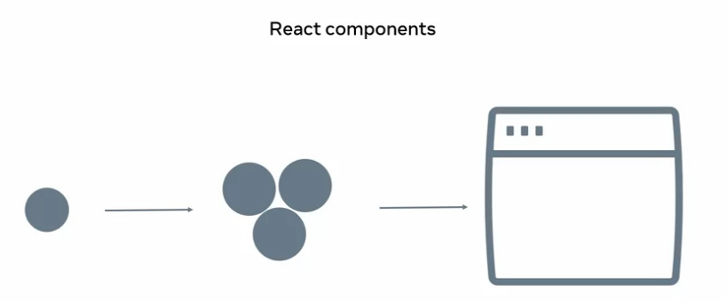

<!-- {width="4.0in" height="1.6605293088363955in"} -->

Simple components combined into more complex ones, which eventually
merge to form a website.

A website can essentially be viewed as a highly complex component.

Components and website UIs are not to limited to React.

There\'s a part of the reason why React is so popular, is because it
streamlines the process of building and composing components.

React does this efficiently and without a significant impact on your
browser\'s resources.

Another major topic that will be discussed in this course is working
with state in React apps.

You\'ll learn a lot more about state, you go through the course.

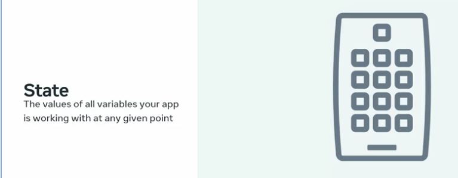
<!-- {width="5.0in" height="1.949206036745407in"} -->

But for now, here\'s a simple definition of state.

**State is simply all the values of all the variables your app is
working with at any given point in time.**

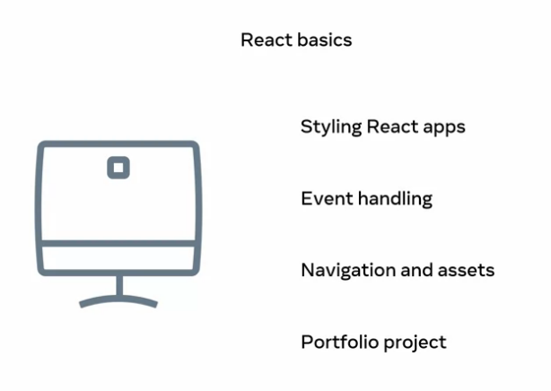
<!-- {width="4.0in" height="2.840391513560805in"} -->

As you progress through this course, you\'ll also learn about how to
style your React apps, which includes the reuse of common styles.

Setting up your apps to respond to events such as clicks and
user-submitted data, creating navigation routes and using assets and
you\'ll finish off the course with a portfolio of projects where you\'ll
apply your new knowledge.

I hope you\'re as excited as I am to begin this course on React basics.

Let\'s get started.

# 2.How is React used in the real world?

My team uses React and we use a lot of new and experimental features
that the React team is building.

Facebook.com is like a demonstration of all the new and cool features
that React engineers are working on.

When we rewrote the website, we were actually using a lot of unreleased
features and experimenting with a lot of new things that the React team
was building, which was really cool to use at first.

My name is Katie and I\'m a Software Engineer on the React Apps team at
Meta, and we work on building a variety of new features for
Facebook.com.

There are plenty of React based apps that you\'ve probably used before.

Facebook and Instagram are two examples.

But Netflix, Airbnb, New York Times, and a variety of other companies
also use React for their websites as well, so you\'ve likely encountered
it before.

These websites that tend to have really interactive UIs are more likely
to be using something like React.

Facebook.com had become really not performing and not modern looking
after the 10 or so years that we have been using it, we had squeezed all
of the performance wins that we could out of Facebook.com.

Really the only option at that point was to rewrite it on a different
stack that was going to be a lot faster and a lot easier to build on.

Basically, there was a need for having a really fast and responsive UI
and React fills all of those needs.

So, this was like a shift in thinking differently about how we build on
web.

We actually rewrote our website a couple of years ago to be completely
React and so every engineer who\'s writing for Facebook.com at Meta is
pretty much using React.

I was there for like the middle of it to finally launching it, so it was
cool that a little bit of it was already written and we were getting
prepared to show it to real users.

I think 40 engineers on our team were all working on building out this
MVP of the redesigned Facebook.com.

We would work with a variety of product teams to get them to also
rewrite their product on our new stack as well.

It was a really big effort and it was also a really big risk. Not all
the teams that we talked to thought that we could ship this new version
of Facebook.com, so we really had to prove that it was faster.

It obviously looked more modern, but we had to prove that it would
really help these products teams deliver the best version of their
product that they could on web.

React is open sourced, meaning that anyone can contribute to it, and
those engineers are working full-time on React.

But we also have developers who aren\'t at Meta who are also
contributing to React, and that means that there\'s a really strong
community around React.

A lot of people are really excited to build on it and make improvements
to it.

If you ever have any questions or you have an idea about a certain
feature or optimization or improvement, there\'s really a great
opportunity to actually contribute to the React library itself.

There\'s a React team at Meta, and this team is comprised of engineers
who are working on React full-time.

But there\'s also a group of developers outside of Meta who are
contributing to React as well.

I think the open source part of it is really cool just because there\'s
such a community around React, it\'s constantly being updated and
maintained.

There\'s always going to be someone available to answer questions or to
update documentation, it\'s very current.

If you\'re using React for the first time, definitely take a look at our
documentation.

There are a lot of conversations being had about React online, and we
actually have a React conference every year where we talk about new
features with React and you can just connect with a lot of React
developers.

There are plenty of opportunities to get involved in the React
community, and I think it makes building with React even more rewarding
if you connect with the community as well.

# 3.Course syllabus for React Basics

## By the end of this reading, you will have learned about the scope of things you will cover in this course. 

### **Prerequisites**

To take this course, you should understand the basics of HTML, CSS, and
JavaScript. Additionally, it always helps to have a can-do attitude!

### **Course content**

This course is an introduction to React development. You\'ll learn
enough basic concepts to empower you to build simple user interfaces in
React.

This course consists of four modules. They cover the following topics.

## **Module 1: Anatomy of React**

In this introductory module, you\'ll learn about what React is and where
it is used. You\'ll also learn how to set up your coding environment so
that you have as productive a learning experience as possible. So, the
purpose of this module is to understand the what and the why, and to get
set up for the modules that follow.

Components are one of the foundations of React. In React, everything
revolves around components. You\'ll learn how to build components, how
to structure and customize your React projects, and how to compose
layouts by importing components into other components.

You\'ll learn about passing data from one component to another. You\'ll
learn about JSX syntax in React and how to use it to structure and style
your components.

By the end of this module you will be able to:

-   Explain the concepts behind React and component architecture.

-   Describe how to use assets within an app to apply styling and
    functional components.

-   Create a component to service a specific purpose.

-   Create a folder and demonstrate how to create and import files
    within that folder.

-   Use and manipulate props and components to effect visual results.

## **Module 2: Data and State**

The second module of this course deals with working with events and
errors in React. You\'ll learn how events work and how you can handle
them in React. Handling events can sometimes get a bit tricky, so
you\'ll also learn about dealing with errors related to events in React.

By the end of this module you will be able to:

-   Use common methods to manage state in React.

-   Detail the concept and nature of state and state change.

-   Describe the hierarchical flow of data in React.

-   Describe how data flows in both stateful and stateless components.

-   Use an event to dynamically change content on a web page.

-   Describe some common errors associated with events and the syntax
    required to handle them.

## **Module 3: Navigation Updating and Assets in React**

In this module, you\'ll learn about routing and navigation in React.
You\'ll learn how to render partial views and how to update routes in
your React apps. You\'ll understand how assets are used, bundled and
embedded.

By the end of this module you will be able to:

-   Use media assets, such as audio and video, with React.

-   Demonstrate how to manipulate image assets using reference paths.

-   Explain the folder structure of a React project in terms of embedded
    or referenced assets.

-   Demonstrate the conditional implementation and rendering of multiple
    components.

-   Create and implement a route in the form of a navbar.

-   Describe navigation design in React, with a focus on single and
    multi-page navigation.

## **Module 4: Portfolio Mini-Project (Calculator App)**

This module is focused on a practical mini project of building a
calculator app in React. Upon completing this module, you\'ll have coded
your own mini project in React, as a starting point for building your
React portfolio.

You have now learned about the scope of things you will cover in this
course.

By the end of this module you will be able to:

-   Synthesize the skills from this course to create and style a React
    component.

-   Reflect on this course\'s content and on the learning path that lies
    ahead.

# 4.Before you learn React

Do you know the fundamentals of HTML, CSS and JavaScript? Perhaps you
learned about these technologies from another course. Either way, a
quick summary will be useful so let\'s explore some fundamental HTML,
CSS and JavaScript principles and practices.

In this reading, let's take a practical approach, and revisit some of
the development techniques you\'ll need to be comfortable with before
learning React.

To get the most out of this course on React basics, you should first
understand the fundamental methods and concepts of JavaScript.
Otherwise, you may feel like you're a child learning to run before you
can walk. React is a declarative, efficient, and flexible JavaScript
library for building user interfaces. It lets you compose complex UIs
from small and isolated pieces of code called "components".

React apps are built using modern JavaScript features, which are
commonly known as ES6. Developers use React to develop Singe Page
Applications. And you can also develop mobile applications with React
Native.

As an aspiring developer, you may opt for a 'learn as you go approach'
regarding JavaScript and React. But this may not help your productivity
and even at times frustrate you. This is because you may confuse code or
functionality that is plain JavaScript, or code that is React.

For example, with a solid foundational knowledge of JavaScript, you can
quickly identify code that is JavaScript ES6 and code that is React. And
throughout this course, there will be help for you along the way with
some friendly reminders. 

Also, keep in mind that you are using React to build user interfaces
which also include HTML and CSS code.

Let's begin with the fundamental HTML knowledge needed to learn React.

### HTML

Recall that HTML is used to describe the structure of Web pages.
Developers use HTML elements with their opening and closing tags to
"mark up" an HTML document. 

These elements form the structure of a web page and describe what to
display to the web browser.

When it comes to HTML it\'s important to know about:

1.  The purpose of HTML in the web browser,

2.  The use of HTML tags and correct syntax,

3.  How HTML elements are used in a web document,

4.  Another important concept to know about when you\'re talking about
    HTML is the Document Object Model, or DOM.

Users need to be able to interact with elements on a web page. This
means that an HTML document must be represented in a way that JavaScript
code can query and update it. And that\'s the function of the DOM. It\'s
a model of the objects in your HTML file.

And web developers interact with the DOM through JavaScript to update
content, set up events and animate HTML elements.

Before you learn React, it's advisable that you are comfortable with the
following HTML tags and concepts

### Layout & Style

-   **\<html\> **

-   **\<head\> **

-   **\<body\> **

-   **\<div\> **

### Text formatting & lists

-   **\<h1\>...\<h6\> **

-   **\<p\> **

-   **\<ul\>\<li\> **

-   **\<b\>\<i\> **

### Images and links

-   **\ **

-   **\<a href=\"\"\> **

### Linking and Meta

-   **\<link\> **

-   **\<title\> **

-   **\<meta\> **

### Semantic

-   **\<header\> **

### CSS

CSS (Cascading Style Sheets) is the code that you use to style HTML. You
need to be familiar with basic CSS concepts before you start learning
React. This is because you will need to style your React components as
well, and basic CSS knowledge will help your learning journey.

Before you learn React, make sure you are comfortable with these CSS
styling options:

-   Font styling (font size, font color, etc.) 

-   Flex Box Layout (Layout of items using CSS Flex Box Layout) 

-   CSS Selectors 

-   Position, Padding, Margins and Display 

-   Colors, Background and Icons 

You can refresh your knowledge of HTML and CSS in the Meta course
titled: [Introduction to Front-End
Development](https://www.coursera.org/learn/introduction-to-front-end-development)

## JavaScript fundamentals and ES6

React is completely written in JavaScript and uses the more modern
version of JavaScript which is ES6. While learning React, you should
already know JavaScript fundamentals. 

JavaScript is the programming language and React is a JavaScript UI
library. This means the first step is to be proficient at JavaScript.

Here are some of the JavaScript topics that you need to be comfortable
with before you begin your journey learning React.

-   Data types 

-   Using var, let and const 

-   Conditionals and Loops 

-   Using objects, arrays and functions 

-   ES6 Arrow functions 

-   In-built functions such as map(), forEach() and promises. 

-   Destructuring Arrays and Objects 

-   Error Handling 

## Package Manager (Node + npm)

React is a UI library, and you will encounter that many times you will
need to add other packages to your React application. A package in
JavaScript contains all the files needed for a module. To install these
packages effectively and manage their dependencies you can use a package
manager like NPM (Node Package Manager).

You can install npm by installing Node.js, which will then automatically
install npm.

You need to be comfortable with using npm as your package manager, since
you will be using npm to install packages within your React
application.  Make sure you are aware of how to do the following with
npm before you get started on this course.

-   Installation command to install npm modules in your project 

-   Installing a package as a dev dependency 

-   Start command 

-   Updating npm version 

-   Navigating around the package.json file 

Once you have become confident with these skills, you'll be in a better
position to learn and apply React concepts and prepare yourself for
development of React apps.

To refresh your knowledge of JavaScript and the basics of Node and npm,
please visit Meta course titled: [Programming with
JavaScript](https://www.coursera.org/learn/programming-with-javascript).

# 5.JavaScript modules, imports - exports

Before you start creating the next great app, let's explore a little
more about modules.

Modules can help you to save and access your code in a more structured
way, and in this reading, you\'ll learn about some foundational concepts
of working with JavaScript modules.

This knowledge is crucial in order to understand the syntax and the
logic behind how the example React apps in this course are put together.

This reading will cover the three main concepts:

-   JavaScript modules 

-   Module exports 

-   Module imports 

## **JavaScript Modules**

In JavaScript, a module is simply a file.

The purpose of a module is to have more modular code, where you can work
with smaller files, and import and export them so that the apps you
build are more customizable and have more composable parts.

A module can be as simple as a single function in a separate file.

Consider the following function declaration:

```
> function addTwo(a, b) {
>     console.log(a + b);
> }
```

Say that you have a file named **addTwo.js** that contains only the
above code.

How would you make this file a JavaScript module?

All that you would need to do to make it a JavaScript module is use the
export syntax.

## **Module Exports**

There is more than one way to export a module in JavaScript.

While all the various syntactical differences are not listed, here are a
few examples that will cover all the ways that the importing and
exporting of JavaScript modules will be done in this course.

In general, there are two ways to export modules in JavaScript:

1.  Using default exports 

2.  Using named exports 

## **Default Exports**

You can have **one default export** per JavaScript module.

Using the above **addTwo.js** file as an example, here are two ways to
perform a default export:

```
> }
```

So, in the above example, you're adding the **export default** keywords
in front of the **addTwo** function declaration.

Here\'s an alternative syntax:

```
> function addTwo(a, b) {
>     console.log(a + b);
> }
>  
> export default addTwo;
```

## **Named Exports**

Named exports are a way to export only certain parts of a given
JavaScript file.

In contrast with default exports, you can export as many items from any
JavaScript file as you want.

In other words, there can be only one default export, but as many named
exports as you want.

For example:

```
> function addTwo(a, b) {
>     console.log(a + b);
> }
>  
> function addThree(a + b + c) {
>     console.log(a + b + c);
> }
```

If you want to export both the **addTwo** and the **addThree** functions
as named exports, one way to do it would be the following:

```
> export function addTwo(a, b) {
>     console.log(a + b);
> }
>  
> export function addThree(a + b + c) {
>     console.log(a + b + c);
> }
```

Here\'s another way you could do it:

```
> function addTwo(a, b) {
>     console.log(a + b);
> }
>  
> function addThree(a + b + c) {
>     console.log(a + b + c);
> }
>  
> export { addTwo, addThree };
```

## **Importing Modules**

Just like when exporting modules in JavaScript, there are several ways
to import them.

The exact syntax depends on how the module was exported.

Say that you have two modules in a folder.

The first module is **addTwo.js** and the second module is
**mathOperations.js**.

You want to import the **addTwo.js** module into the
**mathOperations.js** module.

## **Importing a Module that was Exported as Default**

Consider the previous example of exporting the **addTwo** function as a
default module:

```
> // addTwo.js module:
> function addTwo(a, b) {
>     console.log(a + b);
> }
> export default addTwo;
```

To import it into the **mathOperations.js** module, you could use the
following syntax:

```
> import addTwo from \"./addTwo\";
>
> // the rest of the mathOperations.js code goes here
```

So, you could start this import with the **import** keyword, then the
name under which you'll use this imported code inside the
**mathOperations.js** file. You would then type the keyword **from**,
and finally the location of the file, *without the .js extension.*

Contrast the above import of the default **addTwo export** with the
different import syntax if the **addTwo** function was instead a named
export:

```
> import { addTwo } from \"./addTwo\";
>
> // the rest of the mathOperations.js code goes here
```

## **Conclusion**

In this reading, you\'ve learned about the very basics of what modules
are in JavaScript, why they are used and how they get exported and
imported.

The examples you\'ve seen here are the core of how you\'ll deal with
imports and exports of various modules in the example React apps on this
course.

However, please note that there are many more caveats, rules, and
implementations of working with modules in JavaScript.

The examples given in this reading are there just to make it easier to
comprehend what is happening in React apps that you\'ll be building in
this course.

The intent of this reading was just to get you familiar with the most
common syntax used - not as a comprehensive overview of modules in
JavaScript.

# 6.Working with Labs in this course

The labs for this course already have everything installed and setup so
you can start working with React right away.

{width="3.0in"
height="1.4006627296587926in"}

In order to run and view your React app you will need to open the VS
Code built-in terminal, run **npm start**, and then click **Open
Development server**.

The **Open Development server** link can be found on the blue horizontal
bar at the very bottom of the lab window, written in white letters on a
blue background. Click this link.

That will open the app in the browser in a separate tab.

{width="5.0in"
height="2.788713910761155in"}

### **To view your code and instructions side-by-side**, select the following in your VS Code toolbar:

-   View -\> Editor Layout -\> Two Columns

-   To view a file in Preview mode, right click on the file and **Open
    Preview** (in the EXPLORER sidebar)

-   Select your code file in the code tree, which will open it up in a
    new VS Code tab.

-   You can drag any file over to the second column to view the contents
    in that column.

-   Great work! You can now see instructions and code at the same time.

{width="6.5in"
height="3.2298140857392825in"}

# 7.Additional reading

Below you will find links to helpful additional readings.

-   [nodejs.org](https://nodejs.org/en/) 

-   [npmjs.com](https://www.npmjs.com/) 

-   [reactjs.org](https://reactjs.org/) 

-   <https://create-react-app.dev/> 

-   [VS Code](https://code.visualstudio.com/) 

# 8.Setting up a React project in VS Code (Optional)

To complete the exercises in this course you have been provided with a
dedicated lab environment set up specifically for you to apply the
skills that you have learned. You can find out more about Working with
Labs in this course by accessing the link below:

## [Working with Labs in this course](https://www.coursera.org/learn/react-basics/supplement/7e8Ea/working-with-labs-in-this-course)

You can also use VS Code to practice these exercises on your local
machine as an alternative option.

To follow along in this reading, you need to have Node.js and VS Code
already installed on your computer. If you don't have this setup, please
refer to the Programming with JavaScript course:

-   [Setting up VS
    Code](https://www.coursera.org/learn/react-basics/resources/SSPnG) 

-   [Installing Node and
    NPM ](https://www.coursera.org/learn/react-basics/resources/FTd5h)

In VS Code, you\'re ready to start a brand new React project.

You can do it using npm.

### **What is npm?**

When Node.js is installed on a computer, **npm** comes bundled with it.

With **npm**, you can:

1.  Author your own Node.js modules (\"packages\"), and publish them on
    the npm website so that other people can download and use them 

2.  Use other people\'s authored modules (\"packages\") 

So, ultimately, npm is all about *code sharing* and *reuse*. You can
**use other people\'s code** in your own projects, and you can also
**publish your own Node.js modules** so that other people can use them.

An example npm module that can be useful for a new React developer is
[create-react-app](https://create-react-app.dev/). While this npm module
comes with its own website, you can also find some info on the
[create-react-app project on
GitHub](https://github.com/facebook/create-react-app). 

Whenever you run the npm command to add other people\'s code, **that
code, and all other Node modules that depend on it, get downloaded** to
your machine.

However, although it\'s possible do to so, this is not really necessary,
at least in the case of the **create-react-app** Node module.

In other words, you can avoid installing the **create-react-app**
package but still use it.

You can do that by running the following command: **npm init react-app
example**, where "example" is the actual name of your app. You can use
any name you'd like, but it's always good to have a name that is
descriptive and short.

In the next section, you\'ll learn how to build a brand new app that you
can name: **firstapp**.

## **Opening the built-in VS Code terminal and running** *npm init react-app* **command**

In VS Code, click on *View*, *Terminal* to open the built-in terminal.

{width="5.0in"
height="2.8125in"}

Now run the command to add a brand new React app to the machine:

```
> $ npm init react-app firstapp
```

The installation and setup might take a few minutes.

Here\'s the output of executing the above command:

Installing template dependencies using npm\...

```
> $ npm WARN deprecated source-map-resolve@0.6.0:
```

See [https://github.com/lydell/source-map-resolve#deprecated]{.underline}

To address all issues (including breaking changes), run:

```
> $ npm audit fix \--force
```

Run \`npm audit\` for details.

Created git commit.

Success! Created firstapp at /home/pc/Desktop/firstapp

Inside that directory, you can run several commands:

```
> $ npm start
```

Starts the development server.

```
> $ npm run build
```

Bundles the app into static files for production.

```
> npm test
```

Starts the test runner.

```
> $ npm run eject
```

Removes this tool and copies build dependencies, configuration files

and scripts into the app directory. If you do this, you can't go back!

If you follow the suggestions from the above output, you\'ll run: **cd
firstapp**, and then **npm start**.

This will end up with the following output in the built-in terminal:

*Compiled successfully! You can now view firstapp in the browser.  
Local:           
[[http://localhost:3000]{.underline}](http://localhost:3000/)   On Your
Network: 
[[http://192.168.1.167:3000]{.underline}](http://192.168.1.167:3000/)
Note that the development build is not optimized. To create a production
build, use npm run build. webpack compiled successfully*

Again, following the instructions, opening a browser with the address
bar pointing to [http://localhost:3000](http://localhost:3000/), will
show the following page in your browser:

{width="5.0in"
height="3.1666666666666665in"}

This means that you\'ve successfully:

1.  Set up your local development environment 

2.  Run the create-react-app npm package (without installing it!) 

3.  Built a starter React app on your local machine 

4.  Served that starter React app in your browser 

5.  After you\'ve built your starting setup, in Module 2 you\'ll start
    working with the basic building blocks of React: components.

# 9. Why React?

React is used everywhere in the tech world and you\'ll have the chance
to use it throughout your career. It\'s a very valuable skill set to
have.

My name is Katie and I\'m a Software Engineer on the React Apps team at
Meta, and we work on building new features using React for facebook.com.

My first encounter with React was actually in a senior design project
back at college.

We were looking for a great client-side library to use for an app that
we were building.

React seemed like the easiest to use and the fastest to build on.

I had already gotten my job at Meta, but I didn\'t know what I was going
to be working on at Meta.

It was cool to get this experience with React, realized I really enjoy
working with it and then get to do it in my day-to-day work.

I feel like in school you tend to do a lot of object-oriented
programming which uses inheritance.

React doesn\'t use any of that.

It uses something called composition.

That was a little bit difficult to think about, but there\'s so much
documentation around React and such a strong community that it\'s easy
to pick up.

You have support coming from so many different places.

You can just go onto YouTube and watch a video, read through the
documentation, or look at other open source projects that use React.

There are so many resources to pull from.

I think developers outside of Meta choose to use React for the same
reasons that we do at Meta.

It\'s super easy to learn and pick up.

You\'re able to create really custom UIs with React, we\'re building so
many different features on facebook.com every day that require a lot of
custom components and UIs.

It\'s nice to have the flexibility that React provides.

I would say React is the best choice for an app if your UI is really
costume and you\'re looking for a lot of flexibility with what other
libraries you can integrate for your app or website.

React is just a front-end library.

You\'re going to need to interact with other third-party libraries too,
and if you want the flexibility of integrating with redox or other
third-party libraries, React is the perfect choice for you.

React is also great if you have complex UIs where you want to reuse code
across many different pages.

I think it\'s a great choice if you\'re building a complex website with
a ton of features across a ton of different pages.

I think react solves the problem of code reusability really well.

Here at Meta, we have a core set of UI components that were actually
able to reuse across the site.

This means that we\'re able to build a lot of functionality into these
core UI components like accessibility.

I think we\'re able to have like a high-quality bar across the site just
because we\'re reusing components everywhere and we\'re able to share
code even across Facebook and Instagram and Messenger.

I think that\'s a really unique part of React.

It\'s really interesting because if I find a bug and a core UI component
and I fix it, I\'m not only fixing it for my one-use case, I\'m fixing
it for use cases across the site.

I think it\'s a really smart way to use engineering effort, you\'re
fixing a bug once and you\'re solving one problem everywhere.

I would say the biggest competitor of React is Angular.

Angular is a bit different from React in that it\'s a full-fledged
solution for an app or website.

You don\'t really need to integrate with third-party libraries when
using Angular.

Whereas with React, it\'s just a client-side library.

You do need to figure out how you\'re going to do routing and server
client communication.

I would say React provides more flexibility with creating these complex
costume UIs.

Whereas angular makes it easier to create a single page web application
with like an out-of-the-box solution.

Learn by doing, try to make an example app.

Don\'t go and try to create the most complex app you\'ve ever heard of.

I would say start simple. Make sure you\'re using best practices.

Continuously reference documentation to see if you\'re using hooks the
way you\'re supposed to and that thing.

It should come pretty easily.

I think one of the great benefits of React is how easy it is to pick up
and learn.

There are a lot of different pieces of React and a lot of different
concepts to learn.

But it\'s really well worth it in the end because you\'re going to
encounter React in your day-to-day work.

Hopefully for the rest of your career.

There\'s a huge community behind you ready to help answer questions
about React too.

# 10. React.js overview

Recall the concept of the single-page application or SPA for short?

This is a one-page website where some of the pages content changes based
on user interaction.

SPA differ from traditional website, where each web page needs to be
loaded as the user navigates around the site.

This frequent reload can be considered inefficient as some of the same
content such as logos, navigation, and footers need to be loaded again.

And one of the most popular ways to build a SPA is with the React
library from Meta.

React used to run many of the world\'s most popular websites.

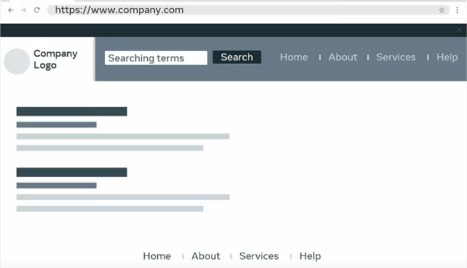{width="5.0in"
height="2.86878280839895in"}

Often on these sites, you\'re type a search term into the sites input
box.

The site then returns the relevant content or results.

But you might notice that even though the content has updated, the sites
URL doesn\'t change.

{width="4.0in"
height="1.472169728783902in"}

As SPA only load the content as required, they can be ideal for
businesses and enterprises who need a web app that offers rich user
interfaces, speed scalability, and flexibility.

As an aspiring developer, you may feel like there are a lot of new
concepts and processes to understand when working with React but you can
be sure that you will have an opportunity to get familiar with and use
them.

In this video, you will learn about the basics of React by exploring the
concepts of the component-based architecture components and the virtual
DOM.

Let\'s begin with components.

One of the core building blocks of React.

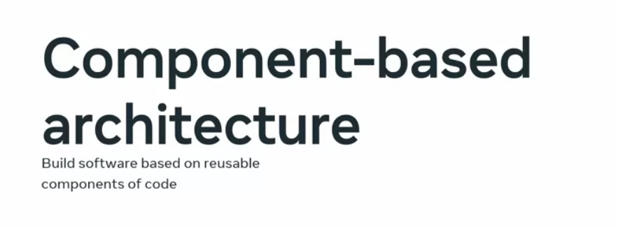{width="5.0in"
height="1.8402121609798776in"}

When meta released the React library, it included the concept of
something called component-based architecture.

This is essentially a design philosophy for building software based on
reusable components of code.

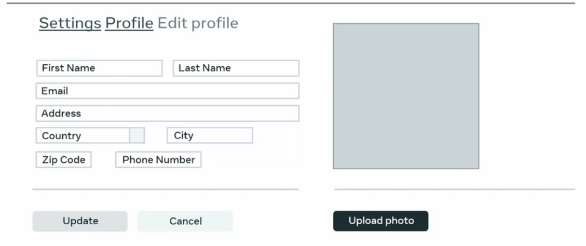{width="5.0in"
height="2.10370406824147in"}

Each component consists of well-defined functionality that can be
inserted into an application without requiring modification of other
components.

{width="5.0in"
height="2.10370406824147in"}

Because components are reusable, they can be used multiple times and
easily inserted anywhere we\'re needed.

This results in components that can exist within the same space yet
interact independently from each other.

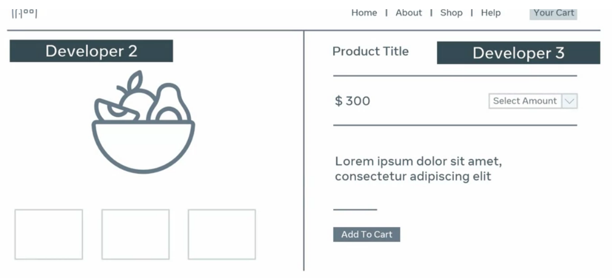{width="5.0in"
height="2.2761909448818898in"}

One of the advantages of developing using components is that many
developers can work on the same project without interfering with the
code of other developers\' components.

As you may recall, modern front-end web development revolves around the
concept of creating standalone parts of the user interface, or UI for
short.

Well, in react, these standalone parts are created using components
which form the foundation of all UI design.

It\'s important to know that all UI is composed of simple components
that can be combined into more complex components.

In fact, you can think of an entire website is just a collection of
components.

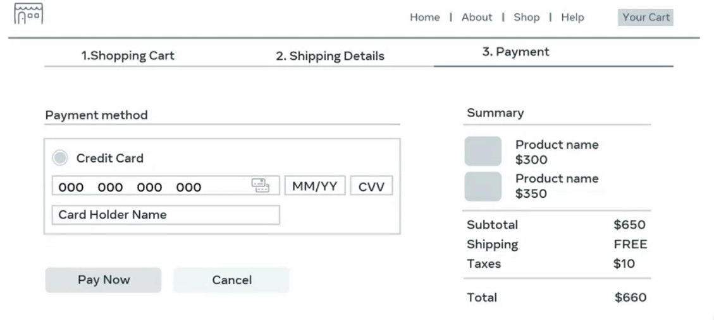{width="5.0in"
height="2.249735345581802in"}

For example, consider the product check out page of an e-commerce web
application.

The page consists of three sections, a header, a payment section, and a
sidebar.

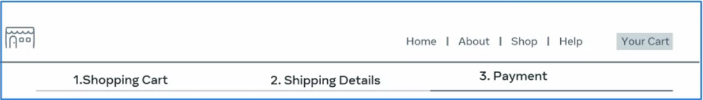{width="5.0in"
height="0.7195767716535433in"}

The header section contains the company logo with a navigation menu and
a button to view the shopping cart.

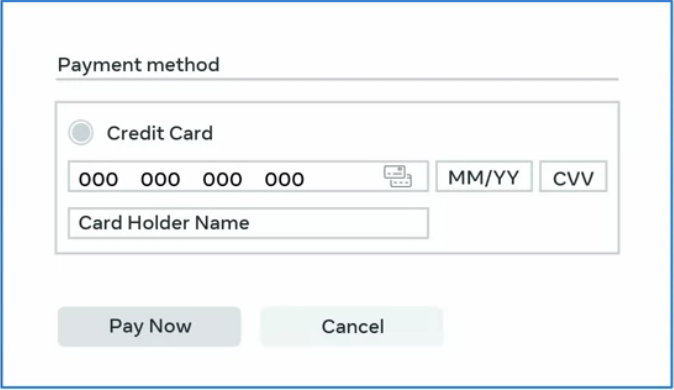{width="3.0in"
height="1.7358727034120736in"}

The payment section area contains a form where the user inputs their
payment information.

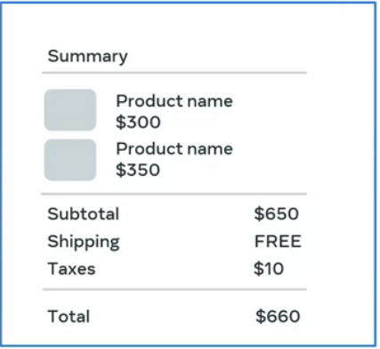{width="3.0in"
height="2.761124234470691in"}

Finally, there\'s a sidebar with the order summary information.

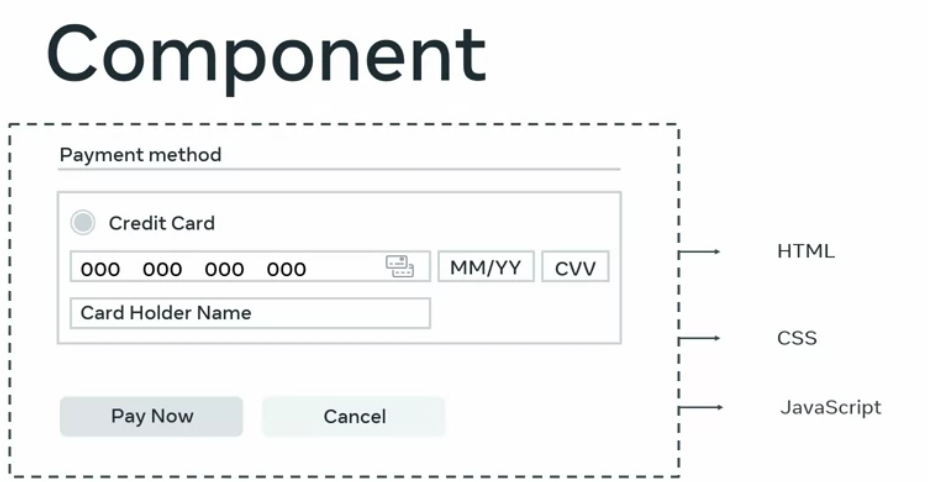{width="4.0in"
height="2.0774595363079613in"}

As the components are self-contained, they have their own HTML, CSS, and
JavaScript logic for functionality.

For example, the payment section component has a JavaScript function
that submits a payment when a button is clicked.

It\'s important to know that the use of components in website UI design
is not limited to just React.

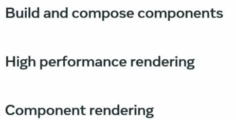{width="3.0in"
height="1.5278346456692913in"}

Many website\'s front end or UI are built on the foundations of
components and compose ability.

But React is a powerful tool for streamlining the process of building
components and composing them.

It performs these actions efficiently as components are rendered to the
DOM without significantly impacting the browser\'s resources.

This is called component rendering and you\'ll learn more about this and
its associated render method later.

You may recall that the DOM is a logical tree-like structure
representing the HTML document and it uses nodes to describe the various
parts of the document.

Before React, you could still build components style layouts.

However, it involved much more complicated DOM manipulation and code
making the layouts more complex and harder to work with.

This resulted in something known as spaghetti code, a term developers
use in web development to describe code that is complex, convoluted, and
difficult to understand like spaghetti.

React prevents this spaghetti code by avoiding any manipulation of the
DOM.

Instead, React provides something known as the virtual DOM.

You may recall that this is an in-memory representation or clone of the
real DOM which minimizes updates to the DOM itself.

React uses the virtual DOM to update the browser Dom only when needed.

This ensures that the update is as minimal as possible, increasing the
application speed and performance.

In this module, you learned about the basics of React by exploring the
concepts of the component-based architecture components and the virtual
DOM.

# 11. Introduction to functional components

Recall how you learned about functions in JavaScript.

They are reusable blocks of code that can take an input, perform some
procedure or calculation, and then return an output.

Well, a React component acts much like a traditional JavaScript
function. In this video, you\'ll continue your exploration of the
structure of the React architecture by learning about functional
components.

Component types, JSX and trans piling.

React provides two types of components, functional components and class
components.

They behave very similar in React to traditional functions, and classes
in JavaScript.

Don\'t worry about class components for now.

You\'ll learn more about them later.

Instead, let\'s just focus on functional components, which acts like a
JavaScript function.

In the default React application, only one component is rendered and
it\'s the app components located inside the index.js file that\'s
located inside the source folder.

It\'s important to know that every React app must contain at least one
component, and it\'s called the root components.

This component is loaded using the import statement.

You\'ll learn more about the import statement in React later.

For now, just know that it\'s used to import code needed for React to
work, such as the import React and import React DOM statements.

The syntax to render a component is very similar to a self-closing tag
in HTML, you just place the component name inside the left and
right-angle brackets and don\'t forget the forward slash.

The roots components can contain other components that developers create
to represent the various UI part of the application.

Like in the e-commerce example that you learned about earlier.

Recall that this component is ultimately converted to a DOM fragment and
placed into the existing DOM as a child of the HTML div element with an
ID of roots.

This div element is then rendered to the browser.

If you analyze the app component, you\'ll notice that it looks very
similar to a JavaScript function with some HTML code inside.

You may also notice an export default statement. You\'ll learn more
about this soon.

For now, just know that you need it to make your components available.

Now that you\'re familiar with the concept of functional components,
let\'s explore how web developers create them in React.

React is scripted using a special syntax called JavaScript XML or JSX.

For many Reacts developers, this is known as a syntax extension to
JavaScript.

What is JSX syntax like? Let\'s find out by going back to our React
default app component.

Recall that in the return statements of the app function, it seemed that
some HTML content is returned.

Well, this content is not exactly HTML.

It\'s JSX. JSX syntax looks very similar to HTML.

What are its advantages is that it allows you to write JavaScript code
inside what looks like HTML elements?

In fact, you can think of JSX as a combination of custom HTML and
JavaScript.

This allows you to make your website dynamic.

You\'ll learn more about the differences between HTML and JSX later.

For now, just know that you can place this syntax inside the return
statement of a functional component.

It\'s also important to note that a React component won\'t render until
it\'s used as a JSX element just like a JavaScript function declaration
and won\'t run until it\'s called or invoked.

Now you know what JSX is.

Let\'s explore the steps involved to create a React components which
will contain some JSX code inside a heading 1 HTML element to display
some text on a webpage.

First, you create the component, which is basically just a JavaScript
file, since its purpose is to return some heading text, you name the
file Heading.js.

Notice that the first letter of the component name is capitalized.

This is because there\'s a difference in how React treats capitalized,
and non-capitalized component names.

It\'s important to remember that all component names in React must be
capitalized. Why is this?

Well, because React treats lowercase components as regular HTML
elements.

Capitalizing a component name helps React to distinguish JSX elements
from HTML elements.

Now let\'s continue with our component. Next inside the app.js file,
create a function named Heading.

The function name must also be declared using a capital letter for the
first letter of the function.

Then inside the function body, you create a variable named title and
assign it the string value of this is some heading text.

Now you\'re ready to create the return statement of the function.

Inside the parentheses of the return, insert a heading 1 tag, and inside
it places the variable named title.

To make React evaluate the title variable, you need to place it inside
curly brackets.

If you didn\'t use curly brackets, you\'d get the word title instead of
this is some heading text.

At this point, it\'s worth remembering that while you are creating HTML
like syntax, you are actually coding inside a JavaScript file.

Because of this, you can output a variable inside your JSX code,
something you cannot do when writing static HTML.

The overall syntax instructs React to render the heading HTML element
with whatever text value that is stored within the variable named title.

This rendering happens behind the scenes because of something called
trans piling.

You can think of trans piling as a process of converting JSX to HTML and
you\'ll learn more about this later.

In this section you learned about functional components and how to
create them in React.

You also learned about JSX, which acts like a combination of HTML, CSS,
and JavaScript that you can use to generate dynamic content inside your
functional components.

Finally, you explore the concepts of rendering and trans piling.

If you\'d like to learn about these concepts in more detail.

There\'s a link to an additional reading at the end of this lesson.

# 12. Creating React components

In this video, you will further explore the concepts of components in
React and learn how to create a component from scratch.

You\'ll be introduced to the concept of the export statements and how
components can be used to create reusable blocks of code.

I\'ve launched VS Code here, and I have the creating components folder
open in the built-in terminal.

Now, I\'ll execute the command npm init, React app dot.

The dot character instructs VS Code to run this command in the current
folder.

In other words, I\'m using Create React app to build a new app for me
inside this folder.

I execute this command by pressing the Enter key.

I wait for the app to build, and once it\'s ready, I can start the app
by typing npm then a space followed by start.

The process of building the React app could take a couple of minutes, so
just sit tight while it builds.

Great. My React app has started and loaded in the browser at
localhost:3000 which is the local server.

Notice that I have all these files and folders in the left pane of VS
Code now, such as node modules, public SRC, and files like package.
json.

You\'ll learn more about these later.

For now, the only folder I need to work in as the SRC folder.

Don\'t worry about all these other files and folders. Instead, I want
you to focus on how to build a component in React.

To do that, let\'s have a clean start.

The easiest way to do this is to remove all the code inside the function
inside the app.js file.

I guess you might say this is the simplest possible component. I\'m
declaring an app function and I\'m exporting it as a default module.

I save my file and notice that my app is just a blank page.

Now, let me create another component that will contain some texts that I
want to display in the browser.

To do this, I create another function called header, and in the function
body, I\'ll just return some greeting texts inside an H1 JSX elements.

Inside the H1 I type, Hello world.

My code looks good now, but my screen is still white.

This is because I\'m not yet rendering anything from my app function.

To do this, I need to return to my app function and call the header
function from it.

I use the JSX elements syntax to render a component which is the name of
my function.

Inside the body of the app function, I create the return statement and
type the function name of header inside left and right-angle brackets,
not forgetting to add the forward slash before the right-angle bracket.

Notice that the syntax to render a component is very similar to a
self-closing tag in HTML.

Press Control S or Command S, if you\'re on Mac to save everything
again.

Great, my code is working now.

I notice in HTML heading with the text Hello World displayed in the
browser. Congratulations.

In this video, you\'ll learned how to create a functional component.

These components named app calls, another component named header, which
displays an HTML heading with some texts.

At the moment, the header component code exists in the same file as the
app component.

To make the header component isolated and reusable, I need to place it
in its own file.

Then I can reuse it multiple times in the application anytime I want to
display a heading element with some texts, and you\'ll learn how to do
this very soon.

In this module, you\'ll learn how to create a functional component in
React, and render it to the root components named app.js.

# 12.Transpiling JSX

## By the end of this reading, you will have learned how a component is built.

## Introduction

Components are a nice way to build websites in React because they allow
you to build more modular apps. However, how do you build components
using React, JSX, and JavaScript? You\'ll learn how this works in this
lesson item.

## A browser cannot understand JSX syntax.

This means that making a browser understand React code requires a lot of
supporting technologies.

An example of such a technology is a **transpiler**.

A **transpiler** takes a piece of code and transforms it into some other
code.

To understand why this is done, here is an example of an ES6 variable
declaration:

const PI = 3.14

This is perfectly valid ES6 syntax.

However, if you were using a very old computer, that computer will have
an old browser. Perhaps that browser was built before ES6 came out in
2015.

This means that the JavaScript engine that is built into your old
computer\'s browser is likely to be an ES5 JavaScript engine.

In ES5, the only way to declare a variable is the following:

```
> var pi = 3.14
```

What this means is that for this old browser to understand the ES6 code,
the only way to do it is by **transpiling** it.

If you feel like it, you can try transpiling ES6 to ES5 code yourself,
using [the es6console website](https://es6console.com/).

Now, let's move the focus to another example of transpiling.

Let\'s say that you want to use a brand new, most modern ECMAScript
syntax in an app. The only problem is that this new syntax is currently
not supported by any browser; even an up-to-date browser.

However, by transpiling the new most-modern JavaScript syntax into
something that modern browsers can understand, it is able to convert
some code that the browser cannot comprehend, into code that it can
comprehend, run, and produce a result from.

Likely the most popular site that shows off how this works is
[Babel](https://babeljs.io/). As the heading of the website reads,
\"Babel is a JavaScript Compiler\".

This finally brings you to the point of this discussion about
transpiling JavaScript code.

What Babel does is this: it allows you to transpile JSX code (which
cannot be understood by a browser) into plain JavaScript code (which can
be understood by a browser).

This is where React and JSX come in.

For React code to be understood by a browser, you need to have a
**transpiling step** in which the JSX code gets converted to plain
JavaScript code that a modern browser can work with.

To demonstrate how this works, let's use the **Heading** component from
the previous lesson.

Add the JSX code into [the online Babel
repl](https://babeljs.io/repl#?browsers=defaults%2C%20not%20ie%2011%2C%20not%20ie_mob%2011&build=&builtIns=false&corejs=3.21&spec=false&loose=false&code_lz=GYVwdgxgLglg9mABACQKYEMAmMwHMAUADgE5yEDOAlIgN4BQijixqUIxSAPABYCMAfDRJlyAOlhQANqgC-nAPR9-dGUA&debug=false&forceAllTransforms=false).
Repl stands for \"read-eval-print loop\" and it accepts code you write,
evaluates it, and produces some result. In the specific case of [the
online Babel
repl](https://babeljs.io/repl#?browsers=defaults%2C%20not%20ie%2011%2C%20not%20ie_mob%2011&build=&builtIns=false&corejs=3.21&spec=false&loose=false&code_lz=GYVwdgxgLglg9mABACQKYEMAmMwHMAUADgE5yEDOAlIgN4BQijixqUIxSAPABYCMAfDRJlyAOlhQANqgC-nAPR9-dGUA&debug=false&forceAllTransforms=false),
that result is some transpiled code. Here\'s a more detailed
explanation.

If you\'ve visited the above-linked URL, you\'ll find a web page that
has two panels. On the left, there\'s source JSX code:

```
> function Heading(props) {
>
>     return &lt;h1\>{props.title}&lt;/h1\>
>
> }
```

\... and on the right, there\'s the transpiled, plain JavaScript code:

```
> \"use strict\";
>  
> function Heading(props) {
>   return /\*#\_\_PURE\_\_\*/React.createElement(\"h1\", null, props.title);
> }
```

If you now analyze the difference between the source JSX code and the
transpiled, plain JavaScript code, dis-regarding the comment, here\'s
the body of the Heading function:

```
> React.createElement(\"h1\", null, props.title);
```

So, here you have a React object, and this object has a
**createElement()** method on it. The method is invoked with three
arguments:

1.  **\"h1\"** 

2.  **null** 

3.  **props.title** 

The **first** argument is the DOM element to render - in this case, an
**h1** element.

The **second** property is any HTML attribute that should be added, and
there\'s a null here - meaning, there should be an object with some
data, but there isn\'t any data so instead of the object there\'s the
null value.

The **third** property is the contents of the inner HTML of the DOM
element specified as the first argument - in this case, the contents of
the inner HTML of the **h1** element.

Now let's use Babel again, and this time transpile the **render** syntax
for the **Heading** component:

> &lt;Heading title=\"This is the heading text!\"\>&lt;/Heading\>

Again using [the Babel
repl](https://babeljs.io/repl#?browsers=defaults%2C%20not%20ie%2011%2C%20not%20ie_mob%2011&build=&builtIns=false&corejs=3.21&spec=false&loose=false&code_lz=DwCQpghgJglgdgcwAQBcYoDZgLwCIAqAFjAM5KmqFhJXTzIpgAeKAhLgHzAD04diHIA&debug=false&forceAllTransforms=false&shippedProposals=false&c),
and as can be confirmed in [the
link](https://babeljs.io/repl#?browsers=defaults%2C%20not%20ie%2011%2C%20not%20ie_mob%2011&build=&builtIns=false&corejs=3.21&spec=false&loose=false&code_lz=DwCQpghgJglgdgcwAQBcYoDZgLwCIAqAFjAM5KmqFhJXTzIpgAeKAhLgHzAD04diHIA&debug=false&forceAllTransforms=false&shippedProposals=false&c),
the output of the tranpilation is the following code:

```
> \"use strict\";
>  
> /\*#\_\_PURE\_\_\*/
> React.createElement(Heading, {
>   title: \"This is the heading text!\"
> });
```

Again, you have the **React.createElement()** method call, and this
time, the first item to render is **Heading**, and then you have an
object as the second argument (instead of a null that you had in the
previous transpilation example).

This brings me to an interesting question: What is the minimum code that
a component must have to be able to show something on the screen when
rendered?

You can see the answer below:

```
> function Example() {
> return &lt;div\>An element&lt;/div\>
> }
> export default Example
```

# 13. Solution: Your first component

Here is the completed solution code for the App.js file:

```
> function Heading() { 
>   return ( 
>     &lt;h1\>This is an h1 heading.&lt;/h1\> 
>   ) 
> } 
>  
> function App() { 
>   return ( 
>     &lt;div className=\"App\"\> 
>       This is the starting code for \"Your first component\" ungraded lab 
>       &lt;Heading /\> 
>     &lt;/div\> 
>   ); 
> } 
>  
> export default App;
```

Here is the output from the solution code for the App.js file:

{width="5.0in"
height="0.8566437007874016in"}

**Step 1:** In the starting code, you already had a JSX element
named **\<Heading /\>** , being rendered from the App component, since
it is a part of the App component\'s return statement.

```
> function App() { 
>   return ( 
>     &lt;div className=\"App\"\> 
>       This is the starting code for \"Your first component\" ungraded lab 
>       &lt;Heading /\> 
>     &lt;/div\> 
>   ); 
> } 
```
 
```
> export default App;
```

Then, you added a new function to the App component, and named that
function **Heading ()**. You placed it at the very top of the **App.js**
file.

```
> function Heading() {
>
> }
```

**Step 2:** Next, in the body of the **Heading** component, you added a
return statement and spread it over several lines by following it up
with an opening and a closing parenthesis.

```
> function Heading() { 
>   return (
>   )
> }
```

**Step 3:** Then, inside the parentheses, you added the following code: 

```
> **&lt;h1\>This is an h1 heading&lt;/h1\>** 
> function Heading() { 
>   return ( 
>     &lt;h1\>This is an h1 heading.&lt;/h1\> 
>   ) 
> } 
```

**Step 4:** Finally, you saved your changes and viewed the app in the
browser.

# 14.The React project structure

As you might already be aware, it\'s important to organize or structure
your React components so that they\'re easy to access.

But what does the structure look like?

What files and folders are found within a typical React application?

The React project structure is the focus of this video.

By the time you reach the end of this video, you have learned how to
explain the default folder structure of a React project, outline the
benefits of the folder structure, customize the folder structure to hold
components and assets, and explain the benefits of planning folder use
for app development.

Let\'s begin by examining how the default files and folders are laid out
in a React app project.

When you build a React app using the command npm init React app, your
project is comprised of a specific file and folder structure.

Notice that there are three folders named node modules, public, and SRC
or source.

Let\'s explore each of these folders briefly now.

First, let\'s begin with the node modules folder.

You can think of this folder as a repository for all the modules in your
React app.

The node modules folder is automatically added when you install a
specific npm package.

You might recall the packages or groupings of files and/or node.js
modules.

Developers use packages when they want to add a piece of functionality
that someone else coded and made available to other developers via the
npm ecosystem.

Don\'t worry too much about the node modules folder.

For now, just be aware of it and that it\'s needed for your React app to
work.

Next is the public folder, and it contains the assets that will be
displayed to the user in your app.

For example, image files for logos, the favicon, which displays an icon
in the browser tab, and the robots.txt file, which is used for search

engine optimization.

Also, there is a manifest.json file, which is used to provide some
metadata to a device when you\'re React powered web app is installed on
it.

While all these files are necessary, the most important one to know
about for now is index.html.

A React app gets injected into the specific elements inside the body of
the index HTML file.

Based on changes happening inside our React app, it injects those
updates in that same div of index HTML.

You\'ll find out more about how this works later on in the course.

Finally, let\'s explore the contents of the SRC or source folder.

This folder contains all the essential component files required to
ensure that a React app functions.

Notice that there are some files already in this folder.

These were automatically created when I use the npm command Create React
app to build a starter React app.

As a React developer, you probably spend most of your time within this
folder, so let\'s get a little more familiar with some of these files
now.

You may be familiar with some of them already, such as index.js and
app.js, which are used to render the root components of the app.

Let\'s briefly explore the others.

App.css contains the styles for the app.js components, and the index.css
file contains the styles to use in the entire app.

App.test.js, setupTests.js, and the reportsWebVitals.js are files
related to the app\'s performance and testing.

The logo.svg file is displayed on the start page of the default app when
the app is displayed in the browser on the local host.

While these can be useful and the functionality is important, I can
still safely delete them without affecting React\'s abilities to create
a very basic application.

I just need to also remove the code that references them.

This is because React doesn\'t have opinions on how you organize your
files and folders in the source folder.

However, there are a few common approaches popular in the ecosystem and
you\'ll learn about them soon.

It\'s that this point is also worth remembering that the most important
file in the entire source folder is the index.js file.

This file imports everything that this React app needs to render a
working React app.

Now you have explored the main folders, let\'s explore the files and the
root of the default app.

Root files are additional files that are found in the root of the
project folder itself and include a gitignore file, two json files, and
a README file.

The .gitignore file is using version control and it\'s used to specify
what files and folders must be excluded from a project.

It\'s important to note that this file is not specific to React.

This means that other systems use this file too.

The README.md file is a markdown file that gives some basic information
on this project.

Developers use this when they want to share the project\'s code on sites
like GitHub.

The package.json file lists information pertaining to my app, which
allows npm to run several scripts and perform various tasks in the app
itself.

Finally, the package-loc.json file holds the list of all dependencies
with a specific version.

The package.json file helps npm rebuild the app on another machine.

Or if we delete the node modules folder with all the files that our
project needs to run, the package-loc.json file has all the information
for npm to be able to rebuild those files reliably.

This file is there to ensure the npm tracks all the modules
installations properly.

As a general rule, it\'s better to leave these files where they offer
the moment as they are required for the app to function.

You should now be able to explain the default folder structure of a
React project and outline the benefits of the folder structure.

In addition, you should know how to customize the folder structure to
hold components and assets and be able to explain the benefits of
planning folder use for app development.

Good job.

# 15. Customizing the project

So far, you've learned about React components, but now you will focus on
learning how to customize the project. You will learn about the software
development approach, detailing the creation of separate associated
files, the requirements gathering and the subsequent folder structure to
be created.

## Building a Layout

Imagine that you\'ve been given the task of building a somewhat more
complex website layout using React.

At this point, you still don\'t know too much about how React works, but
even with your limited knowledge, you can still build some relatively
interesting designs.

Currently, you need to build a simple typography-focused layout for a
coding blog.

This means that you will not have to use images, which simplifies your
task significantly.

The layout you\'re supposed to build will consist of the following
sections:

-   Main navigation 

-   Promo (main advertisement)

-   A list of newest posts\' previews (intros)

-   The footer 

## Organizing Your Code

Keeping in mind the above structure, how would you organize your code?

This is where [React docs]{.underline} can help.

They suggest two approaches:

1.  Grouping by features 

2.  Grouping by file type 

They also advise not to nest folders too deep, and to keep things simple
and not overthink it.

They even say that if you\'re just starting out, you shouldn\'t spend
more than five minutes setting up a project.

Taking this advice into account, you might say that for a small project
like this, you could keep it as simple as just adding a **components**
folder and moving all your components into it. This is exactly what
you'll do next.

## Building the App

Since this is app\'s focus is on customization, let's name the app
**customizing-example***.*

What follows is the command to run **in a suitable folder on your own
computer**. By \"a suitable folder\", I mean: \"a folder where you feel
comfortable installing a boilerplate React application\". This also
includes that the folder you chose will need to be accessible for your
user on your OS (Operating System).

```
> $ npm init react-app customizing-example
```

This will produce a brand-new starter app with a familiar structure.

Inspecting the **src** folder of the starter app, it looks like this:

> src/
>     App.js
>     App.test.js
>     index.css
>     index.js
>     logo.svg
>     reportWebVitals.js
>     setupTests.js
```

Then simply add a components folder to it, like this:

```
> src/
>     components/
>     App.js
>     App.test.js
>     index.css
>     index.js
>     logo.svg
>     reportWebVitals.js
>     setupTests.js
```

Since the components folder is currently empty, you can add a component
for each of the sections of the typography-focused blog. Here\'s the
structural update:

```
> src/
>     components/
>         Nav.js
>         Promo.js
>         Intro1.js
>         Intro2.js
>         Intro3.js
>         Footer.js
>     App.js
>     App.test.js
>     index.css
>     index.js
>     logo.svg
>     reportWebVitals.js
>     setupTests.js
```

At this point, there\'s no need to complicate things. You have the
**Nav** component, the **Promo** component, the **Intro1**, **Intro2**,
and the **Intro3** component. Finally, there\'s also a **Footer.js**
component.

This means you\'ve fully planned the app, based on some best practices
as suggested by the official React docs website, and based on the level
of complexity of the project itself. Since this project is relatively
simple, this structure feels right.

In this reading, you'll just build all the components inside the
components folder, and then, in the upcoming lesson items, import them
into the **App.js** file.

## Building Components

For now, let's just build those components. After you\'ve added the
components folder, you've also added all the functional component files.
Since they are all currently empty, you can start adding them, one by
one.

Here's the contents of the **Nav.js** file:

```
> function Nav() {
>     return (
>         &lt;nav className=\"main-nav\"\>
>             &lt;ul\>
>                 &lt;li\>Home&lt;/li\>
>                 &lt;li\>Articles&lt;/li\>
>                 &lt;li\>About&lt;/li\>
>                 &lt;li\>Contact&lt;/li\>
>             &lt;/ul\>
>         &lt;/nav\>
>     );
> };
>
> export default Nav;
```

Next, you can focus on the **Promo.js** file:

```
> function Promo() {
>      return (
>         &lt;div className=\"promo-section\"\>
>             &lt;div\>
>                 &lt;h1\>Don\'t miss this deal!&lt;/h1\>
>                 &lt;/div\>
>                 &lt;div\>
>                 &lt;h2\>Subscribe to my newsletter and get all the shop items at 50% off!&lt;/h2\>
>             &lt;/div\>
>         &lt;/div\>
>     );
> };
>  
> export default Promo;
```

Once you've finished the promo section, you can focus on the Intro
components.

Here\'s **Intro1.js:**

```
> function Intro1() {
>     return (
>         &lt;div className=\"blog-post-intro\"\>
>             &lt;h2\>I\'ve become a React developer!&lt;/h2\>
>             &lt;div\>
>                 &lt;p\>I\'ve completed the React Basics course and I\'m happy to announce that I\'m now a Junior React Developer!&lt;/p\>
>                 \<p className=\"link\"\>Read more\...\</p\>
>             \</div\>
>         \</div\>
>     );
> };
>
> export default Intro1;
```

Here\'s the code for the **Intro2.js** component:

```
> function Intro2() {
>     return (
>         \<div className=\"blog-post-intro\"\>
>             \<h2\>Why I love front-end web development\</h2\>
>             \<div\>
>                 \<p\>In this blog post, I\'ll list 10 reasons why I love to work as a front-end developer.\</p\>
>                 \<p className=\"link\"\>Read more\...\</p\>
>             \</div\>
>         \</div\>
>     );
> };
>  
> export default Intro2;
```

You can finish the previews for my blog posts with the code for
**Intro3.js** component:

```
> function Intro3() {
>     return (
>         \<div className=\"blog-post-intro\"\>
>             \<h2\>What\'s the best way to style your React apps?\</h2\>
>             \<div\>
>                 \<p\>There are so many options to choose from. Here\'s a high-level overview of the popular ones.\</p\>
>                 \<p className=\"link\"\>Read more\...\</p\>
>             \</div\>
>         \</div\>
>     );
> };
>  
> export default Intro3;
```

There\'s just one more thing left to code, the **Footer** component, so
here it is:

```
> function Footer() {
>     return (
>         \<div className=\"copyright\"\>
>             \<p\>Made with love by Myself\</p\>
>         \</div\>
>     );
> };
>  
> export default Footer;
```

Now that you have completed all the components for the app, here are a
few more interesting things about the syntax.

These are:

-   The use of the **className** attribute in JSX

-   The use of separate components for repetitive code

-   Where are all the props?

-   Why was I not using the **\<a\>** element for empty links? 

## Discussing the Syntax

Now let's briefly discuss the four bullet points above.

Why use the **className** attribute in the JSX syntax?

Well, with JSX, it looks like HTML so much that it\'s easy to forget
that it\'s actually JavaScript code - not HTML.

While regular HTML does indeed have a **class** attribute, which is used
to list one or more CSS classes to be used on a given HTML element, this
cannot really work in JSX.

The reason is that JSX is a special kind of JavaScript syntax, and the
word **class** is a reserved keyword in JSX.

That\'s why the React team had to make a compromise and so **className**
is used in JSX to list one or more CSS classes to be used on a given
element or component.

But why use **Intro1.js, Intro2.js,** and **Intro3.js**? Isn\'t one of
the tenets of coding the DRY approach - that is, the \"Don\'t repeat
yourself\" approach?

Indeed, it is. However, there are still a few concepts to discuss before
you learn how to re-use a single component with variations in its
content.

This has to do with data in components, but don\'t worry, we\'ll be
getting to that later.

The third question is about the **props** object. It has been mentioned
before, but so far it hasn\'t been used. It hasn't been used in this
example either.

The answer to this question has to do with the next lesson, titled
***Component Use and Styling***.

In this lesson, you'll see in practice how you can make components work
better, with the help of **props**.

The final question is about not using the **\<a\>** element for empty
links in my app.

The answer here depends on whether those links are \"internal\" - inside
an app, or \"external\", meaning, leading to some external link, such
as;
[*[https://www.coursera.org]{.underline}*](https://www.coursera.org/).

If the links are internal to the app - as they are envisioned here -
using the **\<a\>** tag is simply not the React way of doing things.
You\'ll learn why that is the case when discussing the use of React
Router.

## Conclusion

Having finished this reading, you have now learned about the software
development approach, detailing the creation of separate associated
files, the requirements gathering, and the subsequent folder structure
to be created.

# 16. Importing components

One of the advantages of component-based architecture is that your app
is split up into individual self-contained components.

As you have already learned, these components can be used to build
powerful UIs based on reusable components of code.

In order to create a fully functioning React app, you need to create a
collection of components.

But with the app broken into several different components, you might be
wondering how do you locate and integrate them all into your app.

In this video, you\'ll learn about the concept of modules and how to
manage your React components by placing them in a components folder.

Finally, you\'ll explore the structure of the import and export
statement.

As a developer, you often need a way to use and reuse components that
may have been defined elsewhere or created by someone else.

For example, do you recall the concept of modules in JavaScript?

Modules are standalone units of code that you can reuse again and again.

Being standalone means that you can add them to your programs, remove
them, and replace them with other modules and everything will still
work.

Well, in React, you can make use of this JavaScript feature to separate
your components by placing them in their own file.

Then you can use the import and export statements to make the false
communicate with each other.

The export statement is used to make a module available to another
module.

It helps to think of every JavaScript file as a module.

Then in order to make the functions and variables available to other
files, you need to export them, which makes them available by the import
statement.

In JavaScript, there are two types of exports, default exports and named
exports.

The default export is used when the function name is the same as the
file name and named exports are used when you want the function name to
be different from the file name.

At this point, you may be wondering what is the difference between
modules and components, since they are both essentially just JavaScript
files?

You are right.

While they have similarities, it can help to think of a component as a
single part or small piece of functionality like a button.

Then you can think of a module as something that\'s larger than just one
component like a series of components.

This technique of splitting your code into several modules is known as
modular programming, and it complements the component-based architecture
of React.

To help you understand this better, let\'s explore the following
scenario.

Suppose you\'re a developer currently in the process of building an
application with React and there are several components that needs to be
included in the app.

Some of the required components have already been created by your fellow
developers, so you need a way to import them into your app.

To do this, you need to use the operation known as importing.

In React, you import components into your application using the import
statements.

You may have already noticed the import statement in the default
index.js file, where the app component is rendered.

In React, to import a component, you use the keyword import, followed by
the component name you want to import.

Then you use the keyword from, to specify the location of where the
component is located.

You need to use a file name sequence, such as a dot forward slash before
the file name, but the file name extension is not required.

Now you know about the syntax of the import and export statements.
Let\'s explore how you construct your components in React.

Remember that a component is essentially just a JavaScript file.

React doesn\'t have strict rules on how you put files into folders,
however, there are a few common approaches you may want to consider.

One approach is to place all components in a folder named components.

This allows you to structure your projects by grouping similar files
together.

For example, suppose you are building a payment page for an e-commerce
app.

The page contains three sections that will each be represented by a
component in React.

First, a Header section using a component called header, then a Payment
section using a component called main, and finally, a Sidebar using a
component called sidebar.

Each component will be called and have its contents returned to the root
components of our application, which is app.js.

In this module, you\'ve explored the concept of modules and the
structure of the import and export statement.

You also learned how to manage your React components by placing them in
a components folder.

# 17.Solution: Creating and importing components

Here are the contents of the Heading.js file:

```
> function Heading() {
>     return (
>         \<h1\>This is an h1 heading\</h1\>
>     )
> }
>  
> export default Heading;
```

Here are the contents of the App.js file:

```
> export default App;
>     \</div\>
>   );
> }
>   return (
>     \<div className=\"App\"\>
>       \<Heading /\>
```

Here is a screenshot of the src folder:

{width="3.7708333333333335in"
height="1.3125in"}

Here is the output from the solution code for the App.js file:

{width="5.0in"
height="1.220472440944882in"}

**Step 1:** You moved the **Heading** function from App to a separate
component file, named "Heading.js".

```
> function Heading() {
>     return (
>         \<h1\>This is an h1 heading\</h1\>
>     )
> }
```
 
```
> export default Heading;
```

**Step 2:** Next, you imported the **Heading** component into the
**App** component. 

```
> import Heading from \"./Heading\";
```

**Step 3:** Finally, you removed the sentence that reads: *This is the
starting code for "Your first component" ungraded lab* - so that only
the **Heading** JSX element remains in the return statement of the App
component. 

```
> import Heading from \"./Heading\";
>
> function App() {
>
>   return (
>
>     \<div className=\"App\"\>
>
>       \<Heading /\>
>
>     \</div\>
>
>   );
>
> }
>
> export default App;
```

# syllabus

# React Components

In this module you will explore the basic structure and use of the
React.js library. You will learn how to produce single page web
applications using React components and to use JSX to style them.

### 15 videos, 21 readings, 5 practice quizzes

1.  [**Video: **Introduction to the course: React
    Basics](https://www.coursera.org/lecture/react-basics/introduction-to-the-course-react-basics-AStT3)

2.  **Video: **How is React used in the real world?

3.  **Discussion Prompt: **What do you hope to learn?

4.  **Reading: **Course syllabus for React Basics

5.  **Reading: **How to be successful in this course

6.  **Reading: **Before you learn React

7.  **Reading: **JavaScript modules, imports - exports

8.  **Reading: **Working with Labs in this course

9.  **Reading: **Additional reading

10. **Reading: **Setting up a React project in VS Code (Optional)

11. **Video: **Why React?

12. **Video: **React.js overview

13. **Video: **Introduction to functional components

14. **Video: **Creating React components

15. **Reading: **Transpiling JSX

16. **Ungraded Lab: **Your first component

17. **Reading: **Solution: Your first component

18. **Practice Quiz: **Self review: Your first component

19. **Video: **The React project structure

20. **Reading: **Customizing the project

21. **Video: **Importing components

22. **Ungraded Lab: **Creating and importing components

23. **Reading: **Solution: Creating and importing components

24. **Practice Quiz: **Self review: Creating and importing components

25. **Practice Quiz: **Knowledge check: React components and where they
    live

26. **Reading: **Additional resources for React components and where
    they live

27. **Video: **Principles of components: Props

28. **Reading: **Dissecting props

29. **Video: **Using props in components

30. **Ungraded Lab: **Passing props

31. **Reading: **Solution: Passing props

32. **Practice Quiz: **Self review: Passing props

33. **Video: **Introducing JSX

34. **Reading: **Props and children

35. **Reading: **Styling JSX elements

36. **Video: **Practical styling

37. **Reading: **JSX syntax and the arrow function

38. **Video: **Embedded JSX expressions

39. **Reading: **Ternary operators and functions in JSX

40. **Reading: **Expressions as props

41. **Video: **Embedding in attributes

42. **Ungraded Lab: **Multiple components

43. **Reading: **Solution: Multiple components

44. **Practice Quiz: **Self review: Multiple components

45. **Video: **Module summary

46. **Reading: **Additional resources

Show lessweek 1 material

**Graded: **Module Quiz

# Week 2

Data and State

In this module you will explore the concept and practical use of state
and stage-management. You will also gain knowledge on how to handle
events and the ability to dynamically change content on a web page.

### 13 videos, 9 readings, 8 practice quizzes

1.  [**Video: **Types of
    events](https://www.coursera.org/lecture/react-basics/types-of-events-L71Z2)

2.  **Reading: **Eventful issues

3.  **Video: **Common event handling

4.  **Practice Quiz: **Knowledge check: Events and errors

5.  **Video: **Syntax for handlers

6.  **Reading: **Event handling and embedded expressions

7.  **Video: **User events

8.  **Ungraded Lab: **Dynamic events

9.  **Reading: **Solution: Dynamic events

10. **Practice Quiz: **Self review: Dynamic events

11. **Practice Quiz: **Knowledge check: Dynamic events and how to handle
    them

12. **Reading: **Additional resources

13. **Video: **Parent-child data flow

14. **Reading: **Data flow in React

15. **Video: **Children and data

16. **Practice Quiz: **Knowledge check: Data flow

17. **Video: **What are hooks?

18. **Reading: **Using hooks

19. **Video: **What is state?

20. **Video: **Observing state

21. **Practice Quiz: **Knowledge Check: State the concept

22. **Video: **Managing state

23. **Reading: **Prop drilling

24. **Video: **React state management

25. **Practice Quiz: **Knowledge check: Passing state

26. **Video: **Stateful vs. stateless

27. **Ungraded Lab: **Managing state in React

28. **Reading: **Solution: Managing state in React

29. **Practice Quiz: **Self review: Managing state in React

30. **Practice Quiz: **Knowledge check: State or stateless

31. **Video: **Module summary

32. **Reading: **Additional resources

# Week 3

Navigation, Updating and Assets in React.js

In this module you will explore the basics of single and multi-page
navigation, as well as the conditional rendering or changing of content
in response to user status or choice.

### 9 videos, 10 readings, 5 practice quizzes

1.  [**Video: **Basic Types of
    navigation](https://www.coursera.org/lecture/react-basics/basic-types-of-navigation-vN7FD)

2.  **Reading: **Navigation

3.  **Video: **The navbar

4.  **Ungraded Lab: **Creating a route

5.  **Reading: **Solution: Creating a route

6.  **Practice Quiz: **Self review: Creating a route

7.  **Practice Quiz: **Knowledge check: Navigation

8.  **Video: **Conditional rendering

9.  **Reading: **Applying conditional rendering

10. **Reading: **Conditional components

11. **Video: **Single view conditional updates

12. **Practice Quiz: **Knowledge check: Conditional updates

13. **Reading: **Additional resources

14. **Video: **What is an asset and where does it live?

15. **Reading: **Bundling assets

16. **Video: **Using embedded assets

17. **Ungraded Lab: **Displaying images

18. **Reading: **Solution: Displaying images

19. **Practice Quiz: **Self review: Displaying images

20. **Video: **Audio and video

21. **Reading: **Media packages

22. **Video: **Create an audio / video component

23. **Ungraded Lab: **Song selection

24. **Reading: **Solution: Song selection

25. **Practice Quiz: **Self review: Song selection

26. **Discussion Prompt: **What challenges did you encounter when
    creating your song selection feature?

27. **Video: **Module summary: navigation, updating and assets in
    React.js

28. **Reading: **Additional resources

# Week 4

# Your first React app

In this module, you will be assessed on the key skills covered in the
Course.

### 3 videos, 3 readings

1.  [**Video: **Course recap: React
    Basics](https://www.coursera.org/lecture/react-basics/course-recap-react-basics-Cr55y)

2.  **Reading: **About this graded assessment: Calculator app

3.  **Ungraded Lab: **Build a calculator app

4.  **Reading: **Solution: Build a calculator app

5.  **Video: **Exemplar: Build a calculator app

6.  **Discussion Prompt: **Share the challenges you encountered when
    creating your calculator app

7.  **Video: **Congratulations, you completed React Basics!

8.  **Discussion Prompt: **What did you find most interesting in this
    course?

9.  **Reading: **Next steps

# Quick Start

## You will learn

-   How to create and nest components

-   How to add markup and styles

-   How to display data

-   How to render conditions and lists

-   How to respond to events and update the screen

-   How to share data between components

# Creating and nesting components 

React apps are made out of components. A component is a piece of the UI
(user interface) that has its own logic and appearance. A component can
be as small as a button, or as large as an entire page.

React components are JavaScript functions that return markup:

```
# function MyButton() {
#  return (
#  \<button\>I\'m a button\</button\>
#  );
# }
```

Now that you've declared MyButton, you can nest it into another
component:

```
> export default function MyApp() {
> return (
> &lt;div\>
> &lt;h1\>Welcome to my app&lt;/h1\>
> &lt;MyButton /\>
> &lt;/div\>
> );
> }
```

Notice that \<MyButton /\> starts with a capital letter. That's how you
know it's a React component. React component names must always start
with a capital letter, while HTML tags must be lowercase.

Have a look at the result:

App.js

```
> function MyButton() {
> return (
> \<button\>
> I\'m a button
> \</button\>
> );
> }
> export default function MyApp() {
> return (
> \<div\>
> \<h1\>Welcome to my app\</h1\>
> \<MyButton /\>
> \</div\>
> );
> }
```

The export default keywords specify the main component in the file. If
you're not familiar with some piece of JavaScript syntax,
[MDN](https://developer.mozilla.org/en-US/docs/web/javascript/reference/statements/export)
and [javascript.info](https://javascript.info/import-export) have great
references.

## Writing markup with JSX 

The markup syntax you've seen above is called *JSX*. It is optional, but
most React projects use JSX for its convenience. All of the [tools we
recommend for local development](https://react.dev/learn/installation)
support JSX out of the box.

JSX is stricter than HTML. You have to close tags like \<br /\>. Your
component also can't return multiple JSX tags. You have to wrap them
into a shared parent, like a \<div\>\...\</div\> or an empty
\<\>\...\</\> wrapper:

function AboutPage() {

```
return (

&lt;\>
&lt;h1\>About&lt;/h1\>
&lt;p\>Hello there.&lt;br /\>How do you do?&lt;/p\>
&lt;/\>
);
}
```

If you have a lot of HTML to port to JSX, you can use an [online
converter.](https://transform.tools/html-to-jsx)

## Adding styles 

In React, you specify a CSS class with className. It works the same way
as the HTML
[[class]{.underline}](https://developer.mozilla.org/en-US/docs/Web/HTML/Global_attributes/class)
attribute:

```
\
```

Then you write the CSS rules for it in a separate CSS file:

```
/\* In your CSS \*/
.avatar {
border-radius: 50%;
}
```

React does not prescribe how you add CSS files. In the simplest case,
you'll add a
[[\<link\>]{.underline}](https://developer.mozilla.org/en-US/docs/Web/HTML/Element/link)
tag to your HTML. If you use a build tool or a framework, consult its
documentation to learn how to add a CSS file to your project.

## Displaying data 

JSX lets you put markup into JavaScript. Curly braces let you "escape
back" into JavaScript so that you can embed some variable from your code
and display it to the user. For example, this will display user.name:

```
return (
&lt;h1\>
{user.name}
&lt;/h1\>
);
```

You can also "escape into JavaScript" from JSX attributes, but you have
to use curly braces *instead of* quotes. For example,
className=\"avatar\" passes the \"avatar\" string as the CSS class, but
src={user.imageUrl} reads the JavaScript user.imageUrl variable value,
and then passes that value as the src attribute:

```
return (
&lt;img
className=\"avatar\"
src={user.imageUrl}
/\>
);
```

You can put more complex expressions inside the JSX curly braces too,
for example, [string
concatenation](https://javascript.info/operators#string-concatenation-with-binary):

App.js

DownloadReset

Fork

```
const user = {
name: \'Hedy Lamarr\',
imageUrl: \'https://i.imgur.com/yXOvdOSs.jpg\',
imageSize: 90,
};
export default function Profile() {
return (
&lt;\>
&lt;h1\>{user.name}&lt;/h1\>
&lt;img
className=\"avatar\"
src={user.imageUrl}
alt={\'Photo of \' + user.name}
style={{
width: user.imageSize,
height: user.imageSize
}}
/\>
&lt;/\>
);
}
```

Show more

In the above example, style={{}} is not a special syntax, but a regular
{} object inside the style={ } JSX curly braces. You can use the style
attribute when your styles depend on JavaScript variables.

## Conditional rendering 

In React, there is no special syntax for writing conditions. Instead,
you'll use the same techniques as you use when writing regular
JavaScript code. For example, you can use an
[[if]{.underline}](https://developer.mozilla.org/en-US/docs/Web/JavaScript/Reference/Statements/if...else)
statement to conditionally include JSX:

```
let content;
if (isLoggedIn) {
content = &lt;AdminPanel /\>;
} else {
content = &lt;LoginForm /\>;
}
return (
&lt;div\>
{content}
&lt;/div\>
);
```

If you prefer more compact code, you can use the [conditional
[?]{.underline}
operator.](https://developer.mozilla.org/en-US/docs/Web/JavaScript/Reference/Operators/Conditional_Operator)
Unlike if, it works inside JSX:

```
&lt;div\>
{isLoggedIn ? (
&lt;AdminPanel /\>
) : (
&lt;LoginForm /\>
)}
&lt;/div\>
```

When you don't need the else branch, you can also use a shorter [logical
[&&]{.underline}
syntax](https://developer.mozilla.org/en-US/docs/Web/JavaScript/Reference/Operators/Logical_AND#short-circuit_evaluation):

```
&lt;div\>
{isLoggedIn && &lt;AdminPanel /\>}
&lt;/div\>
```

All of these approaches also work for conditionally specifying
attributes. If you're unfamiliar with some of this JavaScript syntax,
you can start by always using if\...else.

## Rendering lists 

You will rely on JavaScript features like [[for]{.underline}
loop](https://developer.mozilla.org/en-US/docs/Web/JavaScript/Reference/Statements/for)
and the [array [map()]{.underline}
function](https://developer.mozilla.org/en-US/docs/Web/JavaScript/Reference/Global_Objects/Array/map)
to render lists of components.

For example, let's say you have an array of products:

```
const products = \[
{ title: \'Cabbage\', id: 1 },
{ title: \'Garlic\', id: 2 },
{ title: \'Apple\', id: 3 },
\];
```

Inside your component, use the map() function to transform an array of
products into an array of \<li\> items:

```
const listItems = products.map(product =\>
&lt;li key={product.id}\>
{product.title}
&lt;/li\>
);
return (
&lt;ul\>{listItems}&lt;/ul\>
);
```

Notice how \<li\> has a key attribute. For each item in a list, you
should pass a string or a number that uniquely identifies that item
among its siblings. Usually, a key should be coming from your data, such
as a database ID. React uses your keys to know what happened if you
later insert, delete, or reorder the items.

App.js

DownloadReset

```
const products = \[
{ title: \'Cabbage\', isFruit: false, id: 1 },
{ title: \'Garlic\', isFruit: false, id: 2 },
{ title: \'Apple\', isFruit: true, id: 3 },
\];
export default function ShoppingList() {
const listItems = products.map(product =\>
&lt;li
key={product.id}
style={{
color: product.isFruit ? \'magenta\' : \'darkgreen\'
}}
\>
{product.title}
&lt;/li\>
);
return (
&lt;ul\>{listItems}&lt;/ul\>
);
}
```

Show more

## Responding to events 

You can respond to events by declaring *event handler* functions inside
your components:

```
function MyButton() {
function handleClick() {
alert(\'You clicked me!\');
}
return (
&lt;button onClick={handleClick}\>
Click me
&lt;/button\>
);
}
```

Notice how onClick={handleClick} has no parentheses at the end! Do not
*call* the event handler function: you only need to *pass it down*.
React will call your event handler when the user clicks the button.

## Updating the screen 

Often, you'll want your component to "remember" some information and
display it. For example, maybe you want to count the number of times a
button is clicked. To do this, add *state* to your component.

First, import
[[useState]{.underline}](https://react.dev/reference/react/useState)
from React:

```
import { useState } from \'react\';
```

Now you can declare a *state variable* inside your component:

```
function MyButton() {
const \[count, setCount\] = useState(0);
```

You'll get two things from useState: the current state (count), and the
function that lets you update it (setCount). You can give them any
names, but the convention is to write \[something, setSomething\].

The first time the button is displayed, count will be 0 because you
passed 0 to useState(). When you want to change state, call setCount()
and pass the new value to it. Clicking this button will increment the
counter:

```
function MyButton() {
const \[count, setCount\] = useState(0);
function handleClick() {
setCount(count + 1);
}
return (
&lt;button onClick={handleClick}\>
Clicked {count} times
&lt;/button\>
);
}
```

React will call your component function again. This time, count will
be 1. Then it will be 2. And so on.

If you render the same component multiple times, each will get its own
state. Click each button separately:

App.js

DownloadReset

```
import { useState } from \'react\';
export default function MyApp() {
return (
&lt;div\>
&lt;h1\>Counters that update separately&lt;/h1\>
&lt;MyButton /\>
&lt;MyButton /\>
&lt;/div\>
);
}
function MyButton() {
const \[count, setCount\] = useState(0);

function handleClick() {
setCount(count + 1);
}
return (
&lt;button onClick={handleClick}\>
Clicked {count} times
&lt;/button\>
);
}
```

Show more

Notice how each button "remembers" its own count state and doesn't
affect other buttons.

## Using Hooks 

Functions starting with use are called *Hooks*. useState is a built-in
Hook provided by React. You can find other built-in Hooks in the [API
reference.](https://react.dev/reference/react) You can also write your
own Hooks by combining the existing ones.

Hooks are more restrictive than other functions. You can only call Hooks
*at the top* of your components (or other Hooks). If you want to use
useState in a condition or a loop, extract a new component and put it
there.

## Sharing data between components 

In the previous example, each MyButton had its own independent count,
and when each button was clicked, only the count for the button clicked
changed:

{width="5.0in"
height="4.50859908136483in"}

Initially, each MyButton's count state is 0

{width="5.0in"
height="4.50859908136483in"}

The first MyButton updates its count to 1

However, often you'll need components to *share data and always update
together*.

To make both MyButton components display the same count and update
together, you need to move the state from the individual buttons
"upwards" to the closest component containing all of them.

In this example, it is MyApp:

{width="5.0in"
height="4.6951224846894135in"}

Initially, MyApp's count state is 0 and is passed down to both children

{width="5.0in"
height="4.695121391076116in"}

On click, MyApp updates its count state to 1 and passes it down to both
children

Now when you click either button, the count in MyApp will change, which
will change both of the counts in MyButton. Here's how you can express
this in code.

First, move the state up from MyButton into MyApp:

```
export default function MyApp() {
const \[count, setCount\] = useState(0);
function handleClick() {
setCount(count + 1);
}
return (
&lt;div\>
&lt;h1\>Counters that update separately&lt;/h1\>
&lt;MyButton /\>
&lt;MyButton /\>
&lt;/div\>
);
}
function MyButton() {
// \... we\'re moving code from here \...
}
```

Then, pass the state down from MyApp to each MyButton, together with the
shared click handler. You can pass information to MyButton using the JSX
curly braces, just like you previously did with built-in tags like
\:

```
> export default function MyApp() {
>
> const \[count, setCount\] = useState(0);
>
> function handleClick() {
>
> setCount(count + 1);
>
> }
>
> return (
>
> &lt;div\>
>
> &lt;h1\>Counters that update together&lt;/h1\>
>
> &lt;MyButton count={count} onClick={handleClick} /\>
>
> &lt;MyButton count={count} onClick={handleClick} /\>
>
> &lt;/div\>
>
> );
>
> }
```

The information you pass down like this is called *props*. Now the MyApp
component contains the count state and the handleClick event handler,
and *passes both of them down as props* to each of the buttons.

Finally, change MyButton to *read* the props you have passed from its
parent component:

```
> function MyButton({ count, onClick }) {
>
> return (
>
> &lt;button onClick={onClick}\>
>
> Clicked {count} times
>
> &lt;/button\>
>
> );
>
> }
```

When you click the button, the onClick handler fires. Each button's
onClick prop was set to the handleClick function inside MyApp, so the
code inside of it runs. That code calls setCount(count + 1),
incrementing the count state variable. The new count value is passed as
a prop to each button, so they all show the new value. This is called
"lifting state up". By moving state up, you've shared it between
components.

## App.js

Fork

```
> import { useState } from \'react\';
>
> export default function MyApp() {
>
> const \[count, setCount\] = useState(0);
>
> function handleClick() {
>
> setCount(count + 1);
>
> }
>
> return (
>
> &lt;div\>
>
> &lt;h1\>Counters that update together&lt;/h1\>
>
> &lt;MyButton count={count} onClick={handleClick} /\>
>
> &lt;MyButton count={count} onClick={handleClick} /\>
>
> &lt;/div\>
>
> );
>
> }
>
> function MyButton({ count, onClick }) {
>
> return (
>
> &lt;button onClick={onClick}\>
>
> Clicked {count} times
>
> &lt;/button\>
>
> );
>
> }
```

# Next Steps 

By now, you know the basics of how to write React code!

Check out the [Tutorial](https://react.dev/learn/tutorial-tic-tac-toe)
to put them into practice and build your first mini-app with React.

# Tutorial: Tic-Tac-Toe

You will build a small tic-tac-toe game during this tutorial. This
tutorial does not assume any existing React knowledge. The techniques
you'll learn in the tutorial are fundamental to building any React app,
and fully understanding it will give you a deep understanding of React.

The tutorial is divided into several sections:

-   [Setup for the
    tutorial](https://react.dev/learn/tutorial-tic-tac-toe#setup-for-the-tutorial) will
    give you **a starting point** to follow the tutorial.

-   [Overview](https://react.dev/learn/tutorial-tic-tac-toe#overview) will
    teach you **the fundamentals** of React: components, props, and
    state.

-   [Completing the
    game](https://react.dev/learn/tutorial-tic-tac-toe#completing-the-game) will
    teach you **the most common techniques** in React development.

-   [Adding time
    travel](https://react.dev/learn/tutorial-tic-tac-toe#adding-time-travel) will
    give you **a deeper insight** into the unique strengths of React.

### What are you building? 

In this tutorial, you'll build an interactive tic-tac-toe game with
React.

You can see what it will look like when you're finished here:

## App.js

```
> import { useState } from \'react\';
>
> function Square({ value, onSquareClick }) {
>
> return (
>
> &lt;button className=\"square\" onClick={onSquareClick}\>
>
> {value}
>
> &lt;/button\>
>
> );
>
> }
>
> function Board({ xIsNext, squares, onPlay }) {
>
> function handleClick(i) {
>
> if (calculateWinner(squares) \|\| squares\[i\]) {
>
> return;
>
> }
>
> const nextSquares = squares.slice();
>
> if (xIsNext) {
>
> nextSquares\[i\] = \'X\';
>
> } else {
>
> nextSquares\[i\] = \'O\';
>
> }
>
> onPlay(nextSquares);
>
> }
>
> const winner = calculateWinner(squares);
>
> let status;
>
> if (winner) {
>
> status = \'Winner: \' + winner;
>
> } else {
>
> status = \'Next player: \' + (xIsNext ? \'X\' : \'O\');
>
> }
>
> return (
>
> &lt;\>
>
> &lt;div className=\"status\"\>{status}&lt;/div\>
>
> &lt;div className=\"board-row\"\>
>
> &lt;Square value={squares\[0\]} onSquareClick={() =\> handleClick(0)}
> /\>
>
> &lt;Square value={squares\[1\]} onSquareClick={() =\> handleClick(1)}
> /\>
>
> &lt;Square value={squares\[2\]} onSquareClick={() =\> handleClick(2)}
> /\>
>
> &lt;/div\>
```

If the code doesn't make sense to you yet, or if you are unfamiliar with
the code's syntax, don't worry! The goal of this tutorial is to help you
understand React and its syntax.

We recommend that you check out the tic-tac-toe game above before
continuing with the tutorial. One of the features that you'll notice is
that there is a numbered list to the right of the game's board. This
list gives you a history of all of the moves that have occurred in the
game, and it is updated as the game progresses.

Once you've played around with the finished tic-tac-toe game, keep
scrolling. You'll start with a simpler template in this tutorial. Our
next step is to set you up so that you can start building the game.

## Setup for the tutorial 

In the live code editor below, click **Fork** in the top-right corner to
open the editor in a new tab using the website CodeSandbox. CodeSandbox
lets you write code in your browser and preview how your users will see
the app you've created. The new tab should display an empty square and
the starter code for this tutorial.

## App.js

```
> export default function Square() {
>
> return &lt;button className=\"square\"\>X&lt;/button\>;
>
> }
```

## Note

You can also follow this tutorial using your local development
environment. To do this, you need to:

1.  Install [Node.js](https://nodejs.org/en/)

2.  In the CodeSandbox tab you opened earlier, press the top-left corner
    button to open the menu, and then choose File \> Export to ZIP in
    that menu to download an archive of the files locally

3.  Unzip the archive, then open a terminal and cd to the directory you
    unzipped

4.  Install the dependencies with npm install

5.  Run npm start to start a local server and follow the prompts to view
    the code running in a browser

If you get stuck, don't let this stop you! Follow along online instead
and try a local setup again later.

## Overview 

Now that you're set up, let's get an overview of React!

## Inspecting the starter code 

In CodeSandbox you'll see three main sections:

{width="5.0in"
height="2.3164555993000877in"}

1.  The Files section with a list of files
    like App.js, index.js, styles.css and a folder called public

2.  The code editor where you'll see the source code of your selected
    file

3.  The browser section where you'll see how the code you've written
    will be displayed

The App.js file should be selected in the *Files* section. The contents
of that file in the *code editor* should be:

```
> export default function Square() {
>
> return &lt;button className=\"square\"\>X&lt;/button\>;
>
> }
```

The browser section should be displaying a square with a X in it like
this:

{width="0.9583333333333334in"
height="0.9583333333333334in"}

Now let's have a look at the files in the starter code.

App.js 

The code in App.js creates a *component*. In React, a component is a
piece of reusable code that represents a part of a user interface.
Components are used to render, manage, and update the UI elements in
your application. Let's look at the component line by line to see what's
going on:

```
> export default function Square() {
>
> return &lt;button className=\"square\"\>X&lt;/button\>;
>
> }
```

The first line defines a function called Square. The export JavaScript
keyword makes this function accessible outside of this file. The default
keyword tells other files using your code that it's the main function in
your file.

```
> export default function Square() {
>
> return &lt;button className=\"square\"\>X&lt;/button\>;
>
> }
```

The second line returns a button. The return JavaScript keyword means
whatever comes after is returned as a value to the caller of the
function. \<button\> is a *JSX element*. A JSX element is a combination
of JavaScript code and HTML tags that describes what you'd like to
display. className=\"square\" is a button property or *prop* that tells
CSS how to style the button. X is the text displayed inside of the
button and \</button\> closes the JSX element to indicate that any
following content shouldn't be placed inside the button.

```
> styles.css 
```

Click on the file labeled styles.css in the *Files* section of
CodeSandbox. This file defines the styles for your React app. The first
two *CSS selectors* (\* and body) define the style of large parts of
your app while the .square selector defines the style of any component
where the className property is set to square. In your code, that would
match the button from your Square component in the App.js file.

```
> index.js 
```

Click on the file labeled index.js in the *Files* section of
CodeSandbox. You won't be editing this file during the tutorial but it
is the bridge between the component you created in the App.js file and
the web browser.

```
> import {StrictMode} from \'react\';
>
> import {createRoot} from \'react-dom/client\';
>
> import \'./styles.css\';
>
> import App from \'./App\';
```

Lines 1-5 brings all the necessary pieces together:

-   React

-   React's library to talk to web browsers (React DOM)

-   the styles for your components

-   the component you created in App.js.

The remainder of the file brings all the pieces together and injects the
final product into index.html in the public folder.

## Building the board 

Let's get back to App.js. This is where you'll spend the rest of the
tutorial.

Currently the board is only a single square, but you need nine! If you
just try and copy paste your square to make two squares like this:

```
export default function Square() {
return \<button className=\"square\"\>X\</button\>\<button
className=\"square\"\>X\</button\>;
}
```

You'll get this error:

Console

/src/App.js: Adjacent JSX elements must be wrapped in an enclosing tag.
Did you want a JSX fragment \<\>\...\</\>?

React components need to return a single JSX element and not multiple
adjacent JSX elements like two buttons. To fix this you can use
*fragments* (\<\> and \</\>) to wrap multiple adjacent JSX elements like
this:

```
export default function Square() {
return (
\<\>
\<button className=\"square\"\>X\</button\>
\<button className=\"square\"\>X\</button\>
\</\>
);
}
```

Now you should see:

{width="1.6041666666666667in"
height="0.9166666666666666in"}

Great! Now you just need to copy-paste a few times to add nine squares
and...

{width="6.458333333333333in"
height="1.0in"}

Oh no! The squares are all in a single line, not in a grid like you need
for our board. To fix this you'll need to group your squares into rows
with divs and add some CSS classes. While you're at it, you'll give each
square a number to make sure you know where each square is displayed.

In the App.js file, update the Square component to look like this:

```
export default function Square() {
return (
\<\>
\<div className=\"board-row\"\>
\<button className=\"square\"\>1\</button\>
\<button className=\"square\"\>2\</button\>
\<button className=\"square\"\>3\</button\>
\</div\>
\<div className=\"board-row\"\>
\<button className=\"square\"\>4\</button\>
\<button className=\"square\"\>5\</button\>
\<button className=\"square\"\>6\</button\>
\</div\>
\<div className=\"board-row\"\>
\<button className=\"square\"\>7\</button\>
\<button className=\"square\"\>8\</button\>
\<button className=\"square\"\>9\</button\>
\</div\>
\</\>
);
}
```

The CSS defined in styles.css styles the divs with the className of
board-row. Now that you've grouped your components into rows with the
styled divs you have your tic-tac-toe board:

{width="2.4583333333333335in"
height="2.4583333333333335in"}

But you now have a problem. Your component named Square, really isn't a
square anymore. Let's fix that by changing the name to Board:

```
export default function Board() {
//\...
}
```

At this point your code should look something like this:

App.js

DownloadReset

```
export default function Board() {
return (
\<\>
\<div className=\"board-row\"\>
\<button className=\"square\"\>1\</button\>
\<button className=\"square\"\>2\</button\>
\<button className=\"square\"\>3\</button\>
\</div\>
\<div className=\"board-row\"\>
\<button className=\"square\"\>4\</button\>
\<button className=\"square\"\>5\</button\>
\<button className=\"square\"\>6\</button\>
\</div\>
\<div className=\"board-row\"\>
\<button className=\"square\"\>7\</button\>
\<button className=\"square\"\>8\</button\>
\<button className=\"square\"\>9\</button\>
\</div\>
\</\>
);
}
```

### Note

Psssst... That's a lot to type! It's okay to copy and paste code from
this page. However, if you're up for a little challenge, we recommend
only copying code that you've manually typed at least once yourself.

### Passing data through props 

Next, you'll want to change the value of a square from empty to "X" when
the user clicks on the square. With how you've built the board so far
you would need to copy-paste the code that updates the square nine times
(once for each square you have)! Instead of copy-pasting, React's
component architecture allows you to create a reusable component to
avoid messy, duplicated code.

First, you are going to copy the line defining your first square
(\<button className=\"square\"\>1\</button\>) from your Board component
into a new Square component:

function Square() {

return \<button className=\"square\"\>1\</button\>;

}

export default function Board() {

// \...

}

Then you'll update the Board component to render that Square component
using JSX syntax:

// \...

export default function Board() {

return (

\<\>

\<div className=\"board-row\"\>

\<Square /\>

\<Square /\>

\<Square /\>

\</div\>

\<div className=\"board-row\"\>

\<Square /\>

\<Square /\>

\<Square /\>

\</div\>

\<div className=\"board-row\"\>

\<Square /\>

\<Square /\>

\<Square /\>

\</div\>

\</\>

);

}

Note how unlike the browser divs, your own components Board and Square
must start with a capital letter.

Let's take a look:

{width="2.3125in"
height="2.375in"}

Oh no! You lost the numbered squares you had before. Now each square
says "1". To fix this, you will use *props* to pass the value each
square should have from the parent component (Board) to its child
(Square).

Update the Square component to read the value prop that you'll pass from
the Board:

```
function Square({ value }) {
return \<button className=\"square\"\>1\</button\>;
}
```

function Square({ value }) indicates the Square component can be passed
a prop called value.

Now you want to display that value instead of 1 inside every square. Try
doing it like this:

```
function Square({ value }) {
return \<button className=\"square\"\>value\</button\>;
}
```

Oops, this is not what you wanted:

{width="3.125in"
height="2.6041666666666665in"}

You wanted to render the JavaScript variable called value from your
component, not the word "value". To "escape into JavaScript" from JSX,
you need curly braces. Add curly braces around value in JSX like so:

```
function Square({ value }) {
return \<button className=\"square\"\>{value}\</button\>;
}
```

For now, you should see an empty board:

{width="2.375in"
height="2.3333333333333335in"}

This is because the Board component hasn't passed the value prop to each
Square component it renders yet. To fix it you'll add the value prop to
each Square component rendered by the Board component:

```
export default function Board() {
return (
\<\>
\<div className=\"board-row\"\>
\<Square value=\"1\" /\>
\<Square value=\"2\" /\>
\<Square value=\"3\" /\>
\</div\>
\<div className=\"board-row\"\>
\<Square value=\"4\" /\>
\<Square value=\"5\" /\>
\<Square value=\"6\" /\>
\</div\>
\<div className=\"board-row\"\>
\<Square value=\"7\" /\>
\<Square value=\"8\" /\>
\<Square value=\"9\" /\>
\</div\>
\</\>
);
}
```

Now you should see a grid of numbers again:

{width="2.4583333333333335in"
height="2.4583333333333335in"}

Your updated code should look like this:

App.js

DownloadReset

Fork

```
function Square({ value }) {
return \<button className=\"square\"\>{value}\</button\>;
}
export default function Board() {
return (
\<\>
\<div className=\"board-row\"\>
\<Square value=\"1\" /\>
\<Square value=\"2\" /\>
\<Square value=\"3\" /\>
\</div\>
\<div className=\"board-row\"\>
\<Square value=\"4\" /\>
\<Square value=\"5\" /\>
\<Square value=\"6\" /\>
\</div\>
\<div className=\"board-row\"\>
\<Square value=\"7\" /\>
\<Square value=\"8\" /\>
\<Square value=\"9\" /\>
\</div\>
\</\>
);
}
```

### Making an interactive component 

Let's fill the Square component with an X when you click it. Declare a
function called handleClick inside of the Square. Then, add onClick to
the props of the button JSX element returned from the Square:

```
function Square({ value }) {
function handleClick() {
console.log(\'clicked!\');
}
return (
\<button
className=\"square\"
onClick={handleClick}
\>
{value}
\</button\>
);
}
```

If you click on a square now, you should see a log saying \"clicked!\"
in the *Console* tab at the bottom of the *Browser* section in
CodeSandbox. Clicking the square more than once will log \"clicked!\"
again. Repeated console logs with the same message will not create more
lines in the console. Instead, you will see an incrementing counter next
to your first \"clicked!\" log.

### Note

If you are following this tutorial using your local development
environment, you need to open your browser's Console. For example, if
you use the Chrome browser, you can view the Console with the keyboard
shortcut **Shift + Ctrl + J** (on Windows/Linux) or **Option + ⌘ + J**
(on macOS).

As a next step, you want the Square component to "remember" that it got
clicked, and fill it with an "X" mark. To "remember" things, components
use *state*.

React provides a special function called useState that you can call from
your component to let it "remember" things. Let's store the current
value of the Square in state, and change it when the Square is clicked.

Import useState at the top of the file. Remove the value prop from the
Square component. Instead, add a new line at the start of the Square
that calls useState. Have it return a state variable called value:

```
import { useState } from \'react\';
function Square() {
const \[value, setValue\] = useState(null);
function handleClick() {
//\...
```

Value stores the value and setValue is a function that can be used to
change the value. The null passed to useState is used as the initial
value for this state variable, so value here starts off equal to null.

Since the Square component no longer accepts props anymore, you'll
remove the value prop from all nine of the Square components created by
the Board component:

```
// \...
export default function Board() {
return (
\<\>
\<div className=\"board-row\"\>
\<Square /\>
\<Square /\>
\<Square /\>
\</div\>
\<div className=\"board-row\"\>
\<Square /\>
\<Square /\>
\<Square /\>
\</div\>
\<div className=\"board-row\"\>
\<Square /\>
\<Square /\>
\<Square /\>
\</div\>
\</\>
);
}
```

Now you'll change Square to display an "X" when clicked. Replace the
console.log(\"clicked!\"); event handler with setValue(\'X\');. Now your
Square component looks like this:

```
function Square() {
const \[value, setValue\] = useState(null);
function handleClick() {
setValue(\'X\');
}
return (
\<button
className=\"square\"
onClick={handleClick}
\>
{value}
\</button\>
);
}
```

By calling this set function from an onClick handler, you're telling
React to re-render that Square whenever its \<button\> is clicked. After
the update, the Square's value will be \'X\', so you'll see the "X" on
the game board. Click on any Square, and "X" should show up:

{width="2.5in"
height="2.5625in"}

Each Square has its own state: the value stored in each Square is
completely independent of the others. When you call a set function in a
component, React automatically updates the child components inside too.

After you've made the above changes, your code will look like this:

App.js

DownloadReset

```
import { useState } from \'react\';
function Square() {
const \[value, setValue\] = useState(null);
function handleClick() {
setValue(\'X\');
}
return (
\<button
className=\"square\"
onClick={handleClick}
\>
{value}
\</button\>
);
}
export default function Board() {
return (
\<\>
\<div className=\"board-row\"\>
\<Square /\>
\<Square /\>
\<Square /\>
\</div\>
\<div className=\"board-row\"\>
\<Square /\>
\<Square /\>
\<Square /\>
\</div\>
\<div className=\"board-row\"\>
\<Square /\>
\<Square /\>
\<Square /\>
```

### React Developer Tools 

React DevTools let you check the props and the state of your React
components. You can find the React DevTools tab at the bottom of the
*browser* section in CodeSandbox:

{width="5.0in"
height="3.720173884514436in"}

To inspect a particular component on the screen, use the button in the
top left corner of React DevTools:

{width="6.25in"
height="4.625in"}

### Note

For local development, React DevTools is available as a
[Chrome](https://chrome.google.com/webstore/detail/react-developer-tools/fmkadmapgofadopljbjfkapdkoienihi?hl=en),
[Firefox](https://addons.mozilla.org/en-US/firefox/addon/react-devtools/),
and
[Edge](https://microsoftedge.microsoft.com/addons/detail/react-developer-tools/gpphkfbcpidddadnkolkpfckpihlkkil)
browser extension. Install it, and the *Components* tab will appear in
your browser Developer Tools for sites using React.

## Completing the game 

By this point, you have all the basic building blocks for your
tic-tac-toe game. To have a complete game, you now need to alternate
placing "X"s and "O"s on the board, and you need a way to determine a
winner.

### Lifting state up 

Currently, each Square component maintains a part of the game's state.
To check for a winner in a tic-tac-toe game, the Board would need to
somehow know the state of each of the 9 Square components.

How would you approach that? At first, you might guess that the Board
needs to "ask" each Square for that Square's state. Although this
approach is technically possible in React, we discourage it because the
code becomes difficult to understand, susceptible to bugs, and hard to
refactor. Instead, the best approach is to store the game's state in the
parent Board component instead of in each Square. The Board component
can tell each Square what to display by passing a prop, like you did
when you passed a number to each Square.

**To collect data from multiple children, or to have two child
components communicate with each other, declare the shared state in
their parent component instead. The parent component can pass that state
back down to the children via props. This keeps the child components in
sync with each other and with their parent.**

Lifting state into a parent component is common when React components
are refactored.

Let's take this opportunity to try it out. Edit the Board component so
that it declares a state variable named squares that defaults to an
array of 9 nulls corresponding to the 9 squares:

```
// \...
export default function Board() {
const \[squares, setSquares\] = useState(Array(9).fill(null));
return (
// \...
);
}
```

Array(9).fill(null) creates an array with nine elements and sets each of
them to null. The useState() call around it declares a squares state
variable that's initially set to that array. Each entry in the array
corresponds to the value of a square. When you fill the board in later,
the squares array will look like this:

```
\[\'O\', null, \'X\', \'X\', \'X\', \'O\', \'O\', null, null\]
```

Now your Board component needs to pass the value prop down to each
Square that it renders:

```
export default function Board() {
const \[squares, setSquares\] = useState(Array(9).fill(null));
return (
\<\>
\<div className=\"board-row\"\>
\<Square value={squares\[0\]} /\>
\<Square value={squares\[1\]} /\>
\<Square value={squares\[2\]} /\>
\</div\>
\<div className=\"board-row\"\>
\<Square value={squares\[3\]} /\>
\<Square value={squares\[4\]} /\>
\<Square value={squares\[5\]} /\>
\</div\>
\<div className=\"board-row\"\>
\<Square value={squares\[6\]} /\>
\<Square value={squares\[7\]} /\>
\<Square value={squares\[8\]} /\>
\</div\>
\</\>
);
}
```

Next, you'll edit the Square component to receive the value prop from
the Board component. This will require removing the Square component's
own stateful tracking of value and the button's onClick prop:

```
function Square({value}) {
return \<button className=\"square\"\>{value}\</button\>;
}
```

At this point you should see an empty tic-tac-toe board:

{width="2.375in"
height="2.3333333333333335in"}

And your code should look like this:

App.js

DownloadReset

Fork

```
import { useState } from \'react\';
function Square({ value }) {
return \<button className=\"square\"\>{value}\</button\>;
}
export default function Board() {
const \[squares, setSquares\] = useState(Array(9).fill(null));
return (
\<\>
\<div className=\"board-row\"\>
\<Square value={squares\[0\]} /\>
\<Square value={squares\[1\]} /\>
\<Square value={squares\[2\]} /\>
\</div\>
\<div className=\"board-row\"\>
\<Square value={squares\[3\]} /\>
\<Square value={squares\[4\]} /\>
\<Square value={squares\[5\]} /\>
\</div\>
\<div className=\"board-row\"\>
\<Square value={squares\[6\]} /\>
\<Square value={squares\[7\]} /\>
\<Square value={squares\[8\]} /\>
\</div\>
\</\>
);
}
```

Show more

Each Square will now receive a value prop that will either be \'X\',
\'O\', or null for empty squares.

Next, you need to change what happens when a Square is clicked. The
Board component now maintains which squares are filled. You'll need to
create a way for the Square to update the Board's state. Since state is
private to a component that defines it, you cannot update the Board's
state directly from Square.

Instead, you'll pass down a function from the Board component to the
Square component, and you'll have Square call that function when a
square is clicked. You'll start with the function that the Square
component will call when it is clicked. You'll call that function
onSquareClick:

```
function Square({ value }) {
return (
\<button className=\"square\" onClick={onSquareClick}\>
{value}
\</button\>
);
}
```

Next, you'll add the onSquareClick function to the Square component's
props:

```
function Square({ value, onSquareClick }) {
return (
\<button className=\"square\" onClick={onSquareClick}\>
{value}
\</button\>
);
}
```

Now you'll connect the onSquareClick prop to a function in the Board
component that you'll name handleClick. To connect onSquareClick to
handleClick you'll pass a function to the onSquareClick prop of the
first Square component:

```
export default function Board() {
const \[squares, setSquares\] = useState(Array(9).fill(null));
return (
\<\>
\<div className=\"board-row\"\>
\<Square value={squares\[0\]} onSquareClick={handleClick} /\>
//\...
);
}
```

Lastly, you will define the handleClick function inside the Board
component to update the squares array holding your board's state:

```
export default function Board() {
const \[squares, setSquares\] = useState(Array(9).fill(null));
function handleClick() {
const nextSquares = squares.slice();
nextSquares\[0\] = \"X\";
setSquares(nextSquares);
}
return (
// \...
)
}
```

The handleClick function creates a copy of the squares array
(nextSquares) with the JavaScript slice() Array method. Then,
handleClick updates the nextSquares array to add X to the first (\[0\]
index) square.

Calling the setSquares function lets React know the state of the
component has changed. This will trigger a re-render of the components
that use the squares state (Board) as well as its child components (the
Square components that make up the board).

### Note

JavaScript supports
[closures](https://developer.mozilla.org/en-US/docs/Web/JavaScript/Closures)
which means an inner function (e.g. handleClick) has access to variables
and functions defined in a outer function (e.g. Board). The handleClick
function can read the squares state and call the setSquares method
because they are both defined inside of the Board function.

Now you can add X's to the board... but only to the upper left square.
Your handleClick function is hardcoded to update the index for the upper
left square (0). Let's update handleClick to be able to update any
square. Add an argument i to the handleClick function that takes the
index of the square to update:

```
export default function Board() {
const \[squares, setSquares\] = useState(Array(9).fill(null));
function handleClick(i) {
const nextSquares = squares.slice();
nextSquares\[i\] = \"X\";
setSquares(nextSquares);
}
return (
// \...
)
}
```

Next, you will need to pass that i to handleClick. You could try to set
the onSquareClick prop of square to be handleClick(0) directly in the
JSX like this, but it won't work:

```
\<Square value={squares\[0\]} onSquareClick={handleClick(0)} /\>
```

Here is why this doesn't work. The handleClick(0) call will be a part of
rendering the board component. Because handleClick(0) alters the state
of the board component by calling setSquares, your entire board
component will be re-rendered again. But this runs handleClick(0) again,
leading to an infinite loop:

Console

Too many re-renders. React limits the number of renders to prevent an
infinite loop.

Why didn't this problem happen earlier?

When you were passing onSquareClick={handleClick}, you were passing the
handleClick function down as a prop. You were not calling it! But now
you are *calling* that function right away---notice the parentheses in
handleClick(0)---and that's why it runs too early. You don't *want* to
call handleClick until the user clicks!

You could fix by creating a function like handleFirstSquareClick that
calls handleClick(0), a function like handleSecondSquareClick that calls
handleClick(1), and so on. You would pass (rather than call) these
functions down as props like onSquareClick={handleFirstSquareClick}.
This would solve the infinite loop.

However, defining nine different functions and giving each of them a
name is too verbose. Instead, let's do this:

```
export default function Board() {
// ...
return (
<>
<div className=\"board-row">
<Square value={squares[0]} onSquareClick={() => handleClick(0)} />
// ...
);
}
```

Notice the new () =\> syntax. Here, () =\> handleClick(0) is an *arrow
function,* which is a shorter way to define functions. When the square
is clicked, the code after the =\> "arrow" will run, calling
handleClick(0).

Now you need to update the other eight squares to call handleClick from
the arrow functions you pass. Make sure that the argument for each call
of the handleClick corresponds to the index of the correct square:

```
export default function Board() {
// ...
return (
<>
<div className="board-row">
<Square value={squares[0]} onSquareClick={() => handleClick(0)} />
<Square value={squares[1]} onSquareClick={() => handleClick(1)} />
<Square value={squares[2]} onSquareClick={() => handleClick(2)} />
</div>
<div className="board-row">
<Square value={squares[3]} onSquareClick={() => handleClick(3)} />
<Square value={squares[4]} onSquareClick={() => handleClick(4)} />
<Square value={squares[5]} onSquareClick={() => handleClick(5)} />
</div>
<div className="board-row">
<Square value={squares[6]} onSquareClick={() => handleClick(6)} />
<Square value={squares[7]} onSquareClick={() => handleClick(7)} />
<Square value={squares[8]} onSquareClick={() => handleClick(8)} />
</div>
</>
);
};
```

Now you can again add X's to any square on the board by clicking on
them:

{width="2.5in" height="2.5625in"}

But this time all the state management is handled by the Board
component!

This is what your code should look like:

App.js

DownloadReset

```
import { useState } from 'react';
function Square({ value, onSquareClick }) {
return (
<button className="square" onClick={onSquareClick}>
{value}
</button>
);
}
export default function Board() {
const [squares, setSquares] = useState(Array(9).fill(null));
function handleClick(i) {
const nextSquares = squares.slice();
nextSquares[i] = 'X';
setSquares(nextSquares);
}
return (
<>
<div className="board-row">
<Square value={squares[0]} onSquareClick={() => handleClick(0)} />
<Square value={squares[1]} onSquareClick={() => handleClick(1)} />
<Square value={squares[2]} onSquareClick={() => handleClick(2)} />
</div>
<div className="board-row">
<Square value={squares[3]} onSquareClick={() => handleClick(3)} />
<Square value={squares[4]} onSquareClick={() => handleClick(4)} />
<Square value={squares[5]} onSquareClick={() => handleClick(5)} />
</div>
<div className="board-row">
<Square value={squares[6]} onSquareClick={() => handleClick(6)} />
<Square value={squares[7]} onSquareClick={() => handleClick(7)} />
<Square value={squares[8]} onSquareClick={() => handleClick(8)} />
</div>
```

Show more

Now that your state handling is in the Board component, the parent Board
component passes props to the child Square components so that they can
be displayed correctly. When clicking on a Square, the child Square
component now asks the parent Board component to update the state of the
board. When the Board's state changes, both the Board component and
every child Square re-renders automatically. Keeping the state of all
squares in the Board component will allow it to determine the winner in
the future.

Let's recap what happens when a user clicks the top left square on your
board to add an X to it:

1.  Clicking on the upper left square runs the function that
    the button received as its onClick prop from the Square.
    The Square component received that function as
    its onSquareClick prop from the Board. The Board component defined
    that function directly in the JSX. It calls handleClick with an
    argument of 0.

2.  handleClick uses the argument (0) to update the first element of
    the squares array from null to X.

3.  The squares state of the Board component was updated, so
    the Board and all of its children re-render. This causes
    the value prop of the Square component with index 0 to change
    from null to X.

In the end the user sees that the upper left square has changed from
empty to having a X after clicking it.

### Note

The DOM \<button\> element's onClick attribute has a special meaning to
React because it is a built-in component. For custom components like
Square, the naming is up to you. You could give any name to the Square's
onSquareClick prop or Board's handleClick function, and the code would
work the same. In React, it's conventional to use onSomething names for
props which represent events and handleSomething for the function
definitions which handle those events.

### Why immutability is important 

Note how in handleClick, you call .slice() to create a copy of the
squares array instead of modifying the existing array. To explain why,
we need to discuss immutability and why immutability is important to
learn.

There are generally two approaches to changing data. The first approach
is to *mutate* the data by directly changing the data's values. The
second approach is to replace the data with a new copy which has the
desired changes. Here is what it would look like if you mutated the
squares array:

const squares = \[null, null, null, null, null, null, null, null,
null\];

squares\[0\] = \'X\';

// Now \`squares\` is \[\"X\", null, null, null, null, null, null, null,
null\];

And here is what it would look like if you changed data without mutating
the squares array:

const squares = \[null, null, null, null, null, null, null, null,
null\];

const nextSquares = \[\'X\', null, null, null, null, null, null, null,
null\];

// Now \`squares\` is unchanged, but \`nextSquares\` first element is
\'X\' rather than \`null\`

The result is the same but by not mutating (changing the underlying
data) directly, you gain several benefits.

Immutability makes complex features much easier to implement. Later in
this tutorial, you will implement a "time travel" feature that lets you
review the game's history and "jump back" to past moves. This
functionality isn't specific to games---an ability to undo and redo
certain actions is a common requirement for apps. Avoiding direct data
mutation lets you keep previous versions of the data intact, and reuse
them later.

There is also another benefit of immutability. By default, all child
components re-render automatically when the state of a parent component
changes. This includes even the child components that weren't affected
by the change. Although re-rendering is not by itself noticeable to the
user (you shouldn't actively try to avoid it!), you might want to skip
re-rendering a part of the tree that clearly wasn't affected by it for
performance reasons. Immutability makes it very cheap for components to
compare whether their data has changed or not. You can learn more about
how React chooses when to re-render a component in [the
[memo]{.underline} API
reference](https://react.dev/reference/react/memo).

### Taking turns 

It's now time to fix a major defect in this tic-tac-toe game: the "O"s
cannot be marked on the board.

You'll set the first move to be "X" by default. Let's keep track of this
by adding another piece of state to the Board component:

```
function Board() {
const \[xIsNext, setXIsNext\] = useState(true);
const \[squares, setSquares\] = useState(Array(9).fill(null));
// \...
}
```

Each time a player moves, xIsNext (a boolean) will be flipped to
determine which player goes next and the game's state will be saved.
You'll update the Board's handleClick function to flip the value of
xIsNext:

```
export default function Board() {
const [xIsNext, setXIsNext] = useState(true);
const [squares, setSquares] = useState(Array(9).fill(null));
function handleClick(i) {
const nextSquares = squares.slice();
if (xIsNext) {
nextSquares[i] = "X";
} else {
nextSquares[i] = "O";
}
setSquares(nextSquares);
setXIsNext(!xIsNext);
}
return (
//\...
);
}
```

Now, as you click on different squares, they will alternate between X
and O, as they should!

But wait, there's a problem. Try clicking on the same square multiple
times:

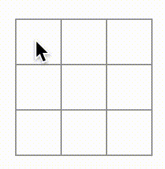{width="2.5in"
height="2.5625in"}

The X is overwritten by an O! While this would add a very interesting
twist to the game, we're going to stick to the original rules for now.

When you mark a square with a X or an O you aren't first checking to see
if the square already has a X or O value. You can fix this by *returning
early*. You'll check to see if the square already has a X or an O. If
the square is already filled, you will return in the handleClick
function early--before it tries to update the board state.

```
function handleClick(i) {
if (squares[i]) {
return;
}
const nextSquares = squares.slice();
//...
}
```

Now you can only add X's or O's to empty squares! Here is what your code
should look like at this point:

App.js

DownloadReset

Fork

```
import { useState } from 'react';
function Square({value, onSquareClick}) {
return (
<button className="square" onClick={onSquareClick}>
{value}
</button>
);
}
export default function Board() {
const [xIsNext, setXIsNext] = useState(true);
const [squares, setSquares] = useState(Array(9).fill(null));
function handleClick(i) {
if (squares[i]) {
return;
}
const nextSquares = squares.slice();
if (xIsNext) {
nextSquares[i] = 'X';
} else {
nextSquares[i] = 'O';
}
setSquares(nextSquares);
setXIsNext(!xIsNext);
}
return (
<>
<div className="board-row">
<Square value={squares[0]} onSquareClick={() => handleClick(0)} />
<Square value={squares[1]} onSquareClick={() => handleClick(1)} />
<Square value={squares[2]} onSquareClick={() => handleClick(2)} />
</div>
<div className="board-row">
```

Show more

### Declaring a winner 

Now that you show which player's turn is next, you should also show when
the game is won and there are no more turns to make. To do this you'll
add a helper function called calculateWinner that takes an array of 9
squares, checks for a winner and returns \'X\', \'O\', or null as
appropriate. Don't worry too much about the calculateWinner function;
it's not specific to React:

```
export default function Board() {
//...
}
function calculateWinner(squares) {
const lines = [
[0, 1, 2],
[3, 4, 5],
[6, 7, 8],
[0, 3, 6],
[1, 4, 7],
[2, 5, 8],
[0, 4, 8],
[2, 4, 6]
];
for (let i = 0; i < lines.length; i++) {
const [a, b, c] = lines[i];
if (squares[a] && squares[a] === squares[b] && squares[a] ===
squares[c]) {
return squares[a];
}
}
return null;
}
```

### Note

It does not matter whether you define calculateWinner before or after
the Board. Let's put it at the end so that you don't have to scroll past
it every time you edit your components.

You will call calculateWinner(squares) in the Board component's
handleClick function to check if a player has won. You can perform this
check at the same time you check if a user has clicked a square that
already has a X or and O. We'd like to return early in both cases:

```
function handleClick(i) {
if (squares[i] || calculateWinner(squares)) {
return;
}
const nextSquares = squares.slice();
//...
}
```

To let the players know when the game is over, you can display text such
as "Winner: X" or "Winner: O". To do that you'll add a status section to
the Board component. The status will display the winner if the game is
over and if the game is ongoing you'll display which player's turn is
next:

```
export default function Board() {
// ...
const winner = calculateWinner(squares);
let status;
if (winner) {
status = "Winner: " + winner;
} else {
status = "Next player: " + (xIsNext ? "X" : "O");
}
return (
<div>
<div className="status">{status}</div>
<div className="board-row">
// ...
)
}
```

Congratulations! You now have a working tic-tac-toe game. And you've
just learned the basics of React too. So *you* are the real winner here.
Here is what the code should look like:

App.js

DownloadReset

Fork

```
import { useState } from 'react';
function Square({value, onSquareClick}) {
return (
<button className="square" onClick={onSquareClick}>
{value}
</button>
);
}
export default function Board() {
const [xIsNext, setXIsNext] = useState(true);
const [squares, setSquares] = useState(Array(9).fill(null));
function handleClick(i) {
if (calculateWinner(squares) || squares[i]) {
return;
}
const nextSquares = squares.slice();
if (xIsNext) {
nextSquares[i] = 'X';
} else {
nextSquares[i] = 'O';
}
setSquares(nextSquares);
setXIsNext(!xIsNext);
}
const winner = calculateWinner(squares);
let status;
if (winner) {
status = 'Winner: ' + winner;
} else {
status = 'Next player: ' + (xIsNext ? 'X' : 'O');
}
return (
<>
<div className="status">{status}</div>
<div className="board-row">
<Square value={squares[0]} onSquareClick={() => handleClick(0)} />
<Square value={squares[1]} onSquareClick={() => handleClick(1)} />
<Square value={squares[2]} onSquareClick={() => handleClick(2)} />
</div>
<div className="board-row">
<Square value={squares[3]} onSquareClick={() => handleClick(3)} />
<Square value={squares[4]} onSquareClick={() => handleClick(4)} />
<Square value={squares[5]} onSquareClick={() => handleClick(5)} />
</div>
<div className="board-row">
<Square value={squares[6]} onSquareClick={() => handleClick(6)} />
<Square value={squares[7]} onSquareClick={() => handleClick(7)} />
<Square value={squares[8]} onSquareClick={() => handleClick(8)} />
</div>
</>
);
}
function calculateWinner(squares) {
const lines = [
[0, 1, 2],
[3, 4, 5],
[6, 7, 8],
[0, 3, 6],
[1, 4, 7],
[2, 5, 8],
[0, 4, 8],
[2, 4, 6],
];
for (let i = 0; i < lines.length; i++) {
const [a, b, c] = lines[i];
if (squares[a] && squares[a] === squares[b] && squares[a] ===
squares[c]) {
return squares[a];
}
}
return null;
}
```

## Adding time travel 

As a final exercise, let's make it possible to "go back in time" to the
previous moves in the game.

### Storing a history of moves 

If you mutated the squares array, implementing time travel would be very
difficult.

However, you used slice() to create a new copy of the squares array
after every move, and treated it as immutable. This will allow you to
store every past version of the squares array, and navigate between the
turns that have already happened.

You'll store the past squares arrays in another array called history,
which you'll store as a new state variable. The history array represents
all board states, from the first to the last move, and has a shape like
this:

```
\[
// Before first move
\[null, null, null, null, null, null, null, null, null\],
// After first move
\[null, null, null, null, \'X\', null, null, null, null\],
// After second move
\[null, null, null, null, \'X\', null, null, null, \'O\'\],
// \...
\]
```

### Lifting state up, again 

You will now write a new top-level component called Game to display a
list of past moves. That's where you will place the history state that
contains the entire game history.

Placing the history state into the Game component will let you remove
the squares state from its child Board component. Just like you "lifted
state up" from the Square component into the Board component, you will
now lift it up from the Board into the top-level Game component. This
gives the Game component full control over the Board's data and lets it
instruct the Board to render previous turns from the history.

First, add a Game component with export default. Have it render the
Board component and some markup:

```
function Board() {
// \...
}
export default function Game() {
return (
\<div className=\"game\"\>
\<div className=\"game-board\"\>
\<Board /\>
\</div\>
\<div className=\"game-info\"\>
\<ol\>{/\*TODO\*/}\</ol\>
\</div\>
\</div\>
);
}
```

Note that you are removing the export default keywords before the
function Board() { declaration and adding them before the function
Game() { declaration. This tells your index.js file to use the Game
component as the top-level component instead of your Board component.
The additional divs returned by the Game component are making room for
the game information you'll add to the board later.

Add some state to the Game component to track which player is next and
the history of moves:

```
export default function Game() {
const \[xIsNext, setXIsNext\] = useState(true);
const \[history, setHistory\] = useState(\[Array(9).fill(null)\]);
// \...
```

Notice how \[Array(9).fill(null)\] is an array with a single item, which
itself is an array of 9 nulls.

To render the squares for the current move, you'll want to read the last
squares array from the history. You don't need useState for this---you
already have enough information to calculate it during rendering:

```
export default function Game() {
const \[xIsNext, setXIsNext\] = useState(true);
const \[history, setHistory\] = useState(\[Array(9).fill(null)\]);
const currentSquares = history\[history.length - 1\];
// \...
```

Next, create a handlePlay function inside the Game component that will
be called by the Board component to update the game. Pass xIsNext,
currentSquares and handlePlay as props to the Board component:

```
export default function Game() {
const \[xIsNext, setXIsNext\] = useState(true);
const \[history, setHistory\] = useState(\[Array(9).fill(null)\]);
const currentSquares = history\[history.length - 1\];
function handlePlay(nextSquares) {
// TODO
}
return (
\<div className=\"game\"\>
\<div className=\"game-board\"\>
\<Board xIsNext={xIsNext} squares={currentSquares} onPlay={handlePlay} /\>
//\...
)
}
```

Let's make the Board component fully controlled by the props it
receives. Change the Board component to take three props: xIsNext,
squares, and a new onPlay function that Board can call with the updated
squares array when a player makes a move. Next, remove the first two
lines of the Board function that call useState:

```
function Board({ xIsNext, squares, onPlay }) {
function handleClick(i) {
//\...
}
// \...
}
```

Now replace the setSquares and setXIsNext calls in handleClick in the
Board component with a single call to your new onPlay function so the
Game component can update the Board when the user clicks a square:

```
function Board({ xIsNext, squares, onPlay }) {
function handleClick(i) {
if (calculateWinner(squares) \|\| squares\[i\]) {
return;
}
const nextSquares = squares.slice();
if (xIsNext) {
nextSquares\[i\] = \"X\";
} else {
nextSquares\[i\] = \"O\";
}
onPlay(nextSquares);
}
//\...
}
```

The Board component is fully controlled by the props passed to it by the
Game component. You need to implement the handlePlay function in the
Game component to get the game working again.

What should handlePlay do when called? Remember that Board used to call
setSquares with an updated array; now it passes the updated squares
array to onPlay.

The handlePlay function needs to update Game's state to trigger a
re-render, but you don't have a setSquares function that you can call
any more---you're now using the history state variable to store this
information. You'll want to update history by appending the updated
squares array as a new history entry. You also want to toggle xIsNext,
just as Board used to do:

```
export default function Game() {
//\...
function handlePlay(nextSquares) {
setHistory(\[\...history, nextSquares\]);
setXIsNext(!xIsNext);
}
//\...
}
```

Here, \[\...history, nextSquares\] creates a new array that contains all
the items in history, followed by nextSquares. (You can read the
\...history [*[spread
syntax]{.underline}*](https://developer.mozilla.org/en-US/docs/Web/JavaScript/Reference/Operators/Spread_syntax)
as "enumerate all the items in history".)

For example, if history is \[\[null,null,null\], \[\"X\",null,null\]\]
and nextSquares is \[\"X\",null,\"O\"\], then the new \[\...history,
nextSquares\] array will be \[\[null,null,null\], \[\"X\",null,null\],
\[\"X\",null,\"O\"\]\].

At this point, you've moved the state to live in the Game component, and
the UI should be fully working, just as it was before the refactor. Here
is what the code should look like at this point:

App.js

DownloadReset

Fork

```
import { useState } from \'react\';
function Square({ value, onSquareClick }) {
return (
\<button className=\"square\" onClick={onSquareClick}\>
{value}
\</button\>
);
}
function Board({ xIsNext, squares, onPlay }) {
function handleClick(i) {
if (calculateWinner(squares) \|\| squares\[i\]) {
return;
}
const nextSquares = squares.slice();
if (xIsNext) {
nextSquares\[i\] = \'X\';
} else {
nextSquares\[i\] = \'O\';
}
onPlay(nextSquares);
}
const winner = calculateWinner(squares);
let status;
if (winner) {
status = \'Winner: \' + winner;
} else {
status = \'Next player: \' + (xIsNext ? \'X\' : \'O\');
}
return (
\<\>
\<div className=\"status\"\>{status}\</div\>
\<div className=\"board-row\"\>
```

### Showing the past moves 

Since you are recording the tic-tac-toe game's history, you can now
display a list of past moves to the player.

React elements like \<button\> are regular JavaScript objects; you can
pass them around in your application. To render multiple items in React,
you can use an array of React elements.

You already have an array of history moves in state, so now you need to
transform it to an array of React elements. In JavaScript, to transform
one array into another, you can use the [array [map]{.underline}
method:](https://developer.mozilla.org/en-US/docs/Web/JavaScript/Reference/Global_Objects/Array/map)

```
\[1, 2, 3\].map((x) =\> x \* 2) // \[2, 4, 6\]
```

You'll use map to transform your history of moves into React elements
representing buttons on the screen, and display a list of buttons to
"jump" to past moves. Let's map over the history in the Game component:

```
export default function Game() {
const \[xIsNext, setXIsNext\] = useState(true);
const \[history, setHistory\] = useState(\[Array(9).fill(null)\]);
const currentSquares = history\[history.length - 1\];
function handlePlay(nextSquares) {
setHistory(\[\...history, nextSquares\]);
setXIsNext(!xIsNext);
}
function jumpTo(nextMove) {
// TODO
}
const moves = history.map((squares, move) =\> {
let description;
if (move \> 0) {
description = \'Go to move #\' + move;
} else {
description = \'Go to game start\';
}
return (
\<li\>
\<button onClick={() =\> jumpTo(move)}\>{description}\</button\>
\</li\>
);
});
return (
\<div className=\"game\"\>
\<div className=\"game-board\"\>
\<Board xIsNext={xIsNext} squares={currentSquares} onPlay={handlePlay}
/\>
\</div\>
\<div className=\"game-info\"\>
\<ol\>{moves}\</ol\>
\</div\>
\</div\>
);
}
```

You can see what your code should look like below. Note that you should
see an error in the developer tools console that says: Warning: Each
child in an array or iterator should have a unique \"key\" prop. Check
the render method of \`Game\`. You'll fix this error in the next
section.

App.js

DownloadReset

Top of Form

Bottom of Form

Fork

```
import { useState } from \'react\';
function Square({ value, onSquareClick }) {
return (
\<button className=\"square\" onClick={onSquareClick}\>
{value}
\</button\>
);
}
function Board({ xIsNext, squares, onPlay }) {
function handleClick(i) {
if (calculateWinner(squares) \|\| squares\[i\]) {
return;
}
const nextSquares = squares.slice();
if (xIsNext) {
nextSquares\[i\] = \'X\';
} else {
nextSquares\[i\] = \'O\';
}
onPlay(nextSquares);
}
const winner = calculateWinner(squares);
let status;
if (winner) {
status = \'Winner: \' + winner;
} else {
status = \'Next player: \' + (xIsNext ? \'X\' : \'O\');
}
return (
\<\>
\<div className=\"status\"\>{status}\</div\>
\<div className=\"board-row\"\>
\<Square value={squares\[0\]} onSquareClick={() =\> handleClick(0)} /\>
\<Square value={squares\[1\]} onSquareClick={() =\> handleClick(1)} /\>
\<Square value={squares\[2\]} onSquareClick={() =\> handleClick(2)} /\>
\</div\>
\<div className=\"board-row\"\>
\<Square value={squares\[3\]} onSquareClick={() =\> handleClick(3)} /\>
\<Square value={squares\[4\]} onSquareClick={() =\> handleClick(4)} /\>
\<Square value={squares\[5\]} onSquareClick={() =\> handleClick(5)} /\>
\</div\>
\<div className=\"board-row\"\>
\<Square value={squares\[6\]} onSquareClick={() =\> handleClick(6)} /\>
\<Square value={squares\[7\]} onSquareClick={() =\> handleClick(7)} /\>
\<Square value={squares\[8\]} onSquareClick={() =\> handleClick(8)} /\>
\</div\>
\</\>
);
}
export default function Game() {
const \[xIsNext, setXIsNext\] = useState(true);
const \[history, setHistory\] = useState(\[Array(9).fill(null)\]);
const currentSquares = history\[history.length - 1\];
function handlePlay(nextSquares) {
setHistory(\[\...history, nextSquares\]);
setXIsNext(!xIsNext);
}
function jumpTo(nextMove) {
// TODO
}
const moves = history.map((squares, move) =\> {
let description;
if (move \> 0) {
description = \'Go to move #\' + move;
} else {
description = \'Go to game start\';
}
return (
\<li\>
\<button onClick={() =\> jumpTo(move)}\>{description}\</button\>
\</li\>
);
});
return (
\<div className=\"game\"\>
\<div className=\"game-board\"\>
\<Board xIsNext={xIsNext} squares={currentSquares} onPlay={handlePlay}
/\>
\</div\>
\<div className=\"game-info\"\>
\<ol\>{moves}\</ol\>
\</div\>
\</div\>
);
}
function calculateWinner(squares) {
const lines = \[
\[0, 1, 2\],
\[3, 4, 5\],
\[6, 7, 8\],
\[0, 3, 6\],
\[1, 4, 7\],
\[2, 5, 8\],
\[0, 4, 8\],
\[2, 4, 6\],
\];
for (let i = 0; i \< lines.length; i++) {
const \[a, b, c\] = lines\[i\];
if (squares\[a\] && squares\[a\] === squares\[b\] && squares\[a\] ===
squares\[c\]) {
return squares\[a\];
}
}
return null;
}
```

As you iterate through history array inside the function you passed to
map, the squares argument goes through each element of history, and the
move argument goes through each array index: 0, 1, 2, .... (In most
cases, you'd need the actual array elements, but to render a list of
moves you will only need indexes.)

For each move in the tic-tac-toe game's history, you create a list item
\<li\> which contains a button \<button\>. The button has an onClick
handler which calls a function called jumpTo (that you haven't
implemented yet).

For now, you should see a list of the moves that occurred in the game
and an error in the developer tools console. Let's discuss what the
"key" error means.

### Picking a key 

When you render a list, React stores some information about each
rendered list item. When you update a list, React needs to determine
what has changed. You could have added, removed, re-arranged, or updated
the list's items.

Imagine transitioning from

\<li\>Alexa: 7 tasks left\</li\>

\<li\>Ben: 5 tasks left\</li\>

to

\<li\>Ben: 9 tasks left\</li\>

\<li\>Claudia: 8 tasks left\</li\>

\<li\>Alexa: 5 tasks left\</li\>

In addition to the updated counts, a human reading this would probably
say that you swapped Alexa and Ben's ordering and inserted Claudia
between Alexa and Ben. However, React is a computer program and can't
know what you intended, so you need to specify a *key* property for each
list item to differentiate each list item from its siblings. If your
data was from a database, Alexa, Ben, and Claudia's database IDs could
be used as keys.

```
\<li key={user.id}\>
{user.name}: {user.taskCount} tasks left
\</li\>
```

When a list is re-rendered, React takes each list item's key and
searches the previous list's items for a matching key. If the current
list has a key that didn't exist before, React creates a component. If
the current list is missing a key that existed in the previous list,
React destroys the previous component. If two keys match, the
corresponding component is moved.

Keys tell React about the identity of each component, which allows React
to maintain state between re-renders. If a component's key changes, the
component will be destroyed and re-created with a new state.

key is a special and reserved property in React. When an element is
created, React extracts the key property and stores the key directly on
the returned element. Even though key may look like it is passed as
props, React automatically uses key to decide which components to
update. There's no way for a component to ask what key its parent
specified.

**It's strongly recommended that you assign proper keys whenever you
build dynamic lists.** If you don't have an appropriate key, you may
want to consider restructuring your data so that you do.

If no key is specified, React will report an error and use the array
index as a key by default. Using the array index as a key is problematic
when trying to re-order a list's items or inserting/removing list items.
Explicitly passing key={i} silences the error but has the same problems
as array indices and is not recommended in most cases.

Keys do not need to be globally unique; they only need to be unique
between components and their siblings.

### Implementing time travel 

In the tic-tac-toe game's history, each past move has a unique ID
associated with it: it's the sequential number of the move. Moves will
never be re-ordered, deleted, or inserted in the middle, so it's safe to
use the move index as a key.

In the Game function, you can add the key as \<li key={move}\>, and if
you reload the rendered game, React's "key" error should disappear:

```
const moves = history.map((squares, move) =\> {
//\...
return (
\<li key={move}\>
\<button onClick={() =\> jumpTo(move)}\>{description}\</button\>
\</li\>
);
});
```

App.js

DownloadReset

```
import { useState } from \'react\';
function Square({ value, onSquareClick }) {
return (
\<button className=\"square\" onClick={onSquareClick}\>
{value}
\</button\>
);
}
function Board({ xIsNext, squares, onPlay }) {
function handleClick(i) {
if (calculateWinner(squares) \|\| squares\[i\]) {
return;
}
const nextSquares = squares.slice();
if (xIsNext) {
nextSquares\[i\] = \'X\';
} else {
nextSquares\[i\] = \'O\';
}
onPlay(nextSquares);
}
const winner = calculateWinner(squares);
let status;
if (winner) {
status = \'Winner: \' + winner;
} else {
status = \'Next player: \' + (xIsNext ? \'X\' : \'O\');
}
return (
\<\>
\<div className=\"status\"\>{status}\</div\>
\<div className=\"board-row\"\>
```

Show more

Before you can implement jumpTo, you need the Game component to keep
track of which step the user is currently viewing. To do this, define a
new state variable called currentMove, defaulting to 0:

```
export default function Game() {
const \[xIsNext, setXIsNext\] = useState(true);
const \[history, setHistory\] = useState(\[Array(9).fill(null)\]);
const \[currentMove, setCurrentMove\] = useState(0);
const currentSquares = history\[history.length - 1\];
//\...
}
```

Next, update the jumpTo function inside Game to update that currentMove.
You'll also set xIsNext to true if the number that you're changing
currentMove to is even.

```
export default function Game() {
// \...
function jumpTo(nextMove) {
setCurrentMove(nextMove);
setXIsNext(nextMove % 2 === 0);
}
//\...
}
```

You will now make two changes to the Game's handlePlay function which is
called when you click on a square.

-   If you "go back in time" and then make a new move from that point,
    you only want to keep the history up to that point. Instead of
    adding nextSquares after all items (\... spread syntax) in history,
    you'll add it after all items in history.slice(0, currentMove +
    1) so that you're only keeping that portion of the old history.

-   Each time a move is made, you need to update currentMove to point to
    the latest history entry.

```
function handlePlay(nextSquares) {
const nextHistory = \[\...history.slice(0, currentMove + 1),
nextSquares\];
setHistory(nextHistory);
setCurrentMove(nextHistory.length - 1);
setXIsNext(!xIsNext);
}
```

Finally, you will modify the Game component to render the currently
selected move, instead of always rendering the final move:

```
export default function Game() {
const \[xIsNext, setXIsNext\] = useState(true);
const \[history, setHistory\] = useState(\[Array(9).fill(null)\]);
const \[currentMove, setCurrentMove\] = useState(0);
const currentSquares = history\[currentMove\];
// \...
}
```

If you click on any step in the game's history, the tic-tac-toe board
should immediately update to show what the board looked like after that
step occurred.

App.js

DownloadReset

Fork

```
import { useState } from \'react\';
function Square({value, onSquareClick}) {
return (
\<button className=\"square\" onClick={onSquareClick}\>
{value}
\</button\>
);
}
function Board({ xIsNext, squares, onPlay }) {
function handleClick(i) {
if (calculateWinner(squares) \|\| squares\[i\]) {
return;
}
const nextSquares = squares.slice();
if (xIsNext) {
nextSquares\[i\] = \'X\';
} else {
nextSquares\[i\] = \'O\';
}
onPlay(nextSquares);
}
const winner = calculateWinner(squares);
let status;
if (winner) {
status = \'Winner: \' + winner;
} else {
status = \'Next player: \' + (xIsNext ? \'X\' : \'O\');
}
return (
\<\>
\<div className=\"status\"\>{status}\</div\>
\<div className=\"board-row\"\>
```

Show more

### Final cleanup 

If you look at the code very closely, you may notice that xIsNext ===
true when currentMove is even and xIsNext === false when currentMove is
odd. In other words, if you know the value of currentMove, then you can
always figure out what xIsNext should be.

There's no reason for you to store both of these in state. In fact,
always try to avoid redundant state. Simplifying what you store in state
reduces bugs and makes your code easier to understand. Change Game so
that it doesn't store xIsNext as a separate state variable and instead
figures it out based on the currentMove:

```
export default function Game() {
const \[history, setHistory\] = useState(\[Array(9).fill(null)\]);
const \[currentMove, setCurrentMove\] = useState(0);
const xIsNext = currentMove % 2 === 0;
const currentSquares = history\[currentMove\];
function handlePlay(nextSquares) {
const nextHistory = \[\...history.slice(0, currentMove + 1),
nextSquares\];
setHistory(nextHistory);
setCurrentMove(nextHistory.length - 1);
}
function jumpTo(nextMove) {
setCurrentMove(nextMove);
}
// \...
}
```

You no longer need the xIsNext state declaration or the calls to
setXIsNext. Now, there's no chance for xIsNext to get out of sync with
currentMove, even if you make a mistake while coding the components.

### Wrapping up 

Congratulations! You've created a tic-tac-toe game that:

-   Lets you play tic-tac-toe,

-   Indicates when a player has won the game,

-   Stores a game's history as a game progresses,

-   Allows players to review a game's history and see previous versions
    of a game's board.

Nice work! We hope you now feel like you have a decent grasp of how
React works.

Check out the final result here:

App.js

DownloadReset

Fork

```
import { useState } from \'react\';
function Square({ value, onSquareClick }) {
return (
\<button className=\"square\" onClick={onSquareClick}\>
{value}
\</button\>
);
}
function Board({ xIsNext, squares, onPlay }) {
function handleClick(i) {
if (calculateWinner(squares) \|\| squares\[i\]) {
return;
}
const nextSquares = squares.slice();
if (xIsNext) {
nextSquares\[i\] = \'X\';
} else {
nextSquares\[i\] = \'O\';
}
onPlay(nextSquares);
}
const winner = calculateWinner(squares);
let status;
if (winner) {
status = \'Winner: \' + winner;
} else {
status = \'Next player: \' + (xIsNext ? \'X\' : \'O\');
}
return (
\<\>
\<div className=\"status\"\>{status}\</div\>
\<div className=\"board-row\"\>
```

If you have extra time or want to practice your new React skills, here
are some ideas for improvements that you could make to the tic-tac-toe
game, listed in order of increasing difficulty:

1.  For the current move only, show "You are at move #..." instead of a
    button

2.  Rewrite Board to use two loops to make the squares instead of
    hardcoding them.

3.  Add a toggle button that lets you sort the moves in either ascending
    or descending order.

4.  When someone wins, highlight the three squares that caused the win
    (and when no one wins, display a message about the result being a
    draw).

5.  Display the location for each move in the format (col, row) in the
    move history list.

Throughout this tutorial, you've touched on React concepts including
elements, components, props, and state. Now that you've seen how these
concepts work when building a game, check out [Thinking in
React](https://react.dev/learn/thinking-in-react) to see how the same
React concepts work when build an app's UI.

# Thinking in React

React can change how you think about the designs you look at and the
apps you build. When you build a user interface with React, you will
first break it apart into pieces called *components*. Then, you will
describe the different visual states for each of your components.
Finally, you will connect your components together so that the data
flows through them. In this tutorial, we'll guide you through the
thought process of building a searchable product data table with React.

## Start with the mockup 

Imagine that you already have a JSON API and a mockup from a designer.

The JSON API returns some data that looks like this:

```
\[
{ category: \"Fruits\", price: \"\$1\", stocked: true, name: \"Apple\"
},
{ category: \"Fruits\", price: \"\$1\", stocked: true, name:
\"Dragonfruit\" },
{ category: \"Fruits\", price: \"\$2\", stocked: false, name:
\"Passionfruit\" },
{ category: \"Vegetables\", price: \"\$2\", stocked: true, name:
\"Spinach\" },
{ category: \"Vegetables\", price: \"\$4\", stocked: false, name:
\"Pumpkin\" },
{ category: \"Vegetables\", price: \"\$1\", stocked: true, name:
\"Peas\" }
\]
```

The mockup looks like this:

{width="3.125in"
height="3.5208333333333335in"}

To implement a UI in React, you will usually follow the same five steps.

## Step 1: Break the UI into a component hierarchy 

Start by drawing boxes around every component and subcomponent in the
mockup and naming them. If you work with a designer, they may have
already named these components in their design tool. Ask them!

Depending on your background, you can think about splitting up a design
into components in different ways:

-   **Programming**---use the same techniques for deciding if you should
    create a new function or object. One such technique is the [single
    responsibility
    principle](https://en.wikipedia.org/wiki/Single_responsibility_principle),
    that is, a component should ideally only do one thing. If it ends up
    growing, it should be decomposed into smaller subcomponents.

-   **CSS**---consider what you would make class selectors for.
    (However, components are a bit less granular.)

-   **Design**---consider how you would organize the design's layers.

If your JSON is well-structured, you'll often find that it naturally
maps to the component structure of your UI. That's because UI and data
models often have the same information architecture---that is, the same
shape. Separate your UI into components, where each component matches
one piece of your data model.

There are five components on this screen:

{width="5.208333333333333in"
height="3.2291666666666665in"}

1.  FilterableProductTable (grey) contains the entire app.

2.  SearchBar (blue) receives the user input.

3.  ProductTable (lavender) displays and filters the list according to
    the user input.

4.  ProductCategoryRow (green) displays a heading for each category.

5.  ProductRow (yellow) displays a row for each product.

If you look at ProductTable (lavender), you'll see that the table header
(containing the "Name" and "Price" labels) isn't its own component. This
is a matter of preference, and you could go either way. For this
example, it is a part of ProductTable because it appears inside the
ProductTable's list. However, if this header grows to be complex (e.g.,
if you add sorting), you can move it into its own ProductTableHeader
component.

Now that you've identified the components in the mockup, arrange them
into a hierarchy. Components that appear within another component in the
mockup should appear as a child in the hierarchy:

-   FilterableProductTable

    -   SearchBar

    -   ProductTable

        -   ProductCategoryRow

        -   ProductRow

## Step 2: Build a static version in React 

Now that you have your component hierarchy, it's time to implement your
app. The most straightforward approach is to build a version that
renders the UI from your data model without adding any interactivity...
yet! It's often easier to build the static version first and add
interactivity later. Building a static version requires a lot of typing
and no thinking, but adding interactivity requires a lot of thinking and
not a lot of typing.

To build a static version of your app that renders your data model,
you'll want to build
[components](https://react.dev/learn/your-first-component) that reuse
other components and pass data using
[props.](https://react.dev/learn/passing-props-to-a-component) Props are
a way of passing data from parent to child. (If you're familiar with the
concept of [state](https://react.dev/learn/state-a-components-memory),
don't use state at all to build this static version. State is reserved
only for interactivity, that is, data that changes over time. Since this
is a static version of the app, you don't need it.)

You can either build "top down" by starting with building the components
higher up in the hierarchy (like FilterableProductTable) or "bottom up"
by working from components lower down (like ProductRow). In simpler
examples, it's usually easier to go top-down, and on larger projects,
it's easier to go bottom-up.

App.js

DownloadReset

Fork

```
function ProductCategoryRow({ category }) {
return (
\<tr\>
\<th colSpan=\"2\"\>
{category}
\</th\>
\</tr\>
);
}
function ProductRow({ product }) {
const name = product.stocked ? product.name :
\<span style={{ color: \'red\' }}\>
{product.name}
\</span\>;
return (
\<tr\>
\<td\>{name}\</td\>
\<td\>{product.price}\</td\>
\</tr\>
);
}
function ProductTable({ products }) {
const rows = \[\];
let lastCategory = null;
products.forEach((product) =\> {
if (product.category !== lastCategory) {
rows.push(
\<ProductCategoryRow
category={product.category}
key={product.category} /\>
);
}
```

Show more

(If this code looks intimidating, go through the [Quick
Start](https://react.dev/learn) first!)

After building your components, you'll have a library of reusable
components that render your data model. Because this is a static app,
the components will only return JSX. The component at the top of the
hierarchy (FilterableProductTable) will take your data model as a prop.
This is called *one-way data flow* because the data flows down from the
top-level component to the ones at the bottom of the tree.

### Pitfall

At this point, you should not be using any state values. That's for the
next step!

## Step 3: Find the minimal but complete representation of UI state 

To make the UI interactive, you need to let users change your underlying
data model. You will use *state* for this.

Think of state as the minimal set of changing data that your app needs
to remember. The most important principle for structuring state is to
keep it [DRY (Don't Repeat
Yourself).](https://en.wikipedia.org/wiki/Don%27t_repeat_yourself)
Figure out the absolute minimal representation of the state your
application needs and compute everything else on-demand. For example, if
you're building a shopping list, you can store the items as an array in
state. If you want to also display the number of items in the list,
don't store the number of items as another state value---instead, read
the length of your array.

Now think of all of the pieces of data in this example application:

1.  The original list of products

2.  The search text the user has entered

3.  The value of the checkbox

4.  The filtered list of products

Which of these are state? Identify the ones that are not:

-   Does it **remain unchanged** over time? If so, it isn't state.

-   Is it **passed in from a parent** via props? If so, it isn't state.

-   **Can you compute it** based on existing state or props in your
    component? If so, it *definitely* isn't state!

What's left is probably state.

Let's go through them one by one again:

1.  The original list of products is **passed in as props, so it's not
    state.**

2.  The search text seems to be state since it changes over time and
    can't be computed from anything.

3.  The value of the checkbox seems to be state since it changes over
    time and can't be computed from anything.

4.  The filtered list of products **isn't state because it can be
    computed** by taking the original list of products and filtering it
    according to the search text and value of the checkbox.

This means only the search text and the value of the checkbox are state!
Nicely done!

DEEP DIVE

Props vs State 

# Step 4: Identify where your state should live 

After identifying your app's minimal state data, you need to identify
which component is responsible for changing this state, or owns the
state. Remember: React uses one-way data flow, passing data down the
component hierarchy from parent to child component. It may not be
immediately clear which component should own what state. This can be
challenging if you're new to this concept, but you can figure it out by
following these steps!

For each piece of state in your application:

1.  Identify every component that renders something based on that state.

2.  Find their closest common parent component---a component above them
    all in the hierarchy.

3.  Decide where the state should live:

4.  Often, you can put the state directly into their common parent.

5.  You can also put the state into some component above their common
    parent.

6.  If you can't find a component where it makes sense to own the state,
    create a new component solely for holding the state and add it
    somewhere in the hierarchy above the common parent component.

In the previous step, you found two pieces of state in this application:
the search input text, and the value of the checkbox. In this example,
they always appear together, so it makes sense to put them into the same
place.

Now let's run through our strategy for them:

1.  Identify components that use state:

2.  ProductTable needs to filter the product list based on that state
    (search text and checkbox value).

3.  SearchBar needs to display that state (search text and checkbox
    value).

4.  Find their common parent: The first parent component both components
    share is FilterableProductTable.

5.  Decide where the state lives: We'll keep the filter text and checked
    state values in FilterableProductTable.

So, the state values will live in FilterableProductTable.

Add state to the component with the [useState()
Hook.](https://react.dev/reference/react/useState) Hooks are special
functions that let you "hook into" React. Add two state variables at the
top of FilterableProductTable and specify their initial state:

# function FilterableProductTable({ products }) {

#  const \[filterText, setFilterText\] = useState(\'\');

#  const \[inStockOnly, setInStockOnly\] = useState(false);

Then, pass filterText and inStockOnly to ProductTable and SearchBar as
props:

```
> \<div\>
> \<SearchBar
> filterText={filterText}
> inStockOnly={inStockOnly} /\>
> \<ProductTable
> products={products}
> filterText={filterText}
> inStockOnly={inStockOnly} /\>
> \</div\>
```

You can start seeing how your application will behave. Edit the
filterText initial value from useState(\'\') to useState(\'fruit\') in
the sandbox code below. You'll see both the search input text and the
table update:

#### App.js

```
> import { useState } from \'react\';
> function FilterableProductTable({ products }) {
> const \[filterText, setFilterText\] = useState(\'\');
> const \[inStockOnly, setInStockOnly\] = useState(false);
> return (
> \<div\>
> \<SearchBar
> filterText={filterText}
> inStockOnly={inStockOnly} /\>
> \<ProductTable
> products={products}
> filterText={filterText}
> inStockOnly={inStockOnly} /\>
> \</div\>
> );
> }
> function ProductCategoryRow({ category }) {
> return (
> \<tr\>
> \<th colSpan=\"2\"\>
> {category}
> \</th\>
> \</tr\>
> );
> }
> function ProductRow({ product }) {
> const name = product.stocked ? product.name :
> \<span style={{ color: \'red\' }}\>
> {product.name}
> \</span\>;
> return (
```

Notice that editing the form doesn't work yet. There is a console error
in the sandbox above explaining why:

### Console

You provided a \`value\` prop to a form field without an \`onChange\`
handler. This will render a read-only field.

In the sandbox above, ProductTable and SearchBar read the filterText and
inStockOnly props to render the table, the input, and the checkbox. For
example, here is how SearchBar populates the input value:

```
> function SearchBar({ filterText, inStockOnly }) {
> return (
> \<form\>
> &lt;input
> type=\"text\"
> value={filterText}
> placeholder=\"Search\...\"/\>
```

However, you haven't added any code to respond to the user actions like
typing yet. This will be your final step.

## Step 5: Add inverse data flow 

Currently your app renders correctly with props and state flowing down
the hierarchy. But to change the state according to user input, you will
need to support data flowing the other way: the form components deep in
the hierarchy need to update the state in FilterableProductTable.

React makes this data flow explicit, but it requires a little more
typing than two-way data binding. If you try to type or check the box in
the example above, you'll see that React ignores your input. This is
intentional. By writing \<input value={filterText} /\>, you've set the
value prop of the input to always be equal to the filterText state
passed in from FilterableProductTable. Since filterText state is never
set, the input never changes.

You want to make it so whenever the user changes the form inputs, the
state updates to reflect those changes. The state is owned by
FilterableProductTable, so only it can call setFilterText and
setInStockOnly. To let SearchBar update the FilterableProductTable's
state, you need to pass these functions down to SearchBar:

```
> function FilterableProductTable({ products }) {
> const \[filterText, setFilterText\] = useState(\'\');
> const \[inStockOnly, setInStockOnly\] = useState(false);
> return (
> &lt;div\>
> &lt;SearchBar
> filterText={filterText}
> inStockOnly={inStockOnly}
> onFilterTextChange={setFilterText}
> onInStockOnlyChange={setInStockOnly} /\>
```

Inside the SearchBar, you will add the onChange event handlers and set
the parent state from them:

```
> &lt;input
> type=\"text\"
> value={filterText}
> placeholder=\"Search\...\"
> onChange={(e) =\> onFilterTextChange(e.target.value)} /\>
```

Now the application fully works!

### App.js

```
> import { useState } from \'react\';
> function FilterableProductTable({ products }) {
> const \[filterText, setFilterText\] = useState(\'\');
> const \[inStockOnly, setInStockOnly\] = useState(false);
> return (
> &lt;div\>
> &lt;SearchBar
> filterText={filterText}
> inStockOnly={inStockOnly}
> onFilterTextChange={setFilterText}
> onInStockOnlyChange={setInStockOnly} /\>
> &lt;ProductTable
> products={products}
> filterText={filterText}
> inStockOnly={inStockOnly} /\>
> &lt;/div\>
> );
> }
> function ProductCategoryRow({ category }) {
> return (
> &lt;tr\>
> &lt;th colSpan=\"2\"\>
> {category}
> &lt;/th\>
> &lt;/tr\>
> );
> }
> function ProductRow({ product }) {
> const name = product.stocked ? product.name :
> &lt;span style={{ color: \'red\' }}\>
> {product.name}
> &lt;/span\>;
```

You can learn all about handling events and updating state in the
[Adding Interactivity](https://react.dev/learn/adding-interactivity)
section.

# Where to go from here 

This was a very brief introduction to how to think about building
components and applications with React. You can [start a React
project](https://react.dev/learn/installation) right now or [dive deeper
on all the syntax](https://react.dev/learn/describing-the-ui) used in
this tutorial.

# Installation

React has been designed from the start for gradual adoption. You can use
as little or as much React as you need. Whether you want to get a taste
of React, add some interactivity to an HTML page, or start a complex
React-powered app, this section will help you get started.

## In this chapter

1.  [How to start a new React
    project](https://react.dev/learn/start-a-new-react-project)

2.  [How to add React to an existing
    project](https://react.dev/learn/add-react-to-an-existing-project)

3.  [How to set up your editor](https://react.dev/learn/editor-setup)

4.  [How to install React Developer
    Tools](https://react.dev/learn/react-developer-tools)

### Try React 

You don't need to install anything to play with React. Try editing this
sandbox!

### App.js

```
> function Greeting({ name }) {
> return &lt;h1\>Hello, {name}&lt;/h1\>;
> }
> export default function App() {
> return &lt;Greeting name=\"world\" /\>
> }
```

You can edit it directly or open it in a new tab by pressing the "Fork"
button in the upper right corner.

Most pages in the React documentation contain sandboxes like this.
Outside of the React documentation, there are many online sandboxes that
support React: for example, [CodeSandbox](https://codesandbox.io/s/new),
[StackBlitz](https://stackblitz.com/fork/react), or
[CodePen.](https://codepen.io/pen?&editors=0010&layout=left&prefill_data_id=3f4569d1-1b11-4bce-bd46-89090eed5ddb)

Try React locally 

To try React locally on your computer, [download this HTML
page.](https://gist.githubusercontent.com/gaearon/0275b1e1518599bbeafcde4722e79ed1/raw/db72dcbf3384ee1708c4a07d3be79860db04bff0/example.html)
Open it in your editor and in your browser!

Start a new React project 

If you want to build an app or a website fully with React, [start a new
React project.](https://react.dev/learn/start-a-new-react-project)

Add React to an existing project 

If want to try using React in your existing app or a website, [add React
to an existing
project.](https://react.dev/learn/add-react-to-an-existing-project)

Next steps 

Head to the [Quick Start](https://react.dev/learn) guide for a tour of
the most important React concepts you will encounter every day.

