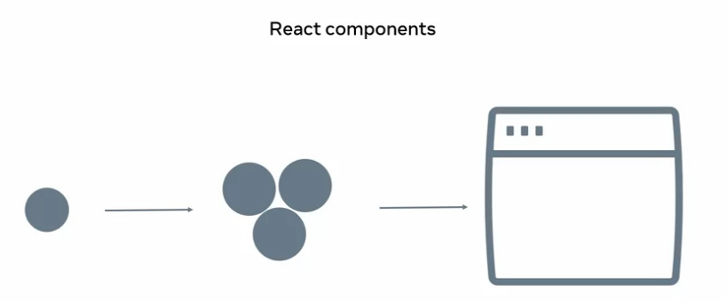
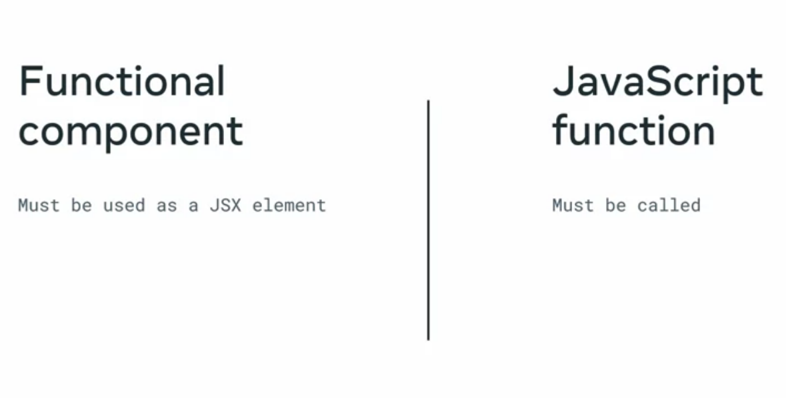
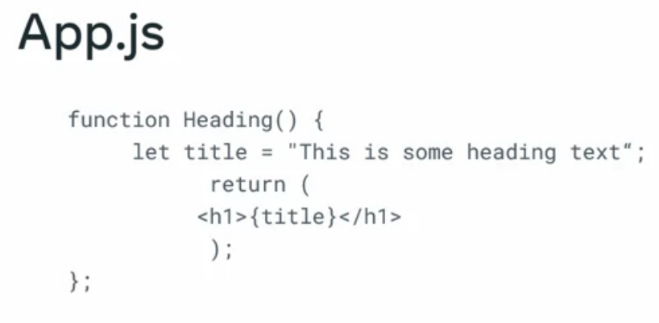
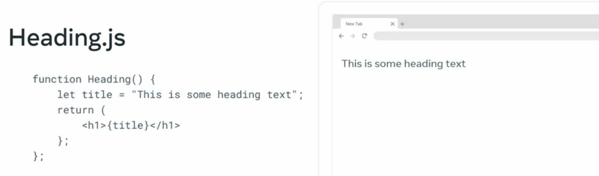

<link rel="stylesheet" type="text/css" media="all" href="./css/markdown-styles.css" />

<h1 align="center" width="100%">meta (Coursera) / React Basics</h1>

<h6 align="center">(meta-react-basics)</h6>
<!--~~~~~~~~~~~~~~~~~~~~~~~~~~~~~~~~~~~~~~~~~~~~~~~~~~~~~~~~~~~~~~~~~~~~~~~~~~~~~~~~~~~~~~~~~~~~-->
<!--~~~~~~~~~~~~~~~~~~~~~~~~ readme.md in meta-react-basics.bauska.org ~~~~~~~~~~~~~~~~~~~~~~~~~-->
<!--~~~~~~~~~~~~~~~~~~~~~~~~~~~~~~~~~~~~~~~~~~~~~~~~~~~~~~~~~~~~~~~~~~~~~~~~~~~~~~~~~~~~~~~~~~~~-->
<!--~~~~~~~~~~~~~~~~~~~~~~~~~~~~~~~~~~ w1-a. meta logo (01) ~~~~~~~~~~~~~~~~~~~~~~~~~~~~~~~~~~~~-->
<!--~~~~~~~~~~~~~~~~~~~~~~~~~~~~~~~~~~~~~~~~~~~~~~~~~~~~~~~~~~~~~~~~~~~~~~~~~~~~~~~~~~~~~~~~~~~~-->
<p align="center" width="100%">

</p>
<!-- {width="1.549261811023622in" height="0.5in"} -->
<!--~~~~~~~~~~~~~~~~~~~~~~~~~~~~~~~~~~~~~~~~~~~~~~~~~~~~~~~~~~~~~~~~~~~~~~~~~~~~~~~~~~~~~~~~~~~~-->
<!--~~~~~~~~~~~~~~~~~~~~~~~~~~~~~~~~~ w1-b. coursera logo (01) ~~~~~~~~~~~~~~~~~~~~~~~~~~~~~~~~~-->
<!--~~~~~~~~~~~~~~~~~~~~~~~~~~~~~~~~~~~~~~~~~~~~~~~~~~~~~~~~~~~~~~~~~~~~~~~~~~~~~~~~~~~~~~~~~~~~-->
<p align="center" width="100%">

</p>
<!-- {width="1.0175437445319335in" height="0.5in"} -->
<p>React is a powerful JavaScript library that you can use to build user
interfaces for web and mobile applications (apps).</p>

<p>In this 4-week course, you will explore the fundamental concepts that
underpin the React library and learn the basic skills required to build
a simple, fast, and scalable app.</p>

<p>By the end of this course, you will be able to:</p>

<ul>
  <li><p>Use reusable components to render views where data changes over time,</p></li>
  <li><p>Create more scalable and maintainable websites and apps,</p></li>
  <li><p>Use props to pass data between components,</p></li>
  <li><p>Create dynamic and interactive web pages and apps,</p></li>
  <li><p>Use forms to allow users to interact with the web page,</p></li>
  <li><p>Build an application in React,</p></li>
  <li><p>You'll gain experience with the following tools and software:</p></li>
  <ul>
    <li><p>React.js,</p></li>
    <li><p>JSX,</p></li>
    <li><p>React,</p></li>
    <li><p>HTML, CSS and JavaScript,</p></li>
    <li><p>VSCode (or other, BETTER, editors with less bullshit), like notepad++,</p></li>
  </ul>
<li>You will be able to leverage the potential of this course to develop new skills, improve productivity, act effectively with data and boost your career.</li>
</ul>

<p>This is a beginner course for learners who would like to prepare
themselves for a career in mobile development.</p>

<p>To succeed in this course, you do not need prior development experience,
only basic internet navigation skills and an eagerness to get started
with coding.</p>

<h3>Table of Contents - 7 pages approx</h3>
<!--~~~~~~~~~~~~~~~~~~~~~~~~~~~~~~~~~~~~~~~~~~~~~~~~~~~~~~~~~~~~~~~~~~~~~~~~~~~~~~~~~~~~~~~~~~~~-->
<h1>Module 1 - React Components</h1>
<!--~~~~~~~~~~~~~~~~~~~~~~~~~~~~~~~~~ section: 01 of module 1 ~~~~~~~~~~~~~~~~~~~~~~~~~~~~~~~~~~-->
<h2>01. Introduction to the course: React Basics</h2>
<!--~~~~~~~~~~~~~~~~~~~~~~~~~~~~~~~~~~~~~~~~~~~~~~~~~~~~~~~~~~~~~~~~~~~~~~~~~~~~~~~~~~~~~~~~~~~~-->
<p>Welcome to React basics.</p>

<p>In this course, you'll be introduced to the basics of working with React.</p>
<!--~~~~~~~~~~~~~~~~~~~~~~~~~~~~~~~~~~~~~~~~~~~~~~~~~~~~~~~~~~~~~~~~~~~~~~~~~~~~~~~~~~~~~~~~~~~~-->
<!--~~~~~~~~~~~~~~~~~~~~~~~~~~~~~ w1-s01-a. 3 basics of react (09) ~~~~~~~~~~~~~~~~~~~~~~~~~~~~~-->
<!--~~~~~~~~~~~~~~~~~~~~~~~~~~~~~~~~~~~~~~~~~~~~~~~~~~~~~~~~~~~~~~~~~~~~~~~~~~~~~~~~~~~~~~~~~~~~-->
<p align="center" width="100%">

</p>
<!-- width="4.0in" height="2.5479451006124236in"} -->

<p>During this section (01), you'll learn how to develop a working
familiarity with a basic structure and use of the React.js library.</p>
<p>Explore the concepts and practical use of state and stage management and
discover how to set up navigation and make use of assets in your React
apps.</p>
<p>You'll begin by learning how to work with React to build modern user
interfaces or UIs on websites front ends.</p>
<p>This involves the concept of standalone parts of the User Interface or
UI.</p>

<p>These standalone bits of UI are commonly referred to as <b>components</b>.</p>

<p>You'll explore components in more detail later in this module.</p>

<p>For now, it's enough for you to know that every website's UI is built
on a foundation of components and composability.</p>
<!--~~~~~~~~~~~~~~~~~~~~~~~~~~~~~~~~~~~~~~~~~~~~~~~~~~~~~~~~~~~~~~~~~~~~~~~~~~~~~~~~~~~~~~~~~~~~-->
<!--~~~~~~~~~~~~~~~~~~~~~~~ w1-s01-b. components & composability (10) ~~~~~~~~~~~~~~~~~~~~~~~~~~-->
<!--~~~~~~~~~~~~~~~~~~~~~~~~~~~~~~~~~~~~~~~~~~~~~~~~~~~~~~~~~~~~~~~~~~~~~~~~~~~~~~~~~~~~~~~~~~~~-->
<p align="center" width="100%">

</p>
<!-- {width="4.0in" height="1.6605293088363955in"} -->

<p>Simple components combined into more complex ones, which eventually
merge to form a website.</p>
<p>A website can essentially be viewed as a highly complex component.</p>
<p>Components and website UIs are not to limited to React.</p>
<p>There's a part of the reason why React is so popular, is because it
streamlines the process of building and composing components.</p>
<p>React does this efficiently and without a significant impact on your
browser's resources.</p>
<p>Another major topic that will be discussed in this course is working
with <b>state</b> in React apps.</p>
<p>You'll learn a lot more about state as you go through the course.</p>
<!--~~~~~~~~~~~~~~~~~~~~~~~~~~~~~~~~~~~~~~~~~~~~~~~~~~~~~~~~~~~~~~~~~~~~~~~~~~~~~~~~~~~~~~~~~~~~-->
<!--~~~~~~ w1-s01-c. state - value of variables your working with at any given point (10) ~~~~~~-->
<!--~~~~~~~~~~~~~~~~~~~~~~~~~~~~~~~~~~~~~~~~~~~~~~~~~~~~~~~~~~~~~~~~~~~~~~~~~~~~~~~~~~~~~~~~~~~~-->
<p align="center" width="100%">

</p>
<!-- (width="5.0in" height="1.949206036745407in"} -->

<p>But for now, here's a simple definition of state.</p>
<p><b>State is simply all the values of all the variables your app is
working with at any given point in time.</b></p>
<!--~~~~~~~~~~~~~~~~~~~~~~~~~~~~~~~~~~~~~~~~~~~~~~~~~~~~~~~~~~~~~~~~~~~~~~~~~~~~~~~~~~~~~~~~~~~~-->
<!--~~~~~~~~~~~~~~~~~~~~~~~~~~ w1-s01-d. react basics - styles (11) ~~~~~~~~~~~~~~~~~~~~~~~~~~~~-->
<!--~~~~~~~~~~~~~~~~~~~~~~~~~~~~~~~~~~~~~~~~~~~~~~~~~~~~~~~~~~~~~~~~~~~~~~~~~~~~~~~~~~~~~~~~~~~~-->
<p align="center" width="100%">

</p>
<!-- {width="4.0in" height="2.840391513560805in"} -->

<p>As you progress through this course, you'll also learn about how to
style your React apps, which includes the reuse of common styles.</p>
<p>Setting up your apps to respond to events such as clicks and
user-submitted data, creating navigation routes and using assets and
you'll finish off the course with a portfolio of projects where you'll
apply your new knowledge.</p>
<p>I hope you're as excited as I am to begin this course on React basics.</p>
<p>Let's get started...</p>
<!--~~~~~~~~~~~~~~~~~~~~~~~~~~~~~~~~~ section: 02 of module 1 ~~~~~~~~~~~~~~~~~~~~~~~~~~~~~~~~~~-->
<h2>02. How is React used in the real world?</h2>
<!--~~~~~~~~~~~~~~~~~~~~~~~~~~~~~~~~~~~~~~~~~~~~~~~~~~~~~~~~~~~~~~~~~~~~~~~~~~~~~~~~~~~~~~~~~~~~-->
<p>There are plenty of React based apps that you've probably used before.</p>
<p>Facebook and Instagram are two examples.</p>
<p>But Netflix, Airbnb, New York Times, and a variety of other companies
also use React for their websites as well, so you've likely encountered
it before.</p>
<p>These websites that tend to have really interactive UIs are more likely
to be using something like React.</p>
<p>Facebook.com was not performing and not modern looking after the 10 or
so years it had been in use. They had milked that cow dry.</p>
<p>Really the only option at that point was to rewrite it on a different
stack that was going to be faster and easier to build on.</p>
<p>Basically, there was a need for having a truly fast and responsive UI
and React fills that need.</p>
<p>Facebook has been rewritten using React.</p>
<p>React is open sourced, meaning that anyone can contribute to it, without
dues and licensing crap. Unlike Apple, Microsoft, and EVERYONE else!
'Thank you' goes out to Linus Benedict Trivolds, creator of GitHub and
the first Linux kernel. You are an inspiration to humanity, and more
specifically, every programmer ever. You've given more than Apple,
Microsoft, & IBM have ever produced. And you ask for nothing in return.
Linus, you are a tribute to humanity.</p>
<p>But we also have developers who aren't at Meta who are also
contributing to React (for free), and that means that there's a really
strong community around React (all for free to meta, a trillion-dollar
company). Something wrong with this picture you say? Hell yes, I say.</p>
<p>A lot of people are really excited to build on it and make improvements
to it.</p>
<p>If you ever have any questions or any (free) ideas about a certain
feature or optimization or improvement, there's really a great
opportunity to actually contribute to the React library itself.</p>
<p>There's a React team at Meta, and this team is comprised of engineers
(really?) who are working on React full-time.</p>
<p>But there's also a group of developers outside of Meta who are
contributing to React as well.</p>
<p>I think the open source part of it is really cool just because there's
such a community around React, it's constantly being updated and
maintained.</p>
<p>There's always going to be someone available to answer questions or to
update documentation, it's very current.</p>
<p>If you're using React for the first time, definitely take a look at our
documentation.</p>
<p>There are a lot of conversations being had about React online, and we
actually have a React conference every year where we talk about new
features with React and you can just connect with a lot of React
developers.</p>
<p>There are plenty of opportunities to get involved in the React
community, and I think it makes building with React even more rewarding
if you connect with the community as well.</p>
<!--~~~~~~~~~~~~~~~~~~~~~~~~~~~~~~~~~ section: 03 of module 1 ~~~~~~~~~~~~~~~~~~~~~~~~~~~~~~~~~~-->
<h2>03. Course syllabus for React Basics</h2>
<!--~~~~~~~~~~~~~~~~~~~~~~~~~~~~~~~~~~~~~~~~~~~~~~~~~~~~~~~~~~~~~~~~~~~~~~~~~~~~~~~~~~~~~~~~~~~~-->
<p>By the end of this section (03), you will have learned about the scope
of things to be covered in this course.</p>

<h3>Prerequisites</h3>

<p>To take this course, you should understand the basics of HTML, CSS, and
JavaScript. Additionally, it always helps to have a can-do attitude!</p>

<h3>Course content</h3>

<p>This course is an introduction to React development, called React Basics.</p>
<p>By the end of this course, you will know how to build a simple user
interface using React.</p>
<p>This course consists of <b>4 (four)</b> main modules. Each split up into sections.
Section 01 thru 31 in Module 1.  Section 01 thru They cover the following topics:</p>

<h3>Module 1: Anatomy of React</h3>

<p>React is an increasingly popular JavaScript framework for building
isomorphic web applications. It is developed and used by Facebook.</p>
<p>In this introductory module, you'll learn about what React is and where
it is used. You'll also learn how to set up your coding environment so
that you have as productive a learning experience as possible. So, the
purpose of this module is to understand the 'what' and the 'why', and to
get set up for the modules that follow.</p>
<p><b>Components</b> are one of the foundations of React. In React, everything
revolves around components. You'll learn how to build <b>components</b>,
how to structure and customize your React projects, and how to compose
layouts by importing components into other components.</p>
<p>You'll learn about passing data from one component to another. You'll
learn about <b>JSX syntax</b> in React and how to use it to structure and
style your components.</p>
<p>By the end of this module (one) you will be able to:</p>

<ul>
  <li>Explain the concepts behind React and component architecture,<br></li>
  <li>Describe how to use assets within an app to apply styling and
    functional components,<br></li>
  <li>Create a component to service a specific purpose,<br></li>
  <li>Create a folder and demonstrate how to create and import files
    within that folder,<br></li>
  <li>Use and manipulate props and components to effect visual results.</li>
</ul>

<h3>Module 2: Data and State</h3>

<p>The second module of this course deals with working with <b>events</b> and
<b>errors</b> in React. You'll learn how <b>events</b> work and how you can
handle them in React. Handling events can sometimes get a bit tricky, so
you'll also learn about dealing with <b>errors</b> related to <b>events</b>
in React.</p>
<p>By the end of this module (two) you will be able to:</p>

<ul>
  <li>Use common methods to manage state in React,<br></li>
  <li>Detail the concept and nature of state and state change,<br></li>
  <li>Describe the hierarchical flow of data in React,<br></li>
  <li>Describe how data flows in both stateful and stateless components,<br></li>
  <li>Use an event to dynamically change content on a web page,<br></li>
  <li>Describe some common errors associated with events and the syntax
    required to handle them.</li>
</ul>

<h3>Module 3: Navigation Updating and Assets in React</h3>

<p>In this module (three), you'll learn about routing and navigation in
React. You'll learn how to render partial views and how to update
routes in your React apps. You'll understand how assets are used,
bundled and embedded.</p>

<p>By the end of this module (three) you will be able to:</p>

<ul>
  <li>Use media assets, such as audio and video, with React,<br></li>
  <li>Demonstrate how to manipulate image assets using reference paths,<br></li>
  <li>Explain the folder structure of a React project in terms of embedded
    or referenced assets,<br></li>
  <li>Demonstrate the conditional implementation and rendering of multiple
    components,<br></li>
  <li>Create and implement a route in the form of a navbar,<br></li>
  <li>Describe navigation design in React, with a focus on single and
    multi-page navigation.</li>
</ul>

<h3>Module 4: Portfolio Mini-Project (Calculator App)</h3>

<p>This module (four) is focused on a practical mini project of building a
calculator app in React. Upon completing this module, you'll have coded
your own mini project in React, as a starting point for building your
React portfolio.</p>
<p>You have now learned about the scope of things you will cover in this
course.</p>
<p>By the end of this module (four) you will be able to:</p>

<ul>
  <li>Synthesize the skills from this course to create and style a React
    component,<br></li>
  <li>Reflect on this course's content and on the learning path that lies
    ahead.</li>
</ul>

<!--~~~~~~~~~~~~~~~~~~~~~~~~~~~~~~~~~ section: 04 of module 1 ~~~~~~~~~~~~~~~~~~~~~~~~~~~~~~~~~~-->
<h2>04. Before you learn React</h2>
<!--~~~~~~~~~~~~~~~~~~~~~~~~~~~~~~~~~~~~~~~~~~~~~~~~~~~~~~~~~~~~~~~~~~~~~~~~~~~~~~~~~~~~~~~~~~~~-->
<p>Do you know the fundamentals of HTML, CSS and JavaScript? Perhaps you
learned about these technologies from another course. Either way, a
quick summary will be useful so let's explore some fundamental HTML,
CSS and JavaScript principles and practices.</p>
<p>In this section (04), let's take a practical approach, and revisit some
of the development techniques you'll need to be comfortable with before
learning React.</p>
<p>To get the most out of this course on React basics, you should first
understand the fundamental methods and concepts of JavaScript.
Otherwise, you may feel like you're a child learning to run before you
can walk.</p>
<p>React is a declarative, efficient, and flexible JavaScript library for
building user interfaces. It lets you compose complex UIs from small and
isolated pieces of code called "<b>components</b>".</p>
<p>React apps are built using modern JavaScript features, which are
commonly known as <b>ES6</b>. Developers use React to develop Single Page
Applications. And you can also develop mobile applications with React
Native.</p>
<p>As an aspiring developer, you may opt for a 'learn as you go approach'
regarding JavaScript and React. But this may not help your productivity
and even at times frustrate you. This is because you may confuse code or
functionality that is plain JavaScript, or code that is React.</p>
<p>For example, with a solid foundational knowledge of JavaScript, you can
quickly identify code that is JavaScript ES6 and code that is React. And
throughout this course, there will be help for you along the way with
some friendly reminders.</p>
<p>Also, keep in mind that you are using React to build user interfaces
which also include HTML and CSS code.</p>
<p>Let's begin with the fundamental HTML knowledge needed to learn React.</p>

<h3>HTML</h3>

<p>Recall that HTML is used to describe the structure of Web pages.
Developers use HTML elements with their opening and closing tags to
"mark up" an HTML document.</p>
<p>These elements form the structure of a web page and describe what to
display to the web browser.</p>
<p>When it comes to HTML it's important to know about:</p>

<ol type="1">
  <li><p>The purpose of HTML in the web browser,</p></li>
  <li><p>The use of HTML tags and correct syntax,</p></li>
  <li><p>How HTML elements are used in a web document,</p></li>
  <li>Another important concept to know about when you're talking about
    HTML is the Document Object Model, or <b>DOM</b>.</li>
</ol>

<p>Users need to be able to interact with elements on a web page. This
means that an HTML document must be represented in a way that JavaScript
code can query and update it. And that's the function of the DOM. It's
a model of the objects in your HTML file.</p>

<p>And web developers interact with the DOM through JavaScript to update
content, set up events and animate HTML elements.</p>

<p>Before you learn React, it's advisable that you are comfortable with the
following HTML tags and concepts:</p>

<h3>Layout & Style</h3>

<ul>
  <li><b>&lt;html&gt;</b><br></li>
  <li><b>&lt;head&gt;</b><br></li>
  <li><b>&lt;body&gt;</b><br></li>
  <li><b>&lt;div&gt;</b></li>
</ul>

<h3>Text formatting & lists</h3>

<ul>
  <li><b>&lt;h1&gt;...&lt;h6&gt;</b><br></li>
  <li><b>&lt;p&gt;</b><br></li>
  <li><b>&lt;ul&gt; &lt;li&gt;</b><br></li>
  <li><b>&lt;b&gt; &lt;i&gt;</b><br></li>
</ul>

<h3>Images and links</h3>

<ul>
  <li><b>&lt;img src= ""&gt;</b><br></li>
  <li><b>&lt;a href=""&gt;</b><br></li>
</ul>

<h3>Linking and Meta</h3>

<ul>
  <li><b>&lt;link&gt;</b><br></li>
  <li><b>&lt;title&gt;</b><br></li>
  <li><b>&lt;meta&gt;</b><br></li>
</ul>

<h3>Semantic</h3>

<ul>
  <li><b>&lt;header&gt;</b><br></li>
</ul>

<h3>CSS</h3>

<p>CSS (Cascading Style Sheets) is the code that you use to style HTML. You
need to be familiar with basic CSS concepts before you start learning
React. This is because you will need to style your React components as
well, and basic CSS knowledge will help your learning journey.</p>

<p>Before you learn React, make sure you are comfortable with these CSS
styling options:</p>

<ul>
  <li>Font styling (font size, font color, etc.),<br></li>
  <li>Flex Box Layout (Layout of items using CSS Flex Box Layout),<br></li>
  <li>CSS Selectors,<br></li>
  <li>Position, Padding, Margins and Display,<br></li>
  <li>Colors, Background and Icons.</li>
</ul>

<p>You can refresh your knowledge of HTML and CSS in the Meta course titled: <a href="https://www.coursera.org/learn/introduction-to-front-end-development" target="_blank" rel="noopener noreferrer">Introduction to Front-End Development</a>.</p>

<h3>JavaScript fundamentals and ES6</h3>

<p>React is completely written in JavaScript and uses the more modern
version of JavaScript which is <b>ES6</b>. While learning React, you should
already know JavaScript fundamentals.</p>

<p>JavaScript is the programming language and React is a JavaScript UI
library. This means the first step is to be proficient at JavaScript.</p>

<p>Here are some of the JavaScript topics that you need to be comfortable
with before you begin your journey learning React:</p>

<ul>
  <li>Data types,<br></li>
  <li>Using var, let and const,<br></li>
  <li>Conditionals and Loops,<br></li>
  <li>Using objects, arrays and functions,<br></li>
  <li>ES6 Arrow functions,<br></li>
  <li>In-built functions such as map(), forEach() and promises,<br></li>
  <li>Destructuring Arrays and Objects,<br></li>
  <li>Error Handling.</li>
</ul>

<h3>Package Manager (Node + npm)</h3>

<p>React is a UI library, and you will encounter that many times you will
need to add other packages to your React application.</p>
<p>A package in JavaScript contains all the files needed for a module.</p>
<p>To install these packages effectively and manage their dependencies you
can use a package manager like <b>NPM</b> (Node Package Manager).</p>
<p>You can install npm by installing <b>Node.js,</b> which will then
automatically install <b>npm</b>.</p>
<p>You need to be comfortable with using npm as your package manager, since
you will be using npm to install packages within your React application.</p>
<p>Make sure you are aware of how to do the following with <b>npm</b> before
you get started on this course.</p>

<ul>
  <li>Installation command to install npm modules in your project,<br></li>
  <li>Installing a package as a dev dependency,<br></li>
  <li>Start command,<br></li>
  <li>Updating npm version,<br></li>
  <li>Navigating around the package.json file.<br></li>
</ul>

<p>Once you have become confident with these skills, you'll be in a better
position to learn and apply React concepts and prepare yourself for
development of React apps.</p>

<p>To refresh your knowledge of JavaScript and the basics of <b>Node</b> and <b>npm</b>, 
please visit Meta course titled: <a href="https://www.coursera.org/learn/programming-with-javascript" 
target="_blank" rel="noopener noreferrer">Programming with JavaScript</a>.</p>

<!--~~~~~~~~~~~~~~~~~~~~~~~~~~~~~~~~~ section: 05 of module 1 ~~~~~~~~~~~~~~~~~~~~~~~~~~~~~~~~~~-->
<h2>05. JavaScript modules, imports - exports</h2>
<!--~~~~~~~~~~~~~~~~~~~~~~~~~~~~~~~~~~~~~~~~~~~~~~~~~~~~~~~~~~~~~~~~~~~~~~~~~~~~~~~~~~~~~~~~~~~~-->
<p>Before you start creating the next great app, let's explore a little
more about modules.</p>
<p>Modules can help you save and access your code in a more structured
way, and in this section (05), you'll learn about some foundational
concepts of working with JavaScript modules.</p>
<p>This knowledge is crucial in order to understand the syntax and the
logic behind how the example <b>React apps</b> in this course are put
together.</p>
<p>This section (05) will cover the three main concepts:</p>

<ol type="1">
  <li>JavaScript modules,<br></li>
  <li>Module exports,<br></li>
  <li>Module imports.</li>
</ol>

<h3>JavaScript Modules</h3>

<p>In JavaScript, a module is simply a <b>file</b>.</p>
<p>The purpose of a module is to have more modular code, where you can work
with smaller files, and import and export them so that the apps you
build are more customizable and have more composable parts.</p>
<p>A module can be as simple as a single function in a separate file.</p>
<p>Consider the following function declaration:</p>

```
function addTwo(a, b) {
  console.log(a + b);
}
```

<p>Say that you have a file named <b>addTwo.js</b> that contains only the
above code.</p>

<p>How would you make this file a JavaScript module?</p>

<p>All that you would need to do to make it a JavaScript module is use the
export syntax.</p>

<h3>Module Exports</h3>

<p>There is more than one way to export a module in JavaScript.</p>

<p>While all the various syntactical differences are not listed, here are a
few examples that will cover all the ways that the importing and
exporting of JavaScript modules will be done in this course.</p>

<p>In general, there are two ways to export modules in JavaScript:</p>

<ol type="1">
  <li><p>Using default exports,</p></li>
  <li>Using named exports.</li>
</ol>

<h3>Default Exports</h3>

<p>You can have <b>one default export</b> per JavaScript module.</p>
<p>Using the above <b>addTwo.js</b> file as an example, here are two ways to
perform a default export:</p>

```
export default function addTwo(a, b) {
  console.log(a + b);
}
```

<p>In the above example, you're adding the <b>export default</b> keywords in
front of the <b>addTwo</b> function declaration.</p>
<p>Here's an alternative syntax:</p>

```
function addTwo(a, b) {
  console.log(a + b);
}

export default addTwo;
```

<h3>Named Exports</h3>

<p>Named exports are a way to export only certain parts of a given
JavaScript file.</p>
<p>In contrast with default exports, you can export as many items from any
JavaScript file as you want.</p>
<p>In other words, there can be only one default export, but as many named
exports as you want.</p>
<p>For example:</p>

```
function addTwo(a, b) {
  console.log(a + b);
}
  
function addThree(a + b + c) {
  console.log(a + b + c);
}
```

<p>If you want to export both the <b>addTwo</b> and the <b>addThree</b> functions
as named exports, one way to do it would be the following:</p>

```
export function addTwo(a, b) {
  console.log(a + b);
}
  
export function addThree(a + b + c) {
  console.log(a + b + c);
}
```

<p>Here's another way you could do it:</p>

<details open>
  <summary>React code:</summary>

```
function addTwo(a, b) {
  console.log(a + b);
}
  
function addThree(a + b + c) {
  console.log(a + b + c);
}
  
export { addTwo, addThree };
```

</details>

<h3>Importing Modules</h3>

<p>Just like when exporting modules in JavaScript, there are several ways
to import them.</p>
<p>The exact syntax depends on how the module was exported.</p>
<p>Say that you have two modules in a folder.</p>
<p>The first module is <b>addTwo.js</b> and the second module is
<b>mathOperations.js</b>.</p>
<p>You want to import the <b>addTwo.js</b> module into the
<b>mathOperations.js</b> module.</p>

<h3>Importing a Module that was Exported as Default</h3>

<p>Consider the previous example of exporting the <b>addTwo</b> function as a
default module:</p>

```
// addTwo.js module:
function addTwo(a, b) {
  console.log(a + b);
}

export default addTwo;
```

<p>To import it into the <b>mathOperations.js</b> module, you could use the
following syntax:</p>

```
import addTwo from "./addTwo";

// the rest of the mathOperations.js code goes here
```

<p>So, you could start this import with the <b>import</b> keyword, then the
name under which you'll use this imported code inside the
<b>mathOperations.js</b> file. You would then type the keyword <b>from</b>,
and finally the location of the file, <i>without the .js extension.</i></p>

<p>Contrast the above import of the default <b>addTwo export</b> with the
different import syntax if the <b>addTwo</b> function was instead a named
export:</p>

```
import { addTwo } from "./addTwo";

// the rest of the mathOperations.js code goes here
```

<h3>Conclusion</h3>

<p>In this section (5), you've learned about the very basics of what modules
are in JavaScript, why they are used and how they get exported and
imported.</p>
<p>The examples you've seen here are the core of how you'll deal with
imports and exports of various modules in the example React apps on this
course.</p>
<p>However, please note that there are many more caveats, rules, and
implementations of working with modules in JavaScript.</p>
<p>The examples given in this section (5) are there just to make it easier to
comprehend what is happening in React apps that you'll be building in
this course.</p>
<p>The intent of this section (5) was just to get you familiar with the most
common syntax used - not as a comprehensive overview of modules in
JavaScript.</p>

<!--~~~~~~~~~~~~~~~~~~~~~~~~~~~~~~~~~ section: 06 of module 1 ~~~~~~~~~~~~~~~~~~~~~~~~~~~~~~~~~~-->
<h2>06. Additional reading</h2>
<!--~~~~~~~~~~~~~~~~~~~~~~~~~~~~~~~~~~~~~~~~~~~~~~~~~~~~~~~~~~~~~~~~~~~~~~~~~~~~~~~~~~~~~~~~~~~~-->
<p>Below you will find links to helpful additional readings:</p>

<ul>
  <li><a href="https://nodejs.org/en" target="_blank" rel="noopener noreferrer">nodejs.org</a>,<br></li>
  <li><a href="https://www.npmjs.com/" target="_blank" rel="noopener noreferrer">npmjs.com</a>,<br></li>
  <li><a href="https://react.dev/" target="_blank" rel="noopener noreferrer">reactjs.org</a>,<br></li>
  <li><a href="https://create-react-app.dev/" target="_blank" rel="noopener noreferrer">create-react-app.dev</a>,<br></li>
  <li><a href="https://code.visualstudio.com/" target="_blank" rel="noopener noreferrer">VS Code</a>,<br></li>
  <li><a href="https://notepad-plus-plus.org/" target="_blank" rel="noopener noreferrer">Notepad</a> to truly know & utilize React and NOT VS code,<br></li>
  <li><a href="https://www.sublimetext.com/" target="_blank" rel="noopener noreferrer">Sublime</a>.<br></li>
</ul>

<p>In the 40+ years I've worked with Microsoft products, I have yet to see anything they've done 
better than everyone else. They can copy, like the Russians did of the Space Shuttle. 
But that is the extent of Microsoft's knowledge. Individually, a lot of intelligence. 
But collectively, they ain't shit.</p>
<!--~~~~~~~~~~~~~~~~~~~~~~~~~~~~~~~~~ section: 07 of module 1 ~~~~~~~~~~~~~~~~~~~~~~~~~~~~~~~~~~-->
<h2>07. Setting up a React project in notepad++, Sublime, &amp; VS Code</h2>
<!--~~~~~~~~~~~~~~~~~~~~~~~~~~~~~~~~~~~~~~~~~~~~~~~~~~~~~~~~~~~~~~~~~~~~~~~~~~~~~~~~~~~~~~~~~~~~-->
<p>To complete the exercises in this course you have been provided with a
dedicated lab environment set up specifically for you to apply the
skills that you have learned.</p>
<p>You can find out more about Working with Labs in this course by
accessing the link below:</p>

<h4><a href="https://www.coursera.org/learn/react-basics/supplement/7e8Ea/working-with-labs-in-this-course" target="_blank" rel="noopener noreferrer">Working with Labs in this course</a></h4>

<p>You can also use VS Code to practice these exercises on your local
machine as an alternative option.</p>
<p>To follow along in this section (7), you need to have Node.js and VS Code
already installed on your computer. If you don't have this setup, please
refer to the <a href="https://www.coursera.org/learn/programming-with-javascript" target="_blank" rel="noopener noreferrer">Programming with JavaScript course</a>:</p>

<ul>
  <li><a href="https://www.coursera.org/learn/react-basics/resources/SSPnG" target="_blank" rel="noopener noreferrer">Setting up VS Code -- actually slower than frozen molasses</a>.<br></li>

  <li><a href="https://www.coursera.org/learn/react-basics/resources/FTd5h" target="_blank" rel="noopener noreferrer">Installing Node and NPM</a>.</li>
</ul>

<p>In VS Code, you're ready to start a brand new React project.</p>
<p>You can do it using npm.</p>

<h3>What is npm?</h3>

<p>When Node.js is installed on a computer, <b>npm</b> comes bundled with it.</p>
<p>With <b>npm</b>, you can:</p>

<ol type="1">
  <li><p>Author your own Node.js modules ("packages"), and publish them on
    the npm website so that other people can download and use them,</p></li>
  <li>Use other people's authored modules ("packages").</li>
</ol>

<p>So, ultimately, npm is all about <b><i>code sharing</i></b> and <b><i>reuse</i>.</b> You
can <b>use other people's code</b> in your own projects, and you can also
<b>publish your own Node.js modules</b> so that other people can use them.</p>

<p>An example npm module that can be useful for a new React developer is
<b><a href="https://create-react-app.dev/" target="_blank" rel="noopener noreferrer">create-react-app</a>.</b></p>

<p>While this npm module comes with its own website, you can also find some info on the <b><a href="https://github.com/facebook/create-react-app" target="_blank" rel="noopener noreferrer">create-react-app project on GitHub</a>.</b></p>

<p>Whenever you run the npm command to add other people's code, that
code, and all other Node modules that depend on it, get downloaded to
your machine.</p>

<p>However, although it's possible do to so, this is not really necessary,
at least in the case of the <b>create-react-app</b> Node module.</p>

<p>In other words, you can avoid installing the <b>create-react-app</b>
package but still use it.</p>

<p>You can do that by running the following command: <b>npm init react-app
example</b>, where "example" is the actual name of your app. You can use
any name you'd like, but it's always good to have a name that is
descriptive and short.</p>

<p>In the next section (07), you'll learn how to build a brand-new app that you
can name: <b>firstapp</b>.</p>

<h4>Opening the built-in VS Code terminal and running npm init react-app command</h4>

<p>In VS Code, click on <i>View</i>, <i>Terminal</i> to open the built-in terminal.</p>
<!--~~~~~~~~~~~~~~~~~~~~~~~~~~~~~~~~~~~~~~~~~~~~~~~~~~~~~~~~~~~~~~~~~~~~~~~~~~~~~~~~~~~~~~~~~~~~-->
<!--~~~~~~~~~~~~~~~~~~~~~~~~~ w1-s07-a. vs code terminal screen (25) ~~~~~~~~~~~~~~~~~~~~~~~~~~~-->
<!--~~~~~~~~~~~~~~~~~~~~~~~~~~~~~~~~~~~~~~~~~~~~~~~~~~~~~~~~~~~~~~~~~~~~~~~~~~~~~~~~~~~~~~~~~~~~-->
<p align="center" width="100%">

</p>
<!-- {width="5.0in" height="2.8125in"} -->

<p>Now run the command to add a brand new React app to the machine:</p>

```
$ npm init react-app my-firstapp
```

<p>The installation and setup might take a few minutes.</p>
<p>Here's the output of executing the above command:</p>

<details open>
  <summary>NPM create-react-app:</summary>

```
Creating a new React app in /home/pc/Desktop/firstapp.
Installing packages. This might take a couple of minutes.
Installing react, react-dom, and react-scripts with cra-template...
added 1383 packages in 56s
190 packages are looking for funding
  run `npm fund` for details
Initialized a git repository.
Installing template dependencies using npm...
npm WARN deprecated source-map-resolve@0.6.0:
See https://github.com/lydell/source-map-resolve#deprecated
added 39 packages in 6s
190 packages are looking for funding
$ run `npm fund` for details
Removing template package using npm...
removed 1 package, and audited 1422 packages in 3s
190 packages are looking for funding
$ run `npm fund` for details
6 high severity vulnerabilities
To address all issues (including breaking changes), run:
$ npm audit fix --force
Run 'npm audit' for details.
Created git commit.
Success! Created firstapp at /home/pc/Desktop/firstapp
Inside that directory, you can run several commands:
$ npm start
Starts the development server.
$ npm run build
    Bundles the app into static files for production.
$ npm test
    Starts the test runner.
$ npm run eject
    Removes this tool and copies build dependencies, configuration files
    and scripts into the app directory. If you do this, you can't go back!
We suggest that you begin by typing:
$ cd firstapp
$ npm start 
```

</details>

<p>If you follow the suggestions from the above output, you'll run: <b>$ cd
firstapp</b>, and then <b>$ npm start</b>.</p>

<p>This will end up with the following output in the built-in terminal:</p>

<details open>
  <summary>Terminal output:</summary>

```
Compiled successfully!
You can now view firstapp in the browser.
Local:           
[[http://localhost:3000]](http://localhost:3000/)
On Your Network: 
[[http://192.168.1.167:3000]](http://192.168.1.167:3000/)
Note that the development build is not optimized.
To create a production build, use npm run build.
webpack compiled successfully
```

</details>

<p>Again, following the instructions, opening a browser with the address
bar pointing to <a href="http://localhost:3000/">http://localhost:3000</a>, will
show the following page in your browser:</p>
<!--~~~~~~~~~~~~~~~~~~~~~~~~~~~~~~~~~~~~~~~~~~~~~~~~~~~~~~~~~~~~~~~~~~~~~~~~~~~~~~~~~~~~~~~~~~~~-->
<!--~~~~~~~~~~~~~~~~~~~~~~~~ w1-s07-b. react logo on black screen (27) ~~~~~~~~~~~~~~~~~~~~~~~~~-->
<!--~~~~~~~~~~~~~~~~~~~~~~~~~~~~~~~~~~~~~~~~~~~~~~~~~~~~~~~~~~~~~~~~~~~~~~~~~~~~~~~~~~~~~~~~~~~~-->
<p align="center" width="100%">

</p>
<!-- {width="4.0in" height="2.533333333333333in"} -->

<p>This means that you've successfully:</p>

<ul>
  <li><p>Set up your local development environment,</p></li>
  <li><p>Run the create-react-app npm package (without installing it!),</p></li>
  <li><p>Built a starter React app on your local machine,</p></li>
  <li>Served that starter React app in your browser.</li>
</ul>

<p>After you've built your starting setup, in Module 2 you'll start
working with the basic building blocks of React: components.</p>

<!--~~~~~~~~~~~~~~~~~~~~~~~~~~~~~~~~~ section: 08 of module 1 ~~~~~~~~~~~~~~~~~~~~~~~~~~~~~~~~~~-->
<h2>08. Why React?</h2>
<!--~~~~~~~~~~~~~~~~~~~~~~~~~~~~~~~~~~~~~~~~~~~~~~~~~~~~~~~~~~~~~~~~~~~~~~~~~~~~~~~~~~~~~~~~~~~~-->
<p>React is used everywhere in the tech world and you'll have the chance
to use it throughout your career. It's a very valuable skill set to
have.</p>

<p>In school you tend to do a lot of object-oriented programming which uses inheritance.</p>

<p>React doesn't use any of that.</p>

<p>It uses something called <b>composition</b>.</p>

<p>That was a little bit difficult to think about, but there's so much
documentation around React and such a strong community that it's easy
to pick up.</p>

<p>You have support coming from so many different places.</p>

<p>You can just go onto YouTube and watch a video, read through the
documentation, or look at other open source projects that use React.</p>

<p>I think developers outside of Meta choose to use React for the same
reasons that we do at Meta.</p>

<p>It's super easy to learn and pick up.</p>

<p>You're able to create really custom UIs with React, we're building so
many different features on facebook.com every day that require a lot of
custom components and UIs.</p>

<p>It's nice to have the flexibility that React provides.</p>

<p>I would say React is the best choice for an app if your UI is really
custom and you're looking for a lot of flexibility with what other
libraries you can integrate for your app or website.</p>

<p>React is just a front-end library.</p>

<p>You're going to need to interact with other third-party libraries too,
and if you want the flexibility of integrating with redux or other
third-party libraries, React is the perfect choice for you.</p>

<p>React is also great if you have complex UIs where you want to reuse code
across many different pages.</p>

<p>I think it's a great choice if you're building a complex website with
a ton of features across a ton of different pages.</p>

<p>I think react solves the problem of code reusability really well.</p>

<p>Here at Meta, we have a core set of UI components that were actually
able to reuse across the site.</p>

<p>This means that we're able to build a lot of functionality into these
core UI components like accessibility.</p>

<p>I think we're able to have like a high-quality bar across the site just
because we're reusing components everywhere and we're able to share
code even across Facebook, Instagram and Messenger.</p>

<p>I think that's a really unique part of React.</p>

<p>It's really interesting because if I find a bug and a core UI component
and I fix it, I'm not only fixing it for my one-use case, I'm fixing
it for use cases across the site.</p>

<p>I think it's a really smart way to use engineering effort, you're
fixing a bug once and you're solving one problem everywhere.</p>

<p>I would say the biggest competitor of React is Angular.</p>

<p>Angular is a bit different from React in that it's a full-fledged
solution for an app or website.</p>

<p>You don't really need to integrate with third-party libraries when
using Angular.</p>

<p>Whereas with React, it's just a client-side library.</p>

<p>You do need to figure out how you're going to do routing and server
client communication.</p>

<p>I would say React provides more flexibility with creating these complex
costume UIs.</p>

<p>Whereas angular makes it easier to create a single page web application
with an out-of-the-box solution.</p>
<p><p>Learn by doing, try to make an example app.</p>
<p>Don't go and try to create the most complex app you've ever heard of.</p>
<p>I would say start simple. Make sure you're using best practices.</p>
<p>Continuously reference documentation to see if you're using hooks the
way you're supposed to and that thing.</p>
<p>It should come pretty easily.</p>
<p>I think one of the great benefits of React is how easy it is to pick up
and learn.</p>
<p>There are a lot of different pieces of React and a lot of different
concepts to learn.</p>
<p>But it's really well worth it in the end because you're going to
encounter React in your day-to-day work.</p>
<p>Hopefully for the rest of your career.</p>
<p>There's a huge community behind you ready to help answer questions
about React too.</p>

<!--~~~~~~~~~~~~~~~~~~~~~~~~~~~~~~~~~ section: 09 of module 1 ~~~~~~~~~~~~~~~~~~~~~~~~~~~~~~~~~~-->
<h2>09. React.js overview</h2>
<!--~~~~~~~~~~~~~~~~~~~~~~~~~~~~~~~~~~~~~~~~~~~~~~~~~~~~~~~~~~~~~~~~~~~~~~~~~~~~~~~~~~~~~~~~~~~~-->

<p>Recall the concept of the <b>single-page application</b> or SPA for short?</p>
<p>This is a one-page website where some of the pages content changes based
on user interaction.</p>
<p>SPA differ from traditional website, where each web page needs to be
loaded as the user navigates around the site.</p>
<p>This frequent reload can be considered inefficient as some of the same
content such as logos, navigation, and footers need to be loaded again.</p>
<p>And one of the most popular ways to build a SPA is with the React
library from Meta.</p>
<p>React used to run many of the world's most popular websites.</p>
<!--~~~~~~~~~~~~~~~~~~~~~~~~~~~~~~~~~~~~~~~~~~~~~~~~~~~~~~~~~~~~~~~~~~~~~~~~~~~~~~~~~~~~~~~~~~~~-->
<!--~~~~~~~~~~~~~~~~~~~~~~~ w1-s09-a. sample search screen example (30) ~~~~~~~~~~~~~~~~~~~~~~~~-->
<!--~~~~~~~~~~~~~~~~~~~~~~~~~~~~~~~~~~~~~~~~~~~~~~~~~~~~~~~~~~~~~~~~~~~~~~~~~~~~~~~~~~~~~~~~~~~~-->
<p align="center" width="100%">

</p>
<!-- {width="5.0in" height="2.86878280839895in"} -->

<p>Often on these sites, you will type a search term into the sites input box.</p>
<p>The site then returns the relevant content or results.</p>
<p>But you might notice that even though the content has updated, the sites
URL doesn't change.</p>
<!--~~~~~~~~~~~~~~~~~~~~~~~~~~~~~~~~~~~~~~~~~~~~~~~~~~~~~~~~~~~~~~~~~~~~~~~~~~~~~~~~~~~~~~~~~~~~-->
<!--~~~~~~~ w1-s09-b. spa: rich user interfaces, speed and scalability/flexibility (30) ~~~~~~~~-->
<!--~~~~~~~~~~~~~~~~~~~~~~~~~~~~~~~~~~~~~~~~~~~~~~~~~~~~~~~~~~~~~~~~~~~~~~~~~~~~~~~~~~~~~~~~~~~~-->
<p align="center" width="100%">

</p>
<!-- {width="4.0in" height="1.472169728783902in"} -->

<p>As SPA's only load the content as required, they can be ideal for
businesses and enterprises who need a web app that offers rich user
interfaces, speed scalability, & flexibility.</p>
<p>As an aspiring developer, you may feel like there are a lot of new
concepts and processes to understand when working with React but you can
be sure that you will have an opportunity to get familiar with and use
them.</p>
<p>In this section (09), you will learn about the basics of React by
exploring the concepts of the component-based architecture components
and the virtual DOM.</p>
<p>Let's begin with components.</p>
<p>One of the core building blocks of React.</p>
<!--~~~~~~~~~~~~~~~~~~~~~~~~~~~~~~~~~~~~~~~~~~~~~~~~~~~~~~~~~~~~~~~~~~~~~~~~~~~~~~~~~~~~~~~~~~~~-->
<!--~~~~~~~~~~~~~~~~~~~~~~~ w1-s09-c. component-based architecture (31) ~~~~~~~~~~~~~~~~~~~~~~~~-->
<!--~~~~~~~~~~~~~~~~~~~~~~~~~~~~~~~~~~~~~~~~~~~~~~~~~~~~~~~~~~~~~~~~~~~~~~~~~~~~~~~~~~~~~~~~~~~~-->
<p align="center" width="100%">

</p>
<!-- {width="5.0in" height="1.8402121609798776in"} -->

<p>When meta released the React library, it included the concept of
something called <b>component-based architecture</b>.</p>
<p>This is essentially a design philosophy for building software based on
reusable components of code.</p>
<!--~~~~~~~~~~~~~~~~~~~~~~~~~~~~~~~~~~~~~~~~~~~~~~~~~~~~~~~~~~~~~~~~~~~~~~~~~~~~~~~~~~~~~~~~~~~~-->
<!--~~~~~~~~~~~~~~~~~~~~~~~~~~~~ w1-s09-d. example component (31) ~~~~~~~~~~~~~~~~~~~~~~~~~~~~~~-->
<!--~~~~~~~~~~~~~~~~~~~~~~~~~~~~~~~~~~~~~~~~~~~~~~~~~~~~~~~~~~~~~~~~~~~~~~~~~~~~~~~~~~~~~~~~~~~~-->
<p align="center" width="100%">

</p>
<!-- {width="6.5in" height="2.734815179352581in"} -->

<p>Each <b>component</b> consists of well-defined functionality that can be
inserted into an application without requiring modification of other
components.</p>
<!--~~~~~~~~~~~~~~~~~~~~~~~~~~~~~~~~~~~~~~~~~~~~~~~~~~~~~~~~~~~~~~~~~~~~~~~~~~~~~~~~~~~~~~~~~~~~-->
<!--~~~~~~~~~~~~~~~~~~~~~~~~~~~~ w1-s09-e. reusable and independent (32) ~~~~~~~~~~~~~~~~~~~~~~~-->
<!--~~~~~~~~~~~~~~~~~~~~~~~~~~~~~~~~~~~~~~~~~~~~~~~~~~~~~~~~~~~~~~~~~~~~~~~~~~~~~~~~~~~~~~~~~~~~-->
<p align="center" width="100%">

</p>
<!-- {width="6.5in" height="2.734815179352581in"} -->

<p>Because components are reusable, they can be used multiple times and
easily inserted anywhere we're needed.</p>

<p>This results in components that can exist within the same space yet
interact independently from each other.</p>
<!--~~~~~~~~~~~~~~~~~~~~~~~~~~~~~~~~~~~~~~~~~~~~~~~~~~~~~~~~~~~~~~~~~~~~~~~~~~~~~~~~~~~~~~~~~~~~-->
<!--~~~~~~~~~~~~~ w1-s09-f. independent developers on independent components (32) ~~~~~~~~~~~~~~-->
<!--~~~~~~~~~~~~~~~~~~~~~~~~~~~~~~~~~~~~~~~~~~~~~~~~~~~~~~~~~~~~~~~~~~~~~~~~~~~~~~~~~~~~~~~~~~~~-->
<p align="center" width="100%">

</p>
<!-- {width="6.0in" height="2.7314293525809274in"} -->

<p>One of the advantages of development using components is that many
developers can work on the same project without interfering with the
code of other developers' components.</p>
<p>As you may recall, modern front-end web development revolves around the
concept of creating standalone parts of the user interface, or UI for
short.</p>
<p>Well, in react, these standalone parts are created using components
which form the foundation of all UI design.</p>
<p>It's important to know that all UI is composed of simple components
that can be combined into more complex components.</p>
<p>In fact, you can think of an entire website is just a collection of
components.</p>
<!--~~~~~~~~~~~~~~~~~~~~~~~~~~~~~~~~~~~~~~~~~~~~~~~~~~~~~~~~~~~~~~~~~~~~~~~~~~~~~~~~~~~~~~~~~~~~-->
<!--~~~~~~~~~~~ w1-s09-g. example product check out page on e-commerce web app (33) ~~~~~~~~~~~~-->
<!--~~~~~~~~~~~~~~~~~~~~~~~~~~~~~~~~~~~~~~~~~~~~~~~~~~~~~~~~~~~~~~~~~~~~~~~~~~~~~~~~~~~~~~~~~~~~-->
<p align="center" width="100%">

</p>
<!-- {width="6.0in" height="2.699682852143482in"} -->

<p>For example, consider the product check out page of an e-commerce web
application.</p>
<p>The page consists of three sections, a header, a payment section, and a
sidebar.</p>
<!--~~~~~~~~~~~~~~~~~~~~~~~~~~~~~~~~~~~~~~~~~~~~~~~~~~~~~~~~~~~~~~~~~~~~~~~~~~~~~~~~~~~~~~~~~~~~-->
<!--~~~~~~~~~~~~~~~~ w1-s09-h. example header section with logo & nav menu (33) ~~~~~~~~~~~~~~~~-->
<!--~~~~~~~~~~~~~~~~~~~~~~~~~~~~~~~~~~~~~~~~~~~~~~~~~~~~~~~~~~~~~~~~~~~~~~~~~~~~~~~~~~~~~~~~~~~~-->
<p align="center" width="100%">

</p>
<!-- {width="6.5in" height="0.9354494750656168in"} -->

<p>The header section contains the company logo with a navigation menu and
a button to view the shopping cart.</p>
<!--~~~~~~~~~~~~~~~~~~~~~~~~~~~~~~~~~~~~~~~~~~~~~~~~~~~~~~~~~~~~~~~~~~~~~~~~~~~~~~~~~~~~~~~~~~~~-->
<!--~~~~~~~~~~~~~~~~~~~~ w1-s09-i. example payment section component (34) ~~~~~~~~~~~~~~~~~~~~~~-->
<!--~~~~~~~~~~~~~~~~~~~~~~~~~~~~~~~~~~~~~~~~~~~~~~~~~~~~~~~~~~~~~~~~~~~~~~~~~~~~~~~~~~~~~~~~~~~~-->
<p align="center" width="100%">

</p>
<!-- {width="3.0in" height="1.7358727034120736in"} -->

<p>The payment section area contains a form where the user inputs their
payment information.</p>
<!--~~~~~~~~~~~~~~~~~~~~~~~~~~~~~~~~~~~~~~~~~~~~~~~~~~~~~~~~~~~~~~~~~~~~~~~~~~~~~~~~~~~~~~~~~~~~-->
<!--~~~~~~~~~~~~~~~~~~~~~ w1-s09-j. example order summary component (35) ~~~~~~~~~~~~~~~~~~~~~~~-->
<!--~~~~~~~~~~~~~~~~~~~~~~~~~~~~~~~~~~~~~~~~~~~~~~~~~~~~~~~~~~~~~~~~~~~~~~~~~~~~~~~~~~~~~~~~~~~~-->
<p align="center" width="100%">

</p>
<!-- {width="3.0in" height="2.761124234470691in"} -->

<p>Finally, there's a sidebar with the order summary information.</p>
<!--~~~~~~~~~~~~~~~~~~~~~~~~~~~~~~~~~~~~~~~~~~~~~~~~~~~~~~~~~~~~~~~~~~~~~~~~~~~~~~~~~~~~~~~~~~~~-->
<!--~~~~~~~~~~~~~~~~~~~~~~~~ w1-s09-k. self-contained components (35) ~~~~~~~~~~~~~~~~~~~~~~~~~~-->
<!--~~~~~~~~~~~~~~~~~~~~~~~~~~~~~~~~~~~~~~~~~~~~~~~~~~~~~~~~~~~~~~~~~~~~~~~~~~~~~~~~~~~~~~~~~~~~-->
<p align="center" width="100%">

</p>
<!-- (width="5.0in" height="2.596824146981627in"} -->

<p>As the components are self-contained, they have their own HTML, CSS, and
JavaScript logic for functionality.</p>
<p>For example, the payment section component has a JavaScript function
that submits a payment when a button is clicked.</p>
<p>It's important to know that the use of components in website UI design
is not limited to just React.</p>
<!--~~~~~~~~~~~~~~~~~~~~~~~~~~~~~~~~~~~~~~~~~~~~~~~~~~~~~~~~~~~~~~~~~~~~~~~~~~~~~~~~~~~~~~~~~~~~-->
<!--~~~~~~~~~~~~~~~~~~~~~~ w1-s09-l. components and compost ability (36) ~~~~~~~~~~~~~~~~~~~~~~~-->
<!--~~~~~~~~~~~~~~~~~~~~~~~~~~~~~~~~~~~~~~~~~~~~~~~~~~~~~~~~~~~~~~~~~~~~~~~~~~~~~~~~~~~~~~~~~~~~-->
<p align="center" width="100%">

</p>
<!-- {width="3.0in" height="1.5278346456692913in"} -->

<p>Many website's front end or UI are built on the foundations of
components and compose ability.</p>
<p>But React is a powerful tool for streamlining the process of building
components and composing them.</p>
<p>It performs these actions efficiently as components are rendered to the
DOM without significantly impacting the browser's resources.</p>
<p>This is called component rendering and you'll learn more about this and
its associated render method later.</p>
<!--~~~~~~~~~~~~~~~~~~~~~~~~~~~~~~~~~~~~~~~~~~~~~~~~~~~~~~~~~~~~~~~~~~~~~~~~~~~~~~~~~~~~~~~~~~~~-->
<!--~~~~~~~~~~~~~~~~~~~~~~~~~~~~~~~ w1-s09-m. tree-like dom (36) ~~~~~~~~~~~~~~~~~~~~~~~~~~~~~~~-->
<!--~~~~~~~~~~~~~~~~~~~~~~~~~~~~~~~~~~~~~~~~~~~~~~~~~~~~~~~~~~~~~~~~~~~~~~~~~~~~~~~~~~~~~~~~~~~~-->
<p align="center" width="100%">

</p>
<!-- {width="1.5in" height="1.5720002187226596in"}  -->

<p>You may recall that the DOM is a logical tree-like structure representing the HTML document and 
it uses nodes to describe the various parts of the document.</p>
<p>Before React, you could still build components style layouts.</p>
<p>However, it involved much more complicated DOM manipulation and code
making the layouts more complex and harder to work with.</p>
<p>This resulted in something known as spaghetti code, a term developers
use in web development to describe code that is complex, convoluted, and
difficult to understand like spaghetti.</p>
<p>React prevents this spaghetti code by avoiding any manipulation of the
DOM.</p>
<!--~~~~~~~~~~~~~~~~~~~~~~~~~~~~~~~~~~~~~~~~~~~~~~~~~~~~~~~~~~~~~~~~~~~~~~~~~~~~~~~~~~~~~~~~~~~~-->
<!--~~~~~~~~~~~~~~~~~~~~~~ w1-s09-n. react components - virtual dom (36) ~~~~~~~~~~~~~~~~~~~~~~~-->
<!--~~~~~~~~~~~~~~~~~~~~~~~~~~~~~~~~~~~~~~~~~~~~~~~~~~~~~~~~~~~~~~~~~~~~~~~~~~~~~~~~~~~~~~~~~~~~-->
<p align="center" width="100%">

</p>
<!-- {width="5.0in" height="2.960317147856518in"} -->

<p>Instead, React provides something known as the virtual DOM.</p>
<p>You may recall that this is an in-memory representation or clone of the
real DOM which minimizes updates to the DOM itself.</p>
<p>React uses the virtual DOM to update the browser Dom only when needed.</p>
<p>This ensures that the update is as minimal as possible, increasing the
application speed and performance.</p>
<p>In this section (09), you learned about the basics of React by exploring the
concepts of the component-based architecture components and the virtual
DOM.</p>
<!--~~~~~~~~~~~~~~~~~~~~~~~~~~~~~~~~~ section: 10 of module 1 ~~~~~~~~~~~~~~~~~~~~~~~~~~~~~~~~~~-->
<h2>10. Introduction to functional components</h2>
<!--~~~~~~~~~~~~~~~~~~~~~~~~~~~~~~~~~~~~~~~~~~~~~~~~~~~~~~~~~~~~~~~~~~~~~~~~~~~~~~~~~~~~~~~~~~~~-->
<!--~~~~~~~~~~~~~~~~~~~~~~~~~~~ w1-s10-a. js multiply function (36) ~~~~~~~~~~~~~~~~~~~~~~~~~~~~-->
<!--~~~~~~~~~~~~~~~~~~~~~~~~~~~~~~~~~~~~~~~~~~~~~~~~~~~~~~~~~~~~~~~~~~~~~~~~~~~~~~~~~~~~~~~~~~~~-->
<p align="center" width="100%">

</p>
<!-- {width="6.0in" height="1.6361898512685915in"} -->

<p>Recall how you learned about functions in JavaScript.</p>
<p>They are reusable blocks of code that can take an input, perform some
procedure or calculation, and then return an output.</p>
<p>Well, a React component acts much like a traditional JavaScript
function. In this section (10), you'll continue your exploration of the
structure of the React architecture by learning about functional
components.</p>
<p>Component types, JSX and trans piling.</p>
<!--~~~~~~~~~~~~~~~~~~~~~~~~~~~~~~~~~~~~~~~~~~~~~~~~~~~~~~~~~~~~~~~~~~~~~~~~~~~~~~~~~~~~~~~~~~~~-->
<!--~~~~~~~~~~~~~~~~~~~~~~~~~~~ w1-s10-b. two react components (37) ~~~~~~~~~~~~~~~~~~~~~~~~~~~~-->
<!--~~~~~~~~~~~~~~~~~~~~~~~~~~~~~~~~~~~~~~~~~~~~~~~~~~~~~~~~~~~~~~~~~~~~~~~~~~~~~~~~~~~~~~~~~~~~-->
<p align="center" width="100%">

</p>
<!-- {width="6.0in" height="2.092697944006999in"} -->

<p>React provides two types of components, functional components and class
components.</p>
<p>They behave very similar in React to traditional functions, and classes
in JavaScript.</p>
<p>Don't worry about class components for now.</p>
<p>You'll learn more about them later.</p>
<p>Instead, let's just focus on functional components, which act like a
JavaScript function.</p>
<!--~~~~~~~~~~~~~~~~~~~~~~~~~~~~~~~~~~~~~~~~~~~~~~~~~~~~~~~~~~~~~~~~~~~~~~~~~~~~~~~~~~~~~~~~~~~~-->
<!--~~~~~~~~~~~~~~~~~~~~~~ w1-s10-c. default react appl'n: index.js (38) ~~~~~~~~~~~~~~~~~~~~~~~-->
<!--~~~~~~~~~~~~~~~~~~~~~~~~~~~~~~~~~~~~~~~~~~~~~~~~~~~~~~~~~~~~~~~~~~~~~~~~~~~~~~~~~~~~~~~~~~~~-->
<p align="center" width="100%">

</p>
<!-- {width="4.0in" height="2.56380905511811in"} -->

<p>In the default React application, only one component is rendered and
it's the app components located inside the index.js file that's
located inside the source folder.</p>
<!--~~~~~~~~~~~~~~~~~~~~~~~~~~~~~~~~~~~~~~~~~~~~~~~~~~~~~~~~~~~~~~~~~~~~~~~~~~~~~~~~~~~~~~~~~~~~-->
<!--~~~~~~~~~~~~~~~~~~~~~~~~~~~~~~ w1-s10-d. root component (38) ~~~~~~~~~~~~~~~~~~~~~~~~~~~~~~~-->
<!--~~~~~~~~~~~~~~~~~~~~~~~~~~~~~~~~~~~~~~~~~~~~~~~~~~~~~~~~~~~~~~~~~~~~~~~~~~~~~~~~~~~~~~~~~~~~-->
<p align="center" width="100%">

</p>
<!-- {width="6.0in" height="2.0984120734908136in"} -->

<p>It's important to know that every React app must contain at least one
component, and it's called the root component.</p>
<p>This component is loaded using the import statement.</p>
<p>You'll learn more about the import statement in React later.</p>
<p>For now, just know that it's used to import code needed for React to
work, such as the import React and import React DOM statements.</p>
<!--~~~~~~~~~~~~~~~~~~~~~~~~~~~~~~~~~~~~~~~~~~~~~~~~~~~~~~~~~~~~~~~~~~~~~~~~~~~~~~~~~~~~~~~~~~~~-->
<!--~~~~~~~~~~~~~~~~~~~~~~~~~~~~~~~ w1-s10-e. render syntax (39) ~~~~~~~~~~~~~~~~~~~~~~~~~~~~~~~-->
<!--~~~~~~~~~~~~~~~~~~~~~~~~~~~~~~~~~~~~~~~~~~~~~~~~~~~~~~~~~~~~~~~~~~~~~~~~~~~~~~~~~~~~~~~~~~~~-->
<p align="center" width="100%">

</p>
<!-- {width="3.0in" height="1.3410400262467193in"} -->

<p>The syntax to render a component is very similar to a self-closing tag in HTML, you just place 
the component name inside the left and right-angle brackets and don't forget the forward slash.</p>
<!--~~~~~~~~~~~~~~~~~~~~~~~~~~~~~~~~~~~~~~~~~~~~~~~~~~~~~~~~~~~~~~~~~~~~~~~~~~~~~~~~~~~~~~~~~~~~-->
<!--~~~~~~~~~~~~~~~~~~~~~~~~~~~~~ w1-s10-f. roots components (39) ~~~~~~~~~~~~~~~~~~~~~~~~~~~~~~-->
<!--~~~~~~~~~~~~~~~~~~~~~~~~~~~~~~~~~~~~~~~~~~~~~~~~~~~~~~~~~~~~~~~~~~~~~~~~~~~~~~~~~~~~~~~~~~~~-->
<p align="center" width="100%">

</p>
<!-- {width="4.0in" height="1.6334394138232722in"} -->

<p>The roots components can contain other components that developers create
to represent the various UI part of the application.</p>
<!--~~~~~~~~~~~~~~~~~~~~~~~~~~~~~~~~~~~~~~~~~~~~~~~~~~~~~~~~~~~~~~~~~~~~~~~~~~~~~~~~~~~~~~~~~~~~-->
<!--~~~~~~~~~~~~~~~~~~~~~~~~~~~~~~~~ w1-s10-g. index.html (39) ~~~~~~~~~~~~~~~~~~~~~~~~~~~~~~~~~-->
<!--~~~~~~~~~~~~~~~~~~~~~~~~~~~~~~~~~~~~~~~~~~~~~~~~~~~~~~~~~~~~~~~~~~~~~~~~~~~~~~~~~~~~~~~~~~~~-->
<p align="center" width="100%">

</p>
<!-- {width="4.0in" height="2.5053969816272965in"} -->

<p>Like in the e-commerce example that you learned about earlier.</p>
<p>Recall that this component is ultimately converted to a DOM fragment and
placed into the existing DOM as a child of the HTML div element with an
ID of roots.</p>
<p>This div element is then rendered to the browser.</p>
<p>If you analyze the app component, you'll notice that it looks very
similar to a JavaScript function with some HTML code inside.</p>
<!--~~~~~~~~~~~~~~~~~~~~~~~~~~~~~~~~~~~~~~~~~~~~~~~~~~~~~~~~~~~~~~~~~~~~~~~~~~~~~~~~~~~~~~~~~~~~-->
<!--~~~~~~~~~~~~~~~~~~~~~~~~~~ w1-s10-h. function app in app.js (40) ~~~~~~~~~~~~~~~~~~~~~~~~~~~-->
<!--~~~~~~~~~~~~~~~~~~~~~~~~~~~~~~~~~~~~~~~~~~~~~~~~~~~~~~~~~~~~~~~~~~~~~~~~~~~~~~~~~~~~~~~~~~~~-->
<p align="center" width="100%">

</p>
<!-- {width="3.0in" height="3.022305336832896in"} -->

<p>You may also notice an export default statement. You'll learn more about
this soon.</p>
<p>For now, just know that you need it to make your components available.</p>
<p>Now that you're familiar with the concept of functional components,
let's explore how web developers create them in React.</p>
<!--~~~~~~~~~~~~~~~~~~~~~~~~~~~~~~~~~~~~~~~~~~~~~~~~~~~~~~~~~~~~~~~~~~~~~~~~~~~~~~~~~~~~~~~~~~~~-->
<!--~~~~~~~~~~~~~~~~~~~~~~~~~~~~~~~~ w1-s10-i. jsx syntax (40) ~~~~~~~~~~~~~~~~~~~~~~~~~~~~~~~~~-->
<!--~~~~~~~~~~~~~~~~~~~~~~~~~~~~~~~~~~~~~~~~~~~~~~~~~~~~~~~~~~~~~~~~~~~~~~~~~~~~~~~~~~~~~~~~~~~~-->
<p align="center" width="100%">

</p>
<!-- {width="3.0in" height="1.0762095363079616in"} -->

<p>React is scripted using a special syntax called JavaScript XML or JSX.</p>
<p>For many Reacts developers, this is known as a syntax extension to
JavaScript.</p>
<p>What is JSX syntax like? Let's find out by going back to our React
default app component.</p>
<!--~~~~~~~~~~~~~~~~~~~~~~~~~~~~~~~~~~~~~~~~~~~~~~~~~~~~~~~~~~~~~~~~~~~~~~~~~~~~~~~~~~~~~~~~~~~~-->
<!--~~~~~~~~~~~~~~~~~~~~~~~~~~ w1-s10-j. app.js with jsx example (40) ~~~~~~~~~~~~~~~~~~~~~~~~~~-->
<!--~~~~~~~~~~~~~~~~~~~~~~~~~~~~~~~~~~~~~~~~~~~~~~~~~~~~~~~~~~~~~~~~~~~~~~~~~~~~~~~~~~~~~~~~~~~~-->
<p align="center" width="100%">

</p>
<!-- {width="4.0in" height="1.7951323272090989in"} -->

<p>Recall that in the return statements of the app function, it seemed that some HTML content is returned.</p>
<p>Well, this content is not exactly HTML.</p>
<p>It's JSX. JSX syntax looks very similar to HTML.</p>
<p>What are its advantages is that it allows you to write JavaScript code
inside what looks like HTML elements?</p>
<p>In fact, you can think of JSX as a combination of custom HTML and
JavaScript.</p>
<p>This allows you to make your website dynamic.</p>
<p>You'll learn more about the differences between HTML and JSX later.</p>
<p>For now, just know that you can place this syntax inside the return
statement of a functional component.</p>
<!--~~~~~~~~~~~~~~~~~~~~~~~~~~~~~~~~~~~~~~~~~~~~~~~~~~~~~~~~~~~~~~~~~~~~~~~~~~~~~~~~~~~~~~~~~~~~-->
<!--~~~~~~~~~~~~~~~~~~~~~~~ w1-s10-k. must be used as a jsx element (41) ~~~~~~~~~~~~~~~~~~~~~~~-->
<!--~~~~~~~~~~~~~~~~~~~~~~~~~~~~~~~~~~~~~~~~~~~~~~~~~~~~~~~~~~~~~~~~~~~~~~~~~~~~~~~~~~~~~~~~~~~~-->
<p align="center" width="100%">

</p>
<!-- {width="5.0in" height="2.5359787839020123in"} -->

<p>It's also important to note that a React component won't render until
it's used as a JSX element just like a JavaScript function declaration
and won't run until it's called or invoked.</p>
<p>Now you know what JSX is.</p>
<p>Let's explore the steps involved to create a React components which
will contain some JSX code inside a heading 1 HTML element to display
some text on a webpage.</p>
<p>First, you create the component, which is basically just a JavaScript
file, since its purpose is to return some heading text, you name the
file Heading.js.</p>
<!--~~~~~~~~~~~~~~~~~~~~~~~~~~~~~~~~~~~~~~~~~~~~~~~~~~~~~~~~~~~~~~~~~~~~~~~~~~~~~~~~~~~~~~~~~~~~-->
<!--~~~~~~~~~~~~~~~~ w1-s10-l. capitalized first letter of component name (41) ~~~~~~~~~~~~~~~~~-->
<!--~~~~~~~~~~~~~~~~~~~~~~~~~~~~~~~~~~~~~~~~~~~~~~~~~~~~~~~~~~~~~~~~~~~~~~~~~~~~~~~~~~~~~~~~~~~~-->
<p align="center" width="100%">

</p>
<!-- {width="6.5625in" height="0.575in"} -->

<p>Notice that the first letter of the component name is capitalized.</p>
<p>This is because there's a difference in how React treats capitalized,
and non-capitalized component names.</p>
<p>It's important to remember that all component names in React must be
capitalized. Why is this?</p>
<p>Well, because React treats lowercase components as regular HTML
elements.</p>
<p>Capitalizing a component name helps React to distinguish JSX elements
from HTML elements.</p>
<!--~~~~~~~~~~~~~~~~~~~~~~~~~~~~~~~~~~~~~~~~~~~~~~~~~~~~~~~~~~~~~~~~~~~~~~~~~~~~~~~~~~~~~~~~~~~~-->
<!--~~~~~~~~~~~~~~~~~~~~~~~ w1-s10-m. heading function with title (42) ~~~~~~~~~~~~~~~~~~~~~~~~~-->
<!--~~~~~~~~~~~~~~~~~~~~~~~~~~~~~~~~~~~~~~~~~~~~~~~~~~~~~~~~~~~~~~~~~~~~~~~~~~~~~~~~~~~~~~~~~~~~-->
<p align="center" width="100%">

</p>
<!-- {width="3.0in" height="1.4707939632545932in"} -->

<p>Now let's continue with our component.</p>
Next inside the app.js file, create a function named Heading.</p>
<p>The function name must also be declared using a capital letter for the
first letter of the function.</p>
<p>Then inside the function body, you create a variable named title and
assign it the string value of this is some heading text.</p>
<p>Now you're ready to create the return statement of the function.</p>
<!--~~~~~~~~~~~~~~~~~~~~~~~~~~~~~~~~~~~~~~~~~~~~~~~~~~~~~~~~~~~~~~~~~~~~~~~~~~~~~~~~~~~~~~~~~~~~-->
<!--~~~~~~~~~~~~~~~~~~~~~~~~~~~~~~ w1-s10-n. title variable (42) ~~~~~~~~~~~~~~~~~~~~~~~~~~~~~~~-->
<!--~~~~~~~~~~~~~~~~~~~~~~~~~~~~~~~~~~~~~~~~~~~~~~~~~~~~~~~~~~~~~~~~~~~~~~~~~~~~~~~~~~~~~~~~~~~~-->
<p align="center" width="100%">

</p>
<!-- {width="6.5625in" height="1.9423611111111112in"} -->

<p>Inside the parentheses of the return, insert a heading 1 tag, and inside
it places the variable named title.</p>
<p>To make React evaluate the title variable, you need to place it inside
curly brackets.</p>
<p>If you didn't use curly brackets, you'd get the word title instead of
this is some heading text.</p>
<p>At this point, it's worth remembering that while you are creating HTML
like syntax, you are actually coding inside a JavaScript file.</p>
<p>Because of this, you can output a variable inside your JSX code,
something you cannot do when writing static HTML.</p>
<p>The overall syntax instructs React to render the heading HTML element
with whatever text value that is stored within the variable named title.</p>
<!--~~~~~~~~~~~~~~~~~~~~~~~~~~~~~~~~~~~~~~~~~~~~~~~~~~~~~~~~~~~~~~~~~~~~~~~~~~~~~~~~~~~~~~~~~~~~-->
<!--~~~~~~~~~~~~~~~~~~~~~~~~~ w1-s10-o. trans piling jsx to html (43) ~~~~~~~~~~~~~~~~~~~~~~~~~~-->
<!--~~~~~~~~~~~~~~~~~~~~~~~~~~~~~~~~~~~~~~~~~~~~~~~~~~~~~~~~~~~~~~~~~~~~~~~~~~~~~~~~~~~~~~~~~~~~-->
<p align="center" width="100%">

</p>
<!-- {width="3.0in" height="0.8577777777777778in"} -->

<p>This rendering happens behind the scenes because of something called <b>trans piling.</b></p>
<p>You can think of trans piling as a process of converting JSX to HTML and
you'll learn more about this later.</p>
<p>In this section you learned about functional components and how to
create them in React.</p>
<p>You also learned about JSX, which acts like a combination of HTML, CSS,
and JavaScript that you can use to generate dynamic content inside your
functional components.</p>
<p>Finally, you explored the concepts of rendering and trans piling.</p>
<p>If you'd like to learn about these concepts in more detail, there's a
link to an additional reading at the end of this lesson.</p>
<!--~~~~~~~~~~~~~~~~~~~~~~~~~~~~~~~~~ section: 11 of module 1 ~~~~~~~~~~~~~~~~~~~~~~~~~~~~~~~~~~-->
<h2>11. Creating React components</h2>
<!--~~~~~~~~~~~~~~~~~~~~~~~~~~~~~~~~~~~~~~~~~~~~~~~~~~~~~~~~~~~~~~~~~~~~~~~~~~~~~~~~~~~~~~~~~~~~-->
<p>In this section (11), you will further explore the concepts of
components in React and learn how to create a component from scratch.</p>
<p>You'll be introduced to the concept of the export statements and how
components can be used to create reusable blocks of code.</p>
<p>I've launched VS Code here, and I have the creating components folder
open in the built-in terminal.</p>
<!--~~~~~~~~~~~~~~~~~~~~~~~~~~~~~~~~~~~~~~~~~~~~~~~~~~~~~~~~~~~~~~~~~~~~~~~~~~~~~~~~~~~~~~~~~~~~-->
<!--~~~~~~~~~~~~~~~~~~~~~~~~~~~~ w1-s11-a. npm init react-app (43) ~~~~~~~~~~~~~~~~~~~~~~~~~~~~~-->
<!--~~~~~~~~~~~~~~~~~~~~~~~~~~~~~~~~~~~~~~~~~~~~~~~~~~~~~~~~~~~~~~~~~~~~~~~~~~~~~~~~~~~~~~~~~~~~-->
<p align="center" width="100%">

</p>

<p>Now, I'll execute the command npm init, React app dot .</p>
<p>The dot character instructs VS Code to run this command in the current
folder.</p>
<p>In other words, I'm using Create React app to build a new app for me
inside this folder.</p>
<p>I execute this command by pressing the Enter key.</p>
<!--~~~~~~~~~~~~~~~~~~~~~~~~~~~~~~~~~~~~~~~~~~~~~~~~~~~~~~~~~~~~~~~~~~~~~~~~~~~~~~~~~~~~~~~~~~~~-->
<!--~~~~~~~~~~~~~~~~~~~~~~~~~~~~~~~~~ w1-s11-b. npm start (44) ~~~~~~~~~~~~~~~~~~~~~~~~~~~~~~~~~-->
<!--~~~~~~~~~~~~~~~~~~~~~~~~~~~~~~~~~~~~~~~~~~~~~~~~~~~~~~~~~~~~~~~~~~~~~~~~~~~~~~~~~~~~~~~~~~~~-->
<p align="center" width="100%">

</p>

<p>I wait for the app to build, and once it's ready, I can start the app
by typing $&gt; npm then a space followed by start ($&gt; npm start).

<p>The process of building the React app could take a couple of minutes, so
just sit tight while it builds.

<p>Great. My React app has started and loaded in the browser at
localhost:3000 which is the local server.
<!--~~~~~~~~~~~~~~~~~~~~~~~~~~~~~~~~~~~~~~~~~~~~~~~~~~~~~~~~~~~~~~~~~~~~~~~~~~~~~~~~~~~~~~~~~~~~-->
<!--~~~~~~~~~~~~~~~~~~~~~~~~~~~ w1-s11-c. on your react network (44) ~~~~~~~~~~~~~~~~~~~~~~~~~~~-->
<!--~~~~~~~~~~~~~~~~~~~~~~~~~~~~~~~~~~~~~~~~~~~~~~~~~~~~~~~~~~~~~~~~~~~~~~~~~~~~~~~~~~~~~~~~~~~~-->
<p align="center" width="100%">

</p>

<p>Notice that I have all these files and folders in the left pane of VS
Code now, such as node modules, public SRC, and files like package.
json.</p>
<p>You'll learn more about these later.</p>
<!--~~~~~~~~~~~~~~~~~~~~~~~~~~~~~~~~~~~~~~~~~~~~~~~~~~~~~~~~~~~~~~~~~~~~~~~~~~~~~~~~~~~~~~~~~~~~-->
<!--~~~~~~~~~~~~~~~~~~~~~~~~~~~~~~~~ w1-s11-d. src folder (45) ~~~~~~~~~~~~~~~~~~~~~~~~~~~~~~~~~-->
<!--~~~~~~~~~~~~~~~~~~~~~~~~~~~~~~~~~~~~~~~~~~~~~~~~~~~~~~~~~~~~~~~~~~~~~~~~~~~~~~~~~~~~~~~~~~~~-->
<p align="center" width="100%">

</p>

<p>For now, the only folder I need to work in as the SRC folder.</p>
<p>Don't worry about all these other files and folders. Instead, I want
you to focus on how to build a component in React.</p>
<p>To do that, let's have a clean start.</p>
<!--~~~~~~~~~~~~~~~~~~~~~~~~~~~~~~~~~~~~~~~~~~~~~~~~~~~~~~~~~~~~~~~~~~~~~~~~~~~~~~~~~~~~~~~~~~~~-->
<!--~~~~~~~~~~~~~~~~~~~~~~~~~~~~~~~~~~ w1-s11-e. app.js (46) ~~~~~~~~~~~~~~~~~~~~~~~~~~~~~~~~~~~-->
<!--~~~~~~~~~~~~~~~~~~~~~~~~~~~~~~~~~~~~~~~~~~~~~~~~~~~~~~~~~~~~~~~~~~~~~~~~~~~~~~~~~~~~~~~~~~~~-->
<p align="center" width="100%">

</p>

<p>The easiest way to do this is to remove all the code inside the function
inside the app.js file.</p>
<p>I guess you might say this is the simplest possible component. I'm
declaring an app function and I'm exporting it as a default module.</p>
<!--~~~~~~~~~~~~~~~~~~~~~~~~~~~~~~~~~~~~~~~~~~~~~~~~~~~~~~~~~~~~~~~~~~~~~~~~~~~~~~~~~~~~~~~~~~~~-->
<!--~~~~~~~~~~~~~~~~~~~~~~~~~~~~~~~ w1-s11-f. blank app.js (47) ~~~~~~~~~~~~~~~~~~~~~~~~~~~~~~~~-->
<!--~~~~~~~~~~~~~~~~~~~~~~~~~~~~~~~~~~~~~~~~~~~~~~~~~~~~~~~~~~~~~~~~~~~~~~~~~~~~~~~~~~~~~~~~~~~~-->
<p align="center" width="100%">

</p>

<p>I save my file and notice that my app is just a blank page.</p>
<p>Now, let me create another component that will contain some texts that I
want to display in the browser.</p>
<!--~~~~~~~~~~~~~~~~~~~~~~~~~~~~~~~~~~~~~~~~~~~~~~~~~~~~~~~~~~~~~~~~~~~~~~~~~~~~~~~~~~~~~~~~~~~~-->
<!--~~~~~~~~~~~~~~~~~~~~~~~~~~~~~ w1-s11-g. header function (47) ~~~~~~~~~~~~~~~~~~~~~~~~~~~~~~~-->
<!--~~~~~~~~~~~~~~~~~~~~~~~~~~~~~~~~~~~~~~~~~~~~~~~~~~~~~~~~~~~~~~~~~~~~~~~~~~~~~~~~~~~~~~~~~~~~-->
<p align="center" width="100%">

</p>

<p>To do this, I create another function called header, and in the function
body, I'll just return some greeting texts inside an H1 JSX elements.</p>
<p>Inside the H1 I type, Hello world.</p>
<p>My code looks good now, but my screen is still white.</p>
<p>This is because I'm not yet rendering anything from my app function.</p>

<p>To do this, I need to return to my app function and call the header
function from it.</p>
<p>I use the JSX elements syntax to render a component which is the name of
my function.</p>
<p>Inside the body of the app function, I create the return statement and
type the function name of header inside left and right-angle brackets,
not forgetting to add the forward slash before the right-angle bracket.</p>
<p>Notice that the syntax to render a component is very similar to a
self-closing tag in HTML.</p>
<p>Press Control S or Command S, if you're on Mac to save everything
again.</p>
<!--~~~~~~~~~~~~~~~~~~~~~~~~~~~~~~~~~~~~~~~~~~~~~~~~~~~~~~~~~~~~~~~~~~~~~~~~~~~~~~~~~~~~~~~~~~~~-->
<!--~~~~~~~~~~~~~~~~~~~~~~~~~~~~~~~ w1-s11-h. hello world (48) ~~~~~~~~~~~~~~~~~~~~~~~~~~~~~~~~~-->
<!--~~~~~~~~~~~~~~~~~~~~~~~~~~~~~~~~~~~~~~~~~~~~~~~~~~~~~~~~~~~~~~~~~~~~~~~~~~~~~~~~~~~~~~~~~~~~-->
<p align="center" width="100%">

</p>

<p>Great, my code is working now.</p>

<p>I notice in HTML heading with the text Hello World displayed in the
browser. Congratulations.</p>
<p>In this section (11), you learned how to create a functional component.</p>
<p>These components named <b>app</b> calls, another component named
<b>header</b>, which displays an HTML heading with some texts.</p>
<p>At the moment, the header component code exists in the same file as the
app component.</p>
<p>To make the header component isolated and reusable, I need to place it
in its own file.</p>
<p>Then I can reuse it multiple times in the application anytime I want to
display a heading element with some texts, and you'll learn how to do
this very soon.</p>
<p>In this nexton section (12), you will learn how to create a functional component in
React, and render it to the root components named <b>app.js</b>.</p>
<!--~~~~~~~~~~~~~~~~~~~~~~~~~~~~~~~~~ section: 12 of module 1 ~~~~~~~~~~~~~~~~~~~~~~~~~~~~~~~~~~-->
<h2>12. Transpiling JSX</h2>
<!--~~~~~~~~~~~~~~~~~~~~~~~~~~~~~~~~~~~~~~~~~~~~~~~~~~~~~~~~~~~~~~~~~~~~~~~~~~~~~~~~~~~~~~~~~~~~-->
<p>By the end of this section (12), you will know how a component is built.</p>

<p>Components are a nice way to build websites in React because they allow
you to build more modular apps. However, how do you build components
using React, JSX, and JavaScript? You'll learn how this works in this
lesson item.</p>

<p>A browser cannot understand JSX syntax.</p>

<p>This means that making a browser understand React code requires a lot of
supporting technologies.</p>

<p>An example of such a technology is a <b>transpiler</b>.</p>

<p>A <b>transpiler</b> takes a piece of code and transforms it into some other
code.</p>

<p>To understand why this is done, here is an example of an ES6 variable
declaration:</p>

```
const PI = 3.14
```

<p>This is perfectly valid ES6 syntax.</p>

<p>However, if you were using a very old computer, that computer will have
an old browser. Perhaps that browser was built before ES6 came out in
2015.</p>

<p>This means that the JavaScript engine that is built into your old
computer's browser is likely to be an ES5 JavaScript engine.</p>

<p>In ES5, the only way to declare a variable is the following:</p>

```
var pi = 3.14
```

<p>What this means is that for this old browser to understand the ES6 code,
the only way to do it is by <b>transpiling</b> it.</p>

<p>If you feel like it, you can try transpiling ES6 to ES5 code yourself,
using <a href="https://es6console.com/" target="_blank" rel="noopener noreferrer">the es6console website</a>.</p>

<p>Now, let's move the focus to another example of transpiling.</p>

<p>Let's say that you want to use a brand new, most modern ECMAScript
syntax in an app. The only problem is that this new syntax is currently
not supported by any browser; even an up-to-date browser.</p>

<p>However, by transpiling the new most-modern JavaScript syntax into
something that modern browsers can understand, it is able to convert
some code that the browser cannot comprehend, into code that it can
comprehend, run, and produce a result from.</p>

<p>Likely the most popular site that shows off how this works is 
<a href="https://babeljs.io/" target="_blank" rel="noopener noreferrer">Babel</a>. As the heading of
the website reads, "Babel is a JavaScript Compiler".</p>
<p>This finally brings you to the point of this discussion about
transpiling JavaScript code.</p>
<p>What Babel does is this: it allows you to transpile JSX code (which
cannot be understood by a browser) into plain JavaScript code (which can
be understood by a browser).</p>
<p>This is where React and JSX come in.</p>
<p>For React code to be understood by a browser, you need to have a
<b>transpiling step</b> in which the JSX code gets converted to plain
JavaScript code that a modern browser can work with.</p>

<p>To demonstrate how this works, let's use the <b>Heading</b> component from
the previous lesson.</p>

<p>Add the JSX code into <a href="https://babeljs.io/repl#?browsers=defaults%2C%20not%20ie%2011%2C%20not%20ie_mob%2011&build=&builtIns=false&corejs=3.21&spec=false&loose=false&code_lz=GYVwdgxgLglg9mABACQKYEMAmMwHMAUADgE5yEDOAlIgN4BQijixqUIxSAPABYCMAfDRJlyAOlhQANqgC-nAPR9-dGUA&debug=false&forceAllTransforms=false)" target="_blank" rel="noopener noreferrer">the online Babel repl</a>.  Repl stands for "read-eval-print loop" and it accepts code you write, evaluates it, and produces some result. In the specific case of <a href="https://babeljs.io/repl#?browsers=defaults%2C%20not%20ie%2011%2C%20not%20ie_mob%2011&build=&builtIns=false&corejs=3.21&spec=false&loose=false&code_lz=GYVwdgxgLglg9mABACQKYEMAmMwHMAUADgE5yEDOAlIgN4BQijixqUIxSAPABYCMAfDRJlyAOlhQANqgC-nAPR9-dGUA&debug=false&forceAllTransforms=false" target="_blank" rel="noopener noreferrer">the online Babel repl</a>, that result is some transpiled code. Here's a more detailed explanation.</p>

<p>If you've visited the above-linked URL, you'll find a web page that
has two panels. On the left, there's source JSX code:</p>

```
function Heading(props) {
  return <h1>{props.title}</h1>
}
```

<p>... and on the right, there's the transpiled, plain JavaScript code:</p>

```
"use strict";

function Heading(props) {
  return /#__PURE__/React.createElement("h1", null, props.title);
}
```

<p>If you now analyze the difference between the source JSX code and the
transpiled, plain JavaScript code, dis-regarding the comment, here's
the body of the Heading function:</p>

```
React.createElement("h1", null, props.title);
```

<p>So, here you have a React object, and this object has a
<b>createElement()</b> method on it. The method is invoked with three
arguments:</p>

<ol type="1">
  <li><b>"h1"</b><br></li>
  <li><b>null</b><br></li>
  <li><b>props.title</b></li>
</ol> 

<p>The <b>first</b> argument is the DOM element to render - in this case, an
<b>h1</b> element.</p>

<p>The <b>second</b> property is any HTML attribute that should be added, and
there's a null here - meaning, there should be an object with some
data, but there isn't any data so instead of the object there's the
null value.</p>

<p>The <b>third</b> property is the contents of the inner HTML of the DOM
element specified as the first argument - in this case, the contents of
the inner HTML of the <b>h1</b> element.</p>

<p>Now let's use Babel again, and this time transpile the <b>render</b> syntax
for the <b>Heading</b> component:</p>

```
<Heading title="This is the heading text!"></Heading>
```

Again using [the Babel
repl](https://babeljs.io/repl#?browsers=defaults%2C%20not%20ie%2011%2C%20not%20ie_mob%2011&build=&builtIns=false&corejs=3.21&spec=false&loose=false&code_lz=DwCQpghgJglgdgcwAQBcYoDZgLwCIAqAFjAM5KmqFhJXTzIpgAeKAhLgHzAD04diHIA&debug=false&forceAllTransforms=false&shippedProposals=false&c),
and as can be confirmed in [the
link](https://babeljs.io/repl#?browsers=defaults%2C%20not%20ie%2011%2C%20not%20ie_mob%2011&build=&builtIns=false&corejs=3.21&spec=false&loose=false&code_lz=DwCQpghgJglgdgcwAQBcYoDZgLwCIAqAFjAM5KmqFhJXTzIpgAeKAhLgHzAD04diHIA&debug=false&forceAllTransforms=false&shippedProposals=false&c),
the output of the tranpilation is the following code:

```
"use strict";

/#__PURE__/

React.createElement(Heading, {
  title: "This is the heading text!"
});
```

<p>Again, you have the <b>React.createElement()</b> method call, and this
time, the first item to render is <b>Heading</b>, and then you have an
object as the second argument (instead of a null that you had in the
previous transpilation example).</p>
<p>This brings me to an interesting question: What is the minimum code that
a component must have to be able to show something on the screen when
rendered?
<p>You can see the answer below:</p>

```
function Example() {
  return <div>An element</div>
}

export default Example
```

<!--~~~~~~~~~~~~~~~~~~~~~~~~~~~~~~~~~ section: 13 of module 1 ~~~~~~~~~~~~~~~~~~~~~~~~~~~~~~~~~~-->
<h2>13. Your first component</h2>
<!--~~~~~~~~~~~~~~~~~~~~~~~~~~~~~~~~~~~~~~~~~~~~~~~~~~~~~~~~~~~~~~~~~~~~~~~~~~~~~~~~~~~~~~~~~~~~-->
<p>Here is the completed solution code for the App.js file:</p>

<details open>
  <summary>React code:</summary>

```
function Heading() { 
  return ( 
     <h1>This is an h1 heading.</h1> 
   ) 
} 

function App() { 
  return ( 
    <div className="App"> 
      This is the starting code for "Your first component" ungraded lab 
      <Heading /> 
    </div> 
  ); 
}
  
export default App;
```

</details>

<p>Here is the output from the solution code for the App.js file:</p>
<!--~~~~~~~~~~~~~~~~~~~~~~~~~~~~~~~~~~~~~~~~~~~~~~~~~~~~~~~~~~~~~~~~~~~~~~~~~~~~~~~~~~~~~~~~~~~~-->
<!--~~~~~~~~~~~~~~~~~~ w1-s13-a. 'your first component' example output (52) ~~~~~~~~~~~~~~~~~~~~-->
<!--~~~~~~~~~~~~~~~~~~~~~~~~~~~~~~~~~~~~~~~~~~~~~~~~~~~~~~~~~~~~~~~~~~~~~~~~~~~~~~~~~~~~~~~~~~~~-->
<p align="center" width="100%">

</p>
<!-- {width="5.0in" height="0.8566437007874016in"} -->

<p><b>Step 1:</b> In the starting code, you already had a JSX element
named <b>&lt;Heading /&gt;</b> , being rendered from the App component, since
it is a part of the App component's return statement.</p>

<details open>
  <summary>React code:</summary>

```
 function App() { 
   return ( 
     <div className="App"> 
       This is the starting code for "Your first component" ungraded lab 
       <Heading /> 
    </div> 
  ); 
} 
export default App;
```

</details>

<p>Then, you added a new function to the App component, and named that
function <b>Heading ()</b>. You placed it at the very top of the <b>App.js</b>
file.</p>

```
function Heading() {

}
```

<p><b>Step 2:</b> Next, in the body of the <b>Heading</b> component, you added a
return statement and spread it over several lines by following it up
with an opening and a closing parenthesis.</p>

```
function Heading() { 
  return (
  )
}
```

<p><b>Step 3:</b> Then, inside the parentheses, you added the following code:</p>

```
<h1>This is an h1 heading</h1>

function Heading() { 
  return ( 
    <h1>This is an h1 heading.</h1> 
  ) 
} 
```

<p><b>Step 4:</b> Finally, you saved your changes and viewed the app in the
browser.

<!--~~~~~~~~~~~~~~~~~~~~~~~~~~~~~~~~~ section: 14 of module 1 ~~~~~~~~~~~~~~~~~~~~~~~~~~~~~~~~~~-->
<h2>14. The React project structure</h2>
<!--~~~~~~~~~~~~~~~~~~~~~~~~~~~~~~~~~~~~~~~~~~~~~~~~~~~~~~~~~~~~~~~~~~~~~~~~~~~~~~~~~~~~~~~~~~~~-->
<p>As you might already be aware, it's important to organize or structure
your React components so that they're easy to access.</p>
<p>But what does the structure look like?</p>
<p>What files and folders are found within a typical React application?</p>
<p>The React project structure is the focus of this section (14).</p>
<p>By the time you reach the end of this section (14), you have learned how
to explain the default folder structure of a React project, outline the
benefits of the folder structure, customize the folder structure to hold
components and assets, and explain the benefits of planning folder use
for app development.</p>
<!--~~~~~~~~~~~~~~~~~~~~~~~~~~~~~~~~~~~~~~~~~~~~~~~~~~~~~~~~~~~~~~~~~~~~~~~~~~~~~~~~~~~~~~~~~~~~-->
<!--~~~~~~~~~~~~~~~~~~~~~~~~~ w1-s14-a. default files and folders (54) ~~~~~~~~~~~~~~~~~~~~~~~~~-->
<!--~~~~~~~~~~~~~~~~~~~~~~~~~~~~~~~~~~~~~~~~~~~~~~~~~~~~~~~~~~~~~~~~~~~~~~~~~~~~~~~~~~~~~~~~~~~~-->
<p align="center" width="100%">

</p>

<p>Let's begin by examining how the default files and folders are laid out
in a React app project.</p>

<p>When you build a React app using the command npm init React app, your
project is comprised of a specific file and folder structure.</p>

<p>Notice that there are three folders named node modules, public, and SRC
or source.</p>

<p>Let's explore each of these folders briefly now.
<!--~~~~~~~~~~~~~~~~~~~~~~~~~~~~~~~~~~~~~~~~~~~~~~~~~~~~~~~~~~~~~~~~~~~~~~~~~~~~~~~~~~~~~~~~~~~~-->
<!--~~~~~~~~~~~~~~~~~~~~~~~~~~~~ w1-s14-b. node module folder (54) ~~~~~~~~~~~~~~~~~~~~~~~~~~~~~-->
<!--~~~~~~~~~~~~~~~~~~~~~~~~~~~~~~~~~~~~~~~~~~~~~~~~~~~~~~~~~~~~~~~~~~~~~~~~~~~~~~~~~~~~~~~~~~~~-->
<p align="center" width="100%">

</p>

<p>First, let's begin with the node modules folder.</p>

<p>You can think of this folder as a repository for all the modules in your
React app.</p>

<p>The node modules folder is automatically added when you install a
specific npm package.</p>

<p>You might recall the packages or groupings of files and/or node.js
modules.</p>

<p>Developers use packages when they want to add a piece of functionality
that someone else coded and made available to other developers via the
npm ecosystem.</p>

<p>Don't worry too much about the node modules folder.</p>

<p>For now, just be aware of it and that it's needed for your React app to
work.</p>
<!--~~~~~~~~~~~~~~~~~~~~~~~~~~~~~~~~~~~~~~~~~~~~~~~~~~~~~~~~~~~~~~~~~~~~~~~~~~~~~~~~~~~~~~~~~~~~-->
<!--~~~~~~~~~~~~~~~~~~~~~~~~~~~~~~~ w1-s14-c. public folder (55) ~~~~~~~~~~~~~~~~~~~~~~~~~~~~~~~-->
<!--~~~~~~~~~~~~~~~~~~~~~~~~~~~~~~~~~~~~~~~~~~~~~~~~~~~~~~~~~~~~~~~~~~~~~~~~~~~~~~~~~~~~~~~~~~~~-->
<p align="center" width="100%">

</p>

<p>Next is the public folder, and it contains the assets that will be
displayed to the user in your app.</p>
<p>For example, image files for logos, the favicon, which displays an icon
in the browser tab, and the robots.txt file, which is used for search
engine optimization.</p>
<p>Also, there is a manifest.json file, which is used to provide some
metadata to a device when you're React powered web app is installed on
it.</p>
<!--~~~~~~~~~~~~~~~~~~~~~~~~~~~~~~~~~~~~~~~~~~~~~~~~~~~~~~~~~~~~~~~~~~~~~~~~~~~~~~~~~~~~~~~~~~~~-->
<!--~~~~~~~~~~~~~~~~~~~~~~~~~~~~~~~~ w1-s14-d. index.html (55) ~~~~~~~~~~~~~~~~~~~~~~~~~~~~~~~~~-->
<!--~~~~~~~~~~~~~~~~~~~~~~~~~~~~~~~~~~~~~~~~~~~~~~~~~~~~~~~~~~~~~~~~~~~~~~~~~~~~~~~~~~~~~~~~~~~~-->
<p align="center" width="100%">

</p>

While all these files are necessary, the most important one to know
about for now is index.html.

A React app gets injected into the specific elements inside the body of
the index HTML file.

Based on changes happening inside our React app, it injects those
updates in that same div of index HTML.

You'll find out more about how this works later on in the course.
<!--~~~~~~~~~~~~~~~~~~~~~~~~~~~~~~~~~~~~~~~~~~~~~~~~~~~~~~~~~~~~~~~~~~~~~~~~~~~~~~~~~~~~~~~~~~~~-->
<!--~~~~~~~~~~~~~~~~~~~~~~~~~~~~~~~~ w1-s14-e. src folder (56) ~~~~~~~~~~~~~~~~~~~~~~~~~~~~~~~~~-->
<!--~~~~~~~~~~~~~~~~~~~~~~~~~~~~~~~~~~~~~~~~~~~~~~~~~~~~~~~~~~~~~~~~~~~~~~~~~~~~~~~~~~~~~~~~~~~~-->
<p align="center" width="100%">

</p>
Finally, let's explore the contents of the SRC or source folder.

This folder contains all the essential component files required to
ensure that a React app functions.

Notice that there are some files already in this folder.

These were automatically created when I use the npm command Create React
app to build a starter React app.

As a React developer, you probably spend most of your time within this
folder, so let's get a little more familiar with some of these files
now.

You may be familiar with some of them already, such as index.js and
app.js, which are used to render the root components of the app.

Let's briefly explore the others.
<!--~~~~~~~~~~~~~~~~~~~~~~~~~~~~~~~~~~~~~~~~~~~~~~~~~~~~~~~~~~~~~~~~~~~~~~~~~~~~~~~~~~~~~~~~~~~~-->
<!--~~~~~~~~~~~~~~~~~~~~~~~~~~~~~~~~~~ w1-s14-f. styles (57) ~~~~~~~~~~~~~~~~~~~~~~~~~~~~~~~~~~~-->
<!--~~~~~~~~~~~~~~~~~~~~~~~~~~~~~~~~~~~~~~~~~~~~~~~~~~~~~~~~~~~~~~~~~~~~~~~~~~~~~~~~~~~~~~~~~~~~-->
<p align="center" width="100%">

</p>
App.css contains the styles for the app.js components, and the index.css
file contains the styles to use in the entire app.

App.test.js, setupTests.js, and the reportsWebVitals.js are files
related to the app's performance and testing.

The logo.svg file is displayed on the start page of the default app when
the app is displayed in the browser on the local host.

While these can be useful and the functionality is important, I can
still safely delete them without affecting React's abilities to create
a very basic application.

I just need to also remove the code that references them.

This is because React doesn't have opinions on how you organize your
files and folders in the source folder.

However, there are a few common approaches popular in the ecosystem and
you'll learn about them soon.
<!--~~~~~~~~~~~~~~~~~~~~~~~~~~~~~~~~~~~~~~~~~~~~~~~~~~~~~~~~~~~~~~~~~~~~~~~~~~~~~~~~~~~~~~~~~~~~-->
<!--~~~~~~~~~~~~~~~~~~~~~~~~~~~~~~~~~ w1-s14-g. index.js (58) ~~~~~~~~~~~~~~~~~~~~~~~~~~~~~~~~~~-->
<!--~~~~~~~~~~~~~~~~~~~~~~~~~~~~~~~~~~~~~~~~~~~~~~~~~~~~~~~~~~~~~~~~~~~~~~~~~~~~~~~~~~~~~~~~~~~~-->
<p align="center" width="100%">

</p>
It's that this point is also worth remembering that the most important
file in the entire source folder is the index.js file.

This file imports everything that this React app needs to render a
working React app.

Now you have explored the main folders, let's explore the files and the
root of the default app.
<!--~~~~~~~~~~~~~~~~~~~~~~~~~~~~~~~~~~~~~~~~~~~~~~~~~~~~~~~~~~~~~~~~~~~~~~~~~~~~~~~~~~~~~~~~~~~~-->
<!--~~~~~~~~~~~~~~~~~~~~~~~~~~~~~~~~ w1-s14-h. root files (58) ~~~~~~~~~~~~~~~~~~~~~~~~~~~~~~~~~-->
<!--~~~~~~~~~~~~~~~~~~~~~~~~~~~~~~~~~~~~~~~~~~~~~~~~~~~~~~~~~~~~~~~~~~~~~~~~~~~~~~~~~~~~~~~~~~~~-->
<p align="center" width="100%">

</p>
Root files are additional files that are found in the root of the
project folder itself and include a gitignore file, two json files, and
a README file.
<!--~~~~~~~~~~~~~~~~~~~~~~~~~~~~~~~~~~~~~~~~~~~~~~~~~~~~~~~~~~~~~~~~~~~~~~~~~~~~~~~~~~~~~~~~~~~~-->
<!--~~~~~~~~~~~~~~~~~~~~~~~ w1-s14-i. .gitignore for version control (58) ~~~~~~~~~~~~~~~~~~~~~~-->
<!--~~~~~~~~~~~~~~~~~~~~~~~~~~~~~~~~~~~~~~~~~~~~~~~~~~~~~~~~~~~~~~~~~~~~~~~~~~~~~~~~~~~~~~~~~~~~-->
<p align="center" width="100%">

</p>

The .gitignore file is using version control and it's used to specify
what files and folders must be excluded from a project.

It's important to note that this file is not specific to React.

This means that other systems use this file too.
<!--~~~~~~~~~~~~~~~~~~~~~~~~~~~~~~~~~~~~~~~~~~~~~~~~~~~~~~~~~~~~~~~~~~~~~~~~~~~~~~~~~~~~~~~~~~~~-->
<!--~~~~~~~~~~~~~~~~~~~~ w1-s14-j. readme.md giving basic project info (59) ~~~~~~~~~~~~~~~~~~~~-->
<!--~~~~~~~~~~~~~~~~~~~~~~~~~~~~~~~~~~~~~~~~~~~~~~~~~~~~~~~~~~~~~~~~~~~~~~~~~~~~~~~~~~~~~~~~~~~~-->
<p align="center" width="100%">

</p>

The README.md file is a markdown file that gives some basic information
on this project.

Developers use this when they want to share the project's code on sites
like GitHub.
<!--~~~~~~~~~~~~~~~~~~~~~~~~~~~~~~~~~~~~~~~~~~~~~~~~~~~~~~~~~~~~~~~~~~~~~~~~~~~~~~~~~~~~~~~~~~~~-->
<!--~~~~~~~~~~~~~~~~~~~~~~ w1-s14-k. package.json list info for npm (59) ~~~~~~~~~~~~~~~~~~~~~~~-->
<!--~~~~~~~~~~~~~~~~~~~~~~~~~~~~~~~~~~~~~~~~~~~~~~~~~~~~~~~~~~~~~~~~~~~~~~~~~~~~~~~~~~~~~~~~~~~~-->
<p align="center" width="100%">

</p>

The package.json file lists information pertaining to my app, which
allows npm to run several scripts and perform various tasks in the app
itself.
<!--~~~~~~~~~~~~~~~~~~~~~~~~~~~~~~~~~~~~~~~~~~~~~~~~~~~~~~~~~~~~~~~~~~~~~~~~~~~~~~~~~~~~~~~~~~~~-->
<!--~~~~~~~~~~~~~~~~~~~~~ w1-s14-l. package-lock.json for recovery (59) ~~~~~~~~~~~~~~~~~~~~~~~~-->
<!--~~~~~~~~~~~~~~~~~~~~~~~~~~~~~~~~~~~~~~~~~~~~~~~~~~~~~~~~~~~~~~~~~~~~~~~~~~~~~~~~~~~~~~~~~~~~-->
<p align="center" width="100%">

</p>
Finally, the package-lock.json file holds the list of all dependencies
with a specific version.

The package.json file helps npm rebuild the app on another machine.

Or if we delete the node modules folder with all the files that our
project needs to run, the package-loc.json file has all the information
for npm to be able to rebuild those files reliably.

This file is there to ensure the npm tracks all the modules
installations properly.

As a general rule, it's better to leave these files where they are for
the moment as they are required for the app to function.

You should now be able to explain the default folder structure of a
React project and outline the benefits of the folder structure.

In addition, you should know how to customize the folder structure to
hold components and assets and be able to explain the benefits of
planning folder use for app development.

Good job.
<!--~~~~~~~~~~~~~~~~~~~~~~~~~~~~~~~~~ section: 15 of module 1 ~~~~~~~~~~~~~~~~~~~~~~~~~~~~~~~~~~-->
<h2>15. Customizing the project</h2>
<!--~~~~~~~~~~~~~~~~~~~~~~~~~~~~~~~~~~~~~~~~~~~~~~~~~~~~~~~~~~~~~~~~~~~~~~~~~~~~~~~~~~~~~~~~~~~~-->
So far, you've learned about React components, but now you will focus on
learning how to customize the project. You will learn about the software
development approach, detailing the creation of separate associated
files, the requirements gathering and the subsequent folder structure to
be created.

<h3>Building a Layout</h3>

Imagine that you've been given the task of building a somewhat more
complex website layout using React.

At this point, you still don't know too much about how React works, but
even with your limited knowledge, you can still build some relatively
interesting designs.

Currently, you need to build a simple typography-focused layout for a
coding blog.

This means that you will not have to use images, which simplifies your
task significantly.

The layout you're supposed to build will consist of the following
sections:

-   Main navigation 

-   Promo (main advertisement)

-   A list of newest posts' previews (intros)

-   The footer 

<h3>Organizing Your Code</h3>

Keeping in mind the above structure, how would you organize your code?

This is where [React docs] can help.

They suggest two approaches:

1.  Grouping by features 

2.  Grouping by file type 

They also advise not to nest folders too deep, and to keep things simple
and not overthink it.

They even say that if you're just starting out, you shouldn't spend
more than five minutes setting up a project.

Taking this advice into account, you might say that for a small project
like this, you could keep it as simple as just adding a <b>components</b>
folder and moving all your components into it. This is exactly what
you'll do next.

<h4>Building the App</h4>

Since this is app's focus on customization, let's name the app
<b>customizing-example</b>.

What follows is the command to run <b>in a suitable folder on your own
computer</b>. By "a suitable folder", I mean: "a folder where you feel
comfortable installing a boilerplate React application". This also
includes that the folder you chose will need to be accessible for your
user on your OS (Operating System).

```
$ npm init react-app customizing-example
```

This will produce a brand-new starter app with a familiar structure.

Inspecting the <b>src</b> folder of the starter app, it looks like this:

<details open>
  <summary>React components:</summary>

```
 src/

     App.js
     App.test.js
     index.css
     index.js
     logo.svg
     reportWebVitals.js
     setupTests.js
```

</details>

<p>Then simply add a components folder to it, like this:</p>

<details open>
  <summary>React components:</summary>

```
 src/

     components/

     App.js
     App.test.js
     index.css
     index.js
     logo.svg
     reportWebVitals.js
     setupTests.js
```

</details>

<p>Since the components folder is currently empty, you can add a component
for each of the sections of the typography-focused blog. Here's the
structural update:</p>

<details open>
  <summary>React components:</summary>

```
src/
  components/
    Nav.js
    Promo.js
    Intro1.js
    Intro2.js
    Intro3.js
    Footer.js
 
    App.js
    App.test.js
    index.css
    index.js
    logo.svg
    reportWebVitals.js
    setupTests.js
```

</details>

<p>At this point, there's no need to complicate things. You have the
<b>Nav</b> component, the <b>Promo</b> component, the <b>Intro1</b>, <b>Intro2</b>,
and the <b>Intro3</b> component. Finally, there's also a <b>Footer.js</b>
component.</p>
<p>This means you've fully planned the app, based on some best practices
as suggested by the official React docs website, and based on the level
of complexity of the project itself. Since this project is relatively
simple, this structure feels right.</p>
<p>In this section (15), you'll just build all the components inside the
components folder, and then, in the upcoming sections, import them
into the <b>App.js</b> file.</p>

<h3>Building Components</h3>

<p>For now, let's just build those components. After you've added the
components folder, you've also added all the functional component files.
Since they are all currently empty, you can start adding them, one by
one.</p>
<p>Here's the contents of the <b>Nav.js</b> file:</p>

<details open>
  <summary>React code:</summary>

```
function Nav() {
  return (
    <nav className="main-nav">
      <ul>
        <li>Home</li>
        <li>Articles</li>
        <li>About</li>
        <li>Contact</li>
      </ul>
    </nav>
  );
};

export default Nav;
```

</details>

<p>Next, you can focus on the <b>Promo.js</b> file:</p>

<details open>
  <summary>React code:</summary>

```
function Promo() {
  return (
    <div className="promo-section">
      <div>
        <h1>Don't miss this deal!</h1>
      </div>
      <div>
        <h2>Subscribe to my newsletter and get all the shop items at 50% off!</h2>
      </div>
    </div>
  );
};

export default Promo;
```

</details>

<p>Once you've finished the promo section, you can focus on the Intro
components.</p>
<p>Here's <b>Intro1.js:</b></p>

<details open>
  <summary>React code:</summary>

```
function Intro1() {

  return (
    <div className="blog-post-intro">
      <h2>I've become a React developer!</h2>
      <div>
        <p>I've completed the React Basics course and I'm happy to announce that I'm now a Junior React Developer!</p>
        <p className="link">Read more...</p>
      </div>
    </div>
  );
};
  
export default Intro1;
```

</details>

<p>Here's the code for the <b>Intro2.js</b> component:</p>

<details open>
  <summary>React code:</summary>

```
function Intro2() {
  return (
    <div className="blog-post-intro">
      <h2>Why I love front-end web development</h2>
      <div>
        <p>In this blog post, I'll list 10 reasons why I love to work as a front-end developer.</p>
        <p className="link">Read more...</p>
      </div>
    </div>
  );
};

export default Intro2;
```

</details>

<p>You can finish the previews for my blog posts with the code for
<b>Intro3.js</b> component:</p>

<details open>
  <summary>React code:</summary>

```
function Intro3() {
  return (
    <div className="blog-post-intro">
      <h2>What's the best way to style your React apps?</h2>
      <div>
        <p>There are so many options to choose from. Here's a high-level overview of the popular ones.</p>
        <p className="link">Read more...</p>
      </div>
    </div>
  );
};

export default Intro3;
```

</details>

<p>There's just one more thing left to code, the <b>Footer</b> component, so
here it is:</p>

<details open>
  <summary>React code:</summary>

```
function Footer() {
  return (
    <div className="copyright">
      <p>Made with love by Myself</p>
    </div>
  );
};

export default Footer;
```

</details>

<p>Now that you have completed all the components for the app, here are a
few more interesting things about the syntax.</p>
<p>These are:</p>

<ul>
  <li>The use of the <b>className</b> attribute in JSX,<br></li>

  <li>The use of separate components for repetitive code,<br></li>

  <li>Where are all the props?<br></li>

  <li>Why was I not using the <b>&lt;a&gt;</b> element for empty links?</li>
</ul>

<h3>Discussing the Syntax</h3>

<p>Now let's briefly discuss the four bullet points above.</p>

<p>Why use the <b>className</b> attribute in the JSX syntax?</p>

<p>Well, with JSX, it looks like HTML so much that it's easy to forget
that it's actually JavaScript code - not HTML.</p>

<p>While regular HTML does indeed have a <b>class</b> attribute, which is used
to list one or more CSS classes to be used on a given HTML element, this
cannot really work in JSX.</p>

<p>The reason is that JSX is a special kind of JavaScript syntax, and the
word <b>class</b> is a reserved keyword in JSX.</p>

<p>That's why the React team had to make a compromise and so <b>className</b>
is used in JSX to list one or more CSS classes to be used on a given
element or component.</p>

<p>But why use <b>Intro1.js, Intro2.js,</b> and <b>Intro3.js</b>? Isn't one of
the tenets of coding the DRY approach - that is, the "Don't repeat
yourself" approach?</p>

<p>Indeed, it is. However, there are still a few concepts to discuss before
you learn how to re-use a single component with variations in its
content.</p>

<p>This has to do with data in components, but don't worry, we'll be
getting to that later.</p>

<p>The third question is about the <b>props</b> object. It has been mentioned
before, but so far it hasn't been used. It hasn't been used in this
example either.</p>

<p>The answer to this question has to do with the next lesson, titled
<b><i>Component Use and Styling</i></b>.</p>

<p>In this lesson, you'll see in practice how you can make components work
better, with the help of <b>props</b>.</p>

<p>The final question is about not using the <b>&lt;a&gt;</b> element for empty
links in my app.</p>

The answer here depends on whether those links are "internal" - inside
an app, or "external", meaning, leading to some external link, such
as;
[[https://www.coursera.org]](https://www.coursera.org/).

<p>If the links are internal to the app - as they are envisioned here -
using the <b>&lt;a&gt;</b> tag is simply not the React way of doing things.
You'll learn why that is the case when discussing the use of React
Router.</p>

<h3>Conclusion</h3>

Having finished this section (15), you have now learned about the software
development approach, detailing the creation of separate associated
files, the requirements gathering, and the subsequent folder structure
to be created.
<!--~~~~~~~~~~~~~~~~~~~~~~~~~~~~~~~~~ section: 16 of module 1 ~~~~~~~~~~~~~~~~~~~~~~~~~~~~~~~~~~-->
<h2>16. Importing components</h2>
<!--~~~~~~~~~~~~~~~~~~~~~~~~~~~~~~~~~~~~~~~~~~~~~~~~~~~~~~~~~~~~~~~~~~~~~~~~~~~~~~~~~~~~~~~~~~~~-->
One of the advantages of component-based architecture is that your app
is split up into individual self-contained components.

As you have already learned, these components can be used to build
powerful UIs based on reusable components of code.
<!--~~~~~~~~~~~~~~~~~~~~~~~~~~~~~~~~~~~~~~~~~~~~~~~~~~~~~~~~~~~~~~~~~~~~~~~~~~~~~~~~~~~~~~~~~~~~-->
<!--~~~~~~~~~~~~~~~~~~~~ w1-s16-a. react is collection of components (66) ~~~~~~~~~~~~~~~~~~~~~~-->
<!--~~~~~~~~~~~~~~~~~~~~~~~~~~~~~~~~~~~~~~~~~~~~~~~~~~~~~~~~~~~~~~~~~~~~~~~~~~~~~~~~~~~~~~~~~~~~-->
<p align="center" width="100%">

</p>

In order to create a fully functioning React app, you need to create a
collection of components.

But with the app broken into several different components, you might be
wondering how do you locate and integrate them all into your app.

In this section (16), you'll learn about the concept of modules and how
to manage your React components by placing them in a components folder.

Finally, you'll explore the structure of the import and export
statement.

As a developer, you often need a way to use and reuse components that
may have been defined elsewhere or created by someone else.

For example, do you recall the concept of modules in JavaScript?
<!--~~~~~~~~~~~~~~~~~~~~~~~~~~~~~~~~~~~~~~~~~~~~~~~~~~~~~~~~~~~~~~~~~~~~~~~~~~~~~~~~~~~~~~~~~~~~-->
<!--~~~~~~~~~~~~~~~~~~~ w1-s16-b. modules are standalone units of code (67) ~~~~~~~~~~~~~~~~~~~~-->
<!--~~~~~~~~~~~~~~~~~~~~~~~~~~~~~~~~~~~~~~~~~~~~~~~~~~~~~~~~~~~~~~~~~~~~~~~~~~~~~~~~~~~~~~~~~~~~-->
<p align="center" width="100%">

</p>

Modules are standalone units of code that you can reuse again and again.

Being standalone means that you can add them to your programs, remove
them, and replace them with other modules and everything will still
work.

Well, in React, you can make use of this JavaScript feature to separate
your components by placing them in their own file.
<!--~~~~~~~~~~~~~~~~~~~~~~~~~~~~~~~~~~~~~~~~~~~~~~~~~~~~~~~~~~~~~~~~~~~~~~~~~~~~~~~~~~~~~~~~~~~~-->
<!--~~~~~~~~~~~~~~~~~~~~~~~~~~~~~~~~~~~~~ w1-s16-c.  (67) ~~~~~~~~~~~~~~~~~~~~~~~~~~~~~~~~~~~~~~-->
<!--~~~~~~~~~~~~~~~~~~~~~~~~~~~~~~~~~~~~~~~~~~~~~~~~~~~~~~~~~~~~~~~~~~~~~~~~~~~~~~~~~~~~~~~~~~~~-->
<p align="center" width="100%">

</p>

Then you can use the import and export statements to make the false
communicate with each other.

The export statement is used to make a module available to another
module.

It helps to think of every JavaScript file as a module.

Then in order to make the functions and variables available to other
files, you need to export them, which makes them available by the import
statement.
<!--~~~~~~~~~~~~~~~~~~~~~~~~~~~~~~~~~~~~~~~~~~~~~~~~~~~~~~~~~~~~~~~~~~~~~~~~~~~~~~~~~~~~~~~~~~~~-->
<!--~~~~~~~~~~~~~~~~~~~~~~~~ w1-s16-d. exports - default and named (68) ~~~~~~~~~~~~~~~~~~~~~~~~-->
<!--~~~~~~~~~~~~~~~~~~~~~~~~~~~~~~~~~~~~~~~~~~~~~~~~~~~~~~~~~~~~~~~~~~~~~~~~~~~~~~~~~~~~~~~~~~~~-->
<p align="center" width="100%">

</p>

In JavaScript, there are two types of exports, default exports and named
exports.

The default export is used when the function name is the same as the
file name and named exports are used when you want the function name to
be different from the file name.

At this point, you may be wondering what is the difference between
modules and components, since they are both essentially just JavaScript
files?

You are right.

While they have similarities, it can help to think of a component as a
single part or small piece of functionality like a button.
<!--~~~~~~~~~~~~~~~~~~~~~~~~~~~~~~~~~~~~~~~~~~~~~~~~~~~~~~~~~~~~~~~~~~~~~~~~~~~~~~~~~~~~~~~~~~~~-->
<!--~~~~~~~~~~~~~~~~~~~~~~~ w1-s16-e. module - series of components (68) ~~~~~~~~~~~~~~~~~~~~~~~-->
<!--~~~~~~~~~~~~~~~~~~~~~~~~~~~~~~~~~~~~~~~~~~~~~~~~~~~~~~~~~~~~~~~~~~~~~~~~~~~~~~~~~~~~~~~~~~~~-->
<p align="center" width="100%">

</p>

Then you can think of a module as something that's larger than just one
component like a series of components.

This technique of splitting your code into several modules is known as
modular programming, and it complements the component-based architecture
of React.

To help you understand this better, let's explore the following
scenario.
<!--~~~~~~~~~~~~~~~~~~~~~~~~~~~~~~~~~~~~~~~~~~~~~~~~~~~~~~~~~~~~~~~~~~~~~~~~~~~~~~~~~~~~~~~~~~~~-->
<!--~~~~~~~~~~~~~~~~~~~~~~~~~~ w1-s16-f. react and components (69) ~~~~~~~~~~~~~~~~~~~~~~~~~~~~~-->
<!--~~~~~~~~~~~~~~~~~~~~~~~~~~~~~~~~~~~~~~~~~~~~~~~~~~~~~~~~~~~~~~~~~~~~~~~~~~~~~~~~~~~~~~~~~~~~-->
<p align="center" width="100%">

</p>

Suppose you're a developer currently in the process of building an
application with React and there are several components that needs to be
included in the app.

Some of the required components have already been created by your fellow
developers, so you need a way to import them into your app.

To do this, you need to use the operation known as importing.

In React, you import components into your application using the import
statements.

<!--~~~~~~~~~~~~~~~~~~~~~~~~~~~~~~~~~~~~~~~~~~~~~~~~~~~~~~~~~~~~~~~~~~~~~~~~~~~~~~~~~~~~~~~~~~~~-->
<!--~~~~~~~~~~~~~~~~~~~~~~~~~~~~ w1-s16-g. import in index.js (70) ~~~~~~~~~~~~~~~~~~~~~~~~~~~~~-->
<!--~~~~~~~~~~~~~~~~~~~~~~~~~~~~~~~~~~~~~~~~~~~~~~~~~~~~~~~~~~~~~~~~~~~~~~~~~~~~~~~~~~~~~~~~~~~~-->
<p align="center" width="100%">

</p>

You may have already noticed the import statement in the default
index.js file, where the app component is rendered.

In React, to import a component, you use the keyword import, followed by
the component name you want to import.

Then you use the keyword from, to specify the location of where the
component is located.

You need to use a file name sequence, such as a dot forward slash before
the file name, but the file name extension is not required.

Now you know about the syntax of the import and export statements.
Let's explore how you construct your components in React.

Remember that a component is essentially just a JavaScript file.

React doesn't have strict rules on how you put files into folders,
however, there are a few common approaches you may want to consider.
<!--~~~~~~~~~~~~~~~~~~~~~~~~~~~~~~~~~~~~~~~~~~~~~~~~~~~~~~~~~~~~~~~~~~~~~~~~~~~~~~~~~~~~~~~~~~~~-->
<!--~~~~~~~~~~~~~~~~~~~~~~~~~~~~ w1-s16-h. components folder (70) ~~~~~~~~~~~~~~~~~~~~~~~~~~~~~~-->
<!--~~~~~~~~~~~~~~~~~~~~~~~~~~~~~~~~~~~~~~~~~~~~~~~~~~~~~~~~~~~~~~~~~~~~~~~~~~~~~~~~~~~~~~~~~~~~-->
<p align="center" width="100%">

</p>

One approach is to place all components in a folder named components.

This allows you to structure your projects by grouping similar files
together.
<!--~~~~~~~~~~~~~~~~~~~~~~~~~~~~~~~~~~~~~~~~~~~~~~~~~~~~~~~~~~~~~~~~~~~~~~~~~~~~~~~~~~~~~~~~~~~~-->
<!--~~~~~~~~~~~~~~~~~~~~~~~~~~~~~ w1-s16-i. sample react app (71) ~~~~~~~~~~~~~~~~~~~~~~~~~~~~~~-->
<!--~~~~~~~~~~~~~~~~~~~~~~~~~~~~~~~~~~~~~~~~~~~~~~~~~~~~~~~~~~~~~~~~~~~~~~~~~~~~~~~~~~~~~~~~~~~~-->
<p align="center" width="100%">

</p>

For example, suppose you are building a payment page for an e-commerce
app.

The page contains three sections that will each be represented by a
component in React.
<!--~~~~~~~~~~~~~~~~~~~~~~~~~~~~~~~~~~~~~~~~~~~~~~~~~~~~~~~~~~~~~~~~~~~~~~~~~~~~~~~~~~~~~~~~~~~~-->
<!--~~~~~~~~~~~~~~~~~~~~~~~~~~~~~~ w1-s16-j. header section (71) ~~~~~~~~~~~~~~~~~~~~~~~~~~~~~~~-->
<!--~~~~~~~~~~~~~~~~~~~~~~~~~~~~~~~~~~~~~~~~~~~~~~~~~~~~~~~~~~~~~~~~~~~~~~~~~~~~~~~~~~~~~~~~~~~~-->
<p align="center" width="100%">

</p>
<!--~~~~~~~~~~~~~~~~~~~~~~~~~~~~~~~~~~~~~~~~~~~~~~~~~~~~~~~~~~~~~~~~~~~~~~~~~~~~~~~~~~~~~~~~~~~~-->
<!--~~~~~~~~~~~~~~~~~~~~~~~~~ w1-s16-k. payment section as main (71) ~~~~~~~~~~~~~~~~~~~~~~~~~~~-->
<!--~~~~~~~~~~~~~~~~~~~~~~~~~~~~~~~~~~~~~~~~~~~~~~~~~~~~~~~~~~~~~~~~~~~~~~~~~~~~~~~~~~~~~~~~~~~~-->
<p align="center" width="100%">

</p>
<!--~~~~~~~~~~~~~~~~~~~~~~~~~~~~~~~~~~~~~~~~~~~~~~~~~~~~~~~~~~~~~~~~~~~~~~~~~~~~~~~~~~~~~~~~~~~~-->
<!--~~~~~~~~~~~~~~~~~~~~~~~~~~~~~~ w1-s16-l. sidebar section (72) ~~~~~~~~~~~~~~~~~~~~~~~~~~~~~~-->
<!--~~~~~~~~~~~~~~~~~~~~~~~~~~~~~~~~~~~~~~~~~~~~~~~~~~~~~~~~~~~~~~~~~~~~~~~~~~~~~~~~~~~~~~~~~~~~-->
<p align="center" width="100%">

</p>

First, a Header section using a component called header, then a Payment
section using a component called main, and finally, a Sidebar using a
component called sidebar.
<!--~~~~~~~~~~~~~~~~~~~~~~~~~~~~~~~~~~~~~~~~~~~~~~~~~~~~~~~~~~~~~~~~~~~~~~~~~~~~~~~~~~~~~~~~~~~~-->
<!--~~~~~~~~~~~~~~~~~~~~~~~~~~~~ w1-s16-m. tree of components (72) ~~~~~~~~~~~~~~~~~~~~~~~~~~~~~-->
<!--~~~~~~~~~~~~~~~~~~~~~~~~~~~~~~~~~~~~~~~~~~~~~~~~~~~~~~~~~~~~~~~~~~~~~~~~~~~~~~~~~~~~~~~~~~~~-->
<p align="center" width="100%">

</p>

Each component will be called and have its contents returned to the root
components of our application, which is app.js.

In this module, you've explored the concept of modules and the
structure of the import and export statement.

You also learned how to manage your React components by placing them in
a components folder.
<!--~~~~~~~~~~~~~~~~~~~~~~~~~~~~~~~~~ section: 17 of module 1 ~~~~~~~~~~~~~~~~~~~~~~~~~~~~~~~~~~-->
<h2>17. Creating and importing components</h2>
<!--~~~~~~~~~~~~~~~~~~~~~~~~~~~~~~~~~~~~~~~~~~~~~~~~~~~~~~~~~~~~~~~~~~~~~~~~~~~~~~~~~~~~~~~~~~~~-->
<p>Here are the contents of the Heading.js file:</p>

```
function Heading() {
  return (
    <h1>This is an h1 heading</h1>
  )
}
  
export default Heading;
```

<p>Here are the contents of the App.js file:</p>

<details open>
  <summary>React code:</summary>

```
export default App;

    </div>
  );
}
   return (
     <div className="App">
       <Heading />
```

</details>

<p>Here is a screenshot of the src folder:</p>

<!--~~~~~~~~~~~~~~~~~~~~~~~~~~~~~~~~~~~~~~~~~~~~~~~~~~~~~~~~~~~~~~~~~~~~~~~~~~~~~~~~~~~~~~~~~~~~-->
<!--~~~~~~~~~~~ w1-s17-a. app, heading and index files displayed in src folder (73) ~~~~~~~~~~~~-->
<!--~~~~~~~~~~~~~~~~~~~~~~~~~~~~~~~~~~~~~~~~~~~~~~~~~~~~~~~~~~~~~~~~~~~~~~~~~~~~~~~~~~~~~~~~~~~~-->
<p align="center" width="100%">

</p>
<!-- {width="3.7708333333333335in" height="1.3125in"} -->

<p>Here is the output from the solution code for the App.js file:</p>

<!--~~~~~~~~~~~~~~~~~~~~~~~~~~~~~~~~~~~~~~~~~~~~~~~~~~~~~~~~~~~~~~~~~~~~~~~~~~~~~~~~~~~~~~~~~~~~-->
<!--~~~~~~~~~~~~~~~~~~~~~~~~~~~~ w1-s17-b. output of exercise (73) ~~~~~~~~~~~~~~~~~~~~~~~~~~~~~-->
<!--~~~~~~~~~~~~~~~~~~~~~~~~~~~~~~~~~~~~~~~~~~~~~~~~~~~~~~~~~~~~~~~~~~~~~~~~~~~~~~~~~~~~~~~~~~~~-->
<p align="center" width="100%">

</p>
<!-- {width="5.0in" height="1.220472440944882in"} -->

<p><b>Step 1:</b> You moved the <b>Heading</b> function from App to a separate
component file, named "Heading.js".</p>

<details open>
  <summary>React code:</summary>

```
function Heading() {
  return (
    <h1>This is an h1 heading</h1>
  )
}

export default Heading;
```

</details>

<p><b>Step 2:</b> Next, you imported the <b>Heading</b> component into the
<b>App</b> component.</p>

```
import Heading from "./Heading";
```

<p><b>Step 3:</b> Finally, you removed the sentence that reads: <i>This is the
starting code for "Your first component" ungraded lab</i> - so that only
the <b>Heading</b> JSX element remains in the return statement of the App
component.</p>

<details open>
  <summary>React code:</summary>

```
import Heading from "./Heading";

function App() {
   return (
    <div className="App">
      <Heading />
    </div>
  );
}
```

</details>
<!--~~~~~~~~~~~~~~~~~~~~~~~~~~~~~~~~~ section: 18 of module 1 ~~~~~~~~~~~~~~~~~~~~~~~~~~~~~~~~~~-->
<h2>18. Additional resources (React components)</h2>
<!--~~~~~~~~~~~~~~~~~~~~~~~~~~~~~~~~~~~~~~~~~~~~~~~~~~~~~~~~~~~~~~~~~~~~~~~~~~~~~~~~~~~~~~~~~~~~-->

  - [Basic Concepts of Flexbox](https://developer.mozilla.org/en-US/docs/Web/CSS/CSS_Flexible_Box_Layout/Basic_Concepts_of_Flexbox)

  - [Importing a Component](https://create-react-app.dev/docs/importing-a-component/)

  - [Babeljs.io](https://babeljs.io/) 

  - [NPM docs: package.json](https://docs.npmjs.com/cli/v7/configuring-npm/package-json)

  - [git docs: gitignore](https://git-scm.com/docs/gitignore)

  - [NPM docs: node modules folder](https://docs.npmjs.com/cli/v8/configuring-npm/folders#node-modules)

  - [webpack docs: DevServer](https://webpack.js.org/configuration/dev-server/)

  - [webpack/webpack-dev-server on GitHub](https://github.com/webpack/webpack-dev-server)

  - [Visual Studio Code keyboard shortcuts (Windows)](https://code.visualstudio.com/shortcuts/keyboard-shortcuts-windows.pdf)

  - [Visual Studio Code keyboard shortcuts (macOS)](https://code.visualstudio.com/shortcuts/keyboard-shortcuts-macos.pdf)

<!--~~~~~~~~~~~~~~~~~~~~~~~~~~~~~~~~~ section: 19 of module 1 ~~~~~~~~~~~~~~~~~~~~~~~~~~~~~~~~~~-->
<h2>19. Principles of Components: Props</h2>
<!--~~~~~~~~~~~~~~~~~~~~~~~~~~~~~~~~~~~~~~~~~~~~~~~~~~~~~~~~~~~~~~~~~~~~~~~~~~~~~~~~~~~~~~~~~~~~-->
<p>By now, you should be familiar with the concept of functional components in React. 
They are reusable blocks of code that act much like a JavaScript function.
</p>
<!--~~~~~~~~~~~~~~~~~~~~~~~~~~~~~~~~~~~~~~~~~~~~~~~~~~~~~~~~~~~~~~~~~~~~~~~~~~~~~~~~~~~~~~~~~~~~-->
<!--~~~~~~~~~~~~~~~~~~~~~~~~~ w1-s19-a. react javascript function (74) ~~~~~~~~~~~~~~~~~~~~~~~~~-->
<!--~~~~~~~~~~~~~~~~~~~~~~~~~~~~~~~~~~~~~~~~~~~~~~~~~~~~~~~~~~~~~~~~~~~~~~~~~~~~~~~~~~~~~~~~~~~~-->
<p align="center" width="100%">

</p>
<p>Recall that in JavaScript, you can make your functions more flexible by
declaring them with parameters that allow you to pass in values as
arguments when you call the function. Well, in React, you can perform a
similar action using something called properties, which are represented
as props.</p>
<!--~~~~~~~~~~~~~~~~~~~~~~~~~~~~~~~~~~~~~~~~~~~~~~~~~~~~~~~~~~~~~~~~~~~~~~~~~~~~~~~~~~~~~~~~~~~~-->
<!--~~~~~~~~~~~~~~~~~~~~~~~~~~~ w1-s19-b. prop example object (75) ~~~~~~~~~~~~~~~~~~~~~~~~~~~~~-->
<!--~~~~~~~~~~~~~~~~~~~~~~~~~~~~~~~~~~~~~~~~~~~~~~~~~~~~~~~~~~~~~~~~~~~~~~~~~~~~~~~~~~~~~~~~~~~~-->
<p align="center" width="100%">

</p>
<p>In this section (19), you will learn about the props object and how
developers use it to pass data from one component to another. Then
you'll explore component hierarchy and learn why components are set to
have a parent-child structure.</p>
<p>Before you begin your journey with props, let's revisit another piece
of JavaScript functionality that will help you understand how props
work. It's called the JavaScript object. Recall this in JavaScript, an
object is a special type of variable that can contain many values.</p>
<!--~~~~~~~~~~~~~~~~~~~~~~~~~~~~~~~~~~~~~~~~~~~~~~~~~~~~~~~~~~~~~~~~~~~~~~~~~~~~~~~~~~~~~~~~~~~~-->
<!--~~~~~~~~~~~~~~~~~~~~~~~~~~~~~ w1-s19-c. object property (75) ~~~~~~~~~~~~~~~~~~~~~~~~~~~~~~~-->
<!--~~~~~~~~~~~~~~~~~~~~~~~~~~~~~~~~~~~~~~~~~~~~~~~~~~~~~~~~~~~~~~~~~~~~~~~~~~~~~~~~~~~~~~~~~~~~-->
<p align="center" width="100%">

</p>
<p>You use objects when you need to store groups of related data of
different types. Each data type is known as an object property, for
example, suppose you create an object called fruits that contains
properties for type, quantity, and color.</p>
<!--~~~~~~~~~~~~~~~~~~~~~~~~~~~~~~~~~~~~~~~~~~~~~~~~~~~~~~~~~~~~~~~~~~~~~~~~~~~~~~~~~~~~~~~~~~~~-->
<!--~~~~~~~~~~~~~~~~~~~~~~~ w1-s19-d. object with name-value pairs (76) ~~~~~~~~~~~~~~~~~~~~~~~~-->
<!--~~~~~~~~~~~~~~~~~~~~~~~~~~~~~~~~~~~~~~~~~~~~~~~~~~~~~~~~~~~~~~~~~~~~~~~~~~~~~~~~~~~~~~~~~~~~-->
<p align="center" width="100%">

</p>

<p>Remember that these properties consist of name-value pairs, and you can
access the object's properties using dot notation.</p>
<!--~~~~~~~~~~~~~~~~~~~~~~~~~~~~~~~~~~~~~~~~~~~~~~~~~~~~~~~~~~~~~~~~~~~~~~~~~~~~~~~~~~~~~~~~~~~~-->
<!--~~~~~~~~~~~~~~~~~~~~~~~~~~~~~~~ w1-s19-e. react props (76) ~~~~~~~~~~~~~~~~~~~~~~~~~~~~~~~~~-->
<!--~~~~~~~~~~~~~~~~~~~~~~~~~~~~~~~~~~~~~~~~~~~~~~~~~~~~~~~~~~~~~~~~~~~~~~~~~~~~~~~~~~~~~~~~~~~~-->
<p align="center" width="100%">

</p>

<p>In React, you can use a similar technique to pass data from one
component to another using the properties object or simply props. Props
allow you to pass data from one component to another. It's helpful to
think of props as arguments a component can accept and are passed using
JSX syntax, much like HTML attributes.</p>
<p>Inside the function, you use the keyword props. Now that you're
familiar with the concept of props, let's explore an example to send
some props to a component and print them out in a React app.</p>
<!--~~~~~~~~~~~~~~~~~~~~~~~~~~~~~~~~~~~~~~~~~~~~~~~~~~~~~~~~~~~~~~~~~~~~~~~~~~~~~~~~~~~~~~~~~~~~-->
<!--~~~~~~~~~~~~~~~~~~~~~~~~~ w1-s19-f. render app in index.js  (77) ~~~~~~~~~~~~~~~~~~~~~~~~~~~-->
<!--~~~~~~~~~~~~~~~~~~~~~~~~~~~~~~~~~~~~~~~~~~~~~~~~~~~~~~~~~~~~~~~~~~~~~~~~~~~~~~~~~~~~~~~~~~~~-->
<p align="center" width="100%">

</p>
<p>Suppose you have the default code for the React app open in the index.js
file, you call the app component. Inside the app component, you return
an h1 heading with some static title text. While this code works, you
can make this heading dynamic by using props.</p>
<!--~~~~~~~~~~~~~~~~~~~~~~~~~~~~~~~~~~~~~~~~~~~~~~~~~~~~~~~~~~~~~~~~~~~~~~~~~~~~~~~~~~~~~~~~~~~~-->
<!--~~~~~~~~~~~~~~~~~~~~~~~~~~~~~ w1-s19-g. index and app.js (77) ~~~~~~~~~~~~~~~~~~~~~~~~~~~~~~-->
<!--~~~~~~~~~~~~~~~~~~~~~~~~~~~~~~~~~~~~~~~~~~~~~~~~~~~~~~~~~~~~~~~~~~~~~~~~~~~~~~~~~~~~~~~~~~~~-->
<p align="center" width="100%">

</p>
<p>Let's now explore the syntax involved to create this. In the root
component, index.js, you send the value you want to pass to the app
component as an argument in the form of an HTML attribute.

Next, in the app component, you accept this argument using the props object. To do
this, you add the keyword props to the function declaration inside of
the parentheses. Finally, to access this object's properties, you use
dots notation to reference the name of the object property that was
passed as an argument by the HTML attribute.</p>
<!--~~~~~~~~~~~~~~~~~~~~~~~~~~~~~~~~~~~~~~~~~~~~~~~~~~~~~~~~~~~~~~~~~~~~~~~~~~~~~~~~~~~~~~~~~~~~-->
<!--~~~~~~~~~~~~~~~~~~~~~~~~~ w1-s19-h. app.js with props title (78) ~~~~~~~~~~~~~~~~~~~~~~~~~~~-->
<!--~~~~~~~~~~~~~~~~~~~~~~~~~~~~~~~~~~~~~~~~~~~~~~~~~~~~~~~~~~~~~~~~~~~~~~~~~~~~~~~~~~~~~~~~~~~~-->
<p align="center" width="100%">

</p>
<p>Once again, remember to enclose your code inside curly brackets so React
knows that you want to work with the props object and not static text.</p>
<p>Because props is essentially a JavaScript object, it can accept many
data types ranging from simple types such as strings and integers to
more complex types such as functions, arrays, and objects. As a result,
props allow developers to have greater flexibility when creating and
working with components, especially when you want the flow of data in
your app to be dynamic.</p>
<p>While you just explore the basic example to dynamically print a heading,
you'll get a chance to practice with more complex data structures using
props later.</p>
<p>Now you're familiar with how props work by sending data between
components. Let's explore this data flow in a little more detail.</p>
<p>When two components communicate with each other, the component sending
the props data is known as the parent, and the component receiving the
props data is known as the child.</p>
<!--~~~~~~~~~~~~~~~~~~~~~~~~~~~~~~~~~~~~~~~~~~~~~~~~~~~~~~~~~~~~~~~~~~~~~~~~~~~~~~~~~~~~~~~~~~~~-->
<!--~~~~~~~~~~~~~~~~~~~ w1-s19-i. parent to multiple child components (78) ~~~~~~~~~~~~~~~~~~~~~-->
<!--~~~~~~~~~~~~~~~~~~~~~~~~~~~~~~~~~~~~~~~~~~~~~~~~~~~~~~~~~~~~~~~~~~~~~~~~~~~~~~~~~~~~~~~~~~~~-->
<p align="center" width="100%">

</p>
<p>As you've just learned with the example earlier, this parent-child
relationship allows parent components of past data down to child
components using props.</p>
<p>It's also possible for parent components to send the same data to
multiple child components. However, it's important to know that this
communication is a one-directional data flow. It's not possible to
communicate from the child component back to the parent components using
props. Instead, developers use other approaches. Don't worry about that
for now. You will learn more about them later.</p>
<p>Although props are a very powerful tool in React, they do have some
limitations. For example, you just learned about how it's not possible
to send data from the child component back to the parent component using
prompts.</p>
<!--~~~~~~~~~~~~~~~~~~~~~~~~~~~~~~~~~~~~~~~~~~~~~~~~~~~~~~~~~~~~~~~~~~~~~~~~~~~~~~~~~~~~~~~~~~~~-->
<!--~~~~~~~~~~~~~~~~~~~~~~~~~~ w1-s19-j. pure functions - same (79) ~~~~~~~~~~~~~~~~~~~~~~~~~~~~-->
<!--~~~~~~~~~~~~~~~~~~~~~~~~~~~~~~~~~~~~~~~~~~~~~~~~~~~~~~~~~~~~~~~~~~~~~~~~~~~~~~~~~~~~~~~~~~~~-->
<p align="center" width="100%">

</p>
<p>Another important limitation has to do with something called pure
functions. In programming, a pure function is a function that will
always return the same outputs for the same argument values that are
passed in. Don't worry too much about pure function for now. Just keep
in mind that in React, when you declare a component using props, it must
never modify its own prompts.</p>
<p>In this section (19), you learned about how props are used to pass data
to components. You discovered that a prop is a special react object that
works in a similar way to a JavaScript object, and that its properties
can be accessed by dot notation. You also learned why developers use
props in order to make their apps more dynamic and flexible. Finally,
you examined some of the limitations about using props in that you
cannot use them to send data back to a parent component, and the
functions using props must never modify its own props.</p>
<!--~~~~~~~~~~~~~~~~~~~~~~~~~~~~~~~~~ section: 20 of module 1 ~~~~~~~~~~~~~~~~~~~~~~~~~~~~~~~~~~-->
<h2>20. Dissecting props</h2>
<!--~~~~~~~~~~~~~~~~~~~~~~~~~~~~~~~~~~~~~~~~~~~~~~~~~~~~~~~~~~~~~~~~~~~~~~~~~~~~~~~~~~~~~~~~~~~~-->
<p>Recall that much like parameters in a JavaScript function which allow
you to pass in values as arguments, React uses properties, or <b>props</b>,
to pass data between components. But how exactly do they work?</p>
<p>In this section (20), you'll use a transpiler to break JSX code to plain
JavaScript, making its purpose more understandable.<p>
<p>Remember first that JSX code in React is just syntactic sugar - meaning,
a nicer way to write some hard-to-read code.<p>
<p>For the browser to understand this syntactic sugar, you need to
transpile JSX down to plain JavaScript code. You have a resource online,
at the URL of <a href="https://babeljs.io/">babeljs.io</a>, which allows you to
inspect the results of this transpiling. Once you visit the website,
make sure to navigate to the <i>Try it out</i> link in the main navigation.</p>
<p>For example, let's say you have a component that returns a piece of JSX:</p>

```
function App() {
  
  return <h1>Hello there</h1>
}
```

<p>... if you used the Babel transpiler to transpile this JSX syntactic
sugar code down to plain JavaScript code, you'd get back some unusual
code:</p>

```
"use strict";

function App() {
  return /#__PURE__/React.createElement("h1", null, "Hello there");
}
```

<p>You just want to focus on the <b>React.createElement("h1", null,
"Hello there");</b> part. You can ignore the rest.</p>
<p>This means that the <b>createElement</b> function receives three arguments:</p>

<ol type="1">
  <li><p>The wrapping element to render.</p></li>
  <li><p>A null value (which is there to show an absence of an expected
    JavaScript object value).</p></li>
  <li>The inner content that will go inside the wrapping element.</li>
</ol>

<p>Interestingly, the inner content that will go inside the wrapping
    element can also be a call to the <b>createElement</b> function.</p>
<p>For example, let's say you have a slightly more complex JSX element
structure:</p>

```
function App() { 
  return (
    <div>
      <h1>Hello there</h1>
    </div>
  )
}
```

<p>... the transpiled return statement in plain JavaScript again returns
two <b>createElement</b> functions:</p>

```
"use strict";
function App() {
  return /#__PURE__/React.createElement("div", null, /#__PURE__/
    React.createElement("h1", null, "Hello there"));
}
```

<p>If you format this output, remove the <b>"use strict"</b> line, and
remove the <b>\_\_PURE\_\_</b> comments, you get a more readable output:</p>

```
function App() {
  return React.createElement(
    "div",
    null,
    React.createElement("h1", null, "Hello there")
  );
}
```

<p>The third argument of the outer-most <b>React.createElement</b> call
is another <b>React.createElement</b> call.</p>

<p>This is how you can nest as many elements as you want.</p>

<p>This means that a nested JSX structure is just a bunch of nested
<b>React.createElement</b> calls, passed in to other
<b>React.createElement</b> calls as their third argument.</p>

<h3>The second -- null -- argument</h3>

<p>The second argument of <b>null</b> can -- in this case -- be replaced with
an empty object.</p>

<p>In that case, your code would contain a pair of curly braces instead of
the word <b>null</b>:</p>

<details open>
  <summary>React code:</summary>

```
"use strict";
  
function App() {
  return React.createElement(
    "div",
    {},
    React.createElement("h1", {}, "Hello there")
  );
}
```

</details>

<p>This object is referred to as the <i>props</i> object. It is the main
mechanism of sending data from a parent component to a child component
in React.</p>

<p>The way this works is described in React docs using the following code:</p>

```
React.createElement(
  type,
  [props],
  [...children]
)
```

<h3>The third argument (...children)</h3>

<p>This is the inner content that will go inside the wrapping element.
It's what makes it possible to nest elements inside other elements,
mimicking the way that HTML works.</p>

<p>In this section (20) you've learned how to use a transpiler to break JSX code
to plain JavaScript, making its purpose more understandable.</p>

<!--~~~~~~~~~~~~~~~~~~~~~~~~~~~~~~~~~ section: 21 of module 1 ~~~~~~~~~~~~~~~~~~~~~~~~~~~~~~~~~~-->
<h2>21. Using props in components</h2>
<!--~~~~~~~~~~~~~~~~~~~~~~~~~~~~~~~~~~~~~~~~~~~~~~~~~~~~~~~~~~~~~~~~~~~~~~~~~~~~~~~~~~~~~~~~~~~~-->
<p>By now, you should be familiar with the concept of props, and that they
allow you to pass data from one component to another. Developers use
props when they want the flow of data in the app to be dynamic.<br>

This makes the app more versatile, helping it consume data easier.<br>
<!--~~~~~~~~~~~~~~~~~~~~~~~~~~~~~~~~~~~~~~~~~~~~~~~~~~~~~~~~~~~~~~~~~~~~~~~~~~~~~~~~~~~~~~~~~~~~-->
<!--~~~~~~~~~~~~~~~~~~~~~ w1-s21-a. syntax for props and components (82) ~~~~~~~~~~~~~~~~~~~~~~~-->
<!--~~~~~~~~~~~~~~~~~~~~~~~~~~~~~~~~~~~~~~~~~~~~~~~~~~~~~~~~~~~~~~~~~~~~~~~~~~~~~~~~~~~~~~~~~~~~-->
<p align="center" width="100%">

</p>

<p>In this section (21) you'll learn the syntax involved to use props and
components. You'll also explore the passing of props to and within a
component using functions.</p>

<p>During this course you were introduced to an example of how to build a simple blog layout in 
react using components.</p>
<!--~~~~~~~~~~~~~~~~~~~~~~~~~~~~~~~~~~~~~~~~~~~~~~~~~~~~~~~~~~~~~~~~~~~~~~~~~~~~~~~~~~~~~~~~~~~~-->
<!--~~~~~~~~~~~~~~~~~~~~~~~~~~~~~~~~~~~~~ w1-s21-b.  (82) ~~~~~~~~~~~~~~~~~~~~~~~~~~~~~~~~~~~~~~-->
<!--~~~~~~~~~~~~~~~~~~~~~~~~~~~~~~~~~~~~~~~~~~~~~~~~~~~~~~~~~~~~~~~~~~~~~~~~~~~~~~~~~~~~~~~~~~~~-->
<p align="center" width="100%">

</p>

Now you'll be introduced to a new component called the Nav component.
Developers commonly build navigation menus using html on ordered lists.<br>

A navigation menu is basically just a list which can be styled easily
with CSS, such a snippet of code is well suited to be placed in its own
react component. Making use of the HTML Nav elements to act as the block
of code to return the JSX from it inside the function. 
<!--~~~~~~~~~~~~~~~~~~~~~~~~~~~~~~~~~~~~~~~~~~~~~~~~~~~~~~~~~~~~~~~~~~~~~~~~~~~~~~~~~~~~~~~~~~~~-->
<!--~~~~~~~~~~~~~~~~~~~~~~~~~~~~ w1-s21-c. jsx nav component (83) ~~~~~~~~~~~~~~~~~~~~~~~~~~~~~~-->
<!--~~~~~~~~~~~~~~~~~~~~~~~~~~~~~~~~~~~~~~~~~~~~~~~~~~~~~~~~~~~~~~~~~~~~~~~~~~~~~~~~~~~~~~~~~~~~-->
<p align="center">

&nbsp;&nbsp;&nbsp;&nbsp;
<!--~~~~~~~~~~~~~~~~~~~~~~~~~~~~~~~~~~~~~~~~~~~~~~~~~~~~~~~~~~~~~~~~~~~~~~~~~~~~~~~~~~~~~~~~~~~~-->
<!--~~~~~~~~~~~~~~~~ w1-s21-d. attributes building components with props (83) ~~~~~~~~~~~~~~~~~~-->
<!--~~~~~~~~~~~~~~~~~~~~~~~~~~~~~~~~~~~~~~~~~~~~~~~~~~~~~~~~~~~~~~~~~~~~~~~~~~~~~~~~~~~~~~~~~~~~-->

</p>

<p>For example, the return statement can contain several HTLM like elements, 
such as U L and L I tags. And this same Nav component can also be rendered 
as a JSX element to which we can pass dynamic value with props.</p>
<p>In order to do this successfully you need to be comfortable with the concept of
attributes.  The best way to develop an understanding of attributes is
with a live example of building a component using props.</p>
<!--~~~~~~~~~~~~~~~~~~~~~~~~~~~~~~~~~~~~~~~~~~~~~~~~~~~~~~~~~~~~~~~~~~~~~~~~~~~~~~~~~~~~~~~~~~~~-->
<!--~~~~~~~~~~~~~~~~~~~~~~~~~~~~~~~~~~~~~ w1-s21-e.  (84) ~~~~~~~~~~~~~~~~~~~~~~~~~~~~~~~~~~~~~~-->
<!--~~~~~~~~~~~~~~~~~~~~~~~~~~~~~~~~~~~~~~~~~~~~~~~~~~~~~~~~~~~~~~~~~~~~~~~~~~~~~~~~~~~~~~~~~~~~-->
<p align="center" width="100%">

</p>

<p>Here's a practical way to work with props. I'm in my app with the header main and sidebar 
components and all of them are rendered from the app component.  The app component in this case 
referred to as the parent component and the header main and sidebar components are referred to
as the Children of the app component.</p>
<p>They are now past data from the app components to each of its Children components.</p>
<!--~~~~~~~~~~~~~~~~~~~~~~~~~~~~~~~~~~~~~~~~~~~~~~~~~~~~~~~~~~~~~~~~~~~~~~~~~~~~~~~~~~~~~~~~~~~~-->
<!--~~~~~~~~~~~~~~~~~~~~~~~~~~~~~~~~~~~~~ w1-s21-f.  (84) ~~~~~~~~~~~~~~~~~~~~~~~~~~~~~~~~~~~~~~-->
<!--~~~~~~~~~~~~~~~~~~~~~~~~~~~~~~~~~~~~~~~~~~~~~~~~~~~~~~~~~~~~~~~~~~~~~~~~~~~~~~~~~~~~~~~~~~~~-->
<p align="center" width="100%">

</p>

<p>First the header component receives a name prop, with a value of ANNA and a color prop
with the value of purple. I'm sending those props from the header JSX
element inside the app components return statement. Press control S, or
command S on a Mac to save these changes.</p>
<p>However, my re compiled app is not showing any changes because I send this data through the props
object to the header component. I'm not using this data and the header component.</p>
<!--~~~~~~~~~~~~~~~~~~~~~~~~~~~~~~~~~~~~~~~~~~~~~~~~~~~~~~~~~~~~~~~~~~~~~~~~~~~~~~~~~~~~~~~~~~~~-->
<!--~~~~~~~~~~~~~~~~~~~~~~~~~~~~~~~~~~~~~ w1-s21-g.  (85) ~~~~~~~~~~~~~~~~~~~~~~~~~~~~~~~~~~~~~~-->
<!--~~~~~~~~~~~~~~~~~~~~~~~~~~~~~~~~~~~~~~~~~~~~~~~~~~~~~~~~~~~~~~~~~~~~~~~~~~~~~~~~~~~~~~~~~~~~-->
<p align="center" width="100%">

</p>

<p>So let me open the head of component and I'll first pass in the props object. For now, 
I'll just console log the props object. Again Press control S, or command s to save the 
update and wait for it to compile.</p>
<p>If I now inspect this object in the console, I find the console logged props object and it 
comes with two properties the name ANNA and the color purple. I can now access the values 
of the two properties inside the header component using props dot name and props dot collar.</p>
<!--~~~~~~~~~~~~~~~~~~~~~~~~~~~~~~~~~~~~~~~~~~~~~~~~~~~~~~~~~~~~~~~~~~~~~~~~~~~~~~~~~~~~~~~~~~~~-->
<!--~~~~~~~~~~~~~~~~~~~~~~~~~~~~~~~~~~~~~ w1-s21-h.  (86) ~~~~~~~~~~~~~~~~~~~~~~~~~~~~~~~~~~~~~~-->
<!--~~~~~~~~~~~~~~~~~~~~~~~~~~~~~~~~~~~~~~~~~~~~~~~~~~~~~~~~~~~~~~~~~~~~~~~~~~~~~~~~~~~~~~~~~~~~-->
<p align="center" width="100%">

</p>
<p>To make sure that the expressions are evaluated 
inside the JSX syntax, I must surround them with an opening and a closing curly brace. 
I press control S or command s on the MAC again, and wait for it to compile.</p>
<p>Now my header shows the prop state received from the parent component, I'll
now update the main and sidebar to.</p>
<!--~~~~~~~~~~~~~~~~~~~~~~~~~~~~~~~~~~~~~~~~~~~~~~~~~~~~~~~~~~~~~~~~~~~~~~~~~~~~~~~~~~~~~~~~~~~~-->
<!--~~~~~~~~~~~~~~~~~~~~~~~~~~~~~~~~~~~~~ w1-s21-i.  (86) ~~~~~~~~~~~~~~~~~~~~~~~~~~~~~~~~~~~~~~-->
<!--~~~~~~~~~~~~~~~~~~~~~~~~~~~~~~~~~~~~~~~~~~~~~~~~~~~~~~~~~~~~~~~~~~~~~~~~~~~~~~~~~~~~~~~~~~~~-->
<p align="center" width="100%">

</p>

<p>Back in the app components render statement, I add the greet prop with the value of 
howdy in the main JXS element, and the value of high in the sidebar JXS element. I opened the 
main components file and receive the props object then output the value of opening curly 
brace props dot greet, closing curly brace. I can now delete the Hello string.</p>
<!--~~~~~~~~~~~~~~~~~~~~~~~~~~~~~~~~~~~~~~~~~~~~~~~~~~~~~~~~~~~~~~~~~~~~~~~~~~~~~~~~~~~~~~~~~~~~-->
<!--~~~~~~~~~~~~~~~~~~~~~~~~~~~~~~~~~~~~~ w1-s21-j.  (86) ~~~~~~~~~~~~~~~~~~~~~~~~~~~~~~~~~~~~~~-->
<!--~~~~~~~~~~~~~~~~~~~~~~~~~~~~~~~~~~~~~~~~~~~~~~~~~~~~~~~~~~~~~~~~~~~~~~~~~~~~~~~~~~~~~~~~~~~~-->
<p align="center" width="100%">

</p>

<p>Similarly in the sidebar components file, I'll also receive the props object and 
replace the Hello with an opening curly brace props dot greet, closing curly brace. 
I click file, save all and wait for the apps to compile. All my components are now 
using the data they received from their parent components using their respective
props objects.</p>
<p>You should now be able to effectively demonstrate the passing of props to and within 
a component using classes and functions.</p>
<!--~~~~~~~~~~~~~~~~~~~~~~~~~~~~~~~~~ section: 22 of module 1 ~~~~~~~~~~~~~~~~~~~~~~~~~~~~~~~~~~-->
<h2>22. Passing props</h2>
<!--~~~~~~~~~~~~~~~~~~~~~~~~~~~~~~~~~~~~~~~~~~~~~~~~~~~~~~~~~~~~~~~~~~~~~~~~~~~~~~~~~~~~~~~~~~~~-->
<p>Here is the completed App.js file:</p>

<details open>
  <summary>React code:</summary>

```
import Heading from "./Heading";

function App() {
  return (
    <div className="App">
      <Heading firstName="Bob" />
      <Heading firstName="Any name other than Bob" />
    </div>
  );
}
  
export default App;
```

</details>

<p>And here is the completed Heading.js file:</p>

```
function Heading(props) {
  return (
    <h1>Hello, {props.firstName}</h1>
  )
}
 
export default Heading;
```

<p>Here is the output from the solution code for the App.js file:</p>
<!--~~~~~~~~~~~~~~~~~~~~~~~~~~~~~~~~~~~~~~~~~~~~~~~~~~~~~~~~~~~~~~~~~~~~~~~~~~~~~~~~~~~~~~~~~~~~-->
<!--~~~~~~~~~~~~~~~~~~~~ w1-s22-a. output of 'passing props' exercise (88) ~~~~~~~~~~~~~~~~~~~~~-->
<!--~~~~~~~~~~~~~~~~~~~~~~~~~~~~~~~~~~~~~~~~~~~~~~~~~~~~~~~~~~~~~~~~~~~~~~~~~~~~~~~~~~~~~~~~~~~~-->
<p align="center" width="100%">

</p>
<!-- (width="6.0in" height="1.8693788276465442in"} -->

<p><b>Step 1:</b> First, you passed the props object as a parameter to the
<b>Heading</b> component in the 'Heading.js' file.</p>

```
function Heading(props) {
  return (
    <h1>Hello, </h1>
  )
}
  
export default Heading;
```

<p><b>Step 2:</b> Next, inside the <b>Heading</b> component's body, you located
the <b>return</b> statement, and added a JSX expression that accesses the
<b>firstName</b> property of the props object, inside the <b>return</b>
statement's <b>h1</b>, after <b>Hello</b>.</p>

```
function Heading(props) {
  return (
    <h1>Hello, {props.firstName}</h1>
  )
}
  
export default Heading;
```
 
<p><b>Step 3:</b> Then, inside the App component's return statement, you
located the <b>&lt;Heading /&gt;</b> JSX element, and added the attribute of
<b>firstName</b> and give it the value of <b>Bob</b>.</p>

<details open>
  <summary>React code:</summary>

```
import Heading from "./Heading";
  
function App() {
  return (
    <div className="App">
      <Heading firstName="Bob" />
    </div>
  );
}

export default App;
```

</details>

<p><b>Step 4:</b> You saved all your changes and ran the app to preview the
updates in the browser, and confirm that the page shows an <b>h1</b>
element with the text that reads "Hello, Bob".</p>

<p><b>Step 5:</b> Then, you changed <b>firstName</b> to any name other than 'Bob'
and see how the page updates with the new name.</p>

<details open>
  <summary>React code:</summary>

```
import Heading from "./Heading";
  
function App() {
  return (
    <div className="App">
      <Heading firstName="Any name other than Bob" />
    </div>
  );
}
  
export default App;
```

</details>

<p><b>Step 6:</b> Finally, you added a second <b>&lt;Heading /&gt;</b> after the
first one.  Again, adding the <b>firstName</b> attribute and choosing
another name for this value.</p>

<details open>
  <summary>React code:</summary>

```
import Heading from "./Heading";

function App() {
  return (
    <div className="App">
      <Heading firstName="Any name other than Bob" />
      <Heading firstName="Jack" />
    </div>
  );
}
  
export default App;
```

</details>
<!--~~~~~~~~~~~~~~~~~~~~~~~~~~~~~~~~~ section: 23 of module 1 ~~~~~~~~~~~~~~~~~~~~~~~~~~~~~~~~~~-->
<h2>23. Introducing JSX</h2>
<!--~~~~~~~~~~~~~~~~~~~~~~~~~~~~~~~~~~~~~~~~~~~~~~~~~~~~~~~~~~~~~~~~~~~~~~~~~~~~~~~~~~~~~~~~~~~~-->
<p>At this point in the course, you've been introduced to the concept of
JSX, and how it's used to interact with components.</p>
<p>In this section (23), you will explore JSX in more detail in the context of 
components and styling.  You'll also learn how to mix JavaScript, HTML, and 
CSS within a component.</p>
<!--~~~~~~~~~~~~~~~~~~~~~~~~~~~~~~~~~~~~~~~~~~~~~~~~~~~~~~~~~~~~~~~~~~~~~~~~~~~~~~~~~~~~~~~~~~~~-->
<!--~~~~~~~~~~~~~~~~~~~~~~~~ w1-s23-a. jsx - write html in javascript (90) ~~~~~~~~~~~~~~~~~~~~~~~-->
<!--~~~~~~~~~~~~~~~~~~~~~~~~~~~~~~~~~~~~~~~~~~~~~~~~~~~~~~~~~~~~~~~~~~~~~~~~~~~~~~~~~~~~~~~~~~~~-->
<p align="center" width="100%">

</p>
<p>What is it that makes JSX so special? In one word,
expressiveness. Developers can express what they want to react to render
using a very expressive syntax, almost identical to HTML or XML.<br>
In other words, JSX allows developers to write HTML directly inside the
JavaScript code.</p>
<!--~~~~~~~~~~~~~~~~~~~~~~~~~~~~~~~~~~~~~~~~~~~~~~~~~~~~~~~~~~~~~~~~~~~~~~~~~~~~~~~~~~~~~~~~~~~~-->
<!--~~~~~~~~~~~~~~~~~~~~ w1-s23-b. nav component with unordered list (90) ~~~~~~~~~~~~~~~~~~~~~~-->
<!--~~~~~~~~~~~~~~~~~~~~~~~~~~~~~~~~~~~~~~~~~~~~~~~~~~~~~~~~~~~~~~~~~~~~~~~~~~~~~~~~~~~~~~~~~~~~-->
<p align="center" width="100%">

</p>
<p>For example, you can add a navigation function to a website by creating a nav component. 
Then place the HTML semantic nav element, and an unordered list inside. 
Because this is React, the list values can be made dynamic by passing values as props. It 
is important to note that a regular JavaScript function is used to define how React
should render the component wherever it's referenced using the nav JSX
elements. This is what makes JSX so powerful, like the fact that you can
insert specific JSX expressions such as variables and props.</p>
<p> The reason why this is so great to work with, is because anything that's placed
inside the curly braces of the code is essentially regular JavaScript code.</p>
<!--~~~~~~~~~~~~~~~~~~~~~~~~~~~~~~~~~~~~~~~~~~~~~~~~~~~~~~~~~~~~~~~~~~~~~~~~~~~~~~~~~~~~~~~~~~~~-->
<!--~~~~~~~~~~~~~~~~~~~~~~~~~~~ w1-s23-c. jsx component syntax (91) ~~~~~~~~~~~~~~~~~~~~~~~~~~~~-->
<!--~~~~~~~~~~~~~~~~~~~~~~~~~~~~~~~~~~~~~~~~~~~~~~~~~~~~~~~~~~~~~~~~~~~~~~~~~~~~~~~~~~~~~~~~~~~~-->
<p align="center" width="100%">

</p>
<p>For example, you could calculate a series of simple expressions
using the Li or list item tag. This means that you can think of the
curly braces as being special areas where you can write any kind of
JavaScript code you like. You can write the rest of the code inside the
return statement.</p>
<!--~~~~~~~~~~~~~~~~~~~~~~~~~~~~~~~~~~~~~~~~~~~~~~~~~~~~~~~~~~~~~~~~~~~~~~~~~~~~~~~~~~~~~~~~~~~~-->
<!--~~~~~~~~~~~~~~~~~~~~~~~~~~~ w1-s23-d. jsx return statement (91) ~~~~~~~~~~~~~~~~~~~~~~~~~~~~-->
<!--~~~~~~~~~~~~~~~~~~~~~~~~~~~~~~~~~~~~~~~~~~~~~~~~~~~~~~~~~~~~~~~~~~~~~~~~~~~~~~~~~~~~~~~~~~~~-->
<p align="center" width="100%">

</p>
<p>Now that you've learned a little more about JSX expressions, let's focus on some JSX rules 
inside the return statement of the function.</p>
<p>The return statements can be thought of as the area of expressive syntax that allows you to 
write regular HTML code as you'd like to have it in your rendered app.  But if you need to return 
HTML code over multiple lines, it must be placed inside parentheses.  This allows developers 
to alternate between regular HTML tags, and dynamic values represented as JSX expressions inside 
curly braces.</p>
<!--~~~~~~~~~~~~~~~~~~~~~~~~~~~~~~~~~~~~~~~~~~~~~~~~~~~~~~~~~~~~~~~~~~~~~~~~~~~~~~~~~~~~~~~~~~~~-->
<!--~~~~~~~~~~~~~~~~~~~~~~~~ w1-s23-e. jsx return command div tags (92) ~~~~~~~~~~~~~~~~~~~~~~~~-->
<!--~~~~~~~~~~~~~~~~~~~~~~~~~~~~~~~~~~~~~~~~~~~~~~~~~~~~~~~~~~~~~~~~~~~~~~~~~~~~~~~~~~~~~~~~~~~~-->
<p align="center">

&nbsp;&nbsp;&nbsp;&nbsp;&nbsp;
<!--~~~~~~~~~~~~~~~~~~~~~~~~~~~~~~~~~~~~~~~~~~~~~~~~~~~~~~~~~~~~~~~~~~~~~~~~~~~~~~~~~~~~~~~~~~~~-->
<!--~~~~~~~~~~~~~~ w1-s23-f. jsx return command less than and greater to (92) ~~~~~~~~~~~~~~~~~~-->
<!--~~~~~~~~~~~~~~~~~~~~~~~~~~~~~~~~~~~~~~~~~~~~~~~~~~~~~~~~~~~~~~~~~~~~~~~~~~~~~~~~~~~~~~~~~~~~-->

</p>
<p>It's also important to remember that the HTML code must be wrapped in a top level
element, such as a div tag. If you do not want to add extra div elements
to the DOM, you can use something called a fragment instead. This is
like an HTML open and close tag without the tag name. While you can
think of the code inside the return statement is regular HTML, it's
worth remembering you are in a JavaScript file, and as a result, there
are some differences.</p>
<!--~~~~~~~~~~~~~~~~~~~~~~~~~~~~~~~~~~~~~~~~~~~~~~~~~~~~~~~~~~~~~~~~~~~~~~~~~~~~~~~~~~~~~~~~~~~~-->
<!--~~~~~~~~~~~~~~~~~~~~~~~~~~~ w1-s23-g. jsx component syntax (92) ~~~~~~~~~~~~~~~~~~~~~~~~~~~~-->
<!--~~~~~~~~~~~~~~~~~~~~~~~~~~~~~~~~~~~~~~~~~~~~~~~~~~~~~~~~~~~~~~~~~~~~~~~~~~~~~~~~~~~~~~~~~~~~-->
<p align="center" width="100%">

</p>
<p>For example, you cannot use the keyword class to work with CSS classes in your HTML elements. 
This is because class is a reserved keyword in JavaScript, you must use a slightly different
keyword called className instead.</p>
<p>Also notice that class name is written in Camel Case, which depicts the separation of words by 
using a single capitalized letter.  You can use className to list any number of CSS classes to style a specific JSX element inside a component.</p>
<p>This is just like how you use a class attribute in regular HTML. 
It's only one of the many ways you can style React apps. You'll learn more about how to 
do this later.</p>
<!--~~~~~~~~~~~~~~~~~~~~~~~~~~~~~~~~~~~~~~~~~~~~~~~~~~~~~~~~~~~~~~~~~~~~~~~~~~~~~~~~~~~~~~~~~~~~-->
<!--~~~~~~~~~~~~~~~~~~~~~~~~~~~~~~~ w1-s23-h. html and jsx (93) ~~~~~~~~~~~~~~~~~~~~~~~~~~~~~~~~-->
<!--~~~~~~~~~~~~~~~~~~~~~~~~~~~~~~~~~~~~~~~~~~~~~~~~~~~~~~~~~~~~~~~~~~~~~~~~~~~~~~~~~~~~~~~~~~~~-->
<p align="center" width="100%">

</p>
<p>For now, just know that this is the closest to what you would do like if you were working 
with HTML, and CSS website layouts.  There are some other differences, and you'll learn 
about them later.  But in practical terms, you can consider the code to be pretty much just
like regular HTML.</p>
<p>In this lesson, you explored further the concept of JSX styling, and how it's used in React. 
You have now furthered your understanding of how to use JSX to mix JavaScript, HTML, and CSS 
within a component. Great work.</p>

<!--~~~~~~~~~~~~~~~~~~~~~~~~~~~~~~~~~ section: 24 of module 1 ~~~~~~~~~~~~~~~~~~~~~~~~~~~~~~~~~~-->
<h2>24. Props and children</h2>
<!--~~~~~~~~~~~~~~~~~~~~~~~~~~~~~~~~~~~~~~~~~~~~~~~~~~~~~~~~~~~~~~~~~~~~~~~~~~~~~~~~~~~~~~~~~~~~-->
<p>Previously, you learned that you could pass props to and within a
component. But there is also a special prop known as <b>props.children,</b>
which is automatically passed to every component. In this section (24),
you'll learn about <b>props.children</b> and what its purpose is.</p>
<p>To understand the concept of <b>props.children</b>, consider the following
real-life situation: you have a couple of apples, and you have a couple
of pears. You'd like to carry the apples some distance, so obviously,
you'll use a bag.</p>

<p>It's not a "bag for apples". It's not a "bag for pairs". It's
just a bag. Nothing about this bag makes it such that it needs to be
referred to as a bag in which you'd only and always carry apples, nor a
bag in which you'd only and always carry pears.</p>

<p>In a way, the bag "doesn't care" if it is used to carry apples or
pears. Nothing about the bag changes. There are no changes in the bag's
material, size, shape, or color - because it can handle apples or pears
being carried inside of it, without issues.</p>
<p>Now, consider the following component:</p>

<details open>
  <summary>React code:</summary>

```
function Apples(props) {

   return (
     <div className="promo-section">
         <div>
             <h2>These apples are: {props.color}</h2>
             </div>
             <div>
             <h3>There are {props.number} apples.</h3>
         </div>
     </div>
   )
}

export default Apples
```

</details>

<p>There is also a <b>Pears</b> component:</p>

```
function Pears(props) {
  return (
    <h2>I don't like pears, but my friend, {props.friend}, does</h2>
  )
}
```

Now, the question is this: Let's say you want to have a <b>Bag</b>
component, which can be used to "carry" <b>Apples</b> or <b>Pears</b>. How
would you do that?

This is where <b>props.children</b> comes in.

You can define a <b>Bag</b> component as follows:

<details open>
  <summary>React code:</summary>

```
function Bag(props) {
  const bag = {
    padding: "20px",
    border: "1px solid gray",
    background: "#fff",
    margin: "20px 0"
  }
  return (
    <div style={bag}>
      {props.children}
    </div>
  )
}

 export default Bag
```

</details>

So, what this does in the <b>Bag</b> component is: it adds a wrapping
<b>div</b> with a specific styling, and then gives it <b>props.children</b> as
its content.

But what is this <b>props.children?</b>

Consider a very simple example:

```
</Example>
```

The <b>Hello there</b> text is a child of the Example JSX element. The
Example JSX Element above is an "invocation" of the <b>Example.js</b>
file, which, in modern React, is usually a function component.

Now, did you know that this <b>Hello there</b> piece of text can be passed
as a <b>named prop</b> when rendering the <b>Example</b> component?

Here's how that would look like:

```
<Example children="Hello there" />
```

Ok, so, there are two ways to do it. But this is just the beginning.

What if you, say, wanted to surround the <b>Hello there</b> text in an
<b>h3</b> HTML element?

Obviously, in JSX, that is easily achievable:

```
<Example children={<h3>Hello there</h3>} />
```

What if the <b>&lt;h3&gt;Hello there&lt;/h3&gt;</b> was a separate component, for
example, named <b>Hello</b>?

In that case, you'd have to update the code like this:

```
<Example children={<Hello />} />
```

You could even make the <b>Hello</b> component more dynamic, by giving it
its own prop:

```
<Example children={<Hello message="Hello there" />} />
```

So, given the <b>Bag</b>, <b>Apples</b>, and <b>Pears</b> examples from the
beginning of this section (24), armed with this new knowledge, how can you
make it work?

Here's how you'd render the <b>Bag</b> component with the <b>Apples</b>
component as its <b>props.children</b>:

```
<Bag children={<Apples color="yellow" number="5" />} />
```

And here's how you'd render the <b>Bag</b> component, wrapping the
<b>Pears</b> component:

```
<Bag children={<Pears friend="Peter" />} />
```

While the above syntax might look a bit weird, it's important to
understand what is happening "under the hood".

Effectively, the above syntax is the same as the two examples below.

```
<Bag>
  <Apples color="yellow" number="5" />
</Bag>

<Bag>
  <Pears friend="Peter" />
</Bag>
```

You can even have multiple levels of nested JSX elements, or a single
JSX element having multiple children, such as, for example:

```
<Trunk>
  <Bag>
    <Apples color="yellow" number="5" />
    <Pears friend="Peter" />
  </Bag>
</Trunk>
```

So, in the above structure, there's a <b>Trunk</b> JSX element, inside of
which is a single <b>Bag</b> JSX element, holding an <b>Apples</b> and a
<b>Pairs</b> JSX element.

Before the end of this reading, consider this JSX element again:

```
<Bag>
  <Apples color="yellow" number="5" />
</Bag>
```

What is <b>Apples</b> to <b>Bag</b> in the above code?

<b>In the above code, Apples is a prop of the Bag component.</b> To explain
further, the Bag component can wrap the Apples component, <b>or <i>any</i>
other component</b>, because I used the <b>{props.children} syntax in the
Bag component function declaration</b>. In other words, just like in the
real world, when you take a bag to a grocery store, you can "wrap" a
wide variety of groceries inside the bag, you can do the same thing in
React: wrap a wide variety of components inside the <b>Bag</b> component,
using the children prop to achieve this.

It's crucial to understand this when working with React.

Before the end of this section (24), there's another important concept that
you need to be aware of: <i>finding the right amount of modularization</i>.

What does this mean? Imagine, for example, that you had a number of
small bags, and that each bag could only carry a single apple or pear.
You'd end up having to wrap each "apple" inside a "bag". That
doesn't make much sense. You can think about components making your
layouts modular in a similar way. You don't want to have an entire
layout contained in a single component, because that would be very
difficult to work with. 

On the flip side, if you made each HTML element in your layout a separate 
component, that would make it very hard to work with, although such layout 
would be modular. So it's all about moderation. 

You need to organize your layouts by splitting them into meaningful areas of 
the page, and then code those meaningful areas as separate components. 
That would constitute the right amount of modularity. To reinforce this point, 
it might help to think of it in terms of how a person would describe a website: 
there's a menu, a footer, the shopping cart, etc.

In conclusion, when you see a JSX element wrapping some other JSX
element, you can easily understand that it's all just
<b>props.children</b> in the background.

<!--~~~~~~~~~~~~~~~~~~~~~~~~~~~~~~~~~ section: 25 of module 1 ~~~~~~~~~~~~~~~~~~~~~~~~~~~~~~~~~~-->
<h2>25. Styling JSX elements</h2>
<!--~~~~~~~~~~~~~~~~~~~~~~~~~~~~~~~~~~~~~~~~~~~~~~~~~~~~~~~~~~~~~~~~~~~~~~~~~~~~~~~~~~~~~~~~~~~~-->
You've observed that JSX is incredibly versatile, and can accept a
combination of JavaScript, HTML and CSS.  In this section (25), you'll learn
some approaches for styling JSX elements and doing so in a way that
achieves both a functional and visual aspect within an app.

There are various ways to style JSX elements.

Probably the simplest way to do this is using the <b>link</b> HTML element
in the head of the <b>index.html</b> file in which your React app will
mount.

The <b>href</b> attribute loads some CSS styles, probably with some CSS
classes, and then, inside the function component's declarations, you
can access those CSS classes using the <b>className</b> attribute.

<details open>
  <summary>React code:</summary>

```
function Promo(props) {
  return (
    <div className="promo-section">
      <div>
        <h1>{props.heading}</h1>
      </div>
      <div>
        <h2>{props.promoSubHeading}</h2>
      </div>
    </div>
  );
}
```

</details>

<p>In CSS:</p>

```
.promo-section {
  font-weight: bold;
  line-height: 20px;
}
```

<p>Another way to add CSS styles to components is using inline styles.</p>

<p>The syntax of inline styles in JSX is a bit custom.</p>

<p>Consider a starting <b>Promo</b> component, containing code that you
encountered earlier:</p>

<details open>
  <summary>React code:</summary>

```
function Promo(props) {
  return (
    <div className="promo-section">
      <div>
        <h1>{props.heading}</h1>
      </div>
      <div>
        <h2>{props.promoSubHeading}</h2>
      </div>
    </div>
  );
}
  
export default Promo;
```

</details>

Now you can add some inline styles to it:

<details open>
  <summary>React code:</summary>

```
function Promo(props) {
  return (
    <div className="promo-section">
      <div>
        <h1 style={{color:"tomato", fontSize:"40px", 
          fontWeight:"bold"}}>{props.heading}</h1>
      </div>
      <div>
        <h2>{props.promoSubHeading}</h2>
      </div>
    </div>
  );
}
 
export default Promo;
```

</details>

You can start updating the <b>Promo</b> component by adding the JavaScript
expression syntax:

```
<h1 style={}>
```

As explained previously, this means that whatever code you add inside
these opening and closing curly braces is to be parsed as regular
JavaScript. Now let's add a <b>style object literal</b> inside of these
curly braces:

```
<h1 style={{color:"tomato",fontSize:"40px"}}>
```

You can then re-write this object literal:

```
{
  color: "tomato",
  fontSize: "40px"
}
```

So, there's nothing special about this object, except for the fact that
you've inlined it and placed it inside a pair of curly braces.
Additionally, since it's just JavaScript, those CSS properties that
would be hyphenated in plain CSS, such as, for example,
<b>font-size:40px</b>, become camelCased, and the value is a string, making
it look like this: <b>fontSize:"40px"</b>.

Besides inlining a <i>style object literal</i>, you can also save it in a
variable, and then use that variable instead of passing an object
literal.

That gives you an updated <b>Promo</b> component, with the styles object
saved as a JavaScript variable:

<details open>
  <summary>React code:</summary>

```
function Promo(props) {
  
const styles = {
     color: "tomato",
     fontSize: "40px"
 }
  return (
    <div className="promo-section">
      <div>
        <h1 style={styles}>
                  {props.heading}
        </h1>
      </div>
      <div>
        <h2>{props.promoSubHeading}</h2>
      </div>
    </div>
  );
}
```

</details>

Using this approach makes your components more self-contained, because
they come with their own styles built-in, but it also makes them a bit
harder to maintain.

<!--~~~~~~~~~~~~~~~~~~~~~~~~~~~~~~~~~ section: 26 of module 1 ~~~~~~~~~~~~~~~~~~~~~~~~~~~~~~~~~~-->
<h2>26. Practical styling</h2>
<!--~~~~~~~~~~~~~~~~~~~~~~~~~~~~~~~~~~~~~~~~~~~~~~~~~~~~~~~~~~~~~~~~~~~~~~~~~~~~~~~~~~~~~~~~~~~~-->
Recall that there are three techniques to include CSS and HTML documents.

<!--~~~~~~~~~~~~~~~~~~~~~~~~~~~~~~~~~~~~~~~~~~~~~~~~~~~~~~~~~~~~~~~~~~~~~~~~~~~~~~~~~~~~~~~~~~~~-->
<!--~~~~~~~~~~~~~~~~~~~~~~~~ w1-s26-a.  (100) ~~~~~~~~~~~~~~~~~~~~~~~-->
<!--~~~~~~~~~~~~~~~~~~~~~~~~~~~~~~~~~~~~~~~~~~~~~~~~~~~~~~~~~~~~~~~~~~~~~~~~~~~~~~~~~~~~~~~~~~~~-->
<p align="center" width="100%">

</p>
The first is in line by utilizing the style attribute inside the HTML element. 
Next is internal by using the style elements in the head section. 
Finally, external by linking to an external CSS file using the link element. 
<!--~~~~~~~~~~~~~~~~~~~~~~~~~~~~~~~~~~~~~~~~~~~~~~~~~~~~~~~~~~~~~~~~~~~~~~~~~~~~~~~~~~~~~~~~~~~~-->
<!--~~~~~~~~~~~~~~~~~~~~~~~~ w1-s26-b.  (100) ~~~~~~~~~~~~~~~~~~~~~~~-->
<!--~~~~~~~~~~~~~~~~~~~~~~~~~~~~~~~~~~~~~~~~~~~~~~~~~~~~~~~~~~~~~~~~~~~~~~~~~~~~~~~~~~~~~~~~~~~~-->
<p align="center" width="100%">

</p>
In this section (26), you'll learn how to take CSS style rules from an external 
file named index.CSS and add it inside a component as an internal style. 
The style rules can then be referenced by your code inside the return statement of 
the component. 
<!--~~~~~~~~~~~~~~~~~~~~~~~~~~~~~~~~~~~~~~~~~~~~~~~~~~~~~~~~~~~~~~~~~~~~~~~~~~~~~~~~~~~~~~~~~~~~-->
<!--~~~~~~~~~~~~~~~~~~~~~~~~ w1-s26-c.  (100) ~~~~~~~~~~~~~~~~~~~~~~~-->
<!--~~~~~~~~~~~~~~~~~~~~~~~~~~~~~~~~~~~~~~~~~~~~~~~~~~~~~~~~~~~~~~~~~~~~~~~~~~~~~~~~~~~~~~~~~~~~-->
<p align="center" width="100%">

</p>

Notice that the components are styled by the external style sheet, index dot CSS. 

For this section (26), I'll continue working on an app which consists of the components
header, main and sidebar. This time the focus will be on using internal styling inside
the sidebar components. To demonstrate this, I don't need to move all the code from
the index.CSS file. Instead, I'll just focus on the style is related to the sidebar 
components. For example, I select the CSS code for a site and cut it by pressing Control X
or Command X on Mac. After saving, notice that this removes the styling from the sidebar 
components displayed in the browser. 

Now let's go to the sidebar.js file where I'll paste the code before the return statement. 
This will not affect my component because I'm pasting CSS code into a JavaScript file.
<!--~~~~~~~~~~~~~~~~~~~~~~~~~~~~~~~~~~~~~~~~~~~~~~~~~~~~~~~~~~~~~~~~~~~~~~~~~~~~~~~~~~~~~~~~~~~~-->
<!--~~~~~~~~~~~~~~~~~~~~~~~~ w1-s26-d.  (101) ~~~~~~~~~~~~~~~~~~~~~~~-->
<!--~~~~~~~~~~~~~~~~~~~~~~~~~~~~~~~~~~~~~~~~~~~~~~~~~~~~~~~~~~~~~~~~~~~~~~~~~~~~~~~~~~~~~~~~~~~~-->
<p align="center" width="100%">

</p>
I need to make some changes to turn the CSS rule into a JavaScript object. To do this, I need 
to declare a site style as a const variable and then replace the semi-colons and the code with 
commas. I also need to replace the hyphenated names with camelCase. 
<!--~~~~~~~~~~~~~~~~~~~~~~~~~~~~~~~~~~~~~~~~~~~~~~~~~~~~~~~~~~~~~~~~~~~~~~~~~~~~~~~~~~~~~~~~~~~~-->
<!--~~~~~~~~~~~~~~~~~~~~~~~~ w1-s26-e.  (100) ~~~~~~~~~~~~~~~~~~~~~~~-->
<!--~~~~~~~~~~~~~~~~~~~~~~~~~~~~~~~~~~~~~~~~~~~~~~~~~~~~~~~~~~~~~~~~~~~~~~~~~~~~~~~~~~~~~~~~~~~~-->
<p align="center" width="100%">

</p>
It's important to know that because CSS declarations like background are now an object property, 
I need to make their respective values a string by wrapping them inside double quotes. 

<!--~~~~~~~~~~~~~~~~~~~~~~~~~~~~~~~~~~~~~~~~~~~~~~~~~~~~~~~~~~~~~~~~~~~~~~~~~~~~~~~~~~~~~~~~~~~~-->
<!--~~~~~~~~~~~~~~~~~~~~~~~~ w1-s26-f.  (102) ~~~~~~~~~~~~~~~~~~~~~~~-->
<!--~~~~~~~~~~~~~~~~~~~~~~~~~~~~~~~~~~~~~~~~~~~~~~~~~~~~~~~~~~~~~~~~~~~~~~~~~~~~~~~~~~~~~~~~~~~~-->
<p align="center" width="100%">

</p>
I also need to repeat this for the other news tile elements as well. Finally, inside the a site tag 
and return statements of the component, I need to add a style attribute by typing style equals aside 
style as a JSX expression. I then choose save all in the file menu to save my changes. 
<!--~~~~~~~~~~~~~~~~~~~~~~~~~~~~~~~~~~~~~~~~~~~~~~~~~~~~~~~~~~~~~~~~~~~~~~~~~~~~~~~~~~~~~~~~~~~~-->
<!--~~~~~~~~~~~~~~~~~~~~~~~~ w1-s26-g.  (103) ~~~~~~~~~~~~~~~~~~~~~~~-->
<!--~~~~~~~~~~~~~~~~~~~~~~~~~~~~~~~~~~~~~~~~~~~~~~~~~~~~~~~~~~~~~~~~~~~~~~~~~~~~~~~~~~~~~~~~~~~~-->
<p align="center" width="100%">

</p>

Notice that the sidebar components appears in the browser as before, I edited the index.CSS file. 
That's an example of using inline CSS styling directly inside a component. 
<!--~~~~~~~~~~~~~~~~~~~~~~~~~~~~~~~~~~~~~~~~~~~~~~~~~~~~~~~~~~~~~~~~~~~~~~~~~~~~~~~~~~~~~~~~~~~~-->
<!--~~~~~~~~~~~~~~~~~~~~~~~~ w1-s26-h.  (104) ~~~~~~~~~~~~~~~~~~~~~~~-->
<!--~~~~~~~~~~~~~~~~~~~~~~~~~~~~~~~~~~~~~~~~~~~~~~~~~~~~~~~~~~~~~~~~~~~~~~~~~~~~~~~~~~~~~~~~~~~~-->
<p align="center" width="100%">

</p>

In this section (26), you learned how to take CSS style rules from an external file 
named index.CSS and add it inside a component as an internal style.

<!--~~~~~~~~~~~~~~~~~~~~~~~~~~~~~~~~~ section: 27 of module 1 ~~~~~~~~~~~~~~~~~~~~~~~~~~~~~~~~~~-->
<h2>27. JSX syntax and the arrow function</h2>
<!--~~~~~~~~~~~~~~~~~~~~~~~~~~~~~~~~~~~~~~~~~~~~~~~~~~~~~~~~~~~~~~~~~~~~~~~~~~~~~~~~~~~~~~~~~~~~-->
<h3>Components as Function Expressions</h3>

Up to this point, you've likely only observed ES5 function declarations
used to define components in React. However, this is not the only way to
do it.

In this section (27), you will learn about some alternative approaches,
specifically by using function expressions and arrow functions.

<h4>Function Expressions</h4>

Let's start with a function declaration used as a component in React:

```
function Nav(props) {
  return (
    <ul>
      <li>{props.first}</li>
    </ul>
  )
}
```

This component's code returns a list item containing the value of the
'first' prop.

Now, let's change this function declaration to a function expression:

```
const Nav = function(props) {
  return (
    <ul>
      <li>{props.first}</li>
    </ul>
  )
}
```

The component is, for the most part, the same. The only thing that's
changed is that you're now using an anonymous (nameless) function, and
assigning this anonymous function declaration to a variable declared
using the <b>const</b> keyword, and the name <b>Nav</b>. The rest of the code
is identical.

Changing a component from a function declaration to a function
expression doesn't change its behavior, or how you write the code to
render the <b>Nav</b> component. It's still the same:

```
<Nav first="Home" />
```

You can also take this concept a step further, using arrow functions.

<h3>Components as Arrow Functions</h3>

Arrow functions are a core feature of the ES6 version of JavaScript.

One of the main benefits of using arrow functions is its shorter syntax.

Consider the Nav function expression written as an arrow function:

```
const Nav = (props) => {
  return (
    <ul>
      <li>{props.first}</li>
    </ul>
  )
}
```

So, the way to think about this is the following:

-   The arrow itself can be thought of as the replacement for the
    <b>function</b> keyword. 

-   The parameters that this arrow function accepts are listed before
    the arrow itself. 

-   To reiterate, take the smallest possible <b>anonymous ES5 function</b>:

```
const example = function() {}
```

And then observe how this is written as an arrow function:

```
const example = () => {}
```

Another important rule regarding arrow functions is that using the
parentheses is optional if there's a single parameter that a function
accepts.

In other words, another correct way to write the previous Nav arrow
function component would be to drop the parentheses around 'props':

```
const Nav = props => {
  return (
    <ul>
      <li>{props.first}</li>
    </ul>
  )
}
```

In all other cases, when you write arrow functions, <b>for any number of
parameters other than a single parameter, using parentheses around
parameters is compulsory</b>.

For example, if your <b>Nav</b> component wasn't accepting any parameters,
you'd code it with empty parentheses:

```
const Nav = () => {
  return (
    <ul>
      <li>Home</li>
    </ul>
  )
}
```

Another interesting thing about arrow functions is the <b>implicit
return</b>. However, it only works if it's on the same line of code as
the arrow itself. In other words, the implicit return works if your
entire component is a single line of code.

To demonstrate how this works, let's re-write the <b>Nav</b> component as a
one-liner:

```
const Nav = () => <ul><li>Home</li></ul>
```

Note that with the implicit return, you don't even have to use the
curly braces that are compulsory function body delimiters in all other
cases.

<h3>Using Arrow Functions in Other Situations</h3>

In React, just like in plain JavaScript, arrow functions can be used in
many different situations. One such situation is using it with, for
example, the <b>forEach()</b> built-in array method.

For example:

```
[10, 20, 30].forEach(item => item * 10)
```

The output of the above vanilla JavaScript line of code would be three
number values:

<b>100</b> <b>200</b> <b>300</b>

As a side-note, the term "vanilla JavaScript" is often used to
describe the plain, regular JavaScript language syntax, without any
framework-specific or library-specific code. For example, React is a
library, so in this context, saying that a piece of code is "vanilla
JavaScript" means that it doesn't need any special library to run. It
can run in "plain" JavaScript without any additional dependencies.

You could also write this code in ES5 syntax:

```
[10, 20, 30].forEach(function(item) {
        return item * 10
    }
)
```

Regardless of how you write it, the <b>forEach()</b> method can be run on
an array. The <b>forEach()</b> method accepts a single parameter: <b>an
anonymous function</b>. If you write this anonymous function in ES5
syntax, then it would contain a return statement:

```
function(item) {
    return item * 10
}
```

If you write it as an ES6 function instead, it can be simplified as one
line:

```
item => item * 10
```

Both these functions perform the exact same task. Only the syntax is
different. The ES6 function is a lot shorter because:

-   The arrow function has a single parameter, so you do not need to add
    parentheses around the item parameter (to the left of the arrow) 

-   Since the arrow function fits on one line of code, you don't need to
    use curly braces around the function body, or the return keyword;
    it's implicit 

-   Arrow functions are used extensively in JSX in React, and getting
    used to their syntax and being able to "mentally parse" it as you
    read it is an important skill to have and helps you get better at
    writing React apps.

Now that you have completed this section (27), you've learned about some
alternative approaches, specifically by using function expressions and
arrow functions.

<!--~~~~~~~~~~~~~~~~~~~~~~~~~~~~~~~~~ section: 28 of module 1 ~~~~~~~~~~~~~~~~~~~~~~~~~~~~~~~~~~-->
<h2>28. Embedded JSX expressions</h2>
<!--~~~~~~~~~~~~~~~~~~~~~~~~~~~~~~~~~~~~~~~~~~~~~~~~~~~~~~~~~~~~~~~~~~~~~~~~~~~~~~~~~~~~~~~~~~~~-->
Recall that JSX is a syntax extension to JavaScripts that is used with
React. It allows developers to write HTML as part of their component
code, and is frequently used in React as it offers greater flexibility.

In this section (28), you will learn how JSX is used and how to use its
key feature embedded expressions. 

First, let's examine a JSX example that will output some text on a webpage. 
The code consists of a paragraph, HTML elements containing the phrase hello world. 
<!--~~~~~~~~~~~~~~~~~~~~~~~~~~~~~~~~~~~~~~~~~~~~~~~~~~~~~~~~~~~~~~~~~~~~~~~~~~~~~~~~~~~~~~~~~~~~-->
<!--~~~~~~~~~~~~~~~~~~~~~~~~ w1-s28-a.  (108) ~~~~~~~~~~~~~~~~~~~~~~~-->
<!--~~~~~~~~~~~~~~~~~~~~~~~~~~~~~~~~~~~~~~~~~~~~~~~~~~~~~~~~~~~~~~~~~~~~~~~~~~~~~~~~~~~~~~~~~~~~-->
<p align="center" width="100%">

</p>
It is assigned to the constant variable named Result.
Note that when this JSX code executes, the result variable will contain a react 
element that can then be inserted into the webpage. 

<!--~~~~~~~~~~~~~~~~~~~~~~~~~~~~~~~~~~~~~~~~~~~~~~~~~~~~~~~~~~~~~~~~~~~~~~~~~~~~~~~~~~~~~~~~~~~~-->
<!--~~~~~~~~~~~~~~~~~~~~~~~~ w1-s28-b.  (108) ~~~~~~~~~~~~~~~~~~~~~~~-->
<!--~~~~~~~~~~~~~~~~~~~~~~~~~~~~~~~~~~~~~~~~~~~~~~~~~~~~~~~~~~~~~~~~~~~~~~~~~~~~~~~~~~~~~~~~~~~~-->
<p align="center" width="100%">

</p>
This is one of the key features of
JSX. Building React elements from HTML code automatically. 
<!--~~~~~~~~~~~~~~~~~~~~~~~~~~~~~~~~~~~~~~~~~~~~~~~~~~~~~~~~~~~~~~~~~~~~~~~~~~~~~~~~~~~~~~~~~~~~-->
<!--~~~~~~~~~~~~~~~~~~~~~~~~ w1-s28-c.  (108) ~~~~~~~~~~~~~~~~~~~~~~~-->
<!--~~~~~~~~~~~~~~~~~~~~~~~~~~~~~~~~~~~~~~~~~~~~~~~~~~~~~~~~~~~~~~~~~~~~~~~~~~~~~~~~~~~~~~~~~~~~-->
<p align="center" width="100%">

</p>
Let's explore another important feature of JSX, which is embedded expressions.
Embedded expressions allow developers to insert the values of JavaScript
variables into the HTML of the resulting React elements. Embedded expressions can also embed 
the outputs of functions. 

<!--~~~~~~~~~~~~~~~~~~~~~~~~~~~~~~~~~~~~~~~~~~~~~~~~~~~~~~~~~~~~~~~~~~~~~~~~~~~~~~~~~~~~~~~~~~~~-->
<!--~~~~~~~~~~~~~~~~~~~~~~~~ w1-s28-d.  (108) ~~~~~~~~~~~~~~~~~~~~~~~-->
<!--~~~~~~~~~~~~~~~~~~~~~~~~~~~~~~~~~~~~~~~~~~~~~~~~~~~~~~~~~~~~~~~~~~~~~~~~~~~~~~~~~~~~~~~~~~~~-->
<p align="center" width="100%">

</p>
Let's say you need
to output the person's name in a specific format. To do this, you can
first create a function named format name that will return the first
name and surname with a space character between them. 

<!--~~~~~~~~~~~~~~~~~~~~~~~~~~~~~~~~~~~~~~~~~~~~~~~~~~~~~~~~~~~~~~~~~~~~~~~~~~~~~~~~~~~~~~~~~~~~-->
<!--~~~~~~~~~~~~~~~~~~~~~~~~ w1-s28-e.  (109) ~~~~~~~~~~~~~~~~~~~~~~~-->
<!--~~~~~~~~~~~~~~~~~~~~~~~~~~~~~~~~~~~~~~~~~~~~~~~~~~~~~~~~~~~~~~~~~~~~~~~~~~~~~~~~~~~~~~~~~~~~-->
<p align="center" width="100%">

</p>
In your JSX, you can then call this function inside the curly brackets. 
<!--~~~~~~~~~~~~~~~~~~~~~~~~~~~~~~~~~~~~~~~~~~~~~~~~~~~~~~~~~~~~~~~~~~~~~~~~~~~~~~~~~~~~~~~~~~~~-->
<!--~~~~~~~~~~~~~~~~~~~~~~~~ w1-s28-f.  (109) ~~~~~~~~~~~~~~~~~~~~~~~-->
<!--~~~~~~~~~~~~~~~~~~~~~~~~~~~~~~~~~~~~~~~~~~~~~~~~~~~~~~~~~~~~~~~~~~~~~~~~~~~~~~~~~~~~~~~~~~~~-->
<p align="center" width="100%">

</p>
As with the previous example, the value that the function generates for the JavaScript 
variable will be output in HTML. 

<!--~~~~~~~~~~~~~~~~~~~~~~~~~~~~~~~~~~~~~~~~~~~~~~~~~~~~~~~~~~~~~~~~~~~~~~~~~~~~~~~~~~~~~~~~~~~~-->
<!--~~~~~~~~~~~~~~~~~~~~~~~~ w1-s28-g.  (109) ~~~~~~~~~~~~~~~~~~~~~~~-->
<!--~~~~~~~~~~~~~~~~~~~~~~~~~~~~~~~~~~~~~~~~~~~~~~~~~~~~~~~~~~~~~~~~~~~~~~~~~~~~~~~~~~~~~~~~~~~~-->
<p align="center" width="100%">

</p>
Expressions can also be used for HTML attributes.
This is useful if you need to insert the address of a person's profile picture. 

To do this, first, you would store the profile picture address in a variable named URL. 

<!--~~~~~~~~~~~~~~~~~~~~~~~~~~~~~~~~~~~~~~~~~~~~~~~~~~~~~~~~~~~~~~~~~~~~~~~~~~~~~~~~~~~~~~~~~~~~-->
<!--~~~~~~~~~~~~~~~~~~~~~~~~ w1-s28-h.  (109) ~~~~~~~~~~~~~~~~~~~~~~~-->
<!--~~~~~~~~~~~~~~~~~~~~~~~~~~~~~~~~~~~~~~~~~~~~~~~~~~~~~~~~~~~~~~~~~~~~~~~~~~~~~~~~~~~~~~~~~~~~-->
<p align="center" width="100%">

</p>
The image will be displayed using the img elements, so you should embed the URL 
variable into the src attributes. 

Note that the double-quotes are not needed for the attribute value as JSX will automatically 
add these.  This is just one example of how JSX is an efficient way of 
outputting HTML elements that contain JavaScript variable content, and you'll 
encounter more as you progress. 

In this section (28), you explored several JSX examples, including one that uses 
embedded expressions to insert the values of JavaScript variables into HTML within 
a React element.

<!--~~~~~~~~~~~~~~~~~~~~~~~~~~~~~~~~~ section: 29 of module 1 ~~~~~~~~~~~~~~~~~~~~~~~~~~~~~~~~~~-->
<h2>29. Ternary operators and functions in JSX</h2>
<!--~~~~~~~~~~~~~~~~~~~~~~~~~~~~~~~~~~~~~~~~~~~~~~~~~~~~~~~~~~~~~~~~~~~~~~~~~~~~~~~~~~~~~~~~~~~~-->
So you've explored several ways to define components in React; this
includes function declarations, function expressions and arrow
functions.

As you continue with building your knowledge of React syntax, you'll
learn to make more use of JSX and embedded JSX expressions.

In this section (29), you will become familiar with how to use ternary
expressions to achieve a random return, as well as how to invoke
functions inside of JSX expressions.

<h3>A different way of writing an if...else conditional</h3>

You are likely familiar with the structure of an if...else conditional.
Here is a quick refresher:

```
let name = 'Bob';

if (name == 'Bob') {
  console.log('Hello, Bob');
} else {
  console.log('Hello, Friend');
};
```

<p>The above code works as follows:</p>

1.  First, I declare a <b>name</b> variable and set it to a string of
    <b>"Bob"</b>.

2.  Next, I use the <b>if</b> statement to check if the value of the name
    variable is <b>"Bob"</b>. If it is, I want to <b>console.log</b> the
    word <b>"Bob"</b>.

3.  Otherwise, if the name variable's value is not <b>"Bob"</b>, the
    <b>else</b> block will execute and output the words <b>"Hello,
    Friend"</b> in the console.

<p>Above, I gave you an example of using an <b>if...else</b> conditional. Did
you know that there is another, different way, to effectively do the
same thing?</p>

<p>It's known as the <b>ternary operator</b>. A ternary operator in JavaScript uses 
two distict characters: the first oneis <b>the question mark</b>, that is, the 
<b>?</b> character. To the left of the <b>?</b> character, you put <i>a condition 
that you'd like to check for</i>.</p>

<p>Just like I did in the above <b>if...else</b> statement, the condition I'm
checking is <b>name == 'Bob'</b>. In other words, I'm asking the
JavaScript engine to look at the value that's stored inside the
<b>name</b> variable, and to verify if that value is the same as
<b>'Bob'</b>. If it is, then the JavaScript engine will return the
boolean value of <b>true</b>. If the value of the <b>name</b> variable is
something different from <b>'Bob'</b>, the value that the JavaScript
engine returns will be the boolean value of <b>false</b>.</p>

<p>Here is the code that reflects the explanation in the previous
paragraph:</p>

```
name == 'Bob' ?
```

<p>Note that the above code is incompleted. I have the condition that I'm
checking (the <b>name == 'Bob'</b> part). I also have the <b>?</b>
character, that is, the first of the two characters needed to construct
a syntactically valid ternary operator. However, I still need the second
character, which is the colon, that is the <b>:</b> character. This
character is placed after the question mark character. I can now expand
my code to include this as well:</p>

```
name == 'Bob' ? :
```

This brings me a step closer to completing my ternary operator. Although
I've added the characters needed to construct the ternary operator, I
still need to add the return values. In other words, if <b>name ==
'Bob'</b> evaluates to true, I want to return the words, "Yes, it is
Bob!". Otherwise, I want to return the words "I don't know this
person".

```
name == Bob ? "Yes, it is Bob" : "I don't know this person";
```

This, in essence, is how the ternary operator works. It's just some
shorthand syntax that I can use as a replacement for the <b>if</b>
statement. To prove that this is really the case, here's my starting
if...else example, written as a ternary operator:

```
let name = 'Bob';

name == 'Bob' ? console.log('Hello, Bob') : console.log('Hello, Friend');
```

<h3>Using ternary expressions in JSX</h3>

Let's examine an example of a component which uses a ternary expression
to randomly change the text that is displayed.

<details open>
  <summary>React code:</summary>

```
function Example() {
  return (
    <div className="heading">
      <h1>{Math.random() >= 0.5 ? "Over 0.5" : "Under 0.5"}</h1>
    </div>
  );
};
```

</details.

<p>Inside the <b>&lt;h1&gt;</b> element, the curly braces signal to React that you
want it to parse the code inside as regular JavaScript.</p>

<p>Then, inside the curly braces, you can add a ternary statement. Every
ternary statement conceptually, expressed in pseudo-code, works like
this:</p>

```
comparison ? true : false
```

In the actual code example at the start of this lesson item, the
comparison part, which goes to the left of the question mark, is using
the >= (greater-than-or-equal-to operator), to return a Boolean value.
If the result of the comparison evaluates to <b>true</b>, then the string
"Over 0.5" gets returned. In other words, whatever sits between the
question mark and the semi-colon character will get returned. Otherwise,
if the result of the comparison evaluates to <b>false</b>, then the string
"Under 0.5" gets returned. In other words, the value that sits to the
right of the colon character will get returned from the ternary
expression.

This is how you can use a ternary expression to check for a condition
right inside a component and return a value dynamically.

<h3>Using function calls in JSX</h3>

Another way to work with an expression in JSX is to invoke a function.
Function invocation is an expression because every expression returns a
value, and function invocation will always return a value, even when
that return value is <b>undefined</b>.

Like the previous example, you can use function invocation inside JSX to
return a random number:

<details open>
  <summary>React code:</summary>

```
function Example2() {
  return (
    <div className="heading">
      <h1>Here's a random number from 0 to 10: 
        { Math.floor(Math.random() * 10) + 1 }
      </h1>
    </div>
  );
};
```

</details>

<p>In the <b>Example2</b> component, built-in <b>Math.floor()</b> and
<b>Math.random()</b> methods are being used, as well as some number values
and arithmetic operators, to display a random number between 0 and 10.</p>

<p>You can also extract this functionality into a separate function:</p>

<details open>
  <summary>React code:</summary>

```
function Example3() {
  const getRandomNum = () => Math.floor(Math.random() * 10) + 1
    return (
      <div className="heading">
        <h1>Here's a random number from 0 to 10: { getRandomNum() }</h1>
      </div>
    );
};
```

</details>

<p>The <b>getRandomNum()</b> function can also be written as a function
declaration, or as a function expression. It does not have to be an
arrow function.</p>

<p>But let's observe both alternatives: the function expression <i>and</i> the
function declaration.</p>

<h4>Function expression:</h4>

```
const getRandomNum = function() {
  return Math.floor(Math.random() * 10) + 1
} ;
```

<h4>Function declaration:</h4>

```
function getRandomNum() {
  return Math.floor(Math.random() *10) + 1
};
```

Of course, there are many other examples. The ones used here are there
to help you understand how versatile and seamless the JSX syntax is. As
you improve your React skills, you will find many creative ways of using
JavaScript expressions in JSX.

Now that you have completed this section (29), you have learned about a few
more ways that you can use expressions in JSX.

<!--~~~~~~~~~~~~~~~~~~~~~~~~~~~~~~~~~ section: 30 of module 1 ~~~~~~~~~~~~~~~~~~~~~~~~~~~~~~~~~~-->
<h2>30. Expressions as props</h2>
<!--~~~~~~~~~~~~~~~~~~~~~~~~~~~~~~~~~~~~~~~~~~~~~~~~~~~~~~~~~~~~~~~~~~~~~~~~~~~~~~~~~~~~~~~~~~~~-->
<p>You've already learned a bit about using expressions as props. These
can be, among other things, ternary operators, function calls, or some
arithmetic operations.</p>
<p>However, you can pass almost any kind of expression as a prop.</p>

<p>For example:</p>

<details open>
  <summary>React code:</summary>

```
const bool = false; 
  
function Example(props) {
  return (
    <h2>The value of the toggleBoolean prop is: {props.toggleBoolean.toString()}</h2>
  );
};
  
export default function App() { 
  return ( 
    <div className="App"> 
      <Example toggleBoolean={!bool} />
    </div> 
  ); 
};
```

</details>

In the example above, you're using the <b>!bool</b>, that is, the NOT
operator, which evaluates to <b>true</b>, since <b>!false</b> is true.

Also, for the <b>toggleBoolean</b> prop to be rendered on the page, you're
converting its boolean value to a string using the JavaScript's built-in
toString method. 

Here's an extension of the above code which shows more ways to work with
expressions as props in React.

What is happening here is several props are being passed to the
<b>Example</b> component, and rendering each of these props' values to the
screen.

<details open>
  <summary>React code:</summary>

```
const bool = false;
const str1 = "just";
  
function Example(props) {
  return (
    <div>
      <h2>
        The value of the toggleBoolean prop is:{props.toggleBoolean.toString()}
      </h2>
      <p>The value of the math prop is: <em>{props.math}</em></p>
      <p>The value of the str prop is: <em>{props.str}</em></p>
    </div>
  );
};

export default function App() {
  return (
    <div className="App">
      <Example
        toggleBoolean={!bool}
        math={(10 + 20) / 3}
        str={str1 + ' another ' + 'string'}
      />
    </div>
  );
};
```

</details>

In this improvement to the <b>Example</b> component, three props are being
passed to it: <b>toggleBoolean</b>, <b>math</b>, and <b>str</b>. The
<b>toggleBoolean</b> is unchanged, and the <b>math</b> prop and the <b>str</b>
prop have been added.

The <b>math</b> prop is there to show that you can add arithmetic operators
and numbers inside JSX, and it will be evaluated just like it does in
plain JavaScript. 

The <b>str</b> prop is there to show that you can concatenate strings, as
well as strings and variables -- which is shown by adding string
literals of " another " and "string" to the <b>str1</b> variable.

In summary, just like you can use expressions inside function
components, you can also use them as prop values inside JSX elements,
when rendering those function components.

<!--~~~~~~~~~~~~~~~~~~~~~~~~~~~~~~~~~ section: 31 of module 1 ~~~~~~~~~~~~~~~~~~~~~~~~~~~~~~~~~~-->
<h2>31. Embedding in attributes</h2>
<!--~~~~~~~~~~~~~~~~~~~~~~~~~~~~~~~~~~~~~~~~~~~~~~~~~~~~~~~~~~~~~~~~~~~~~~~~~~~~~~~~~~~~~~~~~~~~-->
I'm building an application using react and I now need to add a new
feature to the app that renders images. I can do this by embedding a JS
expression in an attribute, specifically the SRC attribute of the html
image tag. 
<!--~~~~~~~~~~~~~~~~~~~~~~~~~~~~~~~~~~~~~~~~~~~~~~~~~~~~~~~~~~~~~~~~~~~~~~~~~~~~~~~~~~~~~~~~~~~~-->
<!--~~~~~~~~~~~~~~~~~~~~~~~~ w1-s31-a. embedding jsx expressions (115) ~~~~~~~~~~~~~~~~~~~~~~~-->
<!--~~~~~~~~~~~~~~~~~~~~~~~~~~~~~~~~~~~~~~~~~~~~~~~~~~~~~~~~~~~~~~~~~~~~~~~~~~~~~~~~~~~~~~~~~~~~-->
<p align="center" width="100%">

</p>
Over the next few minutes I'll guide you through the process
as I complete the steps. And by the end of this section (31) you'll be
able to demonstrate how to embed a JS expression in an attribute,
including adding additional styling and importing additional assets and
utilize additional assets within an app by importing components. 
<!--~~~~~~~~~~~~~~~~~~~~~~~~~~~~~~~~~~~~~~~~~~~~~~~~~~~~~~~~~~~~~~~~~~~~~~~~~~~~~~~~~~~~~~~~~~~~-->
<!--~~~~~~~~~~~~~~~~~~~~~~~~~~~~~ w1-s31-b. screenshot app.js (116) ~~~~~~~~~~~~~~~~~~~~~~~~~~~~-->
<!--~~~~~~~~~~~~~~~~~~~~~~~~~~~~~~~~~~~~~~~~~~~~~~~~~~~~~~~~~~~~~~~~~~~~~~~~~~~~~~~~~~~~~~~~~~~~-->
<p align="center" width="100%">

</p>
<p>Now I'm in the App.js file of a new project and start with an app component
that returns the h1 header text, hello world.</p>
<p>I've previously copied the avatar profile image from the Coursera GitHub account which is
publicly available through the get up API.</p>
<p>I have pasted the images into the roots of the SRC folder and named it avatar.png.</p>
<p>In order to use the image I need to import it into the app component.</p>
<!--~~~~~~~~~~~~~~~~~~~~~~~~~~~~~~~~~~~~~~~~~~~~~~~~~~~~~~~~~~~~~~~~~~~~~~~~~~~~~~~~~~~~~~~~~~~~-->
<!--~~~~~~~~~~~~~~~~~~~~~~~~ w1-s31-c. add logo function to app.js (116) ~~~~~~~~~~~~~~~~~~~~~~~-->
<!--~~~~~~~~~~~~~~~~~~~~~~~~~~~~~~~~~~~~~~~~~~~~~~~~~~~~~~~~~~~~~~~~~~~~~~~~~~~~~~~~~~~~~~~~~~~~-->
<p align="center" width="100%">

</p>
<p>I then add a new function in the App.js file named logo. The logo function is 
essentially a separate component. But to keep things clean for this example, 
I'll save the code in the app component instead of a separate file.</p>
<p>The logo function except the props object and inside of the logo function I
declare a userPic const and assign it a JSX element. This is an image
element and I'm passing the imported avatar PNG image as the value of
the SRC attribute inside this image element. Finally I'm returning the userPic 
const from the logo function.</p>
<p>Back inside the app component I'll now render the logo component by adding 
the logo element inside the app components return statement.</p>
<!--~~~~~~~~~~~~~~~~~~~~~~~~~~~~~~~~~~~~~~~~~~~~~~~~~~~~~~~~~~~~~~~~~~~~~~~~~~~~~~~~~~~~~~~~~~~~-->
<!--~~~~~~~~~~~~~~~~~~ w1-s31-d. snapshot of preview header and image (117) ~~~~~~~~~~~~~~~~~~~~-->
<!--~~~~~~~~~~~~~~~~~~~~~~~~~~~~~~~~~~~~~~~~~~~~~~~~~~~~~~~~~~~~~~~~~~~~~~~~~~~~~~~~~~~~~~~~~~~~-->
<p align="center" width="100%">

</p>
<p>Lemme now preview my app in the browser. Great, so it displays the header text along with the 
image.</p>
<p>Keep in mind that if I were to continue building this app with more
components, it would be best to extract the logo component to its own
file and then import and render it as needed.</p>
<!--~~~~~~~~~~~~~~~~~~~~~~~~~~~~~~~~~~~~~~~~~~~~~~~~~~~~~~~~~~~~~~~~~~~~~~~~~~~~~~~~~~~~~~~~~~~~-->
<!--~~~~~~~~~~~~~~~~~~ w1-s31-e. embed a jsx expression in an attribute (117) ~~~~~~~~~~~~~~~~~~-->
<!--~~~~~~~~~~~~~~~~~~~~~~~~~~~~~~~~~~~~~~~~~~~~~~~~~~~~~~~~~~~~~~~~~~~~~~~~~~~~~~~~~~~~~~~~~~~~-->
<p align="center" width="100%">

</p>
<p>And that's a demonstration on how you can embed a JSX expression in an attribute. In
this case the SRC attribute of an html image tag.</p>
<!--~~~~~~~~~~~~~~~~~~~~~~~~~~~~~~~~~ section: 32 of module 1 ~~~~~~~~~~~~~~~~~~~~~~~~~~~~~~~~~~-->
<h2>32. Multiple components</h2>
<!--~~~~~~~~~~~~~~~~~~~~~~~~~~~~~~~~~~~~~~~~~~~~~~~~~~~~~~~~~~~~~~~~~~~~~~~~~~~~~~~~~~~~~~~~~~~~-->
<p>Here's the completed App.js file:</p>

<details open>
  <summary>React code:</summary>

```
1.	import "./App.css";
2.	import Card from "./Card";
3.	
4.	function App() {
5.	  return (
6.	    <div className="App">
7.	      <h1>Task: Add three Card elements</h1>
8.	        <Card h2="First card's h2" h3="First card's h3" />
9.	        <Card h2="Second card's h2" h3="Second card's h3" />
10.	        <Card h2="Third card's h2" h3="Third card's h3" />
11.	    </div>
12.	  );
13.	};
14.	
15.	export default App;
```

</details>

<details open>
  <summary>React code:</summary>

```
import "./App.css";
import Card from "./Card";
  
function App() {
  return (
    <div className="App">
      <h1>Task: Add three Card elements</h1>
      <Card h2="First card's h2" h3="First card's h3" />
      <Card h2="Second card's h2" h3="Second card's h3" />
      <Card h2="Third card's h2" h3="Third card's h3" />
    </div>
  );
};

export default App;
```

</details>

<p>Here's the completed Card.js file:</p>

<details open>
  <summary>React code:</summary>
  
```
function Card(props) {
  return (
    <div className="card">
      <h2>{props.h2}</h2>
      <h3>{props.h3}</h3>
    </div>
  );
};
 
export default Card;
```

</details>

<p>Here is the output from the completed solution code:</p>
<!--~~~~~~~~~~~~~~~~~~~~~~~~~~~~~~~~~~~~~~~~~~~~~~~~~~~~~~~~~~~~~~~~~~~~~~~~~~~~~~~~~~~~~~~~~~~~-->
<!--~~~~~~~~~~~~~~~~~~~~~~~~ w1-s32-a.  (118) ~~~~~~~~~~~~~~~~~~~~~~~-->
<!--~~~~~~~~~~~~~~~ 43. output of completed 'multiple components' exercise (xx) ~~~~~~~~~~~~~~~~-->
<!--~~~~~~~~~~~~~~~~~~~~~~~~~~~~~~~~~~~~~~~~~~~~~~~~~~~~~~~~~~~~~~~~~~~~~~~~~~~~~~~~~~~~~~~~~~~~-->
<p align="center" width="100%">

</p>
<!-- {width="6.020833333333333in" height="3.3621489501312336in"} -->

<p><b>Step 1.</b> Your first task is to add a Card.js file, and inside of
that file, declare a <b>Card</b> function.</p>

```
function Card(props) {

};
```

<p><b>Step 2.</b> Inside the Card.js file's <b>Card</b> function, you add a
<b>return</b> statement with two parentheses after it, to allow the
<b>return</b> statement to spread onto several lines.</p>

```
function Card(props) {
  return (
  
  );
};
```

<p><b>Step 3.</b> Inside the <b>return</b> statement, you need to add a
wrapping <b>div</b> element.</p>

```
function Card(props) {
  return (
    <div>
    </div>
  );
};
```

<p><b>Step 4.</b> Inside the wrapping <b>div</b> element, you need to add an
<b>h2</b> element, and under it, an <b>h3</b> element.</p>

<details open>
  <summary>React code:</summary>

```
function Card(props) {
  return (
    <div>
      <h2></h2>
      <h3></h3>
    </div>  
  );
};
```

</details>

<p><b>Step 5.</b> Inside the <b>h2</b> element add the JSX expression: {props.h2}.</p>

<details open>
  <summary>React code:</summary>

```
function Card(props) {
  return (
    <div className="card">
      <h2>{props.h2}</h2>
      <h3></h3>
    </div>
  );
};
```

</details>

<p><b>Step 6.</b> Inside the <b>h3</b> element add the JSX expression: <b>{props.h3}</b>.</p>

<details open>
  <summary>React code:</summary>

```
function Card(props) {
  return (
    <div className="card">
      <h2>{props.h2}</h2>
      <h3>{props.h3}</h3>
    </div>
  );
};
```

</details>

<p><b>Step 7.</b> Then, add <b>export default Card;</b> at the bottom of the Card component.</p>

<details open>
  <summary>React code:</summary>

```
function Card(props) {
  return (
    <div className="card">
      <h2>{props.h2}</h2>
      <h3>{props.h3}</h3>
    </div>
  );
};
  
export default Card;
```

</details>

<p><b>Step 8.</b> Back inside the App component, import the <b>Card</b> component.</p>

<details open>
  <summary>React code:</summary>

```
import "./App.css";
import Card from "./Card";
  
function App() {
  return (
    <div>
      <h1>Task: Add three Card elements</h1>
    </div>
  );
};

export default App;
```

</details>

<p><b>Step 9.</b> Inside the App component's <b>return</b> statement, under the
<b>h1</b> element, add three <b>&lt;Card /&gt;</b> JSX elements.</p>

<details open>
  <summary>React code:</summary>

```
import "./App.css";
import Card from "./Card";
  
function App() {
  return (
    <div>
      <h1>Task: Add three Card elements</h1>
      <Card />
      <Card />
      <Card />
    </div>
  );
};
  
export default App;
```

</details>

<p><b>Step 10.</b> You need to add the <b>h2</b> prop to the first <b>&lt;Card
/&gt;</b> element, like this: <b>h2="First card's h2"</b>.</p>

<details open>
  <summary>React code:</summary>

```
import "./App.css";
import Card from "./Card";
  
function App() {
  return (
    <div>
      <h1>Task: Add three Card elements</h1>
      <Card h2="First card's h2" />
      <Card />
      <Card />
    </div>
  );
};
 
export default App;
```

</details>

<p><b>Step 11.</b> You need to add the <b>h3</b> prop to the first <b>&lt;Card
/&gt;</b> element, like so: <b>h3="First card's h3"</b>.</p>

<details open>
  <summary>React code:</summary>

```
import "./App.css";
import Card from "./Card";

function App() {
  return (
    <div>
      <h1>Task: Add three Card elements</h1>
      <Card h2="First card's h2" h3="First card's h3" />
      <Card />
      <Card />
    </div>
  );
};
  
export default App;
```

</details>

<p><b>Step 12.</b> You should next add the <b>h2</b> and <b>h3</b> props to the
second <b>&lt;Card /&gt;</b> element, with the <b>h2</b> reading: <b>"Second
card's h2"</b>, and the <b>h3</b> reading <b>"Second card's h3"</b>.</p>

<details open>
  <summary>React code:</summary>

```
import "./App.css";
import Card from "./Card";
  
function App() {
  return (
    <div>
      <h1>Task: Add three Card elements</h1>
      <Card h2="First card's h2" h3="First card's h3" />
      <Card h2="Second card's h2" h3="Second card's h3" />
      <Card />
    </div>
  );
};

export default App;
```

</details>

<p><b>Step 13.</b> Next, add the <b>h2</b> and <b>h3</b> props to the
third <b>&lt;Card /&gt;</b> element, with the h2 reading: <b>"Third card's
h2"</b>, and the <b>h3</b> reading <b>"Third card's h3"</b>.</p>

<details open>
  <summary>React code:</summary>

```
import "./App.css";

import Card from "./Card";

function App() {
  return (
    <div>
      <h1>Task: Add three Card elements</h1>
      <Card h2="First card's h2" h3="First card's h3" />
      <Card h2="Second card's h2" h3="Second card's h3" />
      <Card h2="Third card's h2" h3="Third card's h3" />
    </div>
  );
};

export default App;
```

</details>

<p><b>Step 14.</b> You need to add the <b>className</b> attribute to the
Card.js file's <b>Card</b> function's <b>return</b> statement's wrapping
<b>div</b> element.  That's it!  You've done it!</p>

<details open>
  <summary>React code:</summary>

```
import "./App.css";

import Card from "./Card";

function App() {
  return (
    <div className="App">
      <h1>Task: Add three Card elements</h1>
      <Card h2="First card's h2" h3="First card's h3" />
      <Card h2="Second card's h2" h3="Second card's h3" />
      <Card h2="Third card's h2" h3="Third card's h3" />
    </div>
  );
};

export default App;
```

</details>
<!--~~~~~~~~~~~~~~~~~~~~~~~~~~~~~~~~~ section: 33 of module 1 ~~~~~~~~~~~~~~~~~~~~~~~~~~~~~~~~~~-->
<h2>33. Module Summary -- React Components &amp; where they live</h2>
<!--~~~~~~~~~~~~~~~~~~~~~~~~~~~~~~~~~~~~~~~~~~~~~~~~~~~~~~~~~~~~~~~~~~~~~~~~~~~~~~~~~~~~~~~~~~~~-->
<p>Well done. You've reached the end of module one (1), section 32 on React components.</p>
<p>Module one, section 32 gave you an overview of the basic structure and use of
react.js. The purpose was to enable you to produce single page
applications with react.</p>
<p>Let's take a tour of the lessons to determine how it did just that.</p>
<p>First, you learned about how reactors used in the real-world from meta
software engineer Katie.</p>
<!--~~~~~~~~~~~~~~~~~~~~~~~~~~~~~~~~~~~~~~~~~~~~~~~~~~~~~~~~~~~~~~~~~~~~~~~~~~~~~~~~~~~~~~~~~~~~-->
<!--~~~~~~~~~~~~~~~~~~~~~~~~ w1-s33-a. html, css and js (122) ~~~~~~~~~~~~~~~~~~~~~~~-->
<!--~~~~~~~~~~~~~~~~~~~~~~~~~~~~~~~~~~~~~~~~~~~~~~~~~~~~~~~~~~~~~~~~~~~~~~~~~~~~~~~~~~~~~~~~~~~~-->
<p align="center" width="100%">

</p>
<p>Then to lay the foundation for the hands-on labs, you had a quick
summary of the fundamentals of HTML, CSS and JavaScript.</p>
<p>And then you learned how to set up a project in VS Code and how to
work with JavaScript modules.</p>
<p>The second lesson was all about react components and where they're
stored within your applications. In this lesson, you were introduced
component-based architecture, a design philosophy for building software
based on reusable components of code like the reactor library.</p>
<!--~~~~~~~~~~~~~~~~~~~~~~~~~~~~~~~~~~~~~~~~~~~~~~~~~~~~~~~~~~~~~~~~~~~~~~~~~~~~~~~~~~~~~~~~~~~~-->
<!--~~~~~~~~~~~~~~~~~~~~ w1-s33-b. react components and virtual dom (123) ~~~~~~~~~~~~~~~~~~~~~~-->
<!--~~~~~~~~~~~~~~~~~~~~~~~~~~~~~~~~~~~~~~~~~~~~~~~~~~~~~~~~~~~~~~~~~~~~~~~~~~~~~~~~~~~~~~~~~~~~-->
<p align="center" width="100%">

</p>
<p>You learned about component types and components style layouts that use the
virtual DOM. And you learned how to create components that form the
foundation of UI design.</p>
<!--~~~~~~~~~~~~~~~~~~~~~~~~~~~~~~~~~~~~~~~~~~~~~~~~~~~~~~~~~~~~~~~~~~~~~~~~~~~~~~~~~~~~~~~~~~~~-->
<!--~~~~~~~~~~~~~~~~~~~~~~~~~~~~~~~ w1-s33-c. jsx to html (123) ~~~~~~~~~~~~~~~~~~~~~~~~~~~~~~~~-->
<!--~~~~~~~~~~~~~~~~~~~~~~~~~~~~~~~~~~~~~~~~~~~~~~~~~~~~~~~~~~~~~~~~~~~~~~~~~~~~~~~~~~~~~~~~~~~~-->
<p align="center" width="100%">

</p>
<p>In this lesson, you also learned more about JSX, a special kind of
syntax that acts like an extension of JavaScript. You learned how to
transpire it in other words convert JSX to Html, which helped you to
understand how a component is built. And you learned how to build a new
component inside the app component and have it rendered onscreen. As
well as how to save a component to its own file and importing it into
its parent component so that it can be rendered onscreen.</p>
<p>The third lesson was about component use and styling. You learned how to
pass data from one component to another using properties and your
ability to do so was tested in the lab. And you learned how to render
one component multiple times using different props. You also learned
more about how to use JSX and its embedded expressions and how to style
JSX elements in a way that is functional and looks good.</p>
<!--~~~~~~~~~~~~~~~~~~~~~~~~~~~~~~~~~~~~~~~~~~~~~~~~~~~~~~~~~~~~~~~~~~~~~~~~~~~~~~~~~~~~~~~~~~~~-->
<!--~~~~~~~~~~~~~~~ w1-s33-d. use, define components and invoke functions (124) ~~~~~~~~~~~~~~~~-->
<!--~~~~~~~~~~~~~~~~~~~~~~~~~~~~~~~~~~~~~~~~~~~~~~~~~~~~~~~~~~~~~~~~~~~~~~~~~~~~~~~~~~~~~~~~~~~~-->
<p float="left">

<!--~~~~~~~~~~~~~~~~~~~~~~~~~~~~~~~~~~~~~~~~~~~~~~~~~~~~~~~~~~~~~~~~~~~~~~~~~~~~~~~~~~~~~~~~~~~~-->
<!--~~~~~~~~~~~~~ w1-s33-e. use expressions as props and declare components (124) ~~~~~~~~~~~~~~-->
<!--~~~~~~~~~~~~~~~~~~~~~~~~~~~~~~~~~~~~~~~~~~~~~~~~~~~~~~~~~~~~~~~~~~~~~~~~~~~~~~~~~~~~~~~~~~~~-->

</p>

As part of this lesson, you learned how to use and manipulate props and
components. Define components using function expressions and arrow
functions. Invoke functions inside of JSX expressions. Use expressions
as props. Declare components that require props and use expressions and
embedded expressions in attributes.
<!--~~~~~~~~~~~~~~~~~~~~~~~~~~~~~~~~~~~~~~~~~~~~~~~~~~~~~~~~~~~~~~~~~~~~~~~~~~~~~~~~~~~~~~~~~~~~-->
<!--~~~~~~~~~~~~~~~~~~~ w1-s33-f. explain react &amp; create components (124) ~~~~~~~~~~~~~~~~~~-->
<!--~~~~~~~~~~~~~~~~~~~~~~~~~~~~~~~~~~~~~~~~~~~~~~~~~~~~~~~~~~~~~~~~~~~~~~~~~~~~~~~~~~~~~~~~~~~~-->
<p float="left">

<!--~~~~~~~~~~~~~~~~~~~~~~~~~~~~~~~~~~~~~~~~~~~~~~~~~~~~~~~~~~~~~~~~~~~~~~~~~~~~~~~~~~~~~~~~~~~~-->
<!--~~~~~~~~~~~~~~~ w1-s33-g. use props &amp; components, describe assets (124) ~~~~~~~~~~~~~~~~-->
<!--~~~~~~~~~~~~~~~~~~~~~~~~~~~~~~~~~~~~~~~~~~~~~~~~~~~~~~~~~~~~~~~~~~~~~~~~~~~~~~~~~~~~~~~~~~~~-->

</p>

<p>After completing this module, you are now able to explain the concept
behind React and component architecture. Create a component to serve a
specific purpose. Create a component folder and demonstrate how to
create an import file within that folder. Use and manipulate props and
components to affect visual results. And describe how to use assets
within an app to apply styling and functional components.</p>

<p>That's a great start to your React journey. Well done on completing
this module and get ready for the next one.</p>
<!--~~~~~~~~~~~~~~~~~~~~~~~~~~~~~~~~~ section: 34 of module 1 ~~~~~~~~~~~~~~~~~~~~~~~~~~~~~~~~~~-->
<h2>34. Additional resources (React Basics - Module 1)</h2>
<!--~~~~~~~~~~~~~~~~~~~~~~~~~~~~~~~~~~~~~~~~~~~~~~~~~~~~~~~~~~~~~~~~~~~~~~~~~~~~~~~~~~~~~~~~~~~~-->
<p>Below you will find links to helpful additional resources.</p>

<ol type="1">
  <li><p><a href="https://reactjs.org/docs/components-and-props.html">Components and props</a>,</p></li>
  <li><p><a href="https://reactjs.org/docs/introducing-jsx.html">Introducing JSX</a>,</p></li>
  <li><p><a href="https://reactjs.org/docs/faq-styling.html">Styling and CSS in React</a>,</p></li>
  <li><a href="https://reactjs.org/docs/introducing-jsx.html#embedding-expressions-in-jsx">Introducing expressions in JSX</a>.</li>
</ol>

<!--~~~~~~~~~~~~~~~~~~~~~~~~~~~~~~~~~~~~~~~~~~~~~~~~~~~~~~~~~~~~~~~~~~~~~~~~~~~~~~~~~~~~~~~~~~~~-->
<h1>Module 2 - Data and State</h1>
<!--~~~~~~~~~~~~~~~~~~~~~~~~~~~~~~~~~ section: 01 of module 2 ~~~~~~~~~~~~~~~~~~~~~~~~~~~~~~~~~~-->
<h2>01. Types of Events</h2>
<!--~~~~~~~~~~~~~~~~~~~~~~~~~~~~~~~~~~~~~~~~~~~~~~~~~~~~~~~~~~~~~~~~~~~~~~~~~~~~~~~~~~~~~~~~~~~~-->
<!--~~~~~~~~~~~~~~~~~~~~~~ w2-s01-a. "clicks  movements  commands" (125) ~~~~~~~~~~~~~~~~~~~~~~~-->
<!--~~~~~~~~~~~~~~~~~~~~~~~~~~~~~~~~~~~~~~~~~~~~~~~~~~~~~~~~~~~~~~~~~~~~~~~~~~~~~~~~~~~~~~~~~~~~-->
<p align="center" width="100%">

</p>

<p>By now, you're probably familiar with <b>events</b> in JavaScript. Recall
that events are the process by which JavaScript interacts with HTML and
can occur when the user or the browser manipulates a page. They provide
enhanced interactive experiences, such as responding to mouse clicks,
movements, or keyboard commands. Because events usually rely on some
interaction, they need to wait and listen in the background for that
interaction to occur before they can be triggered.</p>
<!--~~~~~~~~~~~~~~~~~~~~~~~~~~~~~~~~~~~~~~~~~~~~~~~~~~~~~~~~~~~~~~~~~~~~~~~~~~~~~~~~~~~~~~~~~~~~-->
<!--~~~~~~~~~~~~~~~~~~~~~~~~~~ w2-s01-b. event listener button (125) ~~~~~~~~~~~~~~~~~~~~~~~~~~~-->
<!--~~~~~~~~~~~~~~~~~~~~~~~~~~~~~~~~~~~~~~~~~~~~~~~~~~~~~~~~~~~~~~~~~~~~~~~~~~~~~~~~~~~~~~~~~~~~-->
<p align="center" width="100%">

</p>
<p>Every HTML element contains a set of events that developers can access
by using HTML attributes, commonly referred to as event listeners.</p>
<!--~~~~~~~~~~~~~~~~~~~~~~~~~~~~~~~~~~~~~~~~~~~~~~~~~~~~~~~~~~~~~~~~~~~~~~~~~~~~~~~~~~~~~~~~~~~~-->
<!--~~~~~~~~~~~~~~~~ w2-s01-c. on click, add to cart html (126) ~~~~~~~~~~~~~~~~~~-->
<!--~~~~~~~~~~~~~~~~~~~~~~~~~~~~~~~~~~~~~~~~~~~~~~~~~~~~~~~~~~~~~~~~~~~~~~~~~~~~~~~~~~~~~~~~~~~~-->
<p align="center" width="100%">

</p>
<p>For example, it's a common feature of a website or app to have a button
that when clicked, causes something to happen. This action is an example
of an event and is accomplished with either event listener methods or by
defining specific JavaScript functions.</p>

<p>Developers can use <b>events</b> to execute JavaScript's code in response
to an action based on user interactivity, like clicking a button. This
process by which the HTML button communicates to the JavaScript event
handler to execute some code and respond to the event action is known as
<b>triggering</b>.
<!--~~~~~~~~~~~~~~~~~~~~~~~~~~~~~~~~~~~~~~~~~~~~~~~~~~~~~~~~~~~~~~~~~~~~~~~~~~~~~~~~~~~~~~~~~~~~-->
<!--~~~~~~~~~~~~~~~~~ w2-s01-d. on click, add to cart js (126) ~~~~~~~~~~~~~~~~~~~-->
<!--~~~~~~~~~~~~~~~~~~~~~~~~~~~~~~~~~~~~~~~~~~~~~~~~~~~~~~~~~~~~~~~~~~~~~~~~~~~~~~~~~~~~~~~~~~~~-->
<p align="center" width="100%">

</p>
For example, you might want to listen for a click event on an Add to
Cart button. Once you capture such an event, you might want to run some
JavaScript code. 
<!--~~~~~~~~~~~~~~~~~~~~~~~~~~~~~~~~~~~~~~~~~~~~~~~~~~~~~~~~~~~~~~~~~~~~~~~~~~~~~~~~~~~~~~~~~~~~-->
<!--~~~~~~~~~~~~~~~~ w2-s01-e. on click, add 1 to cart js (127) ~~~~~~~~~~~~~~~~~~-->
<!--~~~~~~~~~~~~~~~~~~~~~~~~~~~~~~~~~~~~~~~~~~~~~~~~~~~~~~~~~~~~~~~~~~~~~~~~~~~~~~~~~~~~~~~~~~~~-->
<p align="center" width="100%">

</p>

In this example, I just circled with a number 1 in the
shopping cart to indicate one item has been added. If the same event
gets triggered or fired again, our event handling code that handles the
event by updating the count in the circle next to the shopping cart
icon. 
<!--~~~~~~~~~~~~~~~~~~~~~~~~~~~~~~~~~~~~~~~~~~~~~~~~~~~~~~~~~~~~~~~~~~~~~~~~~~~~~~~~~~~~~~~~~~~~-->
<!--~~~~~~~~~~~~~~~~~~~~~~ w2-s01-f. - 2 item in cart (127) ~~~~~~~~~~~~~~~~~~~~~~~~-->
<!--~~~~~~~~~~~~~~~~~~~~~~~~~~~~~~~~~~~~~~~~~~~~~~~~~~~~~~~~~~~~~~~~~~~~~~~~~~~~~~~~~~~~~~~~~~~~-->
<p align="center" width="100%">

</p>

The circle then displays the number 2 to indicate that there are
two items in the cart.

Events are a powerful tool and make up part of the <b>Document Object
Model</b>. As an aspiring React developer, you'll need to know how to
work with <b>events</b> as they are handled a bit differently.
<!--~~~~~~~~~~~~~~~~~~~~~~~~~~~~~~~~~~~~~~~~~~~~~~~~~~~~~~~~~~~~~~~~~~~~~~~~~~~~~~~~~~~~~~~~~~~~-->
<!--~~~~~~~~~ w2-s01-g. identify types of events & event handling (128) ~~~~~~~~~~-->
<!--~~~~~~~~~~~~~~~~~~~~~~~~~~~~~~~~~~~~~~~~~~~~~~~~~~~~~~~~~~~~~~~~~~~~~~~~~~~~~~~~~~~~~~~~~~~~-->
<p align="center" width="100%">

</p>

<p>By the end of this section (01), you'll be able to identify the broad
types of events available in React, and describe some of the most
commonly used ones. You'll also know how to explain the event handling
process in React at a high level.</p>
<p>In React code, events are handled using <b>JSX event attributes</b>, which
are very similar to HTML event attributes that you may be familiar with.</p>
<!--~~~~~~~~~~~~~~~~~~~~~~~~~~~~~~~~~~~~~~~~~~~~~~~~~~~~~~~~~~~~~~~~~~~~~~~~~~~~~~~~~~~~~~~~~~~~-->
<!--~~~~~~~~~~~~~~~~~~~~~~~~~~ w2-s01-h. onclick (128) ~~~~~~~~~~~~~~~~~~~~~~~~~~~-->
<!--~~~~~~~~~~~~~~~~~~~~~~~~~~~~~~~~~~~~~~~~~~~~~~~~~~~~~~~~~~~~~~~~~~~~~~~~~~~~~~~~~~~~~~~~~~~~-->
<p align="center" width="100%">

</p>
<p>For example, the click handling attributes in HTML is the onclick
attribute with all the letters lowercased. The equivalent click handling
attributes in React's JSX is the <b>camelCased onClick</b> attribute.
Remember that camel case means that the first letter is lowercase and
the separation of words is indicated with a capital letter rather than a
space.
<!--~~~~~~~~~~~~~~~~~~~~~~~~~~~~~~~~~~~~~~~~~~~~~~~~~~~~~~~~~~~~~~~~~~~~~~~~~~~~~~~~~~~~~~~~~~~~-->
<!--~~~~~~~~~~~~~~~~ w2-s01-i. events supported in react (128) ~~~~~~~~~~~~~~~~~~~-->
<!--~~~~~~~~~~~~~~~~~~~~~~~~~~~~~~~~~~~~~~~~~~~~~~~~~~~~~~~~~~~~~~~~~~~~~~~~~~~~~~~~~~~~~~~~~~~~-->
<p align="center" width="100%">

</p>
<p>There are many events supported in React, which can be divided into
several groups. Those groups include clipboard Events, composition
Events, keyboard Events, and many more. Each group usually holds
multiple events.</p>
<!--~~~~~~~~~~~~~~~~~~~~~~~~~~~~~~~~~~~~~~~~~~~~~~~~~~~~~~~~~~~~~~~~~~~~~~~~~~~~~~~~~~~~~~~~~~~~-->
<!--~~~~~~~~~~~~~~~~~ w2-s01-j. supported mouse events (129) ~~~~~~~~~~~~~~~~~~~~~-->
<!--~~~~~~~~~~~~~~~~~~~~~~~~~~~~~~~~~~~~~~~~~~~~~~~~~~~~~~~~~~~~~~~~~~~~~~~~~~~~~~~~~~~~~~~~~~~~-->
<p align="center" width="100%">

</p>

For example, supported mouse events include onClick, onContextMenu,
onDoubleClick, and several others.
<!--~~~~~~~~~~~~~~~~~~~~~~~~~~~~~~~~~~~~~~~~~~~~~~~~~~~~~~~~~~~~~~~~~~~~~~~~~~~~~~~~~~~~~~~~~~~~-->
<!--~~~~~~~~~~~~~~~~~~~~~~~~~~~~ w2-s01-k. clipboard events (129) ~~~~~~~~~~~~~~~~~~~~~~~~~~~~~-->
<!--~~~~~~~~~~~~~~~~~~~~~~~~~~~~~~~~~~~~~~~~~~~~~~~~~~~~~~~~~~~~~~~~~~~~~~~~~~~~~~~~~~~~~~~~~~~~-->
<p align="center" width="100%">

</p>
You will also find that the clipboard group has the useful events:
onCopy, onCuts, and onPaste. There are far too many events to cover
here, but you can find a complete list in the additional reading.

The large number of event types that are accessible in React may seem
overwhelming at first. But note that it's actually the browser that
comes with these features as the various devices that we use to access
the incident have given rise to many ways for users to interact with
websites. This means these events are not specific to React and it's
probably not necessary to learn about all of these events.

Also keep in mind that many of these events are related to specific use
cases.
<!--~~~~~~~~~~~~~~~~~~~~~~~~~~~~~~~~~~~~~~~~~~~~~~~~~~~~~~~~~~~~~~~~~~~~~~~~~~~~~~~~~~~~~~~~~~~~-->
<!--~~~~~~~~~~~~~~~~~~ w2-s01-l - supported drag n drop mouse events (129) ~~~~~~~~~~~~~~~~~~~~~-->
<!--~~~~~~~~~~~~~~~~~~~~~~~~~~~~~~~~~~~~~~~~~~~~~~~~~~~~~~~~~~~~~~~~~~~~~~~~~~~~~~~~~~~~~~~~~~~~-->
<p align="center" width="100%">

</p>

For example, several of the mouse events are limited to the drag and
drop API.

In other words, at this point in your learning journey, your focus
should be on understanding the overall event handling process and what
capabilities events can open up to you.

In this section (1), you learned about the types of events available in
React and how they came to be. Next, you'll explore specific examples
and build the skills to use events competently from various situations.
<!--~~~~~~~~~~~~~~~~~~~~~~~~~~~~~~~~~ section: 02 of module 2 ~~~~~~~~~~~~~~~~~~~~~~~~~~~~~~~~~~-->
<h2>02. Eventful issues</h2>
<!--~~~~~~~~~~~~~~~~~~~~~~~~~~~~~~~~~~~~~~~~~~~~~~~~~~~~~~~~~~~~~~~~~~~~~~~~~~~~~~~~~~~~~~~~~~~~-->
You're now aware that React can work with most of the same events found
in HTML, although React handles them differently.

This means that you may encounter unfamiliar errors when you run your
event-driven React code. However, in this section (2), you'll learn about
some of the most common errors associated with events and how you can
deal with them.

<h4>Event Errors</h4>

When you work in any programming environment, language, or framework,
you are bound to write code that throws errors, for a variety of
reasons.

Sometimes it's just about writing the wrong syntax. Other times it's
about not thinking of all the possible scenarios and all the possible
ways that things can go wrong in your code.

Regardless of what causes them, errors are a part of everyday life for a
developer.

The JavaScript language comes with a built-in error handling syntax, the
<b>try...catch</b> syntax.

Let's examine an example of an error in JavaScript:

```
(5).toUpperCase()
```

Obviously, you cannot uppercase a number value, and thus, this throws
the following error:

```
Uncaught TypeError: 5.toUpperCase is not a function
```

To handle this TypeError, you can update the code with a try...catch
block that instructs the code to continue running after the error is
encountered:

```
try {
  (5).toUpperCase();
} 

catch(e) {
  console.log(`Oops, you can't uppercase a number. 
   Trying to do it resulted in the following`, e);
}
```

The try-catch block will output some text in the console:

<b>Oops, you can't uppercase a number. Trying to do it resulted in the
following TypeError: 5.toUpperCase is not a function</b>

It is assumed that if you are taking this course that you are already
familiar with how the try...catch syntax works, so I won't go into any
details after this quick refresher.

Back to React, here's an example of a simple error in a React
component:

```
function NumBillboard(props) {
  return (
    <>
      <h1>{prop.num}</h1>
    </>
  )
}

export default NumBillboard;
```

In React, an error in the code, such as the one above, will result in
the error overlay showing in the app in the browser.

In this specific example, the error would be:

```
ReferenceError

prop is not defined
```

Note: <i>You can click the X button to close the error overlay.</i>

Since event-handling errors occur after the UI has already been
rendered, all you have to do is use the error-handling mechanism that
already exists in JavaScript -- that is, you just use the
<b>try...catch</b> blocks.
<!--~~~~~~~~~~~~~~~~~~~~~~~~~~~~~~~~~ section: 03 of module 2 ~~~~~~~~~~~~~~~~~~~~~~~~~~~~~~~~~~-->
<h2>03. Common event handling</h2>
<!--~~~~~~~~~~~~~~~~~~~~~~~~~~~~~~~~~~~~~~~~~~~~~~~~~~~~~~~~~~~~~~~~~~~~~~~~~~~~~~~~~~~~~~~~~~~~-->
I will now show you how to handle several events in React using
components.
<!--~~~~~~~~~~~~~~~~~~~~~~~~~~~~~~~~~~~~~~~~~~~~~~~~~~~~~~~~~~~~~~~~~~~~~~~~~~~~~~~~~~~~~~~~~~~~-->
<!--~~~~~~~~~~~ w2-s03-a.  (132) ~~~~~~~~~~~~~~~-->
<!--~~~~~~~~~~~~~~~~~~~~~~~~~~~~~~~~~~~~~~~~~~~~~~~~~~~~~~~~~~~~~~~~~~~~~~~~~~~~~~~~~~~~~~~~~~~~-->
<p align="center" width="100%">

</p>

As I start, I've added a new component to the SRC folder. I named it
<b>Btn</b>, and for now it's just an empty function or the default export.

<!--~~~~~~~~~~~~~~~~~~~~~~~~~~~~~~~~~~~~~~~~~~~~~~~~~~~~~~~~~~~~~~~~~~~~~~~~~~~~~~~~~~~~~~~~~~~~-->
<!--~~~~~~~~~~~ w2-s03-b.  (132) ~~~~~~~~~~~~~~~-->
<!--~~~~~~~~~~~~~~~~~~~~~~~~~~~~~~~~~~~~~~~~~~~~~~~~~~~~~~~~~~~~~~~~~~~~~~~~~~~~~~~~~~~~~~~~~~~~-->
<p align="center" width="100%">

</p>

Let me simplify the app.js file as return statement. First, I'll delete
the logo import statements and import the <b>Btn</b> component, then remove
the contents of the return statement. Finally, I'll add the <b>Btn</b> JSX
elements so that it can get rendered.

Back in the <b>Btn</b> components. I add a button in the return statement,
the button reads, Click Me, press Control S or Command S on the Mac to
Save and the button renders on the screen.
<!--~~~~~~~~~~~~~~~~~~~~~~~~~~~~~~~~~~~~~~~~~~~~~~~~~~~~~~~~~~~~~~~~~~~~~~~~~~~~~~~~~~~~~~~~~~~~-->
<!--~~~~~~~~~~~ w2-s03-c.  (1xx) ~~~~~~~~~~~~~~~-->
<!--~~~~~~~~~~~~~~~~~~~~~~~~~~~~~~~~~~~~~~~~~~~~~~~~~~~~~~~~~~~~~~~~~~~~~~~~~~~~~~~~~~~~~~~~~~~~-->
<p align="center" width="100%">

</p>

Now I would like to handle a click on this button. I add the onclick
synthetic events than an equals sign and opening curly brace.
ClickHandler and a closing curly brace. The return statement, I
distributed the code on several lines to increase readability.
<!--~~~~~~~~~~~~~~~~~~~~~~~~~~~~~~~~~~~~~~~~~~~~~~~~~~~~~~~~~~~~~~~~~~~~~~~~~~~~~~~~~~~~~~~~~~~~-->
<!--~~~~~~~~~~~ w2-s03-d.  (133) ~~~~~~~~~~~~~~~-->
<!--~~~~~~~~~~~~~~~~~~~~~~~~~~~~~~~~~~~~~~~~~~~~~~~~~~~~~~~~~~~~~~~~~~~~~~~~~~~~~~~~~~~~~~~~~~~~-->
<p align="center" width="100%">

</p>
Now I'm setting up the click handling behavior. Whenever a user clicks
on the button that will evaluate an expression named <b>clickHandler</b>, I
now need to define this clickHandler and I'll set it as a function
expression, meaning I will use the const variable keyword and name it
<b>clickHandler</b>. Then I'll assign an arrow function to it. That's it.
I've just set up a clickHandler that receives the click events that's
fired from this button and handles it by outputting the word clicked in
the console. Again, I save my changes and, in the browser, I open the
developer tools. 
<!--~~~~~~~~~~~~~~~~~~~~~~~~~~~~~~~~~~~~~~~~~~~~~~~~~~~~~~~~~~~~~~~~~~~~~~~~~~~~~~~~~~~~~~~~~~~~-->
<!--~~~~~~~~~~~ w2-s03-e.  (1xx) ~~~~~~~~~~~~~~~-->
<!--~~~~~~~~~~~~~~~~~~~~~~~~~~~~~~~~~~~~~~~~~~~~~~~~~~~~~~~~~~~~~~~~~~~~~~~~~~~~~~~~~~~~~~~~~~~~-->
<p align="center" width="100%">

</p>
Now I locate and activate the console tab in the developer tools, 
I'll also zoom in on the button.
When I click the button, the word clicked appears in the console for
every click event. Back inside the <b>Btn.js</b> file and VS Code, I select
all the code in the Btn component. Right-click on the selection and
click the Copy command and the contextual menu that pops up. Next, I use
the keyboard shortcut of holding down the control key. While it's
pressed down, press and release the K button, then pressing and
releasing the C button, and finally releasing the Control key.
<!--~~~~~~~~~~~~~~~~~~~~~~~~~~~~~~~~~~~~~~~~~~~~~~~~~~~~~~~~~~~~~~~~~~~~~~~~~~~~~~~~~~~~~~~~~~~~-->
<!--~~~~~~~~~~~ w2-s03-f.  (1xx) ~~~~~~~~~~~~~~~-->
<!--~~~~~~~~~~~~~~~~~~~~~~~~~~~~~~~~~~~~~~~~~~~~~~~~~~~~~~~~~~~~~~~~~~~~~~~~~~~~~~~~~~~~~~~~~~~~-->
<p align="center" width="100%">

</p>

Control K, C that comments out all the highlighted code, right under
this commented code, I now press the Control V keyboard shortcut to
paste in the code that I have previously copied.

I will now show you how to handle a different event. Let me replace the
onclick JSX event handling attributes with another one and thus handle a
different event.
<!--~~~~~~~~~~~~~~~~~~~~~~~~~~~~~~~~~~~~~~~~~~~~~~~~~~~~~~~~~~~~~~~~~~~~~~~~~~~~~~~~~~~~~~~~~~~~-->
<!--~~~~~~~~~~~ w2-s03-g.  (1xx) ~~~~~~~~~~~~~~~-->
<!--~~~~~~~~~~~~~~~~~~~~~~~~~~~~~~~~~~~~~~~~~~~~~~~~~~~~~~~~~~~~~~~~~~~~~~~~~~~~~~~~~~~~~~~~~~~~-->
<p align="center" width="100%">

</p>
For example, I can replace the onclick attribute with the on mouse over
attribute and update my event handling function accordingly to read
mouse over. I save my changes and wait for the app to recompile.

This time, when I hover over the button, the words mouse over are
showing in the console. This section (3), you've learned how to work
with <b>event handling</b> JSX attributes and React.

<!--~~~~~~~~~~~~~~~~~~~~~~~~~~~~~~~~~ section: 04 of module 2 ~~~~~~~~~~~~~~~~~~~~~~~~~~~~~~~~~~-->
<h2>04. Syntax for handlers</h2>
<!--~~~~~~~~~~~~~~~~~~~~~~~~~~~~~~~~~~~~~~~~~~~~~~~~~~~~~~~~~~~~~~~~~~~~~~~~~~~~~~~~~~~~~~~~~~~~-->
Every time you click or tap a button, scroll down the page or cancel a
boring notification, you're producing events in the browser.

As you learned earlier, in order for these events that have any effect,
you need to use <b>event handlers</b> that will then execute an action.
<!--~~~~~~~~~~~~~~~~~~~~~~~~~~~~~~~~~~~~~~~~~~~~~~~~~~~~~~~~~~~~~~~~~~~~~~~~~~~~~~~~~~~~~~~~~~~~-->
<!--~~~~~~~~~~~ w2-s04-a.  (1xx) ~~~~~~~~~~~~~~~-->
<!--~~~~~~~~~~~~~~~~~~~~~~~~~~~~~~~~~~~~~~~~~~~~~~~~~~~~~~~~~~~~~~~~~~~~~~~~~~~~~~~~~~~~~~~~~~~~-->
<p align="center" width="100%">

</p>

For example, suppose you use a button to open a menu. Clicking the
button is the event. The event handler is on click and the action that
follows the event is opening the menu.

There are a few approaches to adding event handlers to your code that
have different advantages, so you should become familiar with each of
them.
<!--~~~~~~~~~~~~~~~~~~~~~~~~~~~~~~~~~~~~~~~~~~~~~~~~~~~~~~~~~~~~~~~~~~~~~~~~~~~~~~~~~~~~~~~~~~~~-->
<!--~~~~~~~~~~~ w2-s04-b.  (1xx) ~~~~~~~~~~~~~~~-->
<!--~~~~~~~~~~~~~~~~~~~~~~~~~~~~~~~~~~~~~~~~~~~~~~~~~~~~~~~~~~~~~~~~~~~~~~~~~~~~~~~~~~~~~~~~~~~~-->
<p align="center" width="100%">

</p>
By the end of this section (04), you'll be able to describe the syntax
differences for using <b>event handlers</b> in HTML and React. You will
also know how to explain HTML <b>function call</b> and React <b>component
inclusion</b>, and discuss the advantage of the component level of
control.

Suppose you're a developer working on a React app and you need to
create a button that will trigger an event when a user clicks on it.
With that scenario in mind, let's examine some codes that accomplishes
this in plain HTML.
<!--~~~~~~~~~~~~~~~~~~~~~~~~~~~~~~~~~~~~~~~~~~~~~~~~~~~~~~~~~~~~~~~~~~~~~~~~~~~~~~~~~~~~~~~~~~~~-->
<!--~~~~~~~~~~~ w2-s04-c.  (1xx) ~~~~~~~~~~~~~~~-->
<!--~~~~~~~~~~~~~~~~~~~~~~~~~~~~~~~~~~~~~~~~~~~~~~~~~~~~~~~~~~~~~~~~~~~~~~~~~~~~~~~~~~~~~~~~~~~~-->
<p align="center" width="100%">

</p>
You might open a tag called button with the ID <b>js-btn</b>. You then
assign the <b>on click</b> event handling attribute and set it equal to the
<b>click handler function</b>.

Next, you can add <b>Click me</b> as the button text and finish with a
closing tag.

The code has an ID HTML attribute with a value JS button, along with the
event handling attribute on the click. While the HTML code in the
example seems pretty straightforward, it's recommended to use
JavaScript for scenarios like these instead. Why is that? Well, you'll
find out later.
<!--~~~~~~~~~~~~~~~~~~~~~~~~~~~~~~~~~~~~~~~~~~~~~~~~~~~~~~~~~~~~~~~~~~~~~~~~~~~~~~~~~~~~~~~~~~~~-->
<!--~~~~~~~~~~~ w2-s04-d.  (1xx) ~~~~~~~~~~~~~~~-->
<!--~~~~~~~~~~~~~~~~~~~~~~~~~~~~~~~~~~~~~~~~~~~~~~~~~~~~~~~~~~~~~~~~~~~~~~~~~~~~~~~~~~~~~~~~~~~~-->
<p align="center" width="100%">

</p>
But for now, you should understand that the equivalent code in
JavaScript consists of two primary steps. First, you should use
JavaScript to plug into these specific HTML elements on what you'd like
to listen to for an event. In the previous example, the HTML element is
button, which signals that it's a target element for allowing
JavaScript to take control of the HTML structure.

Second, once you've got access to an HTML element with JavaScript, you
can then use the built-in add <b>EventListener</b> method on the document
object to attach a specific event listener.

When you apply this method to the previous example, HTML is removed from
the equation, but the code on the other hand, is a bit more complicated.
<!--~~~~~~~~~~~~~~~~~~~~~~~~~~~~~~~~~~~~~~~~~~~~~~~~~~~~~~~~~~~~~~~~~~~~~~~~~~~~~~~~~~~~~~~~~~~~-->
<!--~~~~~~~~~~~ w2-s04-e.  (1xx) ~~~~~~~~~~~~~~~-->
<!--~~~~~~~~~~~~~~~~~~~~~~~~~~~~~~~~~~~~~~~~~~~~~~~~~~~~~~~~~~~~~~~~~~~~~~~~~~~~~~~~~~~~~~~~~~~~-->
<p align="center" width="100%">

</p>
Specifically, you need to first declare a constant called <b>JS button</b>
and assign the value from the DOM. Then you need to add the <b>click
listener</b> event and the function to run the code.

Going back to React. The biggest difference in syntax involves the use
of the <b>addEventListener</b> method in React.

The rule is to avoid manipulating the DOM directly as much as possible.
<!--~~~~~~~~~~~~~~~~~~~~~~~~~~~~~~~~~~~~~~~~~~~~~~~~~~~~~~~~~~~~~~~~~~~~~~~~~~~~~~~~~~~~~~~~~~~~-->
<!--~~~~~~~~~~~ w2-s04-f.  (1xx) ~~~~~~~~~~~~~~~-->
<!--~~~~~~~~~~~~~~~~~~~~~~~~~~~~~~~~~~~~~~~~~~~~~~~~~~~~~~~~~~~~~~~~~~~~~~~~~~~~~~~~~~~~~~~~~~~~-->
<p align="center" width="100%">

</p>
You should set everything up declaratively, meaning that you describe
updates to React and let it figure out the rest.
<!--~~~~~~~~~~~~~~~~~~~~~~~~~~~~~~~~~~~~~~~~~~~~~~~~~~~~~~~~~~~~~~~~~~~~~~~~~~~~~~~~~~~~~~~~~~~~-->
<!--~~~~~~~~~~~ w2-s04-g.  (1xx) ~~~~~~~~~~~~~~~-->
<!--~~~~~~~~~~~~~~~~~~~~~~~~~~~~~~~~~~~~~~~~~~~~~~~~~~~~~~~~~~~~~~~~~~~~~~~~~~~~~~~~~~~~~~~~~~~~-->
<p align="center" width="100%">

</p>

This is best done using event attribute, unfortunately, one-to-one
mapping between HTML event attributes and JSX event attributes means
it's easier to learn.

Event handling in React is overall quite similar to HTML. But note that
there is no function invocation syntax in event handling attribute in
React. In other words, while in plain JavaScript, you would need to pass
an invocation to an event handling function as a value to the on click
events. In React, you should not invoke a function. Instead, you just
pass a reference to the event handling function without invoking it.
<!--~~~~~~~~~~~~~~~~~~~~~~~~~~~~~~~~~~~~~~~~~~~~~~~~~~~~~~~~~~~~~~~~~~~~~~~~~~~~~~~~~~~~~~~~~~~~-->
<!--~~~~~~~~~~~ w2-s04-h.  (1xx) ~~~~~~~~~~~~~~~-->
<!--~~~~~~~~~~~~~~~~~~~~~~~~~~~~~~~~~~~~~~~~~~~~~~~~~~~~~~~~~~~~~~~~~~~~~~~~~~~~~~~~~~~~~~~~~~~~-->
<p align="center" width="100%">

</p>

To illustrate that point, let's compare the syntax of an HTML click
handler event and its reactor JSX equivalent. In HTML, you provide the
event handling attribute starting with <b>on</b>, and you append the name
of the event. All <b>lowercased</b>. After the equal sign, you use a pair
of double quotes. Inside of the double quote delimiters, you invoke the
function that will run contrary to HTML. In React, you provide the event
handling attributes starting with on, and you append the name of the
event with each word's <b>first letter capitalized.</b> After the equal
sign, you use the JSX expression delimiters, that is the opening and
closing <b>curly braces</b>. Inside of the curly brace delimiters, you add
the name of the function to be run. Make sure not to invoke it.
<!--~~~~~~~~~~~~~~~~~~~~~~~~~~~~~~~~~~~~~~~~~~~~~~~~~~~~~~~~~~~~~~~~~~~~~~~~~~~~~~~~~~~~~~~~~~~~-->
<!--~~~~~~~~~~~ w2-s04-i.  (1xx) ~~~~~~~~~~~~~~~-->
<!--~~~~~~~~~~~~~~~~~~~~~~~~~~~~~~~~~~~~~~~~~~~~~~~~~~~~~~~~~~~~~~~~~~~~~~~~~~~~~~~~~~~~~~~~~~~~-->
<p align="center" width="100%">

</p>

Finally, one more feature only using React is the passing of function
declarations as <b>props</b>. For example, in an app component, let's say
you'd like to render a child component named <b>counter</b>. You can pass
some data from the app component to the counter component using a
<b>prop</b>. In this case, let's use an on click prop that passes in the
data that you want the Counter component to receive. There you have it.

The next time you're clicking buttons on a webpage, closing
notifications or simply browsing through, you'll understand that those
events are supported by some form of event handling.

In this section (4), you learned how to distinguish the syntax for event
handling in HTML and JavaScript.
<!--~~~~~~~~~~~~~~~~~~~~~~~~~~~~~~~~~ section: 05 of module 2 ~~~~~~~~~~~~~~~~~~~~~~~~~~~~~~~~~~-->
<h2>05. Event handling and embedded expressions</h2>
<!--~~~~~~~~~~~~~~~~~~~~~~~~~~~~~~~~~~~~~~~~~~~~~~~~~~~~~~~~~~~~~~~~~~~~~~~~~~~~~~~~~~~~~~~~~~~~-->
In this section (5), you'll learn the different ways to embed expressions in
event handlers in React:

<ul>
  <li><p>With an inline anonymous ES5 function,</p></li>
  <li><p>With an inline, anonymous ES6 function (an arrow function),</p></li>
  <li><p>Using a separate function declaration, or</p></li>
  <li>Using a separate function expression.</li>
</ul>

You may find this section (5) useful as a reference sheet.

For clarity and simplicity: a function will simply console log some
words. This will allow you to compare the difference in syntax between
these four approaches, while the result of the event handling will
always be the same: just some words output to the console.

<h4>Handling events using inline anonymous ES5 functions</h4>

This approach allows you to directly pass in an ES5 function declaration
as the <b>onClick</b> event-handling attribute's value:

```
<button onClick={function() {console.log('first example')}}>
  An inline anonymous ES5 function event handler
</button>
```

Although it's possible to write your click handlers using this syntax,
it's not a common approach and you will not find such code very often
in React apps.

<h4>Handling events using inline anonymous ES6 functions (arrow functions)</h4>

With this approach, you can directly pass in an ES6 function declaration
as the <b>onClick</b> event-handling attribute's value:

```
</button>
```

This approach is much more common then the previous one. If you want to
keep all your logic inside the JSX expression assigned to the onClick
attribute, use this syntax.

<h4>Handling events using separate function declarations</h4>

<p>With this approach, you declare a separate ES5 function declaration, and
then you reference its name in the event-handling <b>onClick</b> attribute,
as follows:</p>

<details open>
  <summary>React code:</summary>

```
function App() {
  function thirdExample() {
    console.log('third example');

  };

  return (
    <div className="thirdExample">
      <button onClick={thirdExample}>
        using a separate function declaration
      </button>
    </div>
  );
};

export default App;
```

</details>

<p>This syntax makes sense to be used when your onClick logic is too
complex to easily fit into an anonymous function. While this example is
not really showing this scenario, imagine a function that has, for
example, 20 lines of code, and that needs to be ran when the click event
is triggered. This is a perfect use-case for a separate function
declaration.</p>

<h4>Handling events using separate function expressions</h4>

<p><b>Tip</b>: A way to determine if a function is defined as an expression
or a declaration is: if it does not start the line with the keyword
<b>function</b>, then it's an expression.</p>

<p>In the following example, you're assigning an anonymous ES6 arrow
function to a <b>const</b> variable -- hence, this is a function
expression.</p>

<p>You're then using this const variable's name to handle the <b>onClick</b>
event, so this is an example of handling events using a separate
function expression.</p>

<details open>
  <summary>React code:</summary>

```
function App() {
  const fourthExample = () => console.log('fourth example');
  return (
    <div className="fourthExample">
      <button onClick={fourthExample}>
        using a separate function expression
      </button>
    </div>
  );
};

export default App;
```

</details>

The syntax in this example is very common in React. It uses arrow
functions, but also allows us to handle situations where our separate
function expression spans multiple lines of code.

In this section (5) you've learned the several types of functions you can use to 
handle events in React. Some of those are more common than others, but now that 
you know all the different ways of doing this, you can understand other people's 
code more easily, as well as choose the syntax that best suits your given use case, 
such as a specific company coding style guide.
<!--~~~~~~~~~~~~~~~~~~~~~~~~~~~~~~~~~ section: 06 of module 2 ~~~~~~~~~~~~~~~~~~~~~~~~~~~~~~~~~~-->
<h2>06. User events</h2>
<!--~~~~~~~~~~~~~~~~~~~~~~~~~~~~~~~~~~~~~~~~~~~~~~~~~~~~~~~~~~~~~~~~~~~~~~~~~~~~~~~~~~~~~~~~~~~~-->
<p>In this section (06), I'm going to demonstrate how to toggle the value of a
Boolean state variable using user triggered events. And how to handle
multiple events on a single JSX element.</p>
<p>In the example that you'll
explore next, the code consists of another example of a component than
what you've been used to so far in the course. The aim is to
demonstrates how all the event handling concepts work together with
state, styling, and the use of turning the expressions.</p>

<!--~~~~~~~~~~~~~~~~~~~~~~~~~~~~~~~~~~~~~~~~~~~~~~~~~~~~~~~~~~~~~~~~~~~~~~~~~~~~~~~~~~~~~~~~~~~~-->
<!--~~~~~~~~~~~ w2-s06-a.  (143) ~~~~~~~~~~~~~~~-->
<!--~~~~~~~~~~~~~~~~~~~~~~~~~~~~~~~~~~~~~~~~~~~~~~~~~~~~~~~~~~~~~~~~~~~~~~~~~~~~~~~~~~~~~~~~~~~~-->
<p align="center" width="100%">

</p>
<p>Let's say that you have a component that uses state to keep a Boolean value 
of dark mode on. Based on whether the value of this variable is true or false,
your component will render an H1 heading with some text in it. Either as
a dark theme or as a light theme. Additionally, it's possible to switch
the theme with a button click.</p>
<p>Now, let's continue with an in depth
demonstration of event handling. I'm going to demonstrate event
handling with an example so that you can gain practical insight into the
use of events to provide additional functionality to an app.</p>
<p>I'm going to build a component and I'll name it mode toddler. So, in the Explorer
Sidebar in VS code, I right click the source folder and click the new
file command. I name the file ModeToggler. And for now, it's an empty
function declaration with a default export. I press control S or command
S on a mac to save my updates.</p>
<p>Back in the app component, I update its
return statements to render this new ModeToggler component. I also need
to import it online one of the app component and save the changes to app
JS. I now return some JSX code from my ModeToggler component and add a
return statement.</p>
<p>In this statement, a JSX expression wraps the turner
in which checks if the value of dark mode on is true or false. If it's
true, it will return whatever restored in the dark mode value. And if
it's false, it will return whatever stored in the light mode value.
However, I don't have the values I'm evaluating yet.</p>
<p>So, if I say this code now it throws an error.</p>
<!--~~~~~~~~~~~~~~~~~~~~~~~~~~~~~~~~~~~~~~~~~~~~~~~~~~~~~~~~~~~~~~~~~~~~~~~~~~~~~~~~~~~~~~~~~~~~-->
<!--~~~~~~~~~~~ w2-s06-b.  (144) ~~~~~~~~~~~~~~~-->
<!--~~~~~~~~~~~~~~~~~~~~~~~~~~~~~~~~~~~~~~~~~~~~~~~~~~~~~~~~~~~~~~~~~~~~~~~~~~~~~~~~~~~~~~~~~~~~-->
<p align="center" width="100%">

</p>
<p>Instead I define these values by declaring
three variables above the return statements. These are dark mode on,
which holds a value of true, dark mode which holds the text. Dark mode
is on in an H one header and light mode which holds the text. Light mode
is on in an H one header.</p>
<!--~~~~~~~~~~~~~~~~~~~~~~~~~~~~~~~~~~~~~~~~~~~~~~~~~~~~~~~~~~~~~~~~~~~~~~~~~~~~~~~~~~~~~~~~~~~~-->
<!--~~~~~~~~~~~ w2-s06-c.  (144) ~~~~~~~~~~~~~~~-->
<!--~~~~~~~~~~~~~~~~~~~~~~~~~~~~~~~~~~~~~~~~~~~~~~~~~~~~~~~~~~~~~~~~~~~~~~~~~~~~~~~~~~~~~~~~~~~~-->
<p align="center" width="100%">

</p>
<p>I save my changes and I get the sentence. Dark
mode is on in the browser.</p>
<p>Let me explain what happened here. The dark
mode on variable is set to true.</p>
<!--~~~~~~~~~~~~~~~~~~~~~~~~~~~~~~~~~~~~~~~~~~~~~~~~~~~~~~~~~~~~~~~~~~~~~~~~~~~~~~~~~~~~~~~~~~~~-->
<!--~~~~~~~~~~~ w2-s06-d.  (145) ~~~~~~~~~~~~~~~-->
<!--~~~~~~~~~~~~~~~~~~~~~~~~~~~~~~~~~~~~~~~~~~~~~~~~~~~~~~~~~~~~~~~~~~~~~~~~~~~~~~~~~~~~~~~~~~~~-->
<p align="center" width="100%">

</p>
<p>Just to do a quick test, I can change the variable name of dark mode 
on in the turn array to the value of true. Since this value is true, the 
value that's stored in dark mode will be rendered.</p>
<!--~~~~~~~~~~~~~~~~~~~~~~~~~~~~~~~~~~~~~~~~~~~~~~~~~~~~~~~~~~~~~~~~~~~~~~~~~~~~~~~~~~~~~~~~~~~~-->
<!--~~~~~~~~~~~ w2-s06-e.  (145) ~~~~~~~~~~~~~~~-->
<!--~~~~~~~~~~~~~~~~~~~~~~~~~~~~~~~~~~~~~~~~~~~~~~~~~~~~~~~~~~~~~~~~~~~~~~~~~~~~~~~~~~~~~~~~~~~~-->
<p align="center" width="100%">

</p>
<p>If I change the value of true to false, the value
that's stored in light mode will be displayed. I have replaced the test
word false with our const dark mode on. And now I'll save it and test
it again. Now, I get the light mode is on displayed on the screen. I add
a button with the on click events to handle this toggle of the value of
the dark mode on, variable from true to false.</p>
<!--~~~~~~~~~~~~~~~~~~~~~~~~~~~~~~~~~~~~~~~~~~~~~~~~~~~~~~~~~~~~~~~~~~~~~~~~~~~~~~~~~~~~~~~~~~~~-->
<!--~~~~~~~~~~~ w2-s06-f.  (146) ~~~~~~~~~~~~~~~-->
<!--~~~~~~~~~~~~~~~~~~~~~~~~~~~~~~~~~~~~~~~~~~~~~~~~~~~~~~~~~~~~~~~~~~~~~~~~~~~~~~~~~~~~~~~~~~~~-->
<p align="center" width="100%">

</p>
<p>So, under this turner restatement I'll add a button with an on click event handler.</p>
<p>I'll also define the handle click function.</p>
<p>I start my function by taking the
value of dark mode on, and change it to the opposite Boolean value using
the exclamation mark. That is the not operator.</p>
<p>I then assign this value as the new value of the dark mode on variable.</p>
<p>To explain this a bit
more, if the value of dark mode on was for example true, then the not
dark mode on will be evaluated to not true. This not true will be
assigned to the dark mode on variable, thus becoming false.</p>
<p>I now add to the rest of the code for the handle click function, which is an if
statement.</p>
<!--~~~~~~~~~~~~~~~~~~~~~~~~~~~~~~~~~~~~~~~~~~~~~~~~~~~~~~~~~~~~~~~~~~~~~~~~~~~~~~~~~~~~~~~~~~~~-->
<!--~~~~~~~~~~~ w2-s06-g.  (147) ~~~~~~~~~~~~~~~-->
<!--~~~~~~~~~~~~~~~~~~~~~~~~~~~~~~~~~~~~~~~~~~~~~~~~~~~~~~~~~~~~~~~~~~~~~~~~~~~~~~~~~~~~~~~~~~~~-->
<p align="center" width="100%">

</p>
<p>The logic states that if the dark mode on is set to true,
then console log dark mode is on otherwise console log light mode is on.</p>
<p>	I could have perhaps written this code a bit differently, but I wrote it
in a way that makes it obvious what is happening here.</p>
<p>This is always
good practice for a developer of any skill level, so that they and
others can easily examine the code at a later stage. I save.</p>
<!--~~~~~~~~~~~~~~~~~~~~~~~~~~~~~~~~~~~~~~~~~~~~~~~~~~~~~~~~~~~~~~~~~~~~~~~~~~~~~~~~~~~~~~~~~~~~-->
<!--~~~~~~~~~~~ w2-s06-h. -  (147) ~~~~~~~~~~~~~~~-->
<!--~~~~~~~~~~~~~~~~~~~~~~~~~~~~~~~~~~~~~~~~~~~~~~~~~~~~~~~~~~~~~~~~~~~~~~~~~~~~~~~~~~~~~~~~~~~~-->
<p align="center" width="100%">

</p>

<p>And once my app re compiles, if I click the click me button, I get the appropriate
string output in the console.</p>
<!--~~~~~~~~~~~~~~~~~~~~~~~~~~~~~~~~~~~~~~~~~~~~~~~~~~~~~~~~~~~~~~~~~~~~~~~~~~~~~~~~~~~~~~~~~~~~-->
<!--~~~~~~~~~~~ w2-s06-i. -  (148) ~~~~~~~~~~~~~~~-->
<!--~~~~~~~~~~~~~~~~~~~~~~~~~~~~~~~~~~~~~~~~~~~~~~~~~~~~~~~~~~~~~~~~~~~~~~~~~~~~~~~~~~~~~~~~~~~~-->
<p align="center" width="100%">

</p>
<p>This brings me to an interesting
conclusion. Although the console log is updating, there are no changes
to the actual heading one on the screen.</p>
<p>Of course, I can update it
manually by changing false to true. Then saving the app and waiting for
a rear ender to confirm that my changes have indeed happened.</p>
<p>Because
the previous heading of light mode is on, has now become the heading
that reads dark mode is on. But as soon as I click the button, the
console lock changes.</p>
<p>However, the heading in the web app doesn't reflect this change. Why is this 
the case?</p>
<p>To understand this, you need to go deeper into data flow and react and observe how it moves between
components.</p>
<p>Fortunately, you'll be learning that soon. Great job, you
should now be able to demonstrate how to toggle the value of a Boolean
state variable using user triggered events. And how to handle multiple
events on a single JSX element.</p>
<!--~~~~~~~~~~~~~~~~~~~~~~~~~~~~~~~~~ section: 07 of module 2 ~~~~~~~~~~~~~~~~~~~~~~~~~~~~~~~~~~-->
<h2>07. Dynamic events &amp; how to handle them</h2>
<!--~~~~~~~~~~~~~~~~~~~~~~~~~~~~~~~~~~~~~~~~~~~~~~~~~~~~~~~~~~~~~~~~~~~~~~~~~~~~~~~~~~~~~~~~~~~~-->
<p>Here is the completed App.js file:</p>

<h4>App.js</h4>

<details open>
  <summary>React code:</summary>

```
1.  function App() {
2.  
3.    function handleClick() {
4.      let randomNum = Math.floor(Math.random() * 3) + 1;
5.      console.log(randomNum);
6.      let userInput = prompt('type a number');
7.      alert(`Computer number: ${randomNum}, Your guess: ${userInput}`);
8.    }
9.  
10.   return (
11.     <div>
12.       <h1>Task: Add a button and handle a click event</h1>
13.       <button onClick={handleClick}>Guess the number between 1 and 3</button>
14.     </div>
15.   );
16. }
17.  
18. export default App;
```

</details>

<p>Here is the output from the solution code for the App.js file:</p>
<!--~~~~~~~~~~~~~~~~~~~~~~~~~~~~~~~~~~~~~~~~~~~~~~~~~~~~~~~~~~~~~~~~~~~~~~~~~~~~~~~~~~~~~~~~~~~~-->
<!--~~~~~~~~~~~~~ w2-s07-a. output of the completed dynamic events exercise (149) ~~~~~~~~~~~~~~-->
<!--~~~~~~~~~~~~~~~~~~~~~~~~~~~~~~~~~~~~~~~~~~~~~~~~~~~~~~~~~~~~~~~~~~~~~~~~~~~~~~~~~~~~~~~~~~~~-->
<p align="center" width="100%">

</p>
<!-- {width="7.083333333333333in" height="0.9637893700787401in"} -->
<p><b>Step 1.</b> First, you added a <b>button</b> element, with an opening and a
closing <b>button</b> tag, to the App component's <b>h1</b> element.</p>

<details open>
  <summary>React code:</summary>

```
1.  function App() {
2.
3.    return (
4.      <div>
5.        <h1>Task: Add a button and handle a click event</h1>
6.        <button></button>
7.      </div>
8.    );
9.  }
10.
11. export default App;
```

</details>

<p><b>Step 2.</b> In between the opening and closing <b>button</b> tags, you
added the following text: Guess the number between 1 and 3.</p>

<details open>
  <summary>React code:</summary>

```
1.  function App() {
2.
3.    return (
4.      <div>
5.        <h1>Task: Add a button and handle a click event</h1>
6.        <button>Guess the number between 1 and 3</button>
7.      </div>
8.    );
9.  }
10.
11. export default App;
```

</details>

<p><b>Step 3.</b> Next, inside the opening <b>button</b> tag, you added the
<b>onClick</b> event-handling attribute, and passed it the following JSX
expression: <b>{handleClick}</b>.</p>

<details open>
  <summary>React code:</summary>

```
function App() {
  return (
    <div>
      <h1>Task: Add a button and handle a click event</h1>
      <button onClick={handleClick}>Guess the number between 1 and 3</button>
    </div>
  );
}
  
export default App;
```

</details>

<p><b>Step 4.</b> Then, above the <b>return</b> statement of the App component -
but still inside the App function - you added the following ES5 function
declaration:</p>

<details open>
  <summary>React code:</summary>

```
function App() {
  function handleClick() {
    let randomNum = Math.floor(Math.random() * 3) + 1;
    console.log(randomNum);
    let userInput = prompt('type a number');
    alert(`Computer number: ${randomNum}, Your guess: ${userInput}`);
  }
  return (
    <div>
      <h1>Task: Add a button and handle a click event</h1>
      <button onClick={handleClick}>Guess the number between 1 and 3</button>
    </div>
  );
}

export default App;
```

</details>

<p><b>Step 5.</b> Finally, you saved your changes and ran the app to preview
it in the browser. You should then be able to click a button, which will
show a prompt pop up which you can type into. After that, an alert pop
up will show computer's "choice" and your guess. After you click "ok" to
close the alert, you'll be able to click the button again and try
matching the number "chosen" by the computer one more time.</p>
<!--~~~~~~~~~~~~~~~~~~~~~~~~~~~~~~~~~ section: 08 of module 2 ~~~~~~~~~~~~~~~~~~~~~~~~~~~~~~~~~~-->
<h2>08. Additional resources (Data &amp; State - module 2)</h2>
<!--~~~~~~~~~~~~~~~~~~~~~~~~~~~~~~~~~~~~~~~~~~~~~~~~~~~~~~~~~~~~~~~~~~~~~~~~~~~~~~~~~~~~~~~~~~~~-->
<p>Here is a list of resources that may be helpful as you continue your learning journey:</p>

-   [Handling
    Events](https://reactjs.org/docs/handling-events.html#gatsby-focus-wrapper) 

-   [Supported
    Events](https://reactjs.org/docs/events.html#supported-events) 

-   [SyntheticEvent](https://reactjs.org/docs/events.html#gatsby-focus-wrapper) 

-   [How do I pass an event handler (like onClick) to a
    component?](https://reactjs.org/docs/faq-functions.html#how-do-i-pass-an-event-handler-like-onclick-to-a-component) 

-   [JavaScript Expressions as
    Props](https://reactjs.org/docs/jsx-in-depth.html#javascript-expressions-as-props) 

-   [JavaScript Expressions as
    Children](https://reactjs.org/docs/jsx-in-depth.html#javascript-expressions-as-children) 

<!--~~~~~~~~~~~~~~~~~~~~~~~~~~~~~~~~~ section: 09 of module 2 ~~~~~~~~~~~~~~~~~~~~~~~~~~~~~~~~~~-->
<h2>09. Parent-child data flow</h2>
<!--~~~~~~~~~~~~~~~~~~~~~~~~~~~~~~~~~~~~~~~~~~~~~~~~~~~~~~~~~~~~~~~~~~~~~~~~~~~~~~~~~~~~~~~~~~~~-->
<p>Imagine you're working for an online retailer which discount prices
regularly to keep stock moving. Sales are announced at multiple points
on the website. But what's the best way to keep this information up to
date? For example, updating items individually would be tedious and
time-consuming.</p>
<p>Fortunately, it's possible to change information at a single point and
have everything else update automatically to match. This idea
illustrates a parent-child relationship, and in this section (09), we
will explore this concept as it applies to React.</p>
<!--~~~~~~~~~~~~~~~~~~~~~~~~~~~~~~~~~~~~~~~~~~~~~~~~~~~~~~~~~~~~~~~~~~~~~~~~~~~~~~~~~~~~~~~~~~~~-->
<!--~~~~~~ w2-s09-a. parent-child unidirectional flow of data and react hierarchy (151) ~~~~~~~~-->
<!--~~~~~~~~~~~~~~~~~~~~~~~~~~~~~~~~~~~~~~~~~~~~~~~~~~~~~~~~~~~~~~~~~~~~~~~~~~~~~~~~~~~~~~~~~~~~-->
<p align="center" width="100%">

</p>
<p>By the end of this section (09), you'll be able to describe the
parent-child unidirectional flow of data, and you'll gain an
understanding of the hierarchy of React.</p>
<p>Let's start with an example of two <b>components</b> which will be used in
the same app. First is the promo component, which will return the
contents of the promo heading components that you will create later.</p>
<!--~~~~~~~~~~~~~~~~~~~~~~~~~~~~~~~~~~~~~~~~~~~~~~~~~~~~~~~~~~~~~~~~~~~~~~~~~~~~~~~~~~~~~~~~~~~~-->
<!--~~~~~~~~~~~~~~~~~~~~~~~~~~~~~ w2-s09-b. promo component (152) ~~~~~~~~~~~~~~~~~~~~~~~~~~~~~~-->
<!--~~~~~~~~~~~~~~~~~~~~~~~~~~~~~~~~~~~~~~~~~~~~~~~~~~~~~~~~~~~~~~~~~~~~~~~~~~~~~~~~~~~~~~~~~~~~-->
<p align="center" width="100%">

</p>
<p>To build the promo component, you can declare the function promo and
then write a return statement inside of curly braces. This statement has
a div inside of which <b>PromoHeading</b> is called. This is then followed
by the line export default <b>Promo</b> to make the component accessible.</p>
<!--~~~~~~~~~~~~~~~~~~~~~~~~~~~~~~~~~~~~~~~~~~~~~~~~~~~~~~~~~~~~~~~~~~~~~~~~~~~~~~~~~~~~~~~~~~~~-->
<!--~~~~~~~~~~~~~~~~~~~~~~~~~ w2-s09-c. promoheading component (152) ~~~~~~~~~~~~~~~~~~~~~~~~~~~-->
<!--~~~~~~~~~~~~~~~~~~~~~~~~~~~~~~~~~~~~~~~~~~~~~~~~~~~~~~~~~~~~~~~~~~~~~~~~~~~~~~~~~~~~~~~~~~~~-->
<p align="center" width="100%">

</p>
<p>Next, let's write the <b>PromoHeading</b> component. You can declare
function <b>PromoHeading</b> and in curly braces type return, opening,
parenthesis, h1 tag the text 80 percent of sale, h1 closing tag, and
closing parenthesis.</p>
<!--~~~~~~~~~~~~~~~~~~~~~~~~~~~~~~~~~~~~~~~~~~~~~~~~~~~~~~~~~~~~~~~~~~~~~~~~~~~~~~~~~~~~~~~~~~~~-->
<!--~~~~~~~~~~~~~~~~~~~~ w2-s09-d. promoheading component and export (152) ~~~~~~~~~~~~~~~~~~~~~-->
<!--~~~~~~~~~~~~~~~~~~~~~~~~~~~~~~~~~~~~~~~~~~~~~~~~~~~~~~~~~~~~~~~~~~~~~~~~~~~~~~~~~~~~~~~~~~~~-->
<p align="center" width="100%">

</p>
<p>Once again, don't forget to export the components
to make it available. Success.</p>
<p>You've now created the <b>component</b> promo, which calls a function from
the component <b>PromoHeading</b> to return the text 80 percent off sale.</p>
<!--~~~~~~~~~~~~~~~~~~~~~~~~~~~~~~~~~~~~~~~~~~~~~~~~~~~~~~~~~~~~~~~~~~~~~~~~~~~~~~~~~~~~~~~~~~~~-->
<!--~~~~~~~~~~~~~~~~~~~~~~~ w2-s09-e. promo component with child (153) ~~~~~~~~~~~~~~~~~~~~~~~~~-->
<!--~~~~~~~~~~~~~~~~~~~~~~~~~~~~~~~~~~~~~~~~~~~~~~~~~~~~~~~~~~~~~~~~~~~~~~~~~~~~~~~~~~~~~~~~~~~~-->
<p align="center" width="100%">

</p>
<p>In this example, the <b>Promo</b> component is known as a parent component,
and the component it renders, <b>PromoHeading</b>, is referred to as the
child component.</p>
<!--~~~~~~~~~~~~~~~~~~~~~~~~~~~~~~~~~~~~~~~~~~~~~~~~~~~~~~~~~~~~~~~~~~~~~~~~~~~~~~~~~~~~~~~~~~~~-->
<!--~~~~~~~~~~~~~~~~~~~~~~~~ w2-s09-f. promoheading with 99% off (153) ~~~~~~~~~~~~~~~~~~~~~~~~~-->
<!--~~~~~~~~~~~~~~~~~~~~~~~~~~~~~~~~~~~~~~~~~~~~~~~~~~~~~~~~~~~~~~~~~~~~~~~~~~~~~~~~~~~~~~~~~~~~-->
<p align="center" width="100%">

</p>
<p>Now, let's say that the discount increases to 99 percent off and you
need to update the code to reflect this. One approach is to update the
text inside of the h1 tags in the <b>Promo</b> details component. That's a
quick fix because there is only one change to deal with.</p>
<!--~~~~~~~~~~~~~~~~~~~~~~~~~~~~~~~~~~~~~~~~~~~~~~~~~~~~~~~~~~~~~~~~~~~~~~~~~~~~~~~~~~~~~~~~~~~~-->
<!--~~~~~~~~~~~~~~~~ w2-s09-g. call promoheading and show two messages	(153) ~~~~~~~~~~~~~~~~~~-->
<!--~~~~~~~~~~~~~~~~~~~~~~~~~~~~~~~~~~~~~~~~~~~~~~~~~~~~~~~~~~~~~~~~~~~~~~~~~~~~~~~~~~~~~~~~~~~~-->
<p align="center" width="100%">

</p>
<p>However, let's explore a more complex situation. This time, your
manager asks you to call the <b>PromoHeading</b> component in the sidebar
and footer components of the web app in addition to the primary
component.</p>
<!--~~~~~~~~~~~~~~~~~~~~~~~~~~~~~~~~~~~~~~~~~~~~~~~~~~~~~~~~~~~~~~~~~~~~~~~~~~~~~~~~~~~~~~~~~~~~-->
<!--~~~~~~~~~~~~~~~~~~~~~~~ w2-s09-h. promo, sidebar and footer (154) ~~~~~~~~~~~~~~~~~~~~~~~~~~-->
<!--~~~~~~~~~~~~~~~~~~~~~~~~~~~~~~~~~~~~~~~~~~~~~~~~~~~~~~~~~~~~~~~~~~~~~~~~~~~~~~~~~~~~~~~~~~~~-->
<p align="center" width="100%">

</p>
<p>They also want two messages displayed "99 percent of all items" and
"everything must go". These new requirements mean that the approach of
updating the child component will not work quite as well. Why is that?
Well, it means that you now have to update multiple components with the
same data. This is not in line with the general programming principle of
DRY or don't repeat yourself, which aims to reduce needless code
replication.</p>
<p>Also, consider the following possibilities. While entering
the same text into several components, it's possible you make a typing
error. Also, what if your boss decides to change the discount again? It
means you have to change the text in all the connected components once
more.</p>
<!--~~~~~~~~~~~~~~~~~~~~~~~~~~~~~~~~~~~~~~~~~~~~~~~~~~~~~~~~~~~~~~~~~~~~~~~~~~~~~~~~~~~~~~~~~~~~-->
<!--~~~~~~~~~~~~~~~~~~~~~~~~~ w2-s09-i. single source of truth (154) ~~~~~~~~~~~~~~~~~~~~~~~~~~~-->
<!--~~~~~~~~~~~~~~~~~~~~~~~~~~~~~~~~~~~~~~~~~~~~~~~~~~~~~~~~~~~~~~~~~~~~~~~~~~~~~~~~~~~~~~~~~~~~-->
<p align="center" width="100%">

</p>
<p>But instead of writing the same code over and over, you can change
your approach. You can establish a single source of truth that contains
the two strings that store the values for the texts, "99 percent of all
items" and "everything must go". This will be contained within the
parent component so that any data needed can be passed onto the child
component using props.</p>
<!--~~~~~~~~~~~~~~~~~~~~~~~~~~~~~~~~~~~~~~~~~~~~~~~~~~~~~~~~~~~~~~~~~~~~~~~~~~~~~~~~~~~~~~~~~~~~-->
<!--~~~~~~~~~~~~~~~~~~~~~~~~~ w2-s09-j. single source for text (155) ~~~~~~~~~~~~~~~~~~~~~~~~~~~-->
<!--~~~~~~~~~~~~~~~~~~~~~~~~~~~~~~~~~~~~~~~~~~~~~~~~~~~~~~~~~~~~~~~~~~~~~~~~~~~~~~~~~~~~~~~~~~~~-->
<p align="center" width="100%">

</p>
<p>Now, let's use this approach to update the Promo component. First, you create a 
single source of truth, a JavaScript object named data. Data is an object that will 
contain two properties named heading and callToAction, both represented as strings.</p>
<!--~~~~~~~~~~~~~~~~~~~~~~~~~~~~~~~~~~~~~~~~~~~~~~~~~~~~~~~~~~~~~~~~~~~~~~~~~~~~~~~~~~~~~~~~~~~~-->
<!--~~~~~~~~~~~~~~~~~~~~~~~~ w2-s09-k. parent to child component (155) ~~~~~~~~~~~~~~~~~~~~~~~~~-->
<!--~~~~~~~~~~~~~~~~~~~~~~~~~~~~~~~~~~~~~~~~~~~~~~~~~~~~~~~~~~~~~~~~~~~~~~~~~~~~~~~~~~~~~~~~~~~~-->
<p align="center" width="100%">

</p>
<p>Next, you update the Promo component to pass the heading and the callToAction
values of the data object to the PromoHeading component. This is known
as passing data from the parent to the child component. Back inside the
PromoHeading component, you update it to accept data from its parent
component.</p>
<!--~~~~~~~~~~~~~~~~~~~~~~~~~~~~~~~~~~~~~~~~~~~~~~~~~~~~~~~~~~~~~~~~~~~~~~~~~~~~~~~~~~~~~~~~~~~~-->
<!--~~~~~~~~~~~~~~~~~~~~~~~ w2-s09-l. another example parent-child (155) ~~~~~~~~~~~~~~~~~~~~~~~-->
<!--~~~~~~~~~~~~~~~~~~~~~~~~~~~~~~~~~~~~~~~~~~~~~~~~~~~~~~~~~~~~~~~~~~~~~~~~~~~~~~~~~~~~~~~~~~~~-->
<p align="center" width="100%">

</p>
<p>To do this, you need to first delete the existing h1 in the return statement, 
and then add a new h1 for props.heading, and then h2 for props.callToAction.</p>
<p>Now this component accepts a props object, specifically its two properties, 
heading and callToAction. The values of the props object are determined in the 
parent component when you add the specific JSX element that should be rendered.</p>
<!--~~~~~~~~~~~~~~~~~~~~~~~~~~~~~~~~~~~~~~~~~~~~~~~~~~~~~~~~~~~~~~~~~~~~~~~~~~~~~~~~~~~~~~~~~~~~-->
<!--~~~~~~~~~~~~~~~~~~~~~~~~~ w2-s09-m. promoheading rendering (156) ~~~~~~~~~~~~~~~~~~~~~~~~~~~-->
<!--~~~~~~~~~~~~~~~~~~~~~~~~~~~~~~~~~~~~~~~~~~~~~~~~~~~~~~~~~~~~~~~~~~~~~~~~~~~~~~~~~~~~~~~~~~~~-->
<p align="center" width="100%">

</p>
<p>This was achieved when you rendered the PromoHeading inside the Promo component. Here you access
the properties on the data object using the regular dots notation syntax
of plain JavaScript.</p>
<p>Knowing this, you can now go to the sidebar
component and the footer component in a similar way to the PromoHeading
component.</p>
<!--~~~~~~~~~~~~~~~~~~~~~~~~~~~~~~~~~~~~~~~~~~~~~~~~~~~~~~~~~~~~~~~~~~~~~~~~~~~~~~~~~~~~~~~~~~~~-->
<!--~~~~~~~~~~~~~~~~~~~~~~~ w2-s09-n. parent to 3 child component (156) ~~~~~~~~~~~~~~~~~~~~~~~~-->
<!--~~~~~~~~~~~~~~~~~~~~~~~~~~~~~~~~~~~~~~~~~~~~~~~~~~~~~~~~~~~~~~~~~~~~~~~~~~~~~~~~~~~~~~~~~~~~-->
<p align="center" width="100%">

</p>
<p>Remember that in React, the prop states always flow from the
parent to the child component, and using props helps you avoid the need
to change the data in several places.</p>
<!--~~~~~~~~~~~~~~~~~~~~~~~~~~~~~~~~~~~~~~~~~~~~~~~~~~~~~~~~~~~~~~~~~~~~~~~~~~~~~~~~~~~~~~~~~~~~-->
<!--~~~~~~~~~~~~~~~~~~~~~~~~~~ w2-s09-o. parent prop to child (156) ~~~~~~~~~~~~~~~~~~~~~~~~~~~~-->
<!--~~~~~~~~~~~~~~~~~~~~~~~~~~~~~~~~~~~~~~~~~~~~~~~~~~~~~~~~~~~~~~~~~~~~~~~~~~~~~~~~~~~~~~~~~~~~-->
<p align="center" width="100%">

</p>
<p>Instead, you make the change at
the data source, the parent, and the updates will be applied to the
child automatically.</p>
<p>In this section (09), you learned how the parent-child relationship can be 
set up so that data flows from parent to child. By storing data in the parent 
component, you can dynamically pass it to the child component without the need 
to update children individually.</p>
<!--~~~~~~~~~~~~~~~~~~~~~~~~~~~~~~~~~ section: 10 of module 2 ~~~~~~~~~~~~~~~~~~~~~~~~~~~~~~~~~~-->
<h2>10. Data flow in React</h2>
<!--~~~~~~~~~~~~~~~~~~~~~~~~~~~~~~~~~~~~~~~~~~~~~~~~~~~~~~~~~~~~~~~~~~~~~~~~~~~~~~~~~~~~~~~~~~~~-->
<p>You've just learned how the parent-child relationship can be set up so
that data flows from parent to child.</p>

<p>In this section (10), you'll learn how to detail the flow of data from parent
to child. You will then learn why code samples need to be clear and
concise. Finally, you will explore data flow in greater detail by
looking at more examples. This should act as a refresher to knowledge
gained in previous courses.</p>

<h4>Parent-child data flow</h4>

<p>In React, data flow is a one-way street. Sometimes it's said that the
data flow is unidirectional. Put differently, the data in React flows
from a parent component to a child component. The data flow starts at
the root and can flow to multiple levels of nesting, from the root
component (parent component) to the child component, then the grandchild
component, and further down the hierarchy.</p>

<p>A React app consists of many components, organized as a component tree.
The data flows from the root component to all the components in the tree
structure that require this data, using props.</p>

<p>Props are immutable (cannot be changed).</p>

<p>The two main benefits of this unidirectional data flow are that it
allows developers to:</p>

<ol type="1">
  <li><p>comprehend the logic of React apps more quickly and</p></li>
  <li>simplify the data flow.</li>
</ol>

<p>Here's a practical example of this:</p>

<p>Imagine that the parent component passes a prop (name) to the child
component. The child component then uses this prop to render the name in
the UI.</p>

<h4>Parent component:</h4>

```
function Dog() {
  return (
    <Puppy name="Max" bowlShape="square" bowlStatus="full" />
  );
};
```

<h4>Child component:</h4>

```
function Puppy(props) {
  return (
    <div>
      {props.name} has <Bowl bowlShape="square" bowlStatus="full" />
    </div>
  );
};
```

<h4>Grandchild component:</h4>

```
function Bowl(props) {
  return (
    <span>
      {props.bowlShape}-shaped bowl, and it's currently {props.bowlStatus}
    </span>
  );
};
```

<p>Having data move through props in only one direction makes it simpler to
understand the logic of how the components interact. If data were moving
everywhere, all the time, then it would be much harder to comprehend its
logical flow. Any optimization you tried to implement would likely not
be as efficient as it could be, especially in modern React.</p>

<!--~~~~~~~~~~~~~~~~~~~~~~~~~~~~~~~~~ section: 11 of module 2 ~~~~~~~~~~~~~~~~~~~~~~~~~~~~~~~~~~-->
<h2>11. Children and data</h2>
<!--~~~~~~~~~~~~~~~~~~~~~~~~~~~~~~~~~~~~~~~~~~~~~~~~~~~~~~~~~~~~~~~~~~~~~~~~~~~~~~~~~~~~~~~~~~~~-->
<!--~~~~~~~~~~~~~~~~~~~~~~~~~~ w2-s11-a. data flow in reactjs (158) ~~~~~~~~~~~~~~~~~~~~~~~~~~~~-->
<!--~~~~~~~~~~~~~~~~~~~~~~~~~~~~~~~~~~~~~~~~~~~~~~~~~~~~~~~~~~~~~~~~~~~~~~~~~~~~~~~~~~~~~~~~~~~~-->
<p align="center" width="100%">

</p>
<p>In this section (11), you're going to learn about data flow in ReactJS.
In this case, data flow is in one direction only. Immediately a question
springs to mind.</p>
<p>Why is one-way flow in React important? Let me tell
you. This type of data flow ensures that the data is moving from top to
bottom through the component hierarchy. It also ensures that changes are
transmitted through the system. You'll cover this in more detail later.</p>
<p>For now, in this section (11), you will also learn how to showcase the
use of stateless and stateful examples by focusing on data flow.</p>
<!--~~~~~~~~~~~~~~~~~~~~~~~~~~~~~~~~~~~~~~~~~~~~~~~~~~~~~~~~~~~~~~~~~~~~~~~~~~~~~~~~~~~~~~~~~~~~-->
<!--~~~~~~~~~~~~~~~~~~~~~~~~~ w2-s11-b. one-way flow in reactjs (159) ~~~~~~~~~~~~~~~~~~~~~~~~~~-->
<!--~~~~~~~~~~~~~~~~~~~~~~~~~~~~~~~~~~~~~~~~~~~~~~~~~~~~~~~~~~~~~~~~~~~~~~~~~~~~~~~~~~~~~~~~~~~~-->
<p align="center" width="100%">

</p>
<p>Imagine that data is money and the money is controlled by your employer. This
money can be considered props. This money props is passed to you and
becomes your money state. The money props always flow from your employer
to you, never in the opposite direction.</p>
<!--~~~~~~~~~~~~~~~~~~~~~~~~~~~~~~~~~~~~~~~~~~~~~~~~~~~~~~~~~~~~~~~~~~~~~~~~~~~~~~~~~~~~~~~~~~~~-->
<!--~~~~~~~~~~~~~~~~~~~~~ w2-s11-c. data is passed parent to child (159) ~~~~~~~~~~~~~~~~~~~~~~~-->
<!--~~~~~~~~~~~~~~~~~~~~~~~~~~~~~~~~~~~~~~~~~~~~~~~~~~~~~~~~~~~~~~~~~~~~~~~~~~~~~~~~~~~~~~~~~~~~-->
<p align="center" width="100%">

</p>
<p>In React, data is passed down from parent components to a child components 
via props. A child components can't mutate or change its props. It can only 
read them and re-render. This means that the data comes from the parents and 
it's just consumed in the child components.</p>
<!--~~~~~~~~~~~~~~~~~~~~~~~~~~~~~~~~~~~~~~~~~~~~~~~~~~~~~~~~~~~~~~~~~~~~~~~~~~~~~~~~~~~~~~~~~~~~-->
<!--~~~~~~~~~~~~~~~~~~~~~~~~~~~ w2-s11-d. component templates (159) ~~~~~~~~~~~~~~~~~~~~~~~~~~~~-->
<!--~~~~~~~~~~~~~~~~~~~~~~~~~~~~~~~~~~~~~~~~~~~~~~~~~~~~~~~~~~~~~~~~~~~~~~~~~~~~~~~~~~~~~~~~~~~~-->
<p align="center" width="100%">

</p>
<p>However, if this was always the case, then all you'd have in a React app 
is separate pieces of the DOM acting as component templates to be filled up 
with a data they receive. While this works great, there'd be almost no interactivity.</p>
<!--~~~~~~~~~~~~~~~~~~~~~~~~~~~~~~~~~~~~~~~~~~~~~~~~~~~~~~~~~~~~~~~~~~~~~~~~~~~~~~~~~~~~~~~~~~~~-->
<!--~~~~~~~~~~~~~~ w2-s11-e. passing data to child components using props (159) ~~~~~~~~~~~~~~~~-->
<!--~~~~~~~~~~~~~~~~~~~~~~~~~~~~~~~~~~~~~~~~~~~~~~~~~~~~~~~~~~~~~~~~~~~~~~~~~~~~~~~~~~~~~~~~~~~~-->
<p align="center" width="100%">

</p>

<p>You've learned about passing data to a child component using props.
However, there's another way to work with data in React components, and
that data is referred to as <b>state</b>.</p>
<!--~~~~~~~~~~~~~~~~~~~~~~~~~~~~~~~~~~~~~~~~~~~~~~~~~~~~~~~~~~~~~~~~~~~~~~~~~~~~~~~~~~~~~~~~~~~~-->
<!--~~~~~~~~~~~~~~ w2-s11-f. passing data to child components using props (159) ~~~~~~~~~~~~~~~~-->
<!--~~~~~~~~~~~~~~~~~~~~~~~~~~~~~~~~~~~~~~~~~~~~~~~~~~~~~~~~~~~~~~~~~~~~~~~~~~~~~~~~~~~~~~~~~~~~-->
<p align="center" width="100%">

</p>
<p>All the data in React can be divided into <b>props</b> data and <b>states</b>
data. Props data is data outside the components that it receives and
works with but cannot mutate. State data is data inside the components
that it controls and can mutate.</p>
<p>It also helps to think of it like this. The <b>prop</b> data belongs to the
parent that renders the components. The <b>state</b> data belongs to the
component itself.</p>
<!--~~~~~~~~~~~~~~~~~~~~~~~~~~~~~~~~~~~~~~~~~~~~~~~~~~~~~~~~~~~~~~~~~~~~~~~~~~~~~~~~~~~~~~~~~~~~-->
<!--~~~~~~~~~~~~~~ w2-s11-g. passing data to child components using props (160) ~~~~~~~~~~~~~~~~-->
<!--~~~~~~~~~~~~~~~~~~~~~~~~~~~~~~~~~~~~~~~~~~~~~~~~~~~~~~~~~~~~~~~~~~~~~~~~~~~~~~~~~~~~~~~~~~~~-->
<p align="center" width="100%">

</p>
<p>To demonstrate this, let's open up VS Code and work through an example.
I've built a new app using Create React app. I have two files created,
app.js and child.js.</p>
<p>The app.js file defines the app components using a
class definition instead of a function. When it's created, it
initializes its state with the current date. The render function then
renders a component called child. The child's components has a prop
named message defined and its value is set as the current dates from the
component's state converted to a string format, which includes the
hours, minutes, and seconds of the date.</p>
<p>In the child.js file, the component renders the message prop in an H1 elements.</p>
<!--~~~~~~~~~~~~~~~~~~~~~~~~~~~~~~~~~~~~~~~~~~~~~~~~~~~~~~~~~~~~~~~~~~~~~~~~~~~~~~~~~~~~~~~~~~~~-->
<!--~~~~~~~~~~~~~~ w2-s11-h. passing data to child components using props (159) ~~~~~~~~~~~~~~~~-->
<!--~~~~~~~~~~~~~~~~~~~~~~~~~~~~~~~~~~~~~~~~~~~~~~~~~~~~~~~~~~~~~~~~~~~~~~~~~~~~~~~~~~~~~~~~~~~~-->
<p align="center" width="100%">

</p>
<p>Now when I run the app, the state of the app component flows. It stays down to the child 
component props, and the H1 elements will display the current date and time. Well done.</p>
<p>You've now learned how children and data flows in ReactJS. You should also be able to 
showcase the use of stateless and stateful examples by focusing on data flow.</p>
<!--~~~~~~~~~~~~~~~~~~~~~~~~~~~~~~~~~ section: 12 of module 2 ~~~~~~~~~~~~~~~~~~~~~~~~~~~~~~~~~~-->
<h2>12. What are hooks?</h2>
<!--~~~~~~~~~~~~~~~~~~~~~~~~~~~~~~~~~~~~~~~~~~~~~~~~~~~~~~~~~~~~~~~~~~~~~~~~~~~~~~~~~~~~~~~~~~~~-->
<p>By now you've probably already learned about some important and useful core concepts in React. At this point, you're ready to learn how to add interactivity, maintain state within a React component and explore hooks.</p>
<!--~~~~~~~~~~~~~~~~~~~~~~~~~~~~~~~~~~~~~~~~~~~~~~~~~~~~~~~~~~~~~~~~~~~~~~~~~~~~~~~~~~~~~~~~~~~~-->
<!--~~~~~~~~~~~~~~~~~~~ w2-s12-a. complex components and react hooks (161) ~~~~~~~~~~~~~~~~~~~~~-->
<!--~~~~~~~~~~~~~~~~~~~~~~~~~~~~~~~~~~~~~~~~~~~~~~~~~~~~~~~~~~~~~~~~~~~~~~~~~~~~~~~~~~~~~~~~~~~~-->
<p align="center" width="100%">

</p>
<p>In this section (12), you'll be introduced to what hooks are, how they can be used and 
why they are useful. As you progress as a React developer, you'll likely soon use complex 
components with state fault logic. Keeping track of state across components can become 
quite a task and this is where React's hooks can help.</p>
<!--~~~~~~~~~~~~~~~~~~~~~~~~~~~~~~~~~~~~~~~~~~~~~~~~~~~~~~~~~~~~~~~~~~~~~~~~~~~~~~~~~~~~~~~~~~~~-->
<!--~~~~~~~~~~~~~~~~~~~~~~~~~~~~~~~ w2-s12-b. code reuse (162) ~~~~~~~~~~~~~~~~~~~~~~~~~~~~~~~~~-->
<!--~~~~~~~~~~~~~~~~~~~~~~~~~~~~~~~~~~~~~~~~~~~~~~~~~~~~~~~~~~~~~~~~~~~~~~~~~~~~~~~~~~~~~~~~~~~~-->
<p align="center" width="100%">

</p>
<p>One key benefit of hooks is that they solve the problem of unnecessary code reuse 
across components.  Let's find out how they do that.</p>
<!--~~~~~~~~~~~~~~~~~~~~~~~~~~~~~~~~~~~~~~~~~~~~~~~~~~~~~~~~~~~~~~~~~~~~~~~~~~~~~~~~~~~~~~~~~~~~-->
<!--~~~~~~~~~~~~~~~~~~~~~~ w2-s12-c. hooks are functions in react (162) ~~~~~~~~~~~~~~~~~~~~~~~~-->
<!--~~~~~~~~~~~~~~~~~~~~~~~~~~~~~~~~~~~~~~~~~~~~~~~~~~~~~~~~~~~~~~~~~~~~~~~~~~~~~~~~~~~~~~~~~~~~-->
<p align="center" width="100%">

</p>
<p>Hooks are functions that were introduced in React version 16.8. They let you hook into React state and lifestyle features from components.</p>
<!--~~~~~~~~~~~~~~~~~~~~~~~~~~~~~~~~~~~~~~~~~~~~~~~~~~~~~~~~~~~~~~~~~~~~~~~~~~~~~~~~~~~~~~~~~~~~-->
<!--~~~~~~~~~~~~~~~~~~~~ w2-s12-d. manage the state built into react (162) ~~~~~~~~~~~~~~~~~~~~~-->
<!--~~~~~~~~~~~~~~~~~~~~~~~~~~~~~~~~~~~~~~~~~~~~~~~~~~~~~~~~~~~~~~~~~~~~~~~~~~~~~~~~~~~~~~~~~~~~-->
<p align="center" width="100%">

</p>
<p>Let's observe an example hook. Specifically, you'll examine an instance of the useState hook as it's the most commonly used one. This hook is used to manage the state within a component and keep track of it and it's built directly into React.</p>
<!--~~~~~~~~~~~~~~~~~~~~~~~~~~~~~~~~~~~~~~~~~~~~~~~~~~~~~~~~~~~~~~~~~~~~~~~~~~~~~~~~~~~~~~~~~~~~-->
<!--~~~~~~~~~~~~~~~~~~~~~~~~~~~ w2-s12-e. import the usestate (162) ~~~~~~~~~~~~~~~~~~~~~~~~~~~~-->
<!--~~~~~~~~~~~~~~~~~~~~~~~~~~~~~~~~~~~~~~~~~~~~~~~~~~~~~~~~~~~~~~~~~~~~~~~~~~~~~~~~~~~~~~~~~~~~-->
<p align="center" width="100%">

</p>
<p>To use it, the first thing you need to do is import the useState from React so that it's available for use.</p>
<!--~~~~~~~~~~~~~~~~~~~~~~~~~~~~~~~~~~~~~~~~~~~~~~~~~~~~~~~~~~~~~~~~~~~~~~~~~~~~~~~~~~~~~~~~~~~~-->
<!--~~~~~~~~~~~~~~~~~ w2-s12-f & g. showmenu and setshowmenu #1 and #2 (163) ~~~~~~~~~~~~~~~~~~~-->
<!--~~~~~~~~~~~~~~~~~~~~~~~~~~~~~~~~~~~~~~~~~~~~~~~~~~~~~~~~~~~~~~~~~~~~~~~~~~~~~~~~~~~~~~~~~~~~-->
<p align="center">

&nbsp; &nbsp; &nbsp; &nbsp;

</p>
<p>The next step is to declare a state variable within a component. You can provide any name to the state variable and the set state function. For this example, let's call the state variable showMenu and the set state function setShowMenu.</p>
If you've learned JavaScript, this syntax may feel somewhat familiar to you. You are probably wondering what exactly this code does. Well, it's actually doing something that you've likely encountered before.</p>
<!--~~~~~~~~~~~~~~~~~~~~~~~~~~~~~~~~~~~~~~~~~~~~~~~~~~~~~~~~~~~~~~~~~~~~~~~~~~~~~~~~~~~~~~~~~~~~-->
<!--~~~~~~~~~~~~~~~~~~~~~~~~~~~ w2-s12-h. array destructuring (163) ~~~~~~~~~~~~~~~~~~~~~~~~~~~~-->
<!--~~~~~~~~~~~~~~~~~~~~~~~~~~~~~~~~~~~~~~~~~~~~~~~~~~~~~~~~~~~~~~~~~~~~~~~~~~~~~~~~~~~~~~~~~~~~-->
<p align="center" width="100%">

</p>
<p>Notice that the convention is to name the state variable and the set of function using array destructuring. When you declare a state variable using the useState, it returns a pair which is an array with two items.</p>
<!--~~~~~~~~~~~~~~~~~~~~~~~~~~~~~~~~~~~~~~~~~~~~~~~~~~~~~~~~~~~~~~~~~~~~~~~~~~~~~~~~~~~~~~~~~~~~-->
<!--~~~~~~~~~~~ w2-s12-i. without array destructuring, long &amp; cumbersome (163) ~~~~~~~~~~~~~-->
<!--~~~~~~~~~~~~~~~~~~~~~~~~~~~~~~~~~~~~~~~~~~~~~~~~~~~~~~~~~~~~~~~~~~~~~~~~~~~~~~~~~~~~~~~~~~~~-->
<p align="center" width="100%">

</p>
<p>Without array destructuring, the code would be long and cumbersome. Since it's more confusing and tedious to access the array items by index, array destructuring is preferred and it significantly simplifies the code.</p>
<!--~~~~~~~~~~~~~~~~~~~~~~~~~~~~~~~~~~~~~~~~~~~~~~~~~~~~~~~~~~~~~~~~~~~~~~~~~~~~~~~~~~~~~~~~~~~~-->
<!--~~~~~~~~~~~~~~~~~~~~~~~~~~~ w2-s12-j. simplifies the code (163) ~~~~~~~~~~~~~~~~~~~~~~~~~~~~-->
<!--~~~~~~~~~~~~~~~~~~~~~~~~~~~~~~~~~~~~~~~~~~~~~~~~~~~~~~~~~~~~~~~~~~~~~~~~~~~~~~~~~~~~~~~~~~~~-->
<p align="center" width="100%">

</p>
<p>You now have a new state variable called showMenu. The useState then sets the initial value of showMenu as false.</p>
<!--~~~~~~~~~~~~~~~~~~~~~~~~~~~~~~~~~~~~~~~~~~~~~~~~~~~~~~~~~~~~~~~~~~~~~~~~~~~~~~~~~~~~~~~~~~~~-->
<!--~~~~~~~~~~~~~~~~~~~~~~~~ w2-s12-k. showmenu and setshowmenu (164) ~~~~~~~~~~~~~~~~~~~~~~~~~~-->
<!--~~~~~~~~~~~~~~~~~~~~~~~~~~~~~~~~~~~~~~~~~~~~~~~~~~~~~~~~~~~~~~~~~~~~~~~~~~~~~~~~~~~~~~~~~~~~-->
<p align="center" width="100%">

</p>
<p>To summarize, calling the useState hook does two things. It creates a state variable with an initial value that represents the current state, which in this example is showMenu. And it creates a function to set that states variable value, which in this case is setShowMenu. The function setShowMenu is used to update the value of show menu bypassing the Boolean value to it. It does not matter what names you use for the state variables. You can define them based on your component and use case.</p>
<!--~~~~~~~~~~~~~~~~~~~~~~~~~~~~~~~~~~~~~~~~~~~~~~~~~~~~~~~~~~~~~~~~~~~~~~~~~~~~~~~~~~~~~~~~~~~~-->
<!--~~~~~~~~~~~~~~~~~~~~~~ w2-s12-l. usestate hook - track boolean (164) ~~~~~~~~~~~~~~~~~~~~~~~-->
<!--~~~~~~~~~~~~~~~~~~~~~~~~~~~~~~~~~~~~~~~~~~~~~~~~~~~~~~~~~~~~~~~~~~~~~~~~~~~~~~~~~~~~~~~~~~~~-->
<p align="center" width="100%">

</p>
<p>The useState hook should be called at the top level of your component. In this example, notice that the useState hook was used to track the Boolean state value. 
You can use the useState hook to track any type of data. It could be strings, numbers, arrays, Booleans or objects.</p>
<p>For instance, you can even track the number of times a button is pressed. In addition to the hooks that come out of the box with React, you can also build your own hooks, which will let you extract custom component logic into reusable functions. This is an excellent feature and benefit of using hooks.</p>
<p>The biggest benefit of hooks is the readability and simplicity that they provide to the code.</p>
<p>In this section (12), you learned the basics on React hooks and explored the useState hook. You now understand the benefits of using hooks and how you can use them within your React applications.</p>
<!--~~~~~~~~~~~~~~~~~~~~~~~~~~~~~~~~~ section: 13 of module 2 ~~~~~~~~~~~~~~~~~~~~~~~~~~~~~~~~~~-->
<h2>13. Using hooks</h2>
<!--~~~~~~~~~~~~~~~~~~~~~~~~~~~~~~~~~~~~~~~~~~~~~~~~~~~~~~~~~~~~~~~~~~~~~~~~~~~~~~~~~~~~~~~~~~~~-->
<p>Now that you understand what hooks are in React and have some basic
knowledge on the <b>useState</b> hook, let's dive in deeper. In this
section (14), you will learn how to use hooks in React components and
understand the use-cases for the <b>useState</b> hook.</p>
<p>Let's say you have a component with an input text field. The user can
type into this text field. The component needs to keep track of what the
user types within this text field. You can add state and use the
<b>useState</b> hook, to hold the string.</p>
<p>As the user keeps typing, the local state that holds the string needs to
get updated with the latest text that has been typed.</p>
<p>Let's discuss the below example.</p>

<details open>
  <summary>React code:</summary>

```
1.  import { useState } from 'react';
2.
3.  export default function InputComponent() {
4.   const [inputText, setText] = useState('hello');
5.
6.	  function handleChange(e) {
7.	    setText(e.target.value);
8.	  }
9.
10.	  return (
11.	    <>
12.	    <input value={inputText} onChange={handleChange} />
13.	    <p>You typed: {inputText}</p>
14.	    <button onClick={() => setText('hello')}>
15.	      Reset
16.	    </button>
17.     </>
18.	  );
19. }
```

</details>

<p>To do this, let's define a React component and call it
<b>InputComponent</b>. This component renders three things:</p>

<ol type="1">
  <li>An input text field,<br></li>
  <li>Any text that has been entered into the field,<br></li>
  <li>A Reset button to set the field back to its default state.<br></li>
</ol>

<p>As the user starts typing within the text field, the current text that was typed is also displayed.</p>
<!--~~~~~~~~~~~~~~~~~~~~~~~~~~~~~~~~~~~~~~~~~~~~~~~~~~~~~~~~~~~~~~~~~~~~~~~~~~~~~~~~~~~~~~~~~~~~-->
<!--~~~~~~~~~~~~~~~~~ w2-s13-a. display of word 'welcome' typed to bar (166) ~~~~~~~~~~~~~~~~~~~-->
<!--~~~~~~~~~~~~~~~~~~~~~~~~~~~~~~~~~~~~~~~~~~~~~~~~~~~~~~~~~~~~~~~~~~~~~~~~~~~~~~~~~~~~~~~~~~~~-->
<p align="center" width="100%">

</p>
<!-- {width="5.979166666666667in" height="2.25in"} -->

<p>The state variable <b>inputText</b> and the <b>setText</b> method are used to
set the current text that is typed. The <b>useState</b> hook is initialized
at the beginning of the component.</p>

```
const[inputText, setText] = useState('hello');
```

<p>By default, the <b>inputText</b> will be set to "hello".</p>

<p>As the user types, the <b>handleChange</b> function, reads the latest input
value from the browser's input DOM element, and calls the <b>setText</b>
function, to update the local state of <b>inputText</b>.</p>

```
function handleChange(e) {
  setText(e.target.value);
};
```

<p>Finally, clicking the reset button will update the <b>inputText</b> back to
"hello".</p>

<p>Isn't this neat?</p>

<p>Keep in mind that the <b>inputText</b> here is local state and is local to
the <b>InputComponent</b>. This means that outside of this component,
<b>inputText</b> is unavailable and unknown. In React, state is always
referred to the local state of a component.</p>

<p>Hooks also come with a set of rules, that you need to follow while using
them. This applies to all React hooks, including the <b>useState</b> hook
that you just learned.</p>

<ul>
  <li><p>You can only call hooks at the top level of your component or your own hooks.</p></li>
  <li><p>You cannot call hooks inside loops or conditions.</p></li>
  <li>You can only call hooks from React functions, and not regular JavaScript functions.</li>
</ul>

<p>To demonstrate, let's extend the previous example, to include three
input text fields within a single component. This could be a
registration form with fields for first name, last name and email.</p>
<!--~~~~~~~~~~~~~~~~~~~~~~~~~~~~~~~~~~~~~~~~~~~~~~~~~~~~~~~~~~~~~~~~~~~~~~~~~~~~~~~~~~~~~~~~~~~~-->
<!--~~~~~~~~~~~~ w2-s13-b. text fields of first name, last name, and e-mail (167) ~~~~~~~~~~~~~~-->
<!--~~~~~~~~~~~~~~~~~~~~~~~~~~~~~~~~~~~~~~~~~~~~~~~~~~~~~~~~~~~~~~~~~~~~~~~~~~~~~~~~~~~~~~~~~~~~-->
<p align="center" width="100%">

</p>
<!-- {width="5.375in" height="2.4791666666666665in"} -->

<details open>
  <summary>React code:</summary>

```
1.  import { useState } from 'react';
2.
3.  export default function RegisterForm() {
4.    const [form, setForm] = useState({
5.      firstName: 'Luke',
6.      lastName: 'Jones',
7.      email: 'lukeJones@sculpture.com',
8.    });
9.
10.   return (
11.     <>
12.       <label>
13.	        First name:
14.	        <input
15.	          value={form.firstName}
16.	          onChange={e => {
17.	            setForm({
18.	              ...form,
19.	              firstName: e.target.value
20.	            });
21.	          }}
22.	        />
23.	      </label>
24.	      <label>
25.	        Last name:
26.	        <input
27.	          value={form.lastName}
28.	          onChange={e => {
29.	            setForm({
30.	              ...form,
31.	              lastName: e.target.value
32.	            });
33.	          }}
34.	        />
35.	      </label>
36.	      <label>
37.	        Email:
38.	        <input
39.	          value={form.email}
40.	          onChange={e => {
41.	            setForm({
42.	              ...form,
43.	              email: e.target.value
44.	            });
45.	          }}
46.	        />
47.       </label>
48.       <p>
49.         {form.firstName}{' '}
50.         {form.lastName}{' '}
51.         ({form.email})
52.       </p>
53.     </>
54.   );
55. }
```

</details>

<p>Notice that you are using a <b>form</b> object to store the state of all
three text input field values:</p>

```
1. const[form, setForm] =useState({
2.   firstName:'Luke',
3.   lastName:'Jones',
4.   email:'lukeJones@sculpture.com',
5. });
```

<p>You do not need to have three separate state variables in this case, and
instead you can consolidate them all together into one <b>form</b> object
for better readability.</p>
<p>In addition to the <b>useState</b> hook, there are other hooks that come in
handy such as <b>useContext</b>, <b>useMemo</b>, <b>useRef</b>, etc. When
you need to share logic and reuse the same logic across several
components, you can extract the logic into a custom hook. Custom hooks
offer flexibility and can be used for a wide range of use-cases such as
form handling, animation, timers, and many more.</p>
<p>Next, I'll give you an explanation of how the <b>useRef</b> hook works.</p>

<h4>The useRef hook</h4>

<p>We use the <b>useRef</b> hook to access a child element directly.</p>

<p>When you invoke the <b>useRef</b> hook, it will return a <b>ref</b> object.
The <b>ref</b> object has a property named <b>current</b>.</p>

<details open>
  <summary>React code:</summary>

```
function TextInputWithFocusButton() {
  const inputEl = useRef(null);
  const onButtonClick = () => {
    // `current` points to the mounted text input element
    inputEl.current.focus();
  };
  return (
    <>
      <input ref={inputEl} type="text" />
      <button onClick={onButtonClick}>Focus the input</button>
    </>
  );
}
```

</details>

<p>Using the ref attribute on the input element, I can then access the
current value and invoke the <b>focus()</b> method on it, thereby focusing
the input field.</p>

<p>There are situations where accessing the DOM directly is needed, and
this is where the <b>useRef</b> hook comes into play.</p>

<h4>Conclusion</h4>

<p>In this section (14), you have explored hooks in detail and understand how to
use the <b>useState</b> hook to maintain state within a component. You also
understand the benefits of using hooks within a React component.</p>

<!--~~~~~~~~~~~~~~~~~~~~~~~~~~~~~~~~~ section: 15 of module 2 ~~~~~~~~~~~~~~~~~~~~~~~~~~~~~~~~~~-->
<h2>15. What is state?</h2>
<!--~~~~~~~~~~~~~~~~~~~~~~~~~~~~~~~~~~~~~~~~~~~~~~~~~~~~~~~~~~~~~~~~~~~~~~~~~~~~~~~~~~~~~~~~~~~~-->
<p align="center"><i>"Make it as simple as possible, but not simpler."</i></p>

<h6 align="center">...Albert Einstein</h6>

<p>Consider the different modes in an alarm clock and the situations you would use them in. Typically, you have alarm on for setting a time to wake up, alarm off when this feature is not needed, and snooze for sneaking in a few extra minutes of sleep. Setting these modes doesn't require adding anything extra to your clock. They are built-in features that can be set with the push of a button.</p>
<!--~~~~~~~~~~~~~~~~~~~~~~~~~~~~~~~~~~~~~~~~~~~~~~~~~~~~~~~~~~~~~~~~~~~~~~~~~~~~~~~~~~~~~~~~~~~~-->
<!--~~~~~~~~~~~~~~~~~~~~~~~~~~ w2-s15-a. components with props (169) ~~~~~~~~~~~~~~~~~~~~~~~~~~~-->
<!--~~~~~~~~~~~~~~~~~~~~~~~~~~~~~~~~~~~~~~~~~~~~~~~~~~~~~~~~~~~~~~~~~~~~~~~~~~~~~~~~~~~~~~~~~~~~-->
<p align="center" width="100%">

</p>
<p>If you create this feature in a React app, you could create a component named clock and then 
parsing the status values via props.</p>
<p>Recall the props is a feature of React that essentially allows you to hold information 
about the UI in the browser.</p>
<p>In React, you also have another way to do this by using a similar concept called States, 
which also allows you to easily change how the component behaves in order to suit a given need.</p>
<!--~~~~~~~~~~~~~~~~~~~~~~~~~~~~~~~~~~~~~~~~~~~~~~~~~~~~~~~~~~~~~~~~~~~~~~~~~~~~~~~~~~~~~~~~~~~~-->
<!--~~~~~~~~~~~~~~~~~~~~~~~~~~~~~~ w2-s15-b. describe state (170) ~~~~~~~~~~~~~~~~~~~~~~~~~~~~~~-->
<!--~~~~~~~~~~~~~~~~~~~~~~~~~~~~~~~~~~~~~~~~~~~~~~~~~~~~~~~~~~~~~~~~~~~~~~~~~~~~~~~~~~~~~~~~~~~~-->
<p align="center" width="100%">

</p>
<p>By the end of this section (15), you'll be able to describe what State is in React and why 
developers use it to control what is displayed in the browser from a component. It helps to 
think of State as a component's internal data that determines the current behavior of a component. 
It's often used to store data that affects the behavior of a component.</p>
<!--~~~~~~~~~~~~~~~~~~~~~~~~~~~~~~~~~~~~~~~~~~~~~~~~~~~~~~~~~~~~~~~~~~~~~~~~~~~~~~~~~~~~~~~~~~~~-->
<!--~~~~~~~~~~ w2-s15-c. state - data in a component that determines behavior (170) ~~~~~~~~~~~~-->
<!--~~~~~~~~~~~~~~~~~~~~~~~~~~~~~~~~~~~~~~~~~~~~~~~~~~~~~~~~~~~~~~~~~~~~~~~~~~~~~~~~~~~~~~~~~~~~-->
<p align="center" width="100%">

</p>
<p>State is important because it allows components to stay in sync with each other and ensure 
that your app behaves as intended.</p>
<!--~~~~~~~~~~~~~~~~~~~~~~~~~~~~~~~~~~~~~~~~~~~~~~~~~~~~~~~~~~~~~~~~~~~~~~~~~~~~~~~~~~~~~~~~~~~~-->
<!--~~~~~~~~~ w2-s15-d.  (170) ~~~~~~~~~~~-->
<!--~~~~~~~~~~~~~~~~~~~~~~~~~~~~~~~~~~~~~~~~~~~~~~~~~~~~~~~~~~~~~~~~~~~~~~~~~~~~~~~~~~~~~~~~~~~~-->
<p align="center" width="100%">

</p>

<p>For example, if one component updates its State, all other components that depend on that 
State will automatically update too. This means that a component sends its State to its 
children by using props.</p>
<!--~~~~~~~~~~~~~~~~~~~~~~~~~~~~~~~~~~~~~~~~~~~~~~~~~~~~~~~~~~~~~~~~~~~~~~~~~~~~~~~~~~~~~~~~~~~~-->
<!--~~~~~~~~~ w2-s15-e.  (170) ~~~~~~~~~~~-->
<!--~~~~~~~~~~~~~~~~~~~~~~~~~~~~~~~~~~~~~~~~~~~~~~~~~~~~~~~~~~~~~~~~~~~~~~~~~~~~~~~~~~~~~~~~~~~~-->
<p align="center" width="100%">

</p>
<p>If the child components have their own grandchild components, then the child components 
might have some States that they send us props to those grandchild components. In React, 
State is kept in a state of variables. The main way to change State is to alter these 
variables.</p>
<!--~~~~~~~~~~~~~~~~~~~~~~~~~~~~~~~~~~~~~~~~~~~~~~~~~~~~~~~~~~~~~~~~~~~~~~~~~~~~~~~~~~~~~~~~~~~~-->
<!--~~~~~~~~~ w2-s15-f.  (171) ~~~~~~~~~~~-->
<!--~~~~~~~~~~~~~~~~~~~~~~~~~~~~~~~~~~~~~~~~~~~~~~~~~~~~~~~~~~~~~~~~~~~~~~~~~~~~~~~~~~~~~~~~~~~~-->
<p align="center" width="100%">

</p>
<p>When a component is created, it gets an initial State. The State is used to initialize the 
component's properties.</p>

<p>Components can be either stateful or stateless, but what exactly does that mean? To gain a 
better understanding, let's explore an example of each.</p>
<!--~~~~~~~~~~~~~~~~~~~~~~~~~~~~~~~~~~~~~~~~~~~~~~~~~~~~~~~~~~~~~~~~~~~~~~~~~~~~~~~~~~~~~~~~~~~~-->
<!--~~~~~~~~~ w2-s15-g.  (171) ~~~~~~~~~~~-->
<!--~~~~~~~~~~~~~~~~~~~~~~~~~~~~~~~~~~~~~~~~~~~~~~~~~~~~~~~~~~~~~~~~~~~~~~~~~~~~~~~~~~~~~~~~~~~~-->
<p align="center" width="100%">

</p>

<p>First is an app component with no state defined. It performs a single action, which is to 
render the text a  stateless component and then you have a stateful function component. 
This component also renders some texts, but it references a variable to do so.</p>
<!--~~~~~~~~~~~~~~~~~~~~~~~~~~~~~~~~~~~~~~~~~~~~~~~~~~~~~~~~~~~~~~~~~~~~~~~~~~~~~~~~~~~~~~~~~~~~-->
<!--~~~~~~~~~ w2-s15-h.  (171) ~~~~~~~~~~~-->
<!--~~~~~~~~~~~~~~~~~~~~~~~~~~~~~~~~~~~~~~~~~~~~~~~~~~~~~~~~~~~~~~~~~~~~~~~~~~~~~~~~~~~~~~~~~~~~-->
<p align="center" width="100%">

</p>
<p>We'll explore how that works a little later. For now, notice the syntax using the first 
line of the app's function body. If you're familiar with how array destructuring works in 
plain JavaScript. This line of code might've already make sense to you.</p>
<!--~~~~~~~~~~~~~~~~~~~~~~~~~~~~~~~~~~~~~~~~~~~~~~~~~~~~~~~~~~~~~~~~~~~~~~~~~~~~~~~~~~~~~~~~~~~~-->
<!--~~~~~~~~~ w2-s15-i.  (172) ~~~~~~~~~~~-->
<!--~~~~~~~~~~~~~~~~~~~~~~~~~~~~~~~~~~~~~~~~~~~~~~~~~~~~~~~~~~~~~~~~~~~~~~~~~~~~~~~~~~~~~~~~~~~~-->
<p align="center" width="100%">

</p>
<p>To make things clear, consider an example array called fruits, which contains the three strings, 
apple, pear, and plum.</p>
<!--~~~~~~~~~~~~~~~~~~~~~~~~~~~~~~~~~~~~~~~~~~~~~~~~~~~~~~~~~~~~~~~~~~~~~~~~~~~~~~~~~~~~~~~~~~~~-->
<!--~~~~~~~~~ w2-s15-j.  (172) ~~~~~~~~~~~-->
<!--~~~~~~~~~~~~~~~~~~~~~~~~~~~~~~~~~~~~~~~~~~~~~~~~~~~~~~~~~~~~~~~~~~~~~~~~~~~~~~~~~~~~~~~~~~~~-->
<p align="center" width="100%">

</p>

<p>With its ES6 version, JavaScript introduced the concept of array destructuring, which 
allows you to assign several variables from the array using a single line of code. In other 
words, you can assign apple, pear, and plum to the fruit 1, fruit 2 and fruit 3 variables 
quickly instead of one at a time.</p>
<!--~~~~~~~~~~~~~~~~~~~~~~~~~~~~~~~~~~~~~~~~~~~~~~~~~~~~~~~~~~~~~~~~~~~~~~~~~~~~~~~~~~~~~~~~~~~~-->
<!--~~~~~~~~~ w2-s15-k.  (172) ~~~~~~~~~~~-->
<!--~~~~~~~~~~~~~~~~~~~~~~~~~~~~~~~~~~~~~~~~~~~~~~~~~~~~~~~~~~~~~~~~~~~~~~~~~~~~~~~~~~~~~~~~~~~~-->
<p align="center" width="100%">

</p>

<p>With this in mind, let's come back to that line in the stateful component. Notice that the 
syntax used is similar to the array destructuring example you just examined but with an interesting 
bit of code. React.useState.</p>
<!--~~~~~~~~~~~~~~~~~~~~~~~~~~~~~~~~~~~~~~~~~~~~~~~~~~~~~~~~~~~~~~~~~~~~~~~~~~~~~~~~~~~~~~~~~~~~-->
<!--~~~~~~~~~ w2-s15-l.  (172) ~~~~~~~~~~~-->
<!--~~~~~~~~~~~~~~~~~~~~~~~~~~~~~~~~~~~~~~~~~~~~~~~~~~~~~~~~~~~~~~~~~~~~~~~~~~~~~~~~~~~~~~~~~~~~-->
<p align="center" width="100%">

</p>
<p>Hooks allow developers to hook into some otherwise inaccessible functionality. For example, to 
access the State object you would use the useState hook.</p>
<!--~~~~~~~~~~~~~~~~~~~~~~~~~~~~~~~~~~~~~~~~~~~~~~~~~~~~~~~~~~~~~~~~~~~~~~~~~~~~~~~~~~~~~~~~~~~~-->
<!--~~~~~~~~~ w2-s15-m.  (172) ~~~~~~~~~~~-->
<!--~~~~~~~~~~~~~~~~~~~~~~~~~~~~~~~~~~~~~~~~~~~~~~~~~~~~~~~~~~~~~~~~~~~~~~~~~~~~~~~~~~~~~~~~~~~~-->
<p align="center" width="100%">

</p>
<p>To better understand what is being destructured in the app component, let's call a console 
log to the useState hook. The output reveals an array holding two things, the string Hello 
and a function.</p>
<!--~~~~~~~~~~~~~~~~~~~~~~~~~~~~~~~~~~~~~~~~~~~~~~~~~~~~~~~~~~~~~~~~~~~~~~~~~~~~~~~~~~~~~~~~~~~~-->
<!--~~~~~~~~~ w2-s15-n.  (170) ~~~~~~~~~~~-->
<!--~~~~~~~~~~~~~~~~~~~~~~~~~~~~~~~~~~~~~~~~~~~~~~~~~~~~~~~~~~~~~~~~~~~~~~~~~~~~~~~~~~~~~~~~~~~~-->
<p align="center" width="100%">

</p>
<p>In this case, Hello is the state value assigned to the word state variable. The function is 
a built-in one that is not declared.  The function can be destructured with any name you'd like, 
but there is a convention to follow.</p>
<!--~~~~~~~~~~~~~~~~~~~~~~~~~~~~~~~~~~~~~~~~~~~~~~~~~~~~~~~~~~~~~~~~~~~~~~~~~~~~~~~~~~~~~~~~~~~~-->
<!--~~~~~~~~~ w2-s15-o.  (170) ~~~~~~~~~~~-->
<!--~~~~~~~~~~~~~~~~~~~~~~~~~~~~~~~~~~~~~~~~~~~~~~~~~~~~~~~~~~~~~~~~~~~~~~~~~~~~~~~~~~~~~~~~~~~~-->
<p align="center" width="100%">

</p>
<p>If you set the States variable name to be Greet, then the destructured state function 
should be setGreet. This is because the second destructured variable is a function that 
will be used to update the state of a variable.</p>
<!--~~~~~~~~~~~~~~~~~~~~~~~~~~~~~~~~~~~~~~~~~~~~~~~~~~~~~~~~~~~~~~~~~~~~~~~~~~~~~~~~~~~~~~~~~~~~-->
<!--~~~~~~~~~ w2-s15-p.  (170) ~~~~~~~~~~~-->
<!--~~~~~~~~~~~~~~~~~~~~~~~~~~~~~~~~~~~~~~~~~~~~~~~~~~~~~~~~~~~~~~~~~~~~~~~~~~~~~~~~~~~~~~~~~~~~-->
<p align="center" width="100%">

</p>
<p>Let's examine an updated version of this stateful function component. Notice that the 
setGreet variable is not actually run, that is something that is done elsewhere.</p>
<p>Later in this course, you'll learn about how you can extend this code with a 
clickable button to update the State.</p>
<p>In this section (15), you learned about State in React, specifically the characteristics 
of stateful and stateless components in an app.</p>
<!--~~~~~~~~~~~~~~~~~~~~~~~~~~~~~~~~~ section: 16 of module 2 ~~~~~~~~~~~~~~~~~~~~~~~~~~~~~~~~~~-->
<h2>16. Observing state</h2>
<!--~~~~~~~~~~~~~~~~~~~~~~~~~~~~~~~~~~~~~~~~~~~~~~~~~~~~~~~~~~~~~~~~~~~~~~~~~~~~~~~~~~~~~~~~~~~~-->
<p>Why do we use state in React? Because it's one way to deal with data in our React apps. 
State is a powerful tool in Reacts that developers use to manage data that is likely to 
change in an application. Recall that the state data is internal to the component itself. 
This allows the components to re-render based on the changes in the states data and present 
the newest updates to the user.</p>
<p>With that in mind, let's explore how you can update two components with the useState 
Hook that you encountered earlier.</p>
<!--~~~~~~~~~~~~~~~~~~~~~~~~~~~~~~~~~~~~~~~~~~~~~~~~~~~~~~~~~~~~~~~~~~~~~~~~~~~~~~~~~~~~~~~~~~~~-->
<!--~~~~~~~~~~~~~~~~~ w2-s16-a. usestate hook to access the date state (174) ~~~~~~~~~~~~~~~~~~~-->
<!--~~~~~~~~~~~~~~~~~~~~~~~~~~~~~~~~~~~~~~~~~~~~~~~~~~~~~~~~~~~~~~~~~~~~~~~~~~~~~~~~~~~~~~~~~~~~-->
<p align="center" width="100%">

</p>
<p>The useState Hook allows a components to define and track state. It does this with two 
arguments. The first of which accesses state and the second of which updates it with a function.</p>
<!--~~~~~~~~~~~~~~~~~~~~~~~~~~~~~~~~~~~~~~~~~~~~~~~~~~~~~~~~~~~~~~~~~~~~~~~~~~~~~~~~~~~~~~~~~~~~-->
<!--~~~~~~~~~~~~~~~~~ w2-s16-b. usestate hook to access the date state (174) ~~~~~~~~~~~~~~~~~~~-->
<!--~~~~~~~~~~~~~~~~~~~~~~~~~~~~~~~~~~~~~~~~~~~~~~~~~~~~~~~~~~~~~~~~~~~~~~~~~~~~~~~~~~~~~~~~~~~~-->
<p align="center" width="100%">

</p>
<p>For example, you can use the date variable to access the date state. Then use the set date 
function to update the state.</p>
<!--~~~~~~~~~~~~~~~~~~~~~~~~~~~~~~~~~~~~~~~~~~~~~~~~~~~~~~~~~~~~~~~~~~~~~~~~~~~~~~~~~~~~~~~~~~~~-->
<!--~~~~~~~~~~~~ w2-s16-c. observe and manipulate the state of the component (174) ~~~~~~~~~~~~~-->
<!--~~~~~~~~~~~~~~~~~~~~~~~~~~~~~~~~~~~~~~~~~~~~~~~~~~~~~~~~~~~~~~~~~~~~~~~~~~~~~~~~~~~~~~~~~~~~-->
<p align="center" width="100%">

</p>
<p>To help you understand how useful we use useState Hook can be, you're now going to explore 
an example that demonstrates how to use it to observe and manipulate the state of the component.</p>
<p>In this example app, I have a heading, child components. It receives the props and the object, 
and it also accesses the message property before it returns it and renders it as an H1 element. 
In the parent's app.js component, I import the heading component, and I set the word as a 
state variable, set to the string of Eat. For now, I ignore the comments after the Eat 
string. In the return statement, I wrap the heading components in a single div.</p>
<!--~~~~~~~~~~~~~~~~~~~~~~~~~~~~~~~~~~~~~~~~~~~~~~~~~~~~~~~~~~~~~~~~~~~~~~~~~~~~~~~~~~~~~~~~~~~~-->
<!--~~~~~~~~~~~~~~~~~~ w2-s16-d. jsx expression - message prop + word (175) ~~~~~~~~~~~~~~~~~~~~-->
<!--~~~~~~~~~~~~~~~~~~~~~~~~~~~~~~~~~~~~~~~~~~~~~~~~~~~~~~~~~~~~~~~~~~~~~~~~~~~~~~~~~~~~~~~~~~~~-->
<p align="center" width="100%">

</p>
I pass the message prop of word plus, and then "at Little Lemon", all wrapped in an opening 
and closing curly brace. You already know that's an opening and a closing curly brace 
signifies a JSX expression, which means that all the code inside of those curly braces 
will be evaluated as regular JavaScript. 
<!--~~~~~~~~~~~~~~~~~~~~~~~~~~~~~~~~~~~~~~~~~~~~~~~~~~~~~~~~~~~~~~~~~~~~~~~~~~~~~~~~~~~~~~~~~~~~-->
<!--~~~~~~~~~~~~~~~~ w2-s16-e. setword function to manipulate messaging (175) ~~~~~~~~~~~~~~~~~~-->
<!--~~~~~~~~~~~~~~~~~~~~~~~~~~~~~~~~~~~~~~~~~~~~~~~~~~~~~~~~~~~~~~~~~~~~~~~~~~~~~~~~~~~~~~~~~~~~-->
<p align="center" width="100%">

</p>
<p>The JavaScript engine takes the word Eat and concatenates it, so the words at Little Lemon. 
Thus, in the browser window, I get the words eat at little lemon. If I want to update the value 
of the word States variable to something else like drink, I could use the set word function 
directly to help me achieve this. However, when I save the change and run my code, the app 
does not work. This is because one can't use the state's setting variable from your state 
directly.</p>
<!--~~~~~~~~~~~~~~~~~~~~~~~~~~~~~~~~~~~~~~~~~~~~~~~~~~~~~~~~~~~~~~~~~~~~~~~~~~~~~~~~~~~~~~~~~~~~-->
<!--~~~~~~~~~~~~~~~~~~~~~~~~~ w2-s16-f. onclick event example (175) ~~~~~~~~~~~~~~~~~~~~~~~~~~~~-->
<!--~~~~~~~~~~~~~~~~~~~~~~~~~~~~~~~~~~~~~~~~~~~~~~~~~~~~~~~~~~~~~~~~~~~~~~~~~~~~~~~~~~~~~~~~~~~~-->
<p align="center" width="100%">

</p>
<p>Instead of updating it directly, I can update it based on a click event. I have another 
element called button and onClick is equal to handleClick. I now set another function which 
I'll name handledClick. Inside the handleClick function definition, I run set word to drink. 
I click "File, Save All", and wait for the apps to compile. Now when I click the Click Here 
button, I get to drink at the little lemon.</p>
<p>To observe and update state, you can use the state's setting functions and state variables 
using the state hook. But you must make sure that you use event handling attributes in JSX 
syntax or some other approaches which we'll learn more about later.</p>
<p>In this section (16), you've learned about state change basics in React, including how 
to apply the use of state syntax, observe and manipulate state and components.</p>
<!--~~~~~~~~~~~~~~~~~~~~~~~~~~~~~~~~~ section: 17 of module 2 ~~~~~~~~~~~~~~~~~~~~~~~~~~~~~~~~~~-->
<h2>17. Managing state</h2>
<!--~~~~~~~~~~~~~~~~~~~~~~~~~~~~~~~~~~~~~~~~~~~~~~~~~~~~~~~~~~~~~~~~~~~~~~~~~~~~~~~~~~~~~~~~~~~~-->
<p>As for React applications grow in complexity, so too can the complexity of managing state 
across components. As a result, developers need a way to manage state in their application.</p>
<p>In this section (17), you'll learn how to describe the concept of managing state and explore 
some of the solutions to managing state in React applications.</p>
<!--~~~~~~~~~~~~~~~~~~~~~~~~~~~~~~~~~~~~~~~~~~~~~~~~~~~~~~~~~~~~~~~~~~~~~~~~~~~~~~~~~~~~~~~~~~~~-->
<!--~~~~~~~~~~~~~~~~~~~~~~~~~ w2-s17-a. managing state example (177) ~~~~~~~~~~~~~~~~~~~~~~~~~~~-->
<!--~~~~~~~~~~~~~~~~~~~~~~~~~~~~~~~~~~~~~~~~~~~~~~~~~~~~~~~~~~~~~~~~~~~~~~~~~~~~~~~~~~~~~~~~~~~~-->
<p align="center" width="100%">

</p>
<p>To illustrate a scenario in which states needs to be managed, consider a small React app 
that helps promote a healthier lifestyle by allowing the user to monitor their food intake. 
This app tracts a daily meal plan and the user can click on each individual meal as they've 
consumed it.</p>
<!--~~~~~~~~~~~~~~~~~~~~~~~~~~~~~~~~~~~~~~~~~~~~~~~~~~~~~~~~~~~~~~~~~~~~~~~~~~~~~~~~~~~~~~~~~~~~-->
<!--~~~~~~~~~~~~~~~~~~~~~~~~~~~~ w2-s17-b. meals left to eat (177) ~~~~~~~~~~~~~~~~~~~~~~~~~~~~~-->
<!--~~~~~~~~~~~~~~~~~~~~~~~~~~~~~~~~~~~~~~~~~~~~~~~~~~~~~~~~~~~~~~~~~~~~~~~~~~~~~~~~~~~~~~~~~~~~-->
<p align="center" width="100%">

</p>
<p>The app then updates to show how many meals that are still left to be consumed for the day.</p>
<!--~~~~~~~~~~~~~~~~~~~~~~~~~~~~~~~~~~~~~~~~~~~~~~~~~~~~~~~~~~~~~~~~~~~~~~~~~~~~~~~~~~~~~~~~~~~~-->
<!--~~~~~~~~~~~~~~~~~~~~~~~~~~~ w2-s17-c. healthy eating app (178) ~~~~~~~~~~~~~~~~~~~~~~~~~~~~~-->
<!--~~~~~~~~~~~~~~~~~~~~~~~~~~~~~~~~~~~~~~~~~~~~~~~~~~~~~~~~~~~~~~~~~~~~~~~~~~~~~~~~~~~~~~~~~~~~-->
<p align="center" width="100%">

</p>
<p>The app consists of three components. A root components called App.js, and then two 
child components, mealsList and counter.</p>
<p>Let's explore each component in a little more detail.</p>
<!--~~~~~~~~~~~~~~~~~~~~~~~~~~~~~~~~~~~~~~~~~~~~~~~~~~~~~~~~~~~~~~~~~~~~~~~~~~~~~~~~~~~~~~~~~~~~-->
<!--~~~~~~~~~~~~~~~ w2-s17-d. app component imports mealslist and counter (178) ~~~~~~~~~~~~~~~~-->
<!--~~~~~~~~~~~~~~~~~~~~~~~~~~~~~~~~~~~~~~~~~~~~~~~~~~~~~~~~~~~~~~~~~~~~~~~~~~~~~~~~~~~~~~~~~~~~-->
<p align="center" width="100%">

</p>
<p>First, the app component imports the mealsList and Counter components and renders them 
on the screen. Next, the mealsList component uses use state to hook to list days meals 
which are stored in an array.</p>
<!--~~~~~~~~~~~~~~~~~~~~~~~~~~~~~~~~~~~~~~~~~~~~~~~~~~~~~~~~~~~~~~~~~~~~~~~~~~~~~~~~~~~~~~~~~~~~-->
<!--~~~~~~~~~~~~~~~~~~~~~~~~~~~~~~ w2-s17-e. mealslist.js (178) ~~~~~~~~~~~~~~~~~~~~~~~~~~~~~~~~-->
<!--~~~~~~~~~~~~~~~~~~~~~~~~~~~~~~~~~~~~~~~~~~~~~~~~~~~~~~~~~~~~~~~~~~~~~~~~~~~~~~~~~~~~~~~~~~~~-->
<p align="center" width="100%">

</p>
<p>The array elements are saved inside the todaysMeals variable. Then the meals state 
variable is initialized to hold this value. In other words, the meals state variable 
holds the array. Finally, the counter component tracks the number of meals that a 
user is allowed to eat today.</p>
<!--~~~~~~~~~~~~~~~~~~~~~~~~~~~~~~~~~~~~~~~~~~~~~~~~~~~~~~~~~~~~~~~~~~~~~~~~~~~~~~~~~~~~~~~~~~~~-->
<!--~~~~~~~~~~~~~~~ w2-s17-f. mealslist to counter via siblings component (179) ~~~~~~~~~~~~~~~~-->
<!--~~~~~~~~~~~~~~~~~~~~~~~~~~~~~~~~~~~~~~~~~~~~~~~~~~~~~~~~~~~~~~~~~~~~~~~~~~~~~~~~~~~~~~~~~~~~-->
<p align="center" width="100%">

</p>
<p>While this coding components structure may look good, there is a bit of a problem. 
The counter component needs to get state information from the mealsList components, 
but both components are rendered by the app component. In other words, the mealsList 
and the counter components are siblings and not in a parent-child relationship. 
This brings up a question. How can you pass the state information from the mealsList 
component to the counter component as the counter component is not a child of the 
mealsList component?</p>
<!--~~~~~~~~~~~~~~~~~~~~~~~~~~~~~~~~~~~~~~~~~~~~~~~~~~~~~~~~~~~~~~~~~~~~~~~~~~~~~~~~~~~~~~~~~~~-->
<!--~~~~~~~~~~~~~~~~~~~ w2-s17-g. mealslist to app via state component (179) ~~~~~~~~~~~~~~~~~~~-->
<!--~~~~~~~~~~~~~~~~~~~~~~~~~~~~~~~~~~~~~~~~~~~~~~~~~~~~~~~~~~~~~~~~~~~~~~~~~~~~~~~~~~~~~~~~~~~~-->
<p align="center" width="100%">

</p>
<p>Let's explore a possible solution. First, you can simplify the mealsList component by 
extracting the returned value into its own components, then you can work with the separate 
components to display different meal items. Let's call this new component mealsIitem.</p>
<!--~~~~~~~~~~~~~~~~~~~~~~~~~~~~~~~~~~~~~~~~~~~~~~~~~~~~~~~~~~~~~~~~~~~~~~~~~~~~~~~~~~~~~~~~~~~~-->
<!--~~~~~~~~~~~~~~~~~ w2-s17-h. app to mealslist to mealitem components (180) ~~~~~~~~~~~~~~~~~~-->
<!--~~~~~~~~~~~~~~~~~~~~~~~~~~~~~~~~~~~~~~~~~~~~~~~~~~~~~~~~~~~~~~~~~~~~~~~~~~~~~~~~~~~~~~~~~~~~-->
<p align="center" width="100%">

</p>
<p>To do this, you can use the practice known as lifting state up. This means that you move the 
state from mealsList up to the app components, then you can pass stage three props using the 
mealsList components as a bridge to the mealItem component. Then you just have to count the 
data available in the counter components.</p>
<p>However, this approach relies on two practices, lifting state up and prop drilling. To 
understand the issues this can cause, let's recall the current relationship between your 
app components. The state has now moved up to the app component and my mealsList component 
becomes a conduits for the state data to be passed to its destination, the mealItem 
component.</p>
<!--~~~~~~~~~~~~~~~~~~~~~~~~~~~~~~~~~~~~~~~~~~~~~~~~~~~~~~~~~~~~~~~~~~~~~~~~~~~~~~~~~~~~~~~~~~~~-->
<!--~~~~~~~~~~~~~~~~~~ w2-s17-i. prop drilling passing parent to child (180) ~~~~~~~~~~~~~~~~~~~-->
<!--~~~~~~~~~~~~~~~~~~~~~~~~~~~~~~~~~~~~~~~~~~~~~~~~~~~~~~~~~~~~~~~~~~~~~~~~~~~~~~~~~~~~~~~~~~~~-->
<p align="center" width="100%">

</p>
<p>The question you must now ask is, what is wrong with prop drilling? Prop drilling is 
a commonly used term to describe having to pass Stage 3 props in several layers of 
components, from the parent to the child, to the grandchild, and so on.</p>
<p>Note that if the source data changes, you will have to transfer those changes 
across the entire prop drilled structure.</p>
<p>This complicates things because state updates go to all the child components 
and their siblings, which then needs to be updated to reflect this states change.</p>
<p>Additionally, the problem gets bigger as the app grows and you'll potentially 
have a huge amount of state being kept in the app component. Keep in mind that 
most of that state is not really supposed to be in the app component. That is 
because that state is about components such as the mealItem component.</p>
<p>There's another way to phrase this problem through the viewpoint of 
global state. Whenever I have states that might have to be used in various 
places in my app, that's a global state issue.</p>
<!--~~~~~~~~~~~~~~~~~~~~~~~~~~~~~~~~~~~~~~~~~~~~~~~~~~~~~~~~~~~~~~~~~~~~~~~~~~~~~~~~~~~~~~~~~~~~-->
<!--~~~~~~~~~~~~~ w2-s17-j. api cuts out prop drilling and lifting state up (181) ~~~~~~~~~~~~~~-->
<!--~~~~~~~~~~~~~~~~~~~~~~~~~~~~~~~~~~~~~~~~~~~~~~~~~~~~~~~~~~~~~~~~~~~~~~~~~~~~~~~~~~~~~~~~~~~~-->
<p align="center" width="100%">

</p>
<p>An elegant solution for this issue is Reacts Context API. One way to think about the context 
API is that it cuts out the middleman. There's no need for prop drilling and lifting state up.</p>
<!--~~~~~~~~~~~~~~~~~~~~~~~~~~~~~~~~~~~~~~~~~~~~~~~~~~~~~~~~~~~~~~~~~~~~~~~~~~~~~~~~~~~~~~~~~~~~-->
<!--~~~~~~~~~~~~~~~~~~~~~ w2-s17-k. extract state to separate file (181) ~~~~~~~~~~~~~~~~~~~~~~~-->
<!--~~~~~~~~~~~~~~~~~~~~~~~~~~~~~~~~~~~~~~~~~~~~~~~~~~~~~~~~~~~~~~~~~~~~~~~~~~~~~~~~~~~~~~~~~~~~-->
<p align="center" width="100%">

</p>
Instead, the component that needs the data simply gets it from the context API. The way that 
this is achieved is by extracting the state into a separate file that holds the state in 
context, then, any file that needs it simply imports it and uses it. Great job. You should 
now have a great understanding of managing states in React.
<!--~~~~~~~~~~~~~~~~~~~~~~~~~~~~~~~~~ section: 18 of module 2 ~~~~~~~~~~~~~~~~~~~~~~~~~~~~~~~~~~-->
<h2>18. Prop Drilling</h2>
<!--~~~~~~~~~~~~~~~~~~~~~~~~~~~~~~~~~~~~~~~~~~~~~~~~~~~~~~~~~~~~~~~~~~~~~~~~~~~~~~~~~~~~~~~~~~~~-->
<p>As you’ve learned previously, prop drilling is a situation where you are passing data 
from a parent to a child component, then to a grandchild component, and so on, until 
it reaches a more distant component further down the component tree, where this data 
is required.</p>
<p>Here is a very simple app that focuses on the process of props passing through several 
components.</p>
<p>Please note that the goal here is not to build an app that would exist in the real 
world. The goal of this app is to examine the practice of prop drilling, so that you 
can focus on it and understand it in isolation.</p>
<p>Here is the code for the app:</p>

<details open>
  <summary>React code:</summary>

```
1.  function Main(props) {
2.    return <Header msg={props.msg} />;
3.  };
4.
5.  function Header(props) {
6.    return (
7.      <div style={{ border: "10px solid whitesmoke" }}>
8.        <h1>Header here</h1>
9.        <Wrapper msg={props.msg} />
10.     </div>
11.   );
12. };
13.
14. function Wrapper(props) {
15.   return (
16.     <div style={{ border: "10px solid lightgray" }}>
17.       <h2>Wrapper here</h2>
18.       <Button msg={props.msg} />
19.     </div>
20.   );
21. };
22.
23. function Button(props) {
24.   return (
25.     <div style={{ border: "20px solid orange" }}>
26.       <h3>This is the Button component</h3>
27.       <button onClick={() => alert(props.msg)}>Click me!</button>
28.     </div>
29.   );
30. };
31.
32. function App() {
33.   return (
34.     <Main
35. msg="I passed through the Header and the Wrapper and I reached the Button component"
36.     />
37.   );
38. };
39.
40. export default App;
```

</details>

<p>This app is simple enough that you should be able to understand it on your own. 
Let’s address the main points to highlight what is happening in the code above.  
The top-most component of this app is the App component. The App component returns 
the Main component. The Main component accepts a single attribute, named msg, as 
in “message”.</p>
<p>At the very top of the app, the Main function declares how the Main component 
should behave. The Main component is responsible for rendering the Header 
component. Note that when the Header component is rendered from inside Main, 
it also receives the msg prop.</p>
<p>The Header component’s function declaration renders an h1 that reads “Header here”, 
then another component named Wrapper. Note that the naming here is irrelevant – the 
components Header and Wrapper are named to make it a bit more like it might appear 
in a real app – but ultimately, the focus is on having multiple components, rather 
than describing specific component names properly.</p>
<p>So, the Header component’s function declaration has a return statement, which 
renders the Wrapper component with the msg prop passed to it.</p>
<p>In the Wrapper component’s function declaration, there’s an h2 that reads “Wrapper here”, 
in addition to the rendering of the Button component, which also receives the 
msg attribute.</p>
<p>Finally, the Button component’s function declaration is coded to receive the 
props object, then inside of the wrapping div, show an h3. The h3 reads “This is 
the Button component”, and then, under that, there’s a button element with an 
onClick event-handling attribute. This is passed to an arrow function which 
should alert the string that comes from the props.msg prop.</p>
<p>All this code results in the following UI rendered on the screen:</p>
<!--~~~~~~~~~~~~~~~~~~~~~~~~~~~~~~~~~~~~~~~~~~~~~~~~~~~~~~~~~~~~~~~~~~~~~~~~~~~~~~~~~~~~~~~~~~~~-->
<!--~~~~~~~~~~~~~~~~~~~~~~ w2-s18-a. ui boundaries are illustrated (184) ~~~~~~~~~~~~~~~~~~~~~~~-->
<!--~~~~~~~~~~~~~~~~~~~~~~~~~~~~~~~~~~~~~~~~~~~~~~~~~~~~~~~~~~~~~~~~~~~~~~~~~~~~~~~~~~~~~~~~~~~~-->
<p align="center" width="100%">

</p>
<p>This screenshot illustrates the boundaries of each component. The Main component can’t 
be found in the UI because it’s just rendering the Header component. The Header component 
then renders the Wrapper component, and the Wrapper component then renders the Button 
component.</p>
<p>Note that the string that was passed on and on through each of the children component’s 
props’ objects is not found anywhere. However, it will appear when you click the “Click me!” 
button, as an alert:</p>
<!--~~~~~~~~~~~~~~~~~~~~~~~~~~~~~~~~~~~~~~~~~~~~~~~~~~~~~~~~~~~~~~~~~~~~~~~~~~~~~~~~~~~~~~~~~~~~-->
<!--~~~~~~~~~ w2-s18-b. i passed through the header and wrapper to the button (185) ~~~~~~~~~~~~-->
<!--~~~~~~~~~~~~~~~~~~~~~~~~~~~~~~~~~~~~~~~~~~~~~~~~~~~~~~~~~~~~~~~~~~~~~~~~~~~~~~~~~~~~~~~~~~~~-->
<p align="center" width="100%">

</p>
<p>The alert’s message reads “I passed through the Header and the Wrapper and I reached 
the Button component”.</p>
<p>That’s really all there is to it. Props drilling simply means passing a prop through 
props objects through several layers of components. The more layers there are, the more 
repetitive and unnecessary this feels. There are various ways to deal with this, as you’ll 
learn in the lesson items that follow.</p>
<!--~~~~~~~~~~~~~~~~~~~~~~~~~~~~~~~~~ section: 19 of module 2 ~~~~~~~~~~~~~~~~~~~~~~~~~~~~~~~~~~-->
<h2>19. React state management</h2>
<!--~~~~~~~~~~~~~~~~~~~~~~~~~~~~~~~~~~~~~~~~~~~~~~~~~~~~~~~~~~~~~~~~~~~~~~~~~~~~~~~~~~~~~~~~~~~~-->
<p>During this course, you've probably learned a few approaches for managing states 
between a parent's component and a child components. But have you wondered how well 
these approaches still apply for more complex apps with multiple levels of components? 
Fortunately, there are tools available to help you do just that.</p>
<!--~~~~~~~~~~~~~~~~~~~~~~~~~~~~~~~~~~~~~~~~~~~~~~~~~~~~~~~~~~~~~~~~~~~~~~~~~~~~~~~~~~~~~~~~~~~~-->
<!--~~~~~~~~~~~~ w2-s19-a. context api to manage state and state management (186) ~~~~~~~~~~~~~~-->
<!--~~~~~~~~~~~~~~~~~~~~~~~~~~~~~~~~~~~~~~~~~~~~~~~~~~~~~~~~~~~~~~~~~~~~~~~~~~~~~~~~~~~~~~~~~~~~-->
<p align="center" width="100%">

</p>
<p>By the end of this section (19), you'll understand how context API can be used to 
manage state more efficiently across multiple levels of components. You'll also be 
able to perform basic states management using the useContext and a useReducer hooks 
found in context API.</p>
<!--~~~~~~~~~~~~~~~~~~~~~~~~~~~~~~~~~~~~~~~~~~~~~~~~~~~~~~~~~~~~~~~~~~~~~~~~~~~~~~~~~~~~~~~~~~~~-->
<!--~~~~~~~~~~~~~~~~ w2-s19-b. passing state from 1 component to another (186) ~~~~~~~~~~~~~~~~~-->
<!--~~~~~~~~~~~~~~~~~~~~~~~~~~~~~~~~~~~~~~~~~~~~~~~~~~~~~~~~~~~~~~~~~~~~~~~~~~~~~~~~~~~~~~~~~~~~-->
<p align="center" width="100%">

</p>
<p>By this point, you're probably familiar with the practice of passing states from 
one component to another by using props. While passing props helps to manage states, 
it is like taking a bus and going through each stop before you get off at the end.</p>
<!--~~~~~~~~~~~~~~~~~~~~~~~~~~~~~~~~~~~~~~~~~~~~~~~~~~~~~~~~~~~~~~~~~~~~~~~~~~~~~~~~~~~~~~~~~~~~-->
<!--~~~~~~~~~~~ w2-s19-c. context api is like teleporting to your destination (186) ~~~~~~~~~~~~-->
<!--~~~~~~~~~~~~~~~~~~~~~~~~~~~~~~~~~~~~~~~~~~~~~~~~~~~~~~~~~~~~~~~~~~~~~~~~~~~~~~~~~~~~~~~~~~~~-->
<p align="center" width="100%">

</p>
<p>In comparison, using the context API is like teleporting to your destination 
instantly. It's a way to bypass the redundant passing of data through multiple levels 
of components.</p>
<!--~~~~~~~~~~~~~~~~~~~~~~~~~~~~~~~~~~~~~~~~~~~~~~~~~~~~~~~~~~~~~~~~~~~~~~~~~~~~~~~~~~~~~~~~~~~~-->
<!--~~~~~~~~~~~~~~~~~ w2-s19-d. context provider defined to store state (187) ~~~~~~~~~~~~~~~~~~-->
<!--~~~~~~~~~~~~~~~~~~~~~~~~~~~~~~~~~~~~~~~~~~~~~~~~~~~~~~~~~~~~~~~~~~~~~~~~~~~~~~~~~~~~~~~~~~~~-->
<p align="center" width="100%">

</p>
<p>To set it up, you need to add a piece of code that will be your context provider. 
It's also where the state will be stored. When a component needs to use the state, 
it becomes a context consumer.</p>
<!--~~~~~~~~~~~~~~~~~~~~~~~~~~~~~~~~~~~~~~~~~~~~~~~~~~~~~~~~~~~~~~~~~~~~~~~~~~~~~~~~~~~~~~~~~~~~-->
<!--~~~~~~~~~~~~~ w2-s19-e. example utilizing context api to control state (187) ~~~~~~~~~~~~~~~-->
<!--~~~~~~~~~~~~~~~~~~~~~~~~~~~~~~~~~~~~~~~~~~~~~~~~~~~~~~~~~~~~~~~~~~~~~~~~~~~~~~~~~~~~~~~~~~~~-->
<p align="center" width="100%">

</p>
<p>Now let's examine a simple app that utilizes the context API to control state. 
In my app.js file, I'll use some code for a star to set up. You can also find 
this file in the additional resources if you'd like to use it to practice working 
with context API.</p>
<!--~~~~~~~~~~~~~~~~~~~~~~~~~~~~~~~~~~~~~~~~~~~~~~~~~~~~~~~~~~~~~~~~~~~~~~~~~~~~~~~~~~~~~~~~~~~~-->
<!--~~~~~~~~~ w2-s19-f.  (188) ~~~~~~~~~~~-->
<!--~~~~~~~~~~~~~~~~~~~~~~~~~~~~~~~~~~~~~~~~~~~~~~~~~~~~~~~~~~~~~~~~~~~~~~~~~~~~~~~~~~~~~~~~~~~~-->
<p align="center" width="100%">

</p>
<p>In the app components, I have import statements for meals provider and meals list. 
The meals provider provides contexts state data and gives it to all the components 
it wrapped inside the app components. Currently, it wraps two components, the meals 
list components and the counter components, which are between the div tags of the 
return  statements.</p>
<!--~~~~~~~~~~~~~~~~~~~~~~~~~~~~~~~~~~~~~~~~~~~~~~~~~~~~~~~~~~~~~~~~~~~~~~~~~~~~~~~~~~~~~~~~~~~~-->
<!--~~~~~~~~~ w2-s19-g.  (188) ~~~~~~~~~~~-->
<!--~~~~~~~~~~~~~~~~~~~~~~~~~~~~~~~~~~~~~~~~~~~~~~~~~~~~~~~~~~~~~~~~~~~~~~~~~~~~~~~~~~~~~~~~~~~~-->
<p align="center" width="100%">

</p>
<p>The meals provide a component to holds all the states which is organized with the help of the context API.  First I set the meals contexts variable using the React.createContext function. Next, I declare the today's meals array, which contains several food items saved as strings. I then coach the meals provider as an ES6 function that accepts the children value. This value holds everything that we wrapped into the meals provider component when it gets rendered inside the app component. The children value is just returned from the meals provider, wraps into the MealsContexts.Provider JSX elements.</p>

<p>The MealsContexts.Provider JSX elements comes with the value attribute. This value attributes gets assigned the meals object, which is the value I sent to the use of state variable earlier. Before exporting the meals provider component at the bottom of the file, I'm also setting the use meals list contexts variable to the React.useContexts core and passing it to the meals contexts as its single argument. This makes it easier for me to destructure the meals objects from the use meals list context variable.</p>

<p>Finally, in the meals list component, I'm accessing the context date by importing the use meals list context from the meals provider file.</p>
<!--~~~~~~~~~~~~~~~~~~~~~~~~~~~~~~~~~~~~~~~~~~~~~~~~~~~~~~~~~~~~~~~~~~~~~~~~~~~~~~~~~~~~~~~~~~~~-->
<!--~~~~~~~~~ w2-s19-h.  (189) ~~~~~~~~~~~-->
<!--~~~~~~~~~~~~~~~~~~~~~~~~~~~~~~~~~~~~~~~~~~~~~~~~~~~~~~~~~~~~~~~~~~~~~~~~~~~~~~~~~~~~~~~~~~~~-->
<p align="center" width="100%">

</p>

<p>Let's break down how this component works in more detail. First, I'm destructuring the meals property from the objects returned from the use meals list context call. The original object has a single property named meals, which holds an array of three meals strings.</p>

<p>Once I destructure the meals property from that object, all I have left is the array of three strings saved in the meals variable, which allows me to map over the meals value where I'm rendering an H2 for each member of the meals array. 
This code is probably more complex than most of what you have encountered. Don't worry if it takes time for you to understand how it works. Just remember the important parts, that this setup gives you a nice starting point for working with the context API.</p>
<!--~~~~~~~~~~~~~~~~~~~~~~~~~~~~~~~~~~~~~~~~~~~~~~~~~~~~~~~~~~~~~~~~~~~~~~~~~~~~~~~~~~~~~~~~~~~~-->
<!--~~~~~~~~~ w2-s19-i.  (190) ~~~~~~~~~~~-->
<!--~~~~~~~~~~~~~~~~~~~~~~~~~~~~~~~~~~~~~~~~~~~~~~~~~~~~~~~~~~~~~~~~~~~~~~~~~~~~~~~~~~~~~~~~~~~~-->
<p align="center" width="100%">

</p>
<p>Lastly, let's examine the counter component. Note that it gets the context data in the same way that the meals list component does. This is the usefulness of having a centralized state store. It allows me to simply reach into the states provider directly from whatever components needed without having to do prop drilling or lifting upstate.</p>
<!--~~~~~~~~~~~~~~~~~~~~~~~~~~~~~~~~~~~~~~~~~~~~~~~~~~~~~~~~~~~~~~~~~~~~~~~~~~~~~~~~~~~~~~~~~~~~-->
<!--~~~~~~~~~ w2-s19-j.  (190) ~~~~~~~~~~~-->
<!--~~~~~~~~~~~~~~~~~~~~~~~~~~~~~~~~~~~~~~~~~~~~~~~~~~~~~~~~~~~~~~~~~~~~~~~~~~~~~~~~~~~~~~~~~~~~-->
<p align="center" width="100%">

</p>
<p>Next, let me show you how the useReducer hook works. Let's move on to the useReducer hook. You can think of it as a superpower to use states. While the use state hook starts with an initial state, the useReducer also gets a reducer function in addition to the initial state. Let me illustrate that with a code example.</p>
<p>Let's say I have a rideshare app that represents the amount of money in my wallet. The initial state is a value of 100 and the action of picking up a customer increases the value while the action of refueling my vehicle decreases it. I've applied to reduce a function which takes in the state and the action. Instead of using set states like in the use state hook, I'll use the dispatch method of the useReducer hook, which accepts an object literal with a single property type set to a matching action.type whose behavior is defined inside the reducer function.</p>
<!--~~~~~~~~~~~~~~~~~~~~~~~~~~~~~~~~~~~~~~~~~~~~~~~~~~~~~~~~~~~~~~~~~~~~~~~~~~~~~~~~~~~~~~~~~~~~-->
<!--~~~~~~~~~ w2-s19-k.  (191) ~~~~~~~~~~~-->
<!--~~~~~~~~~~~~~~~~~~~~~~~~~~~~~~~~~~~~~~~~~~~~~~~~~~~~~~~~~~~~~~~~~~~~~~~~~~~~~~~~~~~~~~~~~~~~-->
<p align="center" width="100%">

</p>
<p>Now when I interact with this app in the browser, I can increase the money value by clicking the a new customer button or decrease it by clicking be refilled the tank button.</p>
<p>In this section (19), you learned how the useContext and useReducer hooks can be used to manage state more efficiently across multiple levels of components.</p>
<!--~~~~~~~~~~~~~~~~~~~~~~~~~~~~~~~~~ section: 20 of module 2 ~~~~~~~~~~~~~~~~~~~~~~~~~~~~~~~~~~-->
<h2>20. Stateful vs stateless</h2>
<!--~~~~~~~~~~~~~~~~~~~~~~~~~~~~~~~~~~~~~~~~~~~~~~~~~~~~~~~~~~~~~~~~~~~~~~~~~~~~~~~~~~~~~~~~~~~~-->
<p>In life, there are rarely perfect solutions that suit every need. For instance, this concept applies when it comes to selecting a vehicle. A small car is usually more fuel efficient but has limited space. On the other hand, an SUV can handle many passengers but burns fuel quickly. Making the best choice starts with identifying your specific needs. This is no different when it comes to choosing stateful or stateless components in programming.</p>
<!--~~~~~~~~~~~~~~~~~~~~~~~~~~~~~~~~~~~~~~~~~~~~~~~~~~~~~~~~~~~~~~~~~~~~~~~~~~~~~~~~~~~~~~~~~~~~-->
<!--~~~~~~~~~ w2-s20-a.  (192) ~~~~~~~~~~~-->
<!--~~~~~~~~~~~~~~~~~~~~~~~~~~~~~~~~~~~~~~~~~~~~~~~~~~~~~~~~~~~~~~~~~~~~~~~~~~~~~~~~~~~~~~~~~~~~-->
<p align="center" width="100%">

</p>
<p>By the end of this section (20), you'll be able to describe the differences between types of state and choose the best types to suit a given need and explain how the dynamic nature of React calls a structured decisions to influence complexity.</p>
<p>The distinction between stateful and stateless components is that a stateful component holds states as internal data and its state changes based on the way that the app is built; often as a result of user actions. A stateless component however, doesn't store states and any changes must be inherited through props.</p>
<!--~~~~~~~~~~~~~~~~~~~~~~~~~~~~~~~~~~~~~~~~~~~~~~~~~~~~~~~~~~~~~~~~~~~~~~~~~~~~~~~~~~~~~~~~~~~~-->
<!--~~~~~~~~~ w2-s20-b.  (192) ~~~~~~~~~~~-->
<!--~~~~~~~~~~~~~~~~~~~~~~~~~~~~~~~~~~~~~~~~~~~~~~~~~~~~~~~~~~~~~~~~~~~~~~~~~~~~~~~~~~~~~~~~~~~~-->
<p align="center" width="100%">

</p>
<p>When deciding if a component should be stateless or stateful, you can refer to the following rules. Use stateless components when your component doesn't need to maintain its own state in order to work. Use stateful components when your component does need to maintain its own state in order to work.</p>

<p>This might sound like an oversimplification, but let's explore why this general rule is enough.</p>
<!--~~~~~~~~~~~~~~~~~~~~~~~~~~~~~~~~~~~~~~~~~~~~~~~~~~~~~~~~~~~~~~~~~~~~~~~~~~~~~~~~~~~~~~~~~~~~-->
<!--~~~~~~~~~ w2-s20-c.  (193) ~~~~~~~~~~~-->
<!--~~~~~~~~~~~~~~~~~~~~~~~~~~~~~~~~~~~~~~~~~~~~~~~~~~~~~~~~~~~~~~~~~~~~~~~~~~~~~~~~~~~~~~~~~~~~-->
<p align="center" width="100%">

</p>
<p>A common approach for organizing components in React is to have a stateful component as the parent which then sends its states down to several stateless components that then receive the state and render it on the screen. The children components are stateless because they don't have their own state and only receive their parent state when passed down by using props.</p>
<!--~~~~~~~~~~~~~~~~~~~~~~~~~~~~~~~~~~~~~~~~~~~~~~~~~~~~~~~~~~~~~~~~~~~~~~~~~~~~~~~~~~~~~~~~~~~~-->
<!--~~~~~~~~~ w2-s20-d.  (193) ~~~~~~~~~~~-->
<!--~~~~~~~~~~~~~~~~~~~~~~~~~~~~~~~~~~~~~~~~~~~~~~~~~~~~~~~~~~~~~~~~~~~~~~~~~~~~~~~~~~~~~~~~~~~~-->
<p align="center" width="100%">

</p>
<p>Keep in mind that you should never change the values of props in children components as they are immutable. Now that you know the basic logic, let's break down a specific example of this approach in action starting with two components; the app component and the child  component which returns a message. In the app component, the useState hook defines and keeps the states that will be passed to the child component as the props object. The app component renders the child component and passes the date to it in a string format as a prop named message.</p>
<!--~~~~~~~~~~~~~~~~~~~~~~~~~~~~~~~~~~~~~~~~~~~~~~~~~~~~~~~~~~~~~~~~~~~~~~~~~~~~~~~~~~~~~~~~~~~~-->
<!--~~~~~~~~~ w2-s20-e.  (194) ~~~~~~~~~~~-->
<!--~~~~~~~~~~~~~~~~~~~~~~~~~~~~~~~~~~~~~~~~~~~~~~~~~~~~~~~~~~~~~~~~~~~~~~~~~~~~~~~~~~~~~~~~~~~~-->
<p align="center" width="100%">

</p>
<p>One thing to keep in mind and something that is often overlooked by React beginners is that a prop doesn't always have to pass state. In addition to state, JavaScript values and functions can also be passed to the child component. It's still data but it's props data rather than state data.</p>
<!--~~~~~~~~~~~~~~~~~~~~~~~~~~~~~~~~~~~~~~~~~~~~~~~~~~~~~~~~~~~~~~~~~~~~~~~~~~~~~~~~~~~~~~~~~~~~-->
<!--~~~~~~~~~ w2-s20-f.  (194) ~~~~~~~~~~~-->
<!--~~~~~~~~~~~~~~~~~~~~~~~~~~~~~~~~~~~~~~~~~~~~~~~~~~~~~~~~~~~~~~~~~~~~~~~~~~~~~~~~~~~~~~~~~~~~-->
<p align="center" width="100%">

</p>
<p>In the child component, there is an h1 element. The content of this element will be the message prop that is passed into the component. Note the props are not changed or updated and the components as they are immutable, meaning they can't be changed. Since the child component doesn't store any state, it is a stateless component.</p>
<!--~~~~~~~~~~~~~~~~~~~~~~~~~~~~~~~~~~~~~~~~~~~~~~~~~~~~~~~~~~~~~~~~~~~~~~~~~~~~~~~~~~~~~~~~~~~~-->
<!--~~~~~~~~~ w2-s20-g.  (194) ~~~~~~~~~~~-->
<!--~~~~~~~~~~~~~~~~~~~~~~~~~~~~~~~~~~~~~~~~~~~~~~~~~~~~~~~~~~~~~~~~~~~~~~~~~~~~~~~~~~~~~~~~~~~~-->
<p align="center" width="100%">

</p>
<p>All of its data comes from the props passed into the component. The app component stores the state which can be changed through events and functions and is therefore a stateful component.</p>
<p>In this section (20), you learned why and when to utilize stateful or stateless components in your React apps based on your specific needs. You also observed that although a stateless component can't directly pass state, it can still trigger actions that will update the state of other components.</p>
<!--~~~~~~~~~~~~~~~~~~~~~~~~~~~~~~~~~ section: 21 of module 2 ~~~~~~~~~~~~~~~~~~~~~~~~~~~~~~~~~~-->
<h2>21. Managing state in React</h2>
<!--~~~~~~~~~~~~~~~~~~~~~~~~~~~~~~~~~~~~~~~~~~~~~~~~~~~~~~~~~~~~~~~~~~~~~~~~~~~~~~~~~~~~~~~~~~~~-->
<p>Here is the completed App.js file:</p>

<details open>
  <summary>React code:</summary>

```
1.  import React from "react";
2.  import Fruits from "./Fruits";
3.  import FruitsCounter from "./FruitsCounter";
4.
5.  function App() {
6.    const [fruits] = React.useState([
7.      {fruitName: 'apple', id: 1},
8.      {fruitName: 'apple', id: 2},
9.      {fruitName: 'plum', id: 3},
10.   ]);
11.
12.   return (
13.     <div className="App">
14.       <h1>Where should the state go?</h1>
15.       <Fruits fruits={fruits} />
16.       <FruitsCounter fruits={fruits} />
17.     </div>
18.   );
19. }
20.
21.	export default App;
```

</details>

<p>Here is the completed Fruits.js file:</p>

```
1.  function Fruits(props) {
2.    return (
3.      <div>
4.        {props.fruits.map(f => <p key={f.id}>{f.fruitName}</p>)}
5.      </div>
6.    )
7.  }
8.
9.  export default Fruits
```

<p>Here is the completed FruitsCounter.js file:</p>

```
1.  function FruitsCounter(props) {
2.    return (
3.      <h2>Total fruits: {props.fruits.length}</h2>
4.    )
5.  }
6.
7.  export default FruitsCounter;
```

<p>The completed app should look as follows:</p>
<!--~~~~~~~~~~~~~~~~~~~~~~~~~~~~~~~~~~~~~~~~~~~~~~~~~~~~~~~~~~~~~~~~~~~~~~~~~~~~~~~~~~~~~~~~~~~~-->
<!--~~~~~~~~~~~~~~~~~~~~~~~~ w2-s21-a. where should the state go? (196) ~~~~~~~~~~~~~~~~~~~~~~~~-->
<!--~~~~~~~~~~~~~~~~~~~~~~~~~~~~~~~~~~~~~~~~~~~~~~~~~~~~~~~~~~~~~~~~~~~~~~~~~~~~~~~~~~~~~~~~~~~~-->
<p align="center" width="100%">

</p>

<h4>Step 1.</h4>

<p>Move the state from the Fruits component to the App component.</p>
<p>To complete this step, you need to go to the Fruits component and cut the useState call, namely this piece of code:</p>


```
1.  const [fruits] = React.useState([
2.    {fruitName: 'apple', id: 1},
3.    {fruitName: 'apple', id: 2},
4.    {fruitName: 'plum', id: 3},
5.  ]);
```

<p>You also need to cut the import React from "react"; at the very top of the Fruits component, since you no longer need to access the useState method on the React object from the Fruits file.</p>
<p>Additionally, you need to add the import statement to the App component, which means that you should inject a new import at the very top of App.js:</p>

```
1.  import React from "react";
```

<p>Once you've done that, you need to update the App component's return statement so that it sends the fruits data to the Fruits and FruitsCounter component - since both of these components need to get this state's data via props.</p>

```
1.	// The updated return statement in App.js:
2.	return (
3.	  <div className="App">
4.	    <h1>Where should the state go?</h1>
5.	    <Fruits fruits={fruits} />
6.	    <FruitsCounter fruits={fruits} />
7.	  </div>
8.	);
```

<h4>Step 2.</h4>

<p>The Fruits component should be updated so that it accepts state from the App component.
Now all that you need to do is to update the code in the Fruits components to accept the props object and render the fruits property where appropriate.</p>
<p>That means that the Fruits component will end up having the following code:</p>

```
1.  function Fruits(props) {
2.    return (
3.      <div>
4.        {props.fruits.map(f => <p key={f.id}>{f.fruitName}</p>)}
5.      </div>
6.    )
7.  }
8.
9.  export default Fruits
```

<h4>Step 3.</h4>

<p>Once you've lifted the state up from the Fruits component to the App component, you also need to update the FruitsCounter component.</p>
<p>Just like the Fruits component, the FruitsCounter component should also receive state from the App component, so that it can display the number of the available fruits using the length property of the array of fruits from the fruits state variable.</p>
<p>The FruitsCounter component will end up having the following code:</p>

```
1.  function FruitsCounter(props) {
2.    return (
3.      <h2>Total fruits: {props.fruits.length}</h2>
4.    )
5.  }
6.
7.  export default FruitsCounter;
```

<p>That completes this ungraded lab's solution.</p>

<!--~~~~~~~~~~~~~~~~~~~~~~~~~~~~~~~~~ section: 22 of module 2 ~~~~~~~~~~~~~~~~~~~~~~~~~~~~~~~~~~-->
<h2>22. Module summary</h2>
<!--~~~~~~~~~~~~~~~~~~~~~~~~~~~~~~~~~~~~~~~~~~~~~~~~~~~~~~~~~~~~~~~~~~~~~~~~~~~~~~~~~~~~~~~~~~~~-->
<p>You've reached the end of this module (module 2) exploring the concept of data and states. It's now time to recap the key lessons and skills you've learned.</p>
<p>You began the module with dynamic events and how to handle them in react native. You discovered how to identify common types of events and react. Handle events by using components and write event-handling code using different types of syntax. The next lesson that you encountered focused on data, and event and react.</p>
<!--~~~~~~~~~~~~~~~~~~~~~~~~~~~~~~~~~~~~~~~~~~~~~~~~~~~~~~~~~~~~~~~~~~~~~~~~~~~~~~~~~~~~~~~~~~~~-->
<!--~~~~~~~~~~~~~~~~~~~~~~~ w2-s22-a. click, scroll and/or cancel (198) ~~~~~~~~~~~~~~~~~~~~~~~~-->
<!--~~~~~~~~~~~~~~~~~~~~~~~~~~~~~~~~~~~~~~~~~~~~~~~~~~~~~~~~~~~~~~~~~~~~~~~~~~~~~~~~~~~~~~~~~~~~-->
<p align="center" width="100%">

</p>
<p>Now that you've completed this lesson, you can describe how data flows in react, including data from a parent to a child component.</p>
<!--~~~~~~~~~~~~~~~~~~~~~~~~~~~~~~~~~~~~~~~~~~~~~~~~~~~~~~~~~~~~~~~~~~~~~~~~~~~~~~~~~~~~~~~~~~~~-->
<!--~~~~~~~~~~~~~~~~~~~~~~~~~~~ w2-s22-b. javascript and html (198) ~~~~~~~~~~~~~~~~~~~~~~~~~~~~-->
<!--~~~~~~~~~~~~~~~~~~~~~~~~~~~~~~~~~~~~~~~~~~~~~~~~~~~~~~~~~~~~~~~~~~~~~~~~~~~~~~~~~~~~~~~~~~~~-->
<p align="center" width="100%">

</p>
<p>Explain what state is and how it relates to component behavior. And describe some common approaches for state management.</p>
<!--~~~~~~~~~~~~~~~~~~~~~~~~~~~~~~~~~~~~~~~~~~~~~~~~~~~~~~~~~~~~~~~~~~~~~~~~~~~~~~~~~~~~~~~~~~~~-->
<!--~~~~~~~~~~~~~~~~~~~~~~~~~ w2-s22-c. state, styling, ternary (198) ~~~~~~~~~~~~~~~~~~~~~~~~~~-->
<!--~~~~~~~~~~~~~~~~~~~~~~~~~~~~~~~~~~~~~~~~~~~~~~~~~~~~~~~~~~~~~~~~~~~~~~~~~~~~~~~~~~~~~~~~~~~~-->
<p align="center" width="100%">

</p>
<p>To sum it up in this module, you've learned about two of the most important things that make react apps interactive namely state and events.</p>
<!--~~~~~~~~~~~~~~~~~~~~~~~~~~~~~~~~~~~~~~~~~~~~~~~~~~~~~~~~~~~~~~~~~~~~~~~~~~~~~~~~~~~~~~~~~~~~-->
<!--~~~~~~~~~~~~~~~~~~~~~~~~~ w2-s22-d. stateless vs. stateful (199) ~~~~~~~~~~~~~~~~~~~~~~~~~~~-->
<!--~~~~~~~~~~~~~~~~~~~~~~~~~~~~~~~~~~~~~~~~~~~~~~~~~~~~~~~~~~~~~~~~~~~~~~~~~~~~~~~~~~~~~~~~~~~~-->
<p align="center" width="100%">

</p>
<!--~~~~~~~~~~~~~~~~~~~~~~~~~~~~~~~~~~~~~~~~~~~~~~~~~~~~~~~~~~~~~~~~~~~~~~~~~~~~~~~~~~~~~~~~~~~~-->
<!--~~~~~~~~~~~~~~~ w2-s22-e/f. data and states module summary (module 2) (199) ~~~~~~~~~~~~~~~~-->
<!--~~~~~~~~~~~~~~~~~~~~~~~~~~~~~~~~~~~~~~~~~~~~~~~~~~~~~~~~~~~~~~~~~~~~~~~~~~~~~~~~~~~~~~~~~~~~-->
<p align="center">

&nbsp; &nbsp; &nbsp; &nbsp;

</p>
<p>In the upcoming module, you'll learn about working with links and routing as well as using assets in react. This should finalize your preparations for coding your own portfolio project in react. Excellent. You've made great progress in your journey towards becoming a react developer.</p>
<!--~~~~~~~~~~~~~~~~~~~~~~~~~~~~~~~~~ section: 23 of module 2 ~~~~~~~~~~~~~~~~~~~~~~~~~~~~~~~~~~-->
<h2>23. Additional resources</h2>
<!--~~~~~~~~~~~~~~~~~~~~~~~~~~~~~~~~~~~~~~~~~~~~~~~~~~~~~~~~~~~~~~~~~~~~~~~~~~~~~~~~~~~~~~~~~~~~-->
<p>Below you will find links to helpful additional resources:</p>

<ul>
  <li><p><a href="https://legacy.reactjs.org/blog/2018/03/27/update-on-async-rendering.html">React docs website URL which discusses the issue in depth</a>,</p></li>
  <li><p>Data flows down,</p></li>
  <li><p>The Power Of Not Mutating Data,</p></li>
  <li><p>Add Inverse Data Flow,</p></li>
  <li><p>Component state,</p></li>
  <li><p>State: A Component's Memory,</p></li>
  <li><p>Sharing State Between Components,</p></li>
  <li><p>State as a Snapshot,</p></li>
  <li><p>Basic useState examples,</p></li>
  <li><p>Synchronizing with effects - putting it all together,</p></li>
  <li><p>Fetch API,</p></li>
  <li>The event loop in JavaScript.</li>
</ul>
<!--~~~~~~~~~~~~~~~~~~~~~~~~~~~~~~~~~~~~~~~~~~~~~~~~~~~~~~~~~~~~~~~~~~~~~~~~~~~~~~~~~~~~~~~~~~~~-->
<h1>Module 3 - Navigation, Updating and Assets in React.js</h1>
<!--~~~~~~~~~~~~~~~~~~~~~~~~~~~~~~~~~~~~~~~~~~~~~~~~~~~~~~~~~~~~~~~~~~~~~~~~~~~~~~~~~~~~~~~~~~~~-->
<p>In this module (three) you will explore the basics of single and
multi-page navigation, as well as the conditional rendering or changing
of content in response to user status or choice.</p>
<!--~~~~~~~~~~~~~~~~~~~~~~~~~~~~~~~~~ section: 01 of module 3 ~~~~~~~~~~~~~~~~~~~~~~~~~~~~~~~~~~-->
<h2>01. Basic Types of navigation</h2>
<!--~~~~~~~~~~~~~~~~~~~~~~~~~~~~~~~~~~~~~~~~~~~~~~~~~~~~~~~~~~~~~~~~~~~~~~~~~~~~~~~~~~~~~~~~~~~~-->
<p>In the early days of the web, there were no true standards for design, which meant that developers were often very experimental. There were various designs and experiments, but ultimately, the web development community settled on a few best practices. Today, the web is a mature medium.</p>
<!--~~~~~~~~~~~~~~~~~~~~~~~~~~~~~~~~~~~~~~~~~~~~~~~~~~~~~~~~~~~~~~~~~~~~~~~~~~~~~~~~~~~~~~~~~~~~-->
<!--~~~~~~~~~~~~~~~~~~~~~~~~~ w3-s01-a.  (2) ~~~~~~~~~~~~~~~~~~~~~~~~~~~-->
<!--~~~~~~~~~~~~~~~~~~~~~~~~~~~~~~~~~~~~~~~~~~~~~~~~~~~~~~~~~~~~~~~~~~~~~~~~~~~~~~~~~~~~~~~~~~~~-->
<p align="center" width="100%">

</p>
<p>In this section (01), you will learn about the basic types of navigation on websites and how the navigation process works in React. Now, if you think about the history of web layouts and web navigation, it's likely development of other great inventions throughout history.</p>
<p>For example, after the Wright Brothers flew the first plane in 1903 and Kitty Hawk, North Carolina, there was a period of a few decades where engineers were experimenting with different designs. Planes with two or three sets of wings were the order of the day. Finally, after this initial exploration stage, airplane design settled down and the rules and best practices of building airplanes were established.</p>
<!--~~~~~~~~~~~~~~~~~~~~~~~~~~~~~~~~~~~~~~~~~~~~~~~~~~~~~~~~~~~~~~~~~~~~~~~~~~~~~~~~~~~~~~~~~~~~-->
<!--~~~~~~~~~~~~~~~~~~~~~~~~~ w3-s01-b.  (2) ~~~~~~~~~~~~~~~~~~~~~~~~~~~-->
<!--~~~~~~~~~~~~~~~~~~~~~~~~~~~~~~~~~~~~~~~~~~~~~~~~~~~~~~~~~~~~~~~~~~~~~~~~~~~~~~~~~~~~~~~~~~~~-->
<p align="center" width="100%">

</p>
<p>Like the development of rules of airplane construction, after the experimental years of the early web, the Web Design and Development Community settled on a few accepted unexpected designs. The focus and modern website navigation user interfaces is on utility. Stephen Krug's famous book on user experience Don't Make Me Think sums up the rule that developers are following today.</p>
<p>It's your duty as a web developer and designer to follow the best practices that have already been established. For example, a steering wheel does not belong on a washing machine, or an old-style phone dial does not belong in a car. In the same way, you wouldn't want to confuse your website visitors by giving them navigation that might look and feel smart, but that's completely different from what their used to.</p>
<!--~~~~~~~~~~~~~~~~~~~~~~~~~~~~~~~~~~~~~~~~~~~~~~~~~~~~~~~~~~~~~~~~~~~~~~~~~~~~~~~~~~~~~~~~~~~~-->
<!--~~~~~~~~~~~~~~~~~~~~~~~~~ w3-s01-c.  (2) ~~~~~~~~~~~~~~~~~~~~~~~~~~~-->
<!--~~~~~~~~~~~~~~~~~~~~~~~~~~~~~~~~~~~~~~~~~~~~~~~~~~~~~~~~~~~~~~~~~~~~~~~~~~~~~~~~~~~~~~~~~~~~-->
<p align="center" width="100%">

</p>
<p>You might be wondering what is accepted modern website navigation, and how does it work in React. Website navigation is the parts of any website that allows you to browse through various pages or links on that website from a single component. There are several practical implementations of this user interface pattern. Let's explore each briefly now.</p>
<!--~~~~~~~~~~~~~~~~~~~~~~~~~~~~~~~~~~~~~~~~~~~~~~~~~~~~~~~~~~~~~~~~~~~~~~~~~~~~~~~~~~~~~~~~~~~~-->
<!--~~~~~~~~~~~~~~~~~~~~~~~~~ w3-s01-d.  (2) ~~~~~~~~~~~~~~~~~~~~~~~~~~~-->
<!--~~~~~~~~~~~~~~~~~~~~~~~~~~~~~~~~~~~~~~~~~~~~~~~~~~~~~~~~~~~~~~~~~~~~~~~~~~~~~~~~~~~~~~~~~~~~-->
<p align="center" width="100%">

</p>
<p>The most common navigation components are, a horizontal navigation bar, a vertical navigation menu, a menu hiding behind a button, and a footer navigation menu.</p>
<!--~~~~~~~~~~~~~~~~~~~~~~~~~~~~~~~~~~~~~~~~~~~~~~~~~~~~~~~~~~~~~~~~~~~~~~~~~~~~~~~~~~~~~~~~~~~~-->
<!--~~~~~~~~~~~~~~~~~~~~~~~~~ w3-s01-e.  (2) ~~~~~~~~~~~~~~~~~~~~~~~~~~~-->
<!--~~~~~~~~~~~~~~~~~~~~~~~~~~~~~~~~~~~~~~~~~~~~~~~~~~~~~~~~~~~~~~~~~~~~~~~~~~~~~~~~~~~~~~~~~~~~-->
<p align="center" width="100%">

</p>
<p>The horizontal navigation bar is often referred to as a navbar, and the vertical navigation bar is also known as a sidebar navigation. The menu hiding behind the button is usually represented by an icon that has three horizontal lines and is thus referred to as the burger icon or the burger menu.</p>
<!--~~~~~~~~~~~~~~~~~~~~~~~~~~~~~~~~~~~~~~~~~~~~~~~~~~~~~~~~~~~~~~~~~~~~~~~~~~~~~~~~~~~~~~~~~~~~-->
<!--~~~~~~~~~~~~~~~~~~~~~~~~~ w3-s01-f.  (2) ~~~~~~~~~~~~~~~~~~~~~~~~~~~-->
<!--~~~~~~~~~~~~~~~~~~~~~~~~~~~~~~~~~~~~~~~~~~~~~~~~~~~~~~~~~~~~~~~~~~~~~~~~~~~~~~~~~~~~~~~~~~~~-->
<p align="center" width="100%">

</p>
<p>Alternative to this is the drop-down navigation menu, known as the mega menu. This menu is usually also hiding behind a button and it's usually used as a sub or large menu on e-commerce sites and other sites that require many links. 
The footer navigation menu is usually displayed as several visual columns containing links. All these mentioned menu patterns can often be used simultaneously in different parts of the same page.</p>
<!--~~~~~~~~~~~~~~~~~~~~~~~~~~~~~~~~~~~~~~~~~~~~~~~~~~~~~~~~~~~~~~~~~~~~~~~~~~~~~~~~~~~~~~~~~~~~-->
<!--~~~~~~~~~~~~~~~~~~~~~~~~~ w3-s01-g.  (2) ~~~~~~~~~~~~~~~~~~~~~~~~~~~-->
<!--~~~~~~~~~~~~~~~~~~~~~~~~~~~~~~~~~~~~~~~~~~~~~~~~~~~~~~~~~~~~~~~~~~~~~~~~~~~~~~~~~~~~~~~~~~~~-->
<p align="center" width="100%">

</p>
<p>Additionally, a more complex navigation UI can include multiple navigation approaches in a single component. You may, for example, have a horizontal navigation bar or navbar with drop-down menu items.</p>
<!--~~~~~~~~~~~~~~~~~~~~~~~~~~~~~~~~~~~~~~~~~~~~~~~~~~~~~~~~~~~~~~~~~~~~~~~~~~~~~~~~~~~~~~~~~~~~-->
<!--~~~~~~~~~~~~~~~~~~~~~~~~~ w3-s01-h.  (2) ~~~~~~~~~~~~~~~~~~~~~~~~~~~-->
<!--~~~~~~~~~~~~~~~~~~~~~~~~~~~~~~~~~~~~~~~~~~~~~~~~~~~~~~~~~~~~~~~~~~~~~~~~~~~~~~~~~~~~~~~~~~~~-->
<p align="center" width="100%">

</p>
<p>If you're using a smaller resolution, the navigation bar displays as a burger menu icon. When you click on the burger menu icon a mobile sidebar or a vertical menu appears. Now you're familiar with some of the navigation types that are available in your React apps.</p>

<p>Let's explore how they are implemented to load different pages. If you compare the navigation of websites built with React against HTML and CSS, you will likely find no visual difference.</p>
<!--~~~~~~~~~~~~~~~~~~~~~~~~~~~~~~~~~~~~~~~~~~~~~~~~~~~~~~~~~~~~~~~~~~~~~~~~~~~~~~~~~~~~~~~~~~~~-->
<!--~~~~~~~~~~~~~~~~~~~~~~~~~ w3-s01-i.  (2) ~~~~~~~~~~~~~~~~~~~~~~~~~~~-->
<!--~~~~~~~~~~~~~~~~~~~~~~~~~~~~~~~~~~~~~~~~~~~~~~~~~~~~~~~~~~~~~~~~~~~~~~~~~~~~~~~~~~~~~~~~~~~~-->
<p align="center" width="100%">

</p>
<p>While visually everything looks the same, in the code, React navigation works a bit differently. This is because the entire app is loaded inside a single div. You're not actually visiting different pages like you would with hyperlinks and HTML files. Instead, the content of that single div is controlled by React, and it's based on changes to the virtual DOM. It either updates the existing view or loads a completely new view, giving the user the impression of visiting a completely different URL.</p>
<!--~~~~~~~~~~~~~~~~~~~~~~~~~~~~~~~~~~~~~~~~~~~~~~~~~~~~~~~~~~~~~~~~~~~~~~~~~~~~~~~~~~~~~~~~~~~~-->
<!--~~~~~~~~~~~~~~~~~~~~~~~~~ w3-s01-j.  (2) ~~~~~~~~~~~~~~~~~~~~~~~~~~~-->
<!--~~~~~~~~~~~~~~~~~~~~~~~~~~~~~~~~~~~~~~~~~~~~~~~~~~~~~~~~~~~~~~~~~~~~~~~~~~~~~~~~~~~~~~~~~~~~-->
<p align="center" width="100%">

</p>
<p>Recall that with HTML, developers can use a list to make a navigation menu. Each list item contains a hyperlink to an HTML file, then some CSS to style the menu, like the display inline property to make the list display horizontally.</p>
<!--~~~~~~~~~~~~~~~~~~~~~~~~~~~~~~~~~~~~~~~~~~~~~~~~~~~~~~~~~~~~~~~~~~~~~~~~~~~~~~~~~~~~~~~~~~~~-->
<!--~~~~~~~~~~~~~~~~~~~~~~~~~ w3-s01-k.  (2) ~~~~~~~~~~~~~~~~~~~~~~~~~~~-->
<!--~~~~~~~~~~~~~~~~~~~~~~~~~~~~~~~~~~~~~~~~~~~~~~~~~~~~~~~~~~~~~~~~~~~~~~~~~~~~~~~~~~~~~~~~~~~~-->
<p align="center" width="100%">

</p>
<p>To help illustrate how React's navigation works, think about how the buttons on the inside of an elevator work. Pressing the button will take you to the selected floor. Similarly, if you click on it, each link on a website takes you to a different page.</p>
<!--~~~~~~~~~~~~~~~~~~~~~~~~~~~~~~~~~~~~~~~~~~~~~~~~~~~~~~~~~~~~~~~~~~~~~~~~~~~~~~~~~~~~~~~~~~~~-->
<!--~~~~~~~~~~~~~~~~~~~~~~~~~ w3-s01-l.  (2) ~~~~~~~~~~~~~~~~~~~~~~~~~~~-->
<!--~~~~~~~~~~~~~~~~~~~~~~~~~~~~~~~~~~~~~~~~~~~~~~~~~~~~~~~~~~~~~~~~~~~~~~~~~~~~~~~~~~~~~~~~~~~~-->
<p align="center" width="100%">

</p>

<p>If however, you're in a React elevator, It says if the elevator never moves.</p>
<!--~~~~~~~~~~~~~~~~~~~~~~~~~~~~~~~~~~~~~~~~~~~~~~~~~~~~~~~~~~~~~~~~~~~~~~~~~~~~~~~~~~~~~~~~~~~~-->
<!--~~~~~~~~~~~~~~~~~~~~~~~~~ w3-s01-m.  (2) ~~~~~~~~~~~~~~~~~~~~~~~~~~~-->
<!--~~~~~~~~~~~~~~~~~~~~~~~~~~~~~~~~~~~~~~~~~~~~~~~~~~~~~~~~~~~~~~~~~~~~~~~~~~~~~~~~~~~~~~~~~~~~-->
<p align="center" width="100%">

</p>
<p>Instead, when you press a button in this React's elevator, the entire construction of that given floor is injected into a single floor of this impossible building.
However, this functionality is not available to developers from the React's library itself. In order to achieve this illusion of a multi-page website, you need to add the React router library to your React projects.</p>
<!--~~~~~~~~~~~~~~~~~~~~~~~~~~~~~~~~~~~~~~~~~~~~~~~~~~~~~~~~~~~~~~~~~~~~~~~~~~~~~~~~~~~~~~~~~~~~-->
<!--~~~~~~~~~~~~~~~~~~~~~~~~~ w3-s01-n.  (2) ~~~~~~~~~~~~~~~~~~~~~~~~~~~-->
<!--~~~~~~~~~~~~~~~~~~~~~~~~~~~~~~~~~~~~~~~~~~~~~~~~~~~~~~~~~~~~~~~~~~~~~~~~~~~~~~~~~~~~~~~~~~~~-->
<p align="center" width="100%">

</p>
<p>Once again, you add this using the import statement and you'll learn more about how to do this soon.</p>

<p>In this section (01), you learned about the basic types of navigation on websites and how the navigation process works in React.</p>
<!--~~~~~~~~~~~~~~~~~~~~~~~~~~~~~~~~~ section: 02 of module 3 ~~~~~~~~~~~~~~~~~~~~~~~~~~~~~~~~~~-->
<h2>02. Navigation</h2>
<!--~~~~~~~~~~~~~~~~~~~~~~~~~~~~~~~~~~~~~~~~~~~~~~~~~~~~~~~~~~~~~~~~~~~~~~~~~~~~~~~~~~~~~~~~~~~~-->
<p>In this section (02), you’ll learn about the differences between traditional web pages and React-powered web pages (SPAs – single page applications).</p>
<p>Once you understand the difference between these two ways of building web pages, you will be able to understand the necessary difference between how navigation works in traditional web apps versus how it works in modern SPA websites.</p>

<h4>Before Single-Page Apps</h4>

<p>Before the advent of modern JavaScript frameworks, most websites were implemented as multi-page applications. That is, when a user clicks on a link, the browser navigates to a new webpage, sends a request to the web server; this then responds with the full webpage and the new page is displayed in the browser.</p>
<p>This can make your application resource intensive to the Web Server. CPU time is spent rendering dynamic pages and network bandwidth is used sending entire webpages back for every request. If your website is complex, it may appear slow to your users, even slower if they have a slow or limited internet connection.</p>
<p>To solve this problem, many web developers develop their web applications as Single Page Applications.</p>

<h4>Single-Page Apps</h4>

<p>You’re using many Single Page Applications every day. Think of your favorite social network, or online email provider, or the map application you use to find local businesses. Their excellent user experiences are driven by Single Page Applications.
A Single Page Application allows the user to interact with the website without downloading entire new webpages. Instead, it rewrites the current webpage as the user interacts with it. The outcome is that the application will feel faster and more responsive to the user.</p>

<h4>How Does a Single-Page App Work?</h4>

<p>When the user navigates to the web application in the browser, the Web Server will return the necessary resources to run the application. There are two approaches to serving code and resources in Single Page Applications.</p>

<ol type="1">
  <li><p>When the browser requests the application, return and load all necessary HTML, CSS and JavaScript immediately. This is known as bundling.</p></li>
  <li><p>When the browser requests the application, return only the minimum HTML, CSS and JavaScript needed to load the application. Additional resources are downloaded as required by the application, for example, when a user navigates to a specific section of the application. This is known as lazy loading or code splitting.</li>
</ol>

<p>Both approaches are valid and are used depending on the size, complexity and bandwidth requirements of the application. If your application is complex and has a lot of resources, your bundles will grow quite large and take a long time to download – possibly ending up slower than a traditional web application!</p>
<p>Once the application is loaded, all logic and changes are applied to the current webpage.</p>
<p>Let’s look at an example.</p>
<!--~~~~~~~~~~~~~~~~~~~~~~~~~~~~~~~~~~~~~~~~~~~~~~~~~~~~~~~~~~~~~~~~~~~~~~~~~~~~~~~~~~~~~~~~~~~~-->
<!--~~~~~~~~~~~~~~~~~~~~~~~ w3-s02-a. traditional page lifecycle (207) ~~~~~~~~~~~~~~~~~~~~~~~~~-->
<!--~~~~~~~~~~~~~~~~~~~~~~~~~~~~~~~~~~~~~~~~~~~~~~~~~~~~~~~~~~~~~~~~~~~~~~~~~~~~~~~~~~~~~~~~~~~~-->
<p align="center" width="100%">

</p>
<!--~~~~~~~~~~~~~~~~~~~~~~~~~~~~~~~~~~~~~~~~~~~~~~~~~~~~~~~~~~~~~~~~~~~~~~~~~~~~~~~~~~~~~~~~~~~~-->
<!--~~~~~~~~~~~~~~~~~~~~~~~~~~~ w3-s02-b. spa page lifecycle (207) ~~~~~~~~~~~~~~~~~~~~~~~~~~~~~-->
<!--~~~~~~~~~~~~~~~~~~~~~~~~~~~~~~~~~~~~~~~~~~~~~~~~~~~~~~~~~~~~~~~~~~~~~~~~~~~~~~~~~~~~~~~~~~~~-->
<p align="center" width="100%">

</p>

<h4>An Example of a Single-Page App</h4>

<p>Imagine there is a webpage that has a Label and a Button. It will display a random movie name when the button is clicked.</p>
<p>In a traditional website, when the button is clicked, the browser will send a POST request to the web server. The web server will return a new web page containing the button and movie name, and the web browser renders the new page.</p>
<p>In a Single Page Application, when the button is clicked, the browser will send a POST request to a web server. The web server will return a JSON object. The application reads the object and updates the Label with the movie name.</p>
<p>See, more efficient!</p>
<p>But what if we need to have multiple pages with different layouts in our application?</p>
<p>Let’s look at another example.</p>

<h4>Practical Differences Between Single-Page Apps and Multi-Page Apps</h4>
<!--~~~~~~~~~~~~~~~~~~~~~~~~~~~~~~~~~~~~~~~~~~~~~~~~~~~~~~~~~~~~~~~~~~~~~~~~~~~~~~~~~~~~~~~~~~~~-->
<!--~~~~~~~~~ w3-s02-c/d. example single page and traditional page applications (208) ~~~~~~~~~~-->
<!--~~~~~~~~~~~~~~~~~~~~~~~~~~~~~~~~~~~~~~~~~~~~~~~~~~~~~~~~~~~~~~~~~~~~~~~~~~~~~~~~~~~~~~~~~~~~-->
<p align="center" width="100%">


</p>

<p>You have a web application that has a navigation bar on top and two pages. One page shows the latest news, and the other shows the current user’s profile page. The navigation bar contains a link for each page.</p>
<p>In a traditional website, when the user clicks the Profile link, the web browser sends the request to the web server. The web server generates the HTML page and sends it back to the web browser. The web browser then renders the new web page.</p>
<p>In a Single Page Application, different pages are broken into templates (or views). Each view will have HTML code containing variables that can be updated by the application.</p>
<p>The web browser sends the request to the web server, and the web server sends back a JSON object. The web browser then updates the web page by inserting the template with the variables replaced by the values in the JSON object.</p>

<h4>Anchor Tag Elements in Single-Page Elements</h4>

<p>A single-page application can’t have regular anchor tag elements as a traditional web app can.</p>
<p>The reason for this is that the default behavior of an anchor tag is to load another HTML file from a server and refresh the page. This page refresh is not possible in a SPA that's powered by a library such as React because a total page refresh is not the way that a SPA works, as explained earlier in this lesson item.</p>
<p>Instead, a SPA comes with its own special implementation of anchor tags and links, which only give an illusion of loading different pages to the end user when in fact, they simply load different components into a single element of the real DOM into which the virtual DOM tree gets mounted and updated.</p>
<p>That's why navigation in a single-page app is fundamentally different from its counterpart in a multi-page app. Understanding the concepts outlined in this lesson item will make you a more well-rounded React developer.</p>
<!--~~~~~~~~~~~~~~~~~~~~~~~~~~~~~~~~~ section: 03 of module 3 ~~~~~~~~~~~~~~~~~~~~~~~~~~~~~~~~~~-->
<h2>03. The navbar</h2>
<!--~~~~~~~~~~~~~~~~~~~~~~~~~~~~~~~~~~~~~~~~~~~~~~~~~~~~~~~~~~~~~~~~~~~~~~~~~~~~~~~~~~~~~~~~~~~~-->
<p>By the end of this section (03), you'll know how to install the react-router library on your machine, which gives you more tools for setting up navigation in your apps. You'll also practice using this library to create a basic navigation for a web-page.</p>
<!--~~~~~~~~~~~~~~~~~~~~~~~~~~~~~~~~~~~~~~~~~~~~~~~~~~~~~~~~~~~~~~~~~~~~~~~~~~~~~~~~~~~~~~~~~~~~-->
<!--~~~~~~~~~~~~~~~~~~~~~~~~~ w3-s03-a.  (2) ~~~~~~~~~~~~~~~~~~~~~~~~~~~-->
<!--~~~~~~~~~~~~~~~~~~~~~~~~~~~~~~~~~~~~~~~~~~~~~~~~~~~~~~~~~~~~~~~~~~~~~~~~~~~~~~~~~~~~~~~~~~~~-->
<p align="center" width="100%">

</p>
<p>Let's examine a starter app that I've already prepared. It has two components which are named Homepage and Aboutme. Currently, Homepage is written to display the header text, Welcome to my site on the page. The Aboutme component displays the header text About Me. Both components are children of the app component.</p>
<p>Notice that Homepage and Aboutme are both imported into the app component and referenced using anchor tags. However, with the default React library, these anchor tags won't work as expected. This is because React can't imitate multi-page websites.</p>
<!--~~~~~~~~~~~~~~~~~~~~~~~~~~~~~~~~~~~~~~~~~~~~~~~~~~~~~~~~~~~~~~~~~~~~~~~~~~~~~~~~~~~~~~~~~~~~-->
<!--~~~~~~~~~~~~~~~~~~~~~~~~~ w3-s03-b.  (2) ~~~~~~~~~~~~~~~~~~~~~~~~~~~-->
<!--~~~~~~~~~~~~~~~~~~~~~~~~~~~~~~~~~~~~~~~~~~~~~~~~~~~~~~~~~~~~~~~~~~~~~~~~~~~~~~~~~~~~~~~~~~~~-->
<p align="center" width="100%">

</p>
<p>However, I can make this possible with the help of another library known as React Router.</p>
<!--~~~~~~~~~~~~~~~~~~~~~~~~~~~~~~~~~~~~~~~~~~~~~~~~~~~~~~~~~~~~~~~~~~~~~~~~~~~~~~~~~~~~~~~~~~~~-->
<!--~~~~~~~~~~~~~~~~~~~~~~~~~ w3-s03-c.  (2) ~~~~~~~~~~~~~~~~~~~~~~~~~~~-->
<!--~~~~~~~~~~~~~~~~~~~~~~~~~~~~~~~~~~~~~~~~~~~~~~~~~~~~~~~~~~~~~~~~~~~~~~~~~~~~~~~~~~~~~~~~~~~~-->
<p align="center" width="100%">

</p>
<p>As you may have guessed from the name React Router gives you more control over the routing of components. I'll install it using the npm command, npm i react-router-dom@6. To confirm that it's available, I inspect package.json and find the new entry in the dependencies, which is react-router-dom 6.3.0. Now that react-router is installed, I'm ready to make my broken links work.</p>
<!--~~~~~~~~~~~~~~~~~~~~~~~~~~~~~~~~~~~~~~~~~~~~~~~~~~~~~~~~~~~~~~~~~~~~~~~~~~~~~~~~~~~~~~~~~~~~-->
<!--~~~~~~~~~~~~~~~~~~~~~~~~~ w3-s03-d.  (2) ~~~~~~~~~~~~~~~~~~~~~~~~~~~-->
<!--~~~~~~~~~~~~~~~~~~~~~~~~~~~~~~~~~~~~~~~~~~~~~~~~~~~~~~~~~~~~~~~~~~~~~~~~~~~~~~~~~~~~~~~~~~~~-->
<p align="center" width="100%">

</p>
<!--~~~~~~~~~~~~~~~~~~~~~~~~~~~~~~~~~~~~~~~~~~~~~~~~~~~~~~~~~~~~~~~~~~~~~~~~~~~~~~~~~~~~~~~~~~~~-->
<!--~~~~~~~~~~~~~~~~~~~~~~~~~ w3-s03-e.  (2) ~~~~~~~~~~~~~~~~~~~~~~~~~~~-->
<!--~~~~~~~~~~~~~~~~~~~~~~~~~~~~~~~~~~~~~~~~~~~~~~~~~~~~~~~~~~~~~~~~~~~~~~~~~~~~~~~~~~~~~~~~~~~~-->
<p align="center" width="100%">

</p>
<p>First, I'll access the index.js file, and enter a statement to import browser router from react-router-dom. Once I've imported it, I need to wrap the app jsx element inside the browser router by placing it between the browser router tags.</p>
<!--~~~~~~~~~~~~~~~~~~~~~~~~~~~~~~~~~~~~~~~~~~~~~~~~~~~~~~~~~~~~~~~~~~~~~~~~~~~~~~~~~~~~~~~~~~~~-->
<!--~~~~~~~~~~~~~~~~~~~~~~~~~ w3-s03-f.  (2) ~~~~~~~~~~~~~~~~~~~~~~~~~~~-->
<!--~~~~~~~~~~~~~~~~~~~~~~~~~~~~~~~~~~~~~~~~~~~~~~~~~~~~~~~~~~~~~~~~~~~~~~~~~~~~~~~~~~~~~~~~~~~~-->
<p align="center" width="100%">

</p>
<p>With that done, let's return to app.js. Here I need to import routes and route from react-router-dom. I also need to replace the child jsx elements with some different code. Homepage becomes route path equals and then forward slash between double quotes. This is followed by element equals and then the homepage jsx elements inside of curly braces. Note that the route tag is self-closing and has no children inside. For Aboutme, I add a similar line, but I'll add about-me after the forward slash.</p>
<!--~~~~~~~~~~~~~~~~~~~~~~~~~~~~~~~~~~~~~~~~~~~~~~~~~~~~~~~~~~~~~~~~~~~~~~~~~~~~~~~~~~~~~~~~~~~~-->
<!--~~~~~~~~~~~~~~~~~~~~~~~~~ w3-s03-g.  (2) ~~~~~~~~~~~~~~~~~~~~~~~~~~~-->
<!--~~~~~~~~~~~~~~~~~~~~~~~~~~~~~~~~~~~~~~~~~~~~~~~~~~~~~~~~~~~~~~~~~~~~~~~~~~~~~~~~~~~~~~~~~~~~-->
<p align="center" width="100%">

</p>

<p>These slides will also be encased between route tags. If I go to my browser and type the exact link on one of the routes, for example, /Aboutme, I'll get only the Aboutme components showing under the navigation. However, if I remove the Aboutme from the URL, in other words, if I open the root route that is represented with a forward slash, then it will show the text from the homepage component under the navigation bar.</p>
<!--~~~~~~~~~~~~~~~~~~~~~~~~~~~~~~~~~~~~~~~~~~~~~~~~~~~~~~~~~~~~~~~~~~~~~~~~~~~~~~~~~~~~~~~~~~~~-->
<!--~~~~~~~~~~~~~~~~~~~~~~~~~ w3-s03-h.  (2) ~~~~~~~~~~~~~~~~~~~~~~~~~~~-->
<!--~~~~~~~~~~~~~~~~~~~~~~~~~~~~~~~~~~~~~~~~~~~~~~~~~~~~~~~~~~~~~~~~~~~~~~~~~~~~~~~~~~~~~~~~~~~~-->
<p align="center" width="100%">

</p>

<p>Notice that I'm grouping all the routes by wrapping them inside the routes jsx element. Also note that the nav tags are outside of the routes tag, meaning that navigation is outside the routes.</p>
<!--~~~~~~~~~~~~~~~~~~~~~~~~~~~~~~~~~~~~~~~~~~~~~~~~~~~~~~~~~~~~~~~~~~~~~~~~~~~~~~~~~~~~~~~~~~~~-->
<!--~~~~~~~~~~~~~~~~~~~~~~~~~ w3-s03-i.  (2) ~~~~~~~~~~~~~~~~~~~~~~~~~~~-->
<!--~~~~~~~~~~~~~~~~~~~~~~~~~~~~~~~~~~~~~~~~~~~~~~~~~~~~~~~~~~~~~~~~~~~~~~~~~~~~~~~~~~~~~~~~~~~~-->
<p align="center" width="100%">

</p>
<p>Finally, I need to replace the anchor tags with React router links. This allows the correct component to be loaded when the link is clicked, rather than simply refreshing the page. In the app component, the anchor tag for homepage becomes link to equals and then the forward slash between double quotes. This is followed by class name equals and then nav-item in double quotes.</p>
<!--~~~~~~~~~~~~~~~~~~~~~~~~~~~~~~~~~~~~~~~~~~~~~~~~~~~~~~~~~~~~~~~~~~~~~~~~~~~~~~~~~~~~~~~~~~~~-->
<!--~~~~~~~~~~~~~~~~~~~~~~~~~ w3-s03-j.  (2) ~~~~~~~~~~~~~~~~~~~~~~~~~~~-->
<!--~~~~~~~~~~~~~~~~~~~~~~~~~~~~~~~~~~~~~~~~~~~~~~~~~~~~~~~~~~~~~~~~~~~~~~~~~~~~~~~~~~~~~~~~~~~~-->
<p align="center" width="100%">

</p>
<p>For Aboutme, the change is similar except that about-me appears after the forward slash.</p>
<!--~~~~~~~~~~~~~~~~~~~~~~~~~~~~~~~~~~~~~~~~~~~~~~~~~~~~~~~~~~~~~~~~~~~~~~~~~~~~~~~~~~~~~~~~~~~~-->
<!--~~~~~~~~~~~~~~~~~~~~~~~~~ w3-s03-k.  (2) ~~~~~~~~~~~~~~~~~~~~~~~~~~~-->
<!--~~~~~~~~~~~~~~~~~~~~~~~~~~~~~~~~~~~~~~~~~~~~~~~~~~~~~~~~~~~~~~~~~~~~~~~~~~~~~~~~~~~~~~~~~~~~-->
<p align="center" width="100%">

</p>

<p>I also need to import link from react-router-dom and save my changes. Now when I click on either of the navbar links, the correct content loads in the browser.</p>
<!--~~~~~~~~~~~~~~~~~~~~~~~~~~~~~~~~~~~~~~~~~~~~~~~~~~~~~~~~~~~~~~~~~~~~~~~~~~~~~~~~~~~~~~~~~~~~-->
<!--~~~~~~~~~~~~~~~~~~~~~~~~~ w3-s03-l.  (2) ~~~~~~~~~~~~~~~~~~~~~~~~~~~-->
<!--~~~~~~~~~~~~~~~~~~~~~~~~~~~~~~~~~~~~~~~~~~~~~~~~~~~~~~~~~~~~~~~~~~~~~~~~~~~~~~~~~~~~~~~~~~~~-->
<p align="center" width="100%">

</p>
<p>In this section (03), you learned how to install the react-router library and neutralize some of the key functionalities to create a navbar. Now you're ready to learn about more efficient ways for users to navigate your apps.</p>
<!--~~~~~~~~~~~~~~~~~~~~~~~~~~~~~~~~~ section: 04 of module 3 ~~~~~~~~~~~~~~~~~~~~~~~~~~~~~~~~~~-->
<h2>04. Solution: Creating a route</h2>
<!--~~~~~~~~~~~~~~~~~~~~~~~~~~~~~~~~~~~~~~~~~~~~~~~~~~~~~~~~~~~~~~~~~~~~~~~~~~~~~~~~~~~~~~~~~~~~-->
<p>Here is the Contact.js file:</p>

```
1.  function Contact() {
2.    return  <h1>Contact Little Lemon on this page.</h1>
3.  }
4.  export default Contact
```

<p>Here is the completed App.js file:</p>

```
1.  import "./App.css";
2.  import Homepage from "./Homepage";
3.  import AboutLittleLemon from "./AboutLittleLemon";
4.  import Contact from "./Contact";
5.  import { Routes, Route, Link } from "react-router-dom";
6.
7.  function App() {
8.    return (
9.      <div> 
10.       <nav>
11.         <Link to="/" className="nav-item">Homepage</Link>
12.         <Link to="/about" className="nav-item">About Little Lemon</Link>
13.         <Link to="/contact" className="nav-item">Contact</Link>
14.       </nav>
15.       <Routes> 
16.         <Route path="/" element={<Homepage />}></Route>
17.         <Route path="/about" element={<AboutLittleLemon />}></Route>
18.         <Route path="/contact" element={<Contact />}></Route>
19.	      </Routes>
20.     </div>
21.   );
22.	};
23.
24.	export default App;
```

<p>Here is the output from the completed solution code:</p>
<!--~~~~~~~~~~~~~~~~~~~~~~~~~~~~~~~~~~~~~~~~~~~~~~~~~~~~~~~~~~~~~~~~~~~~~~~~~~~~~~~~~~~~~~~~~~~~-->
<!--~~~~~~~~~~~~~~~~~~~~~~~~~ w3-s04-a.  (2) ~~~~~~~~~~~~~~~~~~~~~~~~~~~-->
<!--~~~~~~~~~~~~~~~~~~~~~~~~~~~~~~~~~~~~~~~~~~~~~~~~~~~~~~~~~~~~~~~~~~~~~~~~~~~~~~~~~~~~~~~~~~~~-->
<p align="center" width="100%">

</p>

<h4>Step 1</h4>

<p>First, you added a new file, Contact.js, to the root of the src folder.</p>

<h4>Step 2</h4>

<p>Inside the Contact.js file, you added an ES5 function, named Contact. And then, added the export default Contact after the Contact function's closing curly brace.</p>

```
1.  function Contact() {
2.
3.  };
4.  export default Contact;
```

<h4>Step 3</h4>

<p>Next, inside the body of the Contact function, you added a return statement with the following code: &lt;h1&gt;Contact Little Lemon on this 
page.&lt;/h1&gt;.</p>

```
1.  function Contact() {
2.    return  <h1>Contact Little Lemon on this page.</h1>
3.  };
4.  export default Contact;
```

<h4>Step 4</h4>

<p>Inside the App.js file, you imported the newly-built Contact component.</p>

```
1.	import "./App.css";
2.	import Homepage from "./Homepage";
3.	import AboutLittleLemon from "./AboutLittleLemon";
4.	import Contact from "./Contact";
5.	import { Routes, Route, Link } from "react-router-dom";
6.	
7.	function App() {
8.	  return (
9.	    <div> 
10.	      <nav>
11.	        <Link to="/" className="nav-item">Homepage</Link>
12.	        <Link to="/about" className="nav-item">About Little Lemon</Link>
13.	      </nav>
14.	      <Routes> 
15.	        <Route path="/" element={<Homepage />}></Route>
16.	        <Route path="/about" element={<AboutLittleLemon />}></Route>
17.	      </Routes>
18.	    </div>
19.	  );
20.	};
21.	
22.	export default App;
```

<h4>Step 5</h4>

<p>Inside the App.js file's App function's return statement, locate the nav element, and inside of it, add another <Link> element, with the to attribute pointing to contact, the className set to "nav-item", and the the text inside the Link element's opening and closing tags set to Contact.</p>

```
1.  import "./App.css";
2.  import Homepage from "./Homepage";
3.  import AboutLittleLemon from "./AboutLittleLemon";
4.  import Contact from "./Contact";
5.  import { Routes, Route, Link } from "react-router-dom";
6.
7.  function App() {
8.    return (
9.      <div> 
10.	      <nav>
11.	        <Link to="/" className="nav-item">Homepage</Link>
12.	        <Link to="/about" className="nav-item">About Little Lemon</Link>
13.	        <Link to="/contact" className="nav-item">Contact</Link>
14.	      </nav>
15.	      <Routes> 
16.	        <Route path="/" element={<Homepage />}></Route>
17.	        <Route path="/about" element={<AboutLittleLemon />}></Route>
18.	      </Routes>
19.	    </div>
20.	  );
21.	};
22.	
23.	export default App;
```

<h4>Step 6</h4>

<p>Inside the Routes element, add a third route, with the path attribute pointing to "/contact", and the element attribute 
set to {&lt;Contact /&gt;}.</p>

```
1.  import "./App.css";
2.  import Homepage from "./Homepage";
3.  import AboutLittleLemon from "./AboutLittleLemon";
4.  import Contact from "./Contact";
5.  import { Routes, Route, Link } from "react-router-dom";
6.
7.  function App() {
8.    return (
9.      <div> 
10.       <nav>
11.         <Link to="/" className="nav-item">Homepage</Link>
12.         <Link to="/about" className="nav-item">About Little Lemon</Link>
13.         <Link to="/contact" className="nav-item">Contact</Link>
14.       </nav>
15.       <Routes> 
16.         <Route path="/" element={<Homepage />}></Route>
17.         <Route path="/about" element={<AboutLittleLemon />}></Route>
18.         <Route path="/contact" element={<Contact />}></Route>
19.       </Routes>
20.     </div>
21.   );
22. };
```

<h4>Step 7</h4>

<p>You saved all your changes and viewed your updates in the served app. You should have had three links in the top navbar, and the third link should have been Contact. Once you clicked the link, the sentence "Contact Little Lemon on this page" should have replaced whatever other content was under the navbar previously.</p>
<!--~~~~~~~~~~~~~~~~~~~~~~~~~~~~~~~~~ section: 05 of module 3 ~~~~~~~~~~~~~~~~~~~~~~~~~~~~~~~~~~-->
<h2>05. Conditional rendering</h2>
<!--~~~~~~~~~~~~~~~~~~~~~~~~~~~~~~~~~~~~~~~~~~~~~~~~~~~~~~~~~~~~~~~~~~~~~~~~~~~~~~~~~~~~~~~~~~~~-->
<p>By now you should be familiar with the concept that react dynamically changes web page content. For example, you discover that when they react website changes from home page text to about me text, it isn't going to a new page, it's rendering one component instead of another. While this is useful, you need to give react very specific instructions about what and what not to render.</p>
<!--~~~~~~~~~~~~~~~~~~~~~~~~~~~~~~~~~~~~~~~~~~~~~~~~~~~~~~~~~~~~~~~~~~~~~~~~~~~~~~~~~~~~~~~~~~~~-->
<!--~~~~~~~~~~~~~~~~~ w3-s05-a. 3 levels event - components - web page (219) ~~~~~~~~~~~~~~~~~~~-->
<!--~~~~~~~~~~~~~~~~~~~~~~~~~~~~~~~~~~~~~~~~~~~~~~~~~~~~~~~~~~~~~~~~~~~~~~~~~~~~~~~~~~~~~~~~~~~~-->
<p align="center" width="100%">

</p>
<p>And when you have components that are responsive to events such as clicks, this can add another layer of complexity. Fortunately, there are several approaches for writing the logic to ensure that this process goes smoothly and requires less work from you.</p>
<p>By the end of this section (05) you'll have a high level understanding of conditional rendering and know how to set it up using ternary operators.</p>
<!--~~~~~~~~~~~~~~~~~~~~~~~~~~~~~~~~~~~~~~~~~~~~~~~~~~~~~~~~~~~~~~~~~~~~~~~~~~~~~~~~~~~~~~~~~~~~-->
<!--~~~~~~~~~~~~~~~~~~~~~~~~~ w3-s05-b. data to props and state (220) ~~~~~~~~~~~~~~~~~~~~~~~~~~-->
<!--~~~~~~~~~~~~~~~~~~~~~~~~~~~~~~~~~~~~~~~~~~~~~~~~~~~~~~~~~~~~~~~~~~~~~~~~~~~~~~~~~~~~~~~~~~~~-->
<p align="center" width="100%">

</p>
<p>Recall that state is a component internal data, which that component can control or change as opposed to props, which the component receives but cannot alter.</p>
<p>In an app, you can render components conditionally based on whether a specific state data has specific values. In other words, when you write the rendering logic in the main app component, you'll need to reference the state of the other components.</p>
<!--~~~~~~~~~~~~~~~~~~~~~~~~~~~~~~~~~~~~~~~~~~~~~~~~~~~~~~~~~~~~~~~~~~~~~~~~~~~~~~~~~~~~~~~~~~~~-->
<!--~~~~~~~~~~~~~~~~~~~~~ w3-s05-c. togglebutton.js to false state (220) ~~~~~~~~~~~~~~~~~~~~~~~-->
<!--~~~~~~~~~~~~~~~~~~~~~~~~~~~~~~~~~~~~~~~~~~~~~~~~~~~~~~~~~~~~~~~~~~~~~~~~~~~~~~~~~~~~~~~~~~~~-->
<p align="center" width="100%">

</p>

<p>For example, suppose you have a component that contains code for a button that shows a sidebar, the button controls the state of the toggle sidebar variable, which is set to false.</p>
<!--~~~~~~~~~~~~~~~~~~~~~~~~~~~~~~~~~~~~~~~~~~~~~~~~~~~~~~~~~~~~~~~~~~~~~~~~~~~~~~~~~~~~~~~~~~~~-->
<!--~~~~~~~~~~~~~~~~~~~~~ w3-s05-d. togglebutton.js to true state (220) ~~~~~~~~~~~~~~~~~~~~~~~~-->
<!--~~~~~~~~~~~~~~~~~~~~~~~~~~~~~~~~~~~~~~~~~~~~~~~~~~~~~~~~~~~~~~~~~~~~~~~~~~~~~~~~~~~~~~~~~~~~-->
<p align="center" width="100%">

</p>

<p>When the button is clicked, the state of the toggle sidebar variable is updated to True, and the sidebar component is displayed.</p>
<!--~~~~~~~~~~~~~~~~~~~~~~~~~~~~~~~~~~~~~~~~~~~~~~~~~~~~~~~~~~~~~~~~~~~~~~~~~~~~~~~~~~~~~~~~~~~~-->
<!--~~~~~~~~~~~~~~~~~~ w3-s05-e. javascript - conditional if statement (221) ~~~~~~~~~~~~~~~~~~~-->
<!--~~~~~~~~~~~~~~~~~~~~~~~~~~~~~~~~~~~~~~~~~~~~~~~~~~~~~~~~~~~~~~~~~~~~~~~~~~~~~~~~~~~~~~~~~~~~-->
<p align="center" width="100%">

</p>
<p>To make this possible react works with conditional concepts and syntax that are already available in JavaScript. For example, recall the conditional if statement in JavaScript, developers use it to run code conditionally based on whether something is either true or false.</p>
<!--~~~~~~~~~~~~~~~~~~~~~~~~~~~~~~~~~~~~~~~~~~~~~~~~~~~~~~~~~~~~~~~~~~~~~~~~~~~~~~~~~~~~~~~~~~~~-->
<!--~~~~~~~~~~~~~~~~~~~ w3-s05-f. get it done or get some rest (boolean) (221) ~~~~~~~~~~~~~~~~~~~-->
<!--~~~~~~~~~~~~~~~~~~~~~~~~~~~~~~~~~~~~~~~~~~~~~~~~~~~~~~~~~~~~~~~~~~~~~~~~~~~~~~~~~~~~~~~~~~~~-->
<p align="center" width="100%">

</p>

<p>To illustrate conditional rendering in action, let's first consider an example productivity app. Based on the device's data at the time of access, the app displays one of two messages.  For work days, the message is, Get it done! For weekends, it displays, Get some rest. As a developer, there are a few ways you can achieve this functionality in react.</p>
<!--~~~~~~~~~~~~~~~~~~~~~~~~~~~~~~~~~~~~~~~~~~~~~~~~~~~~~~~~~~~~~~~~~~~~~~~~~~~~~~~~~~~~~~~~~~~~-->
<!--~~~~~~~~~~~~~~~~~~~~~~~~ w3-s05-g. currentmessage component (221) ~~~~~~~~~~~~~~~~~~~~~~~~~~-->
<!--~~~~~~~~~~~~~~~~~~~~~~~~~~~~~~~~~~~~~~~~~~~~~~~~~~~~~~~~~~~~~~~~~~~~~~~~~~~~~~~~~~~~~~~~~~~~-->
<p align="center" width="100%">

</p>
<p>But in this section (05), you'll focus on using the ternary operator to write simplified, if else conditions, you start by creating a component called CurrentMessage.</p>
<!--~~~~~~~~~~~~~~~~~~~~~~~~~~~~~~~~~~~~~~~~~~~~~~~~~~~~~~~~~~~~~~~~~~~~~~~~~~~~~~~~~~~~~~~~~~~~-->
<!--~~~~~~~~~~~~~~~~~~~~~ w3-s05-h. built-in date function sun-sat (222) ~~~~~~~~~~~~~~~~~~~~~~~-->
<!--~~~~~~~~~~~~~~~~~~~~~~~~~~~~~~~~~~~~~~~~~~~~~~~~~~~~~~~~~~~~~~~~~~~~~~~~~~~~~~~~~~~~~~~~~~~~-->
<p align="center" width="100%">

</p>
<p>This component uses the built in date function in JavaScript, along with the get day method to store the day of the week as a number, where zero represents Sunday, and six, the following Saturday.</p>
<!--~~~~~~~~~~~~~~~~~~~~~~~~~~~~~~~~~~~~~~~~~~~~~~~~~~~~~~~~~~~~~~~~~~~~~~~~~~~~~~~~~~~~~~~~~~~~-->
<!--~~~~~~~~~~~~~~~~~~ w3-s05-i. two components - each with a message (222) ~~~~~~~~~~~~~~~~~~~~-->
<!--~~~~~~~~~~~~~~~~~~~~~~~~~~~~~~~~~~~~~~~~~~~~~~~~~~~~~~~~~~~~~~~~~~~~~~~~~~~~~~~~~~~~~~~~~~~~-->
<p align="center" width="100%">

</p>
<p>Next, you create the two components that each holds one of the messages to be displayed. Let's name these components Workdays and Weekends. The current message component needs to render the appropriate components based on the value returned from the getDay function call.</p>
<!--~~~~~~~~~~~~~~~~~~~~~~~~~~~~~~~~~~~~~~~~~~~~~~~~~~~~~~~~~~~~~~~~~~~~~~~~~~~~~~~~~~~~~~~~~~~~-->
<!--~~~~~~~~~~~~~~~~~~~~~~~~ w3-s05-j. ternary operator example (222) ~~~~~~~~~~~~~~~~~~~~~~~~~~-->
<!--~~~~~~~~~~~~~~~~~~~~~~~~~~~~~~~~~~~~~~~~~~~~~~~~~~~~~~~~~~~~~~~~~~~~~~~~~~~~~~~~~~~~~~~~~~~~-->
<p align="center" width="100%">

</p>

<p>Let's set up the conditions to make that happen. Recall that the ternary operator takes three commands. First is the condition, which in this example uses the logical and operator. The condition checks if the value stored in the day variable is greater than or equal to one, and less than or equal to five. Then the question mark symbol, followed by the expression to execute if the condition evaluates as true.</p>
<p>In this example, the component, Workdays, is rendered. Next is the colon symbol, which represents the code to be executed if the condition evaluates as false. And if this happens, the component weekends is rendered. Using the logical and operator in the condition means that both expressions have to return true in order to render the Workdays component. Otherwise, the Weekends component will be rendered.</p>
<p>While using the ternary operator is a common pattern that you'll see in react code. If you are new to react, it may be difficult to understand what's happening.</p>
<!--~~~~~~~~~~~~~~~~~~~~~~~~~~~~~~~~~~~~~~~~~~~~~~~~~~~~~~~~~~~~~~~~~~~~~~~~~~~~~~~~~~~~~~~~~~~~-->
<!--~~~~~~~~~~~~~~~~~~~~~~~~~ w3-s05-k. isitsummeryet component (223) ~~~~~~~~~~~~~~~~~~~~~~~~~~-->
<!--~~~~~~~~~~~~~~~~~~~~~~~~~~~~~~~~~~~~~~~~~~~~~~~~~~~~~~~~~~~~~~~~~~~~~~~~~~~~~~~~~~~~~~~~~~~~-->
<p align="center" width="100%">

</p>
<p>So let's refer to a simpler version that uses boolean values. In this example component, IsItSummerYet, the variable summer is set to a value of true. A ternary operator returns to the expression after the question mark if the condition before the question mark is true. Otherwise, it returns the expression after the colon symbol. So since the variable, summer, evaluates to true, rendering this component will return the string, Let's go to the beach.</p>
<p>In this section (05), you learned about conditional rendering and how to implement it within dynamic apps by using ternary operators.</p>
<!--~~~~~~~~~~~~~~~~~~~~~~~~~~~~~~~~~ section: 06 of module 3 ~~~~~~~~~~~~~~~~~~~~~~~~~~~~~~~~~~-->
<h2>06. Applying conditional rendering</h2>
<!--~~~~~~~~~~~~~~~~~~~~~~~~~~~~~~~~~~~~~~~~~~~~~~~~~~~~~~~~~~~~~~~~~~~~~~~~~~~~~~~~~~~~~~~~~~~~-->
<p>State is all the data your app is currently working with. With this in mind, you can decide to conditionally render specific components in your app, based on whether specific state data has specific values. To make this possible, React works with the readily available JavaScript syntax and concepts.</p>

<h4>Consider a minimalistic productivity app</h4>

<p>The app takes the client computer’s current datetime, and based on the data, displays one of two messages on the screen:</p>

<ol type="1">
  <li>For workdays, the message is: “Get it done”,<br></li>
  <li>For weekends, the message is: “Get some rest”.</li>
</ol>

<p>There are a few ways you can achieve this in React.</p>
<p>One approach would include setting a component for each of the possible messages, which means you’d have two components. Let’s name them Workdays and Weekends.</p>
<p>Then, you’d have a CurrentMessage component, which would render the appropriate component based on the value returned from the getDay() function call.</p>
<p>Here’s a simplified CurrentMessage component:</p>

```
1.	function CurrentMessage() {
2.	  const day = new Date().getDay();
3.	  if (day >= 1 && day <= 5) {
4.	    return <Workdays />
5.	  }
6.	    return <Weekends />
7.	}
```

<p>Instead of calculating it directly, you could use some historical data instead, and perhaps get that data from a user via an input, from a parent component.</p>
<p>In that case, the CurrentMessage component might look like this:</p>

```
1.  function CurrentMessage(props) {
2.    if (props.day >= 1 && props.day <= 5) {
3.      return <Workdays />
4.    }
5.      return <Weekends />
6.  }
```

<h4>Conditional rendering with the help of element variables</h4>

<p>To further improve your CurrentMessage component, you might want to use element variables. This is useful in some cases, where you want to streamline your render code - that is, when you want to separate the conditional logic from the code to render your UI.</p>
<p>Here’s an example of doing this with the CurrentMessage component:</p>

```
1.  function CurrentMessage({day}) {
2.    const weekday = (day >= 1 && day <= 5);
3.    const weekend = (day >= 6 && day <= 7);
4.    let message;
5.
6.    if (weekday) {
7.      message = <Workdays />
8.    } else if (weekend) {
9.      message = <Weekends />
10.   } else {
11.	    message = <ErrorComponent />
12.	  }
13.	
14.	  return (
15.	    <div>
16.	      {message}
17.	    </div>
18.	  )
19.	}
```

<p>The output of the CurrentMessage component will depend on what the received value of the day variable is. On the condition of the day variable having the value of any number between 1 and 5 (inclusive), the output will be the contents of the Workdays component. Otherwise, on the condition of the day variable having the value of either 6 or 7, the output will be the contents of the Weekends component.
Conditional rendering using the logical AND operator.  Another interesting approach in conditional rendering is the use of the logical AND operator &&.</p>
<p>In the following component, here's how the && operator is used to achieve conditional rendering:</p>

```
1.  function LogicalAndExample() {
2.    const val = prompt('Anything but a 0')
3.
4.    return (
5.      <div>
6.        <h1>Please don't type in a zero</h1>
7.        {val &&
8.          <h2>Yay, no 0 was typed in!</h2>
9.        }
10.     </div>
11.   )
12. }
```

<p>There are a few things to unpack here, so here is the explanation of the LogicalAndExample component, top to bottom:</p>

<ol type="1">
  <li>First, you ask the user to type into the prompt, specifying that you require anything other than a zero character; and you save the input into the val value,</li>
  <li>In the return statement, an h1 heading is wrapped inside a div element, and then curly braces are used to include a JSX expression. Inside this JSX expression is a single && operator, which is surrounded by some code both on its left and on its right sides; on the left side, the val value is provided, and on the right, a piece of JSX is provided.</li>
</ol>

<p>To understand what will be output on screen, consider the following example in standard JavaScript:</p>

```
1.  true && console.log('This will show')
```

<p>If you ran this command in the browser’s console, the text ‘This will show’ will be output.
On the flip side, consider the following example:</p>

```
1.  false && console.log('This will never show')
```

<p>If you ran this command, the output will just be the boolean value of false.
In other words, if a prop gets evaluated to true, using the && operator, you can render whatever JSX elements you want to the right of the && operator.</p>
<!--~~~~~~~~~~~~~~~~~~~~~~~~~~~~~~~~~ section: 07 of module 3 ~~~~~~~~~~~~~~~~~~~~~~~~~~~~~~~~~~-->
<h2>07. Conditional components</h2>
<!--~~~~~~~~~~~~~~~~~~~~~~~~~~~~~~~~~~~~~~~~~~~~~~~~~~~~~~~~~~~~~~~~~~~~~~~~~~~~~~~~~~~~~~~~~~~~-->
<p>Have you ever visited a website that required a user account? To log in you click on a Log in button and once you’ve logged in, the Log in button changes to a Log out button.</p>
<p>This is often done using something called conditional rendering.</p>
<p>In a previous course, you’ve already learned about simple conditions using if and switch statements. Using these statements allows you to change the behaviour of code based on certain conditions being met.</p>
<p>For example, you can set a variable to a different value based on the result of a condition check.</p>

```
1.  let name; 
2.  if (Math.random() > 0.5) { 
3.    name = "Mike" 
4.  } else { 
5.    name = "Susan" 
6.  } 
```

```
1.  let name; 
2.  let newUser = true; 
3.  if (Math.random() > 0.5 && newUser) { 
4.    name = "Mike" 
5.  } else { 
6.    name = "Susan" 
7.  } 
```

<p>Conditional rendering is built on the same principle. By using conditions, you can return different child components. This is often done using the props that are passed into the parent component, but can also be done based on component state.</p>
<p>Let’s take a look at a simple example.</p>
<p>Let’s say you have two child components called LoginButton and LogoutButton; each displaying their corresponding button.</p>
<p>In the parent component, named LogInOutButton, you can check the props passed into the parent component and return a different child component based on the value of the props.</p>
<p>In this example, the props contains a property named isLoggedIn. When this is set to true, the LogoutButton component is returned. Otherwise, the LoginButton component is returned.</p>

```
1.  function LogInOutButton(props) {
2.    const isLoggedIn = props.isLoggedIn;
3.    if (isLoggedIn) {
4.      return <LogoutButton />;
5.    } else {
6.      return <LoginButton />;
7.  }
```

<p>Then when the LogInOutButton parent component is used, the prop can be passed in.</p>

```
1.  <LogInOutButton isLoggedIn={false} />
```

<p>This is a simple example showing how you can change what is displayed based on a condition check. You will use this often when developing React applications.</p>
<!--~~~~~~~~~~~~~~~~~~~~~~~~~~~~~~~~~ section: 08 of module 3 ~~~~~~~~~~~~~~~~~~~~~~~~~~~~~~~~~~-->
<h2>08. Single view conditional updates</h2>
<!--~~~~~~~~~~~~~~~~~~~~~~~~~~~~~~~~~~~~~~~~~~~~~~~~~~~~~~~~~~~~~~~~~~~~~~~~~~~~~~~~~~~~~~~~~~~~-->
<p>By the end of this section (08) you'll be able to describe the various approaches to conditional rendering and react. And you'll be able to use the if-else statements and ternary operators to render components conditionally.</p>
<!--~~~~~~~~~~~~~~~~~~~~~~~~~~~~~~~~~~~~~~~~~~~~~~~~~~~~~~~~~~~~~~~~~~~~~~~~~~~~~~~~~~~~~~~~~~~~-->
<!--~~~~~~~~~~~~~~~~~~~~~~~~~ w3-s08-a. customized startere app (228) ~~~~~~~~~~~~~~~~~~~~~~~~~~-->
<!--~~~~~~~~~~~~~~~~~~~~~~~~~~~~~~~~~~~~~~~~~~~~~~~~~~~~~~~~~~~~~~~~~~~~~~~~~~~~~~~~~~~~~~~~~~~~-->
<p align="center" width="100%">

</p>
<p>I use the create react app to build the starter react app. I'll go through the code in this customized starter app to demonstrate some conditional rendering and practice.  The goal of my app is to use the local computers' time and based on the return values, output various messages inside the same return statement. All wrapped in a single development.</p>
<p>Specifically, I want to quote a small app that displays a message for a given work day. And if it's morning time, ask the user if they've had their breakfast yet. I start my app component code by declaring a time variable and assigning the call to the date constructor to it. I then set the day variable.  And I used the built-in to locale string function that exists on the date object to specify the locale as English US. I also specify the weekday value as long which displays the days as full words such as Monday, Tuesday, Wednesday, and so on. Next, I declare a morning variable that stores a Boolean value based on whether the current time is greater than or equal to 6 and less than or equal to 12. Finally, I declare a day message variable but I'm not assigning any value to it yet.</p>
<p>To generate a dynamic message, I use an if -else statement passing at the value of the day variable. I also make all the characters in the day variable string lowercase with the help of the built-in to lowercase function. Based on the value stored in the day variable. I then assign a specific string to the day message variable. For example, if it's a Monday. The day message variable stores a string that reads happy Monday. If it's a Tuesday the string reads Tuesday 4 days to go.</p>
<p>After I've covered all the possibilities from Monday to Friday I add the L statement with a string value for all the other possibilities. The string reads stay calm and keep having fun. This brings me to the return statement. In the return statement, I have a single heading H1 and inside of it, I'm accessing the string value stored inside the day message variable</p>
<p>Additionally, I use ternary operator to conditionally evaluate the morning variable. If true, I output a string that reads have you had breakfast yet? This string is placed inside the heading 2 element. It false an empty string will be displayed.</p>
<p>Notice the output of this code happy Monday:</p>
<!--~~~~~~~~~~~~~~~~~~~~~~~~~~~~~~~~~~~~~~~~~~~~~~~~~~~~~~~~~~~~~~~~~~~~~~~~~~~~~~~~~~~~~~~~~~~~-->
<!--~~~~~~~~~~~~~~~~~~~~~~~~~~ w3-s08-b. happy monday example (229) ~~~~~~~~~~~~~~~~~~~~~~~~~~~~-->
<!--~~~~~~~~~~~~~~~~~~~~~~~~~~~~~~~~~~~~~~~~~~~~~~~~~~~~~~~~~~~~~~~~~~~~~~~~~~~~~~~~~~~~~~~~~~~~-->
<p align="center" width="100%">

</p>
<p>If I change the get hours value from 12 to 19 and save my code. Notice that a new message is displayed underneath the heading that reads have you had breakfast yet? That's all it takes to build quite a dynamic component that conditionally renders various kinds of strings in its return statement.</p>
<!--~~~~~~~~~~~~~~~~~~~~~~~~~~~~~~~~~~~~~~~~~~~~~~~~~~~~~~~~~~~~~~~~~~~~~~~~~~~~~~~~~~~~~~~~~~~~-->
<!--~~~~~~~~~~~~~~~~~~~~ w3-s08-c. conditional and ternary rendering (230) ~~~~~~~~~~~~~~~~~~~~~-->
<!--~~~~~~~~~~~~~~~~~~~~~~~~~~~~~~~~~~~~~~~~~~~~~~~~~~~~~~~~~~~~~~~~~~~~~~~~~~~~~~~~~~~~~~~~~~~~-->
<p align="center" width="100%">

</p>
<p>In this section (08), you learned about the various approaches to conditional rendering and react using the if-else statement. And ternary operators to render components conditionally.</p>
<!--~~~~~~~~~~~~~~~~~~~~~~~~~~~~~~~~~ section: 09 of module 3 ~~~~~~~~~~~~~~~~~~~~~~~~~~~~~~~~~~-->
<h2>09. Additional resources</h2>
<!--~~~~~~~~~~~~~~~~~~~~~~~~~~~~~~~~~~~~~~~~~~~~~~~~~~~~~~~~~~~~~~~~~~~~~~~~~~~~~~~~~~~~~~~~~~~~-->
<p>Here is a list of resources that may be helpful as you continue your learning journey:</p>

<ul>
  <li><a href="https://reactrouter.com/en/main">React Router v6</a>,</li>
  <li><a href="https://developer.mozilla.org/en-US/docs/Web/HTML/Element/nav">nav: The Navigation Section element</a>,</li>
  <li><a href="https://developer.mozilla.org/en-US/docs/Web/JavaScript/Reference/Operators/Conditional_Operator">Conditional (ternary) operator in JavaScript</a>,</li>
  <li><a href="https://developer.mozilla.org/en-US/docs/Web/JavaScript/Reference/Statements/if...else">if...else</a>.</li>
</ul>

<!--~~~~~~~~~~~~~~~~~~~~~~~~~~~~~~~~~ section: 10 of module 3 ~~~~~~~~~~~~~~~~~~~~~~~~~~~~~~~~~~-->
<h2>10. What is an asset and where does it live?</h2>
<!--~~~~~~~~~~~~~~~~~~~~~~~~~~~~~~~~~~~~~~~~~~~~~~~~~~~~~~~~~~~~~~~~~~~~~~~~~~~~~~~~~~~~~~~~~~~~-->
By now, you should be familiar with creating React components and adding text to them. But text will only go so far in an app and users expect things like images, video, or audio for a more complete experience. Fortunately, you're here to learn about assets and how to use them to liven up your app. 
<!--~~~~~~~~~~~~~~~~~~~~~~~~~~~~~~~~~~~~~~~~~~~~~~~~~~~~~~~~~~~~~~~~~~~~~~~~~~~~~~~~~~~~~~~~~~~~-->
<!--~~~~~~~~~~~~~~~~~~~~~~~~~ w3-s10-a. assets (230) ~~~~~~~~~~~~~~~~~~~~~~~~~~~-->
<!--~~~~~~~~~~~~~~~~~~~~~~~~~~~~~~~~~~~~~~~~~~~~~~~~~~~~~~~~~~~~~~~~~~~~~~~~~~~~~~~~~~~~~~~~~~~~-->
<p align="center" width="100%">

</p>
<p>By the end of this section (10), you'll know what assets are and how developers keep them organized in React. You'll also learn some of the common ways to import asset files to be used in your React apps.</p>
<!--~~~~~~~~~~~~~~~~~~~~~~~~~~~~~~~~~~~~~~~~~~~~~~~~~~~~~~~~~~~~~~~~~~~~~~~~~~~~~~~~~~~~~~~~~~~~-->
<!--~~~~~~~~~~~~~ w3-s10-b. images, stylesheets, fonts and any files needed (231) ~~~~~~~~~~~~~~-->
<!--~~~~~~~~~~~~~~~~~~~~~~~~~~~~~~~~~~~~~~~~~~~~~~~~~~~~~~~~~~~~~~~~~~~~~~~~~~~~~~~~~~~~~~~~~~~~-->
<p align="center" width="100%">

</p>
<p>Let's begin by making sure you fully understand what developers mean when they mention the term, assets. In React, assets can be things like images, style sheets, fonts, media files, or basically any file that's needed by your app at runtime. In other words, assets are all the files that your React app needs to have access to in order to work as intended.</p>
<p>For example, you might code your app to display specific images or use certain fonts. But if you run your app without these being available, it might exhibit unexpected behavior, such as displaying a placeholder when using a default font.</p>
<!--~~~~~~~~~~~~~~~~~~~~~~~~~~~~~~~~~~~~~~~~~~~~~~~~~~~~~~~~~~~~~~~~~~~~~~~~~~~~~~~~~~~~~~~~~~~~-->
<!--~~~~~~~~~~~~~~~~~~~~~~~~~ w3-s10-c.  (2) ~~~~~~~~~~~~~~~~~~~~~~~~~~~-->
<!--~~~~~~~~~~~~~~~~~~~~~~~~~~~~~~~~~~~~~~~~~~~~~~~~~~~~~~~~~~~~~~~~~~~~~~~~~~~~~~~~~~~~~~~~~~~~-->
<p align="center" width="100%">

</p>
That's why it's important to keep assets easily and readily available to your components. A common way to do this is to add an assets folder inside of a source folder and keep all your apps assets there. Some assets can also be placed inside the public folder. 
<!--~~~~~~~~~~~~~~~~~~~~~~~~~~~~~~~~~~~~~~~~~~~~~~~~~~~~~~~~~~~~~~~~~~~~~~~~~~~~~~~~~~~~~~~~~~~~-->
<!--~~~~~~~~~~~~~~~~~~~~~~~~~ w3-s10-d.  (2) ~~~~~~~~~~~~~~~~~~~~~~~~~~~-->
<!--~~~~~~~~~~~~~~~~~~~~~~~~~~~~~~~~~~~~~~~~~~~~~~~~~~~~~~~~~~~~~~~~~~~~~~~~~~~~~~~~~~~~~~~~~~~~-->
<p align="center" width="100%">

</p>
For example, in the default React installation, you'll find that some images such as favicon and Logo 512 are stored there by default. The general rule for asset storage is that if your app can compile without it, you can keep it in the public folder. 
<!--~~~~~~~~~~~~~~~~~~~~~~~~~~~~~~~~~~~~~~~~~~~~~~~~~~~~~~~~~~~~~~~~~~~~~~~~~~~~~~~~~~~~~~~~~~~~-->
<!--~~~~~~~~~~~~~~~~~~~~~~~~~ w3-s10-e.  (2) ~~~~~~~~~~~~~~~~~~~~~~~~~~~-->
<!--~~~~~~~~~~~~~~~~~~~~~~~~~~~~~~~~~~~~~~~~~~~~~~~~~~~~~~~~~~~~~~~~~~~~~~~~~~~~~~~~~~~~~~~~~~~~-->
<p align="center" width="100%">

</p>
For instance, favicon is in the public folder because no component depends on it. In other words, React doesn't need to use the favicon file to compile all the components into an app that will get served in your local browser while you're building your app. 
<!--~~~~~~~~~~~~~~~~~~~~~~~~~~~~~~~~~~~~~~~~~~~~~~~~~~~~~~~~~~~~~~~~~~~~~~~~~~~~~~~~~~~~~~~~~~~~-->
<!--~~~~~~~~~~~~~~~~~~~~~~~~~ w3-s10-f.  (2) ~~~~~~~~~~~~~~~~~~~~~~~~~~~-->
<!--~~~~~~~~~~~~~~~~~~~~~~~~~~~~~~~~~~~~~~~~~~~~~~~~~~~~~~~~~~~~~~~~~~~~~~~~~~~~~~~~~~~~~~~~~~~~-->
<p align="center" width="100%">

</p>
However, suppose you have an image that needs to be imported into one of the app components, then it's best stored in the assets folder. Now you're familiar with the concept of assets in React. Let's explore how to use assets. 
<!--~~~~~~~~~~~~~~~~~~~~~~~~~~~~~~~~~~~~~~~~~~~~~~~~~~~~~~~~~~~~~~~~~~~~~~~~~~~~~~~~~~~~~~~~~~~~-->
<!--~~~~~~~~~~~~~~~~~~~~~~~~~ w3-s10-g.  (2) ~~~~~~~~~~~~~~~~~~~~~~~~~~~-->
<!--~~~~~~~~~~~~~~~~~~~~~~~~~~~~~~~~~~~~~~~~~~~~~~~~~~~~~~~~~~~~~~~~~~~~~~~~~~~~~~~~~~~~~~~~~~~~-->
<p align="center" width="100%">

</p>
Suppose you're a developer working on an app that helps people adopt animals in their local area. You have built most of the apps components, but you are waiting on the adoption center to send you pictures of the animals that are looking for a new home. In preparation for this, you create the assets folder in the React application. The pictures arrive and you place them inside the assets folder so they can be added to your components. 
<!--~~~~~~~~~~~~~~~~~~~~~~~~~~~~~~~~~~~~~~~~~~~~~~~~~~~~~~~~~~~~~~~~~~~~~~~~~~~~~~~~~~~~~~~~~~~~-->
<!--~~~~~~~~~~~~~~~~~~~~~~~~~ w3-s10-h.  (2) ~~~~~~~~~~~~~~~~~~~~~~~~~~~-->
<!--~~~~~~~~~~~~~~~~~~~~~~~~~~~~~~~~~~~~~~~~~~~~~~~~~~~~~~~~~~~~~~~~~~~~~~~~~~~~~~~~~~~~~~~~~~~~-->
<p align="center" width="100%">

</p>
To add an asset file to a component, you first need to import it. This can be done with an import statement. For example, suppose these components will display a picture of a cat, you type the keyword, import, followed by the name you want to give your asset. 
You can call this almost anything you like. But it's best to stick to something descriptive that describes your assets. For example, cat. Then you type the keyword, from, followed by the path to your assets. In this case, it's a file named cat.jpg located in the assets folder. 
<!--~~~~~~~~~~~~~~~~~~~~~~~~~~~~~~~~~~~~~~~~~~~~~~~~~~~~~~~~~~~~~~~~~~~~~~~~~~~~~~~~~~~~~~~~~~~~-->
<!--~~~~~~~~~~~~~~~~~~~~~~~~~ w3-s10-i.  (2) ~~~~~~~~~~~~~~~~~~~~~~~~~~~-->
<!--~~~~~~~~~~~~~~~~~~~~~~~~~~~~~~~~~~~~~~~~~~~~~~~~~~~~~~~~~~~~~~~~~~~~~~~~~~~~~~~~~~~~~~~~~~~~-->
<p align="center" width="100%">

</p>
The next step is to create the function and write a return statement. Inside the return statement, you use the image tag and then set the source attribute to reference the asset's name, which is cat in curly braces. 
<!--~~~~~~~~~~~~~~~~~~~~~~~~~~~~~~~~~~~~~~~~~~~~~~~~~~~~~~~~~~~~~~~~~~~~~~~~~~~~~~~~~~~~~~~~~~~~-->
<!--~~~~~~~~~~~~~~~~~~~~~~~~~ w3-s10-j.  (2) ~~~~~~~~~~~~~~~~~~~~~~~~~~~-->
<!--~~~~~~~~~~~~~~~~~~~~~~~~~~~~~~~~~~~~~~~~~~~~~~~~~~~~~~~~~~~~~~~~~~~~~~~~~~~~~~~~~~~~~~~~~~~~-->
<p align="center" width="100%">

</p>
Alternatively, instead of the asset name, you can reference the path to the assets folder relative to the component. You can do this with the require keyword as well as curly braces that encase the JSX Expression and act as delimiters. It's important to know that with this method, you no longer need the import statement. This is because you're using the required syntax right inside the JSX Expression that's assigned to the SRC JSX attribute. 

In this section (10), you've learned what assets are in React and the best practices for storing them in your project folders. You've also learned some of the most common ways of importing and using image assets in your React apps.

<!--~~~~~~~~~~~~~~~~~~~~~~~~~~~~~~~~~ section: 11 of module 3 ~~~~~~~~~~~~~~~~~~~~~~~~~~~~~~~~~~-->
<h2>11. Bundling assets</h2>
<!--~~~~~~~~~~~~~~~~~~~~~~~~~~~~~~~~~~~~~~~~~~~~~~~~~~~~~~~~~~~~~~~~~~~~~~~~~~~~~~~~~~~~~~~~~~~~-->
Earlier, you learned what assets are in React and the best practices for storing them in your project folders.

In this section (11), you will learn about the advantages and disadvantages of embedding assets, including examples of client/server-side assets. You will also learn about the trade-offs inherent in using asset-heavy apps.
The app’s files will likely be bundled when working with a React app. Bundling is a process that takes all the imported files in an app and joins them into a single file, referred to as a bundle. Several tools can perform this bundling. Since, in this course, you have used the create-react-app to build various React apps, you will focus on webpack. This is because webpack is the built-in tool for the create-react-app.
Let’s start by explaining what webpack is and why you need it.
Simply put, webpack is a module bundler.
Practically, this means that it will take various kinds of files, such as SVG and image files, CSS and SCSS files, JavaScript files, and TypeScript files, and it will bundle them together so that a browser can understand that bundle and work with it.
Why is this important?
When building websites, you could probably do without webpack since your project's structure might be straightforward: you may have a single CSS library, such as Bootstrap, loaded from a CDN (content delivery network). You might also have a single JavaScript file in your static HTML document. If that is all there is to it, you do not need to use webpack in such a scenario.
However, modern web development can get complex.
Here is an example of the first few lines of code in a single file of a React application:

```
1.  import React from 'react';
2.  import '@atlaskit/css-reset';
3.  import styled from 'styled-components';
4.  import './index.css';
5.  import { ThemeProvider } from './contexts/theme';
6.  import { DragDropContext } from 'react-beautiful-dnd';
7.  import { BrowserRouter as Router, Route, Switch } from 'react-router-dom';
8.  import Nav from './components/Nav';
9.  import data from './data';
10. import Loading from './components/Loading';
```
 
The imports here are from fictional libraries and resources because the specific libraries are not necessary. All these different imports can be of various file types: .js, .svg, .css, and so on.
In turn, all the imported files might have their own imported files, and even those might have their imports.
This means that depending on other files, all of these files can create a dependency graph. The order in which all these files are loading is essential. That dependency graph can get so complex that it becomes almost impossible for a human to structure a complex project and bundle all those dependencies properly.
This is the reason you need tools like webpack.
So, webpack builds a dependency graph and bundles modules into one or more files that a browser can consume.

While it is doing that, it also does the following: 
  -	It converts modern JS code - which can only be understood by modern browsers - into older versions of JavaScript so that older browsers can understand your code. This process is known as transpiling.

For example, you can transpile ES7 code to ES5 code using webpack.  
  - It optimizes your code to load as quickly as possible when a user visits your web pages. 
  - It can process your SCSS code into the regular CSS, which browsers can understand. 
  - It can build source maps of the bundle's building blocks  
  - It can produce various kinds of files based on rules and templates. This includes HTML files, among others. 

Another significant characteristic of webpack is that it helps developers create modern web apps.
It helps you achieve this using two modes: production mode or development mode.
In development mode, webpack bundles your files and optimizes your bundles for updates - so that any updates to any of the files in your locally developed app are quickly re-bundled. It also builds source maps so you can inspect the original file included in the bundled code.

In production mode, webpack bundles your files so that they are optimized for speed. This means the files are minified and organized to take up the least amount of memory. So, they are optimized for speed because these bundles are fast to download when a user visits the website online.
Once all the source files of your app have been bundled into a single bundle file, then that single bundle file gets served to a visitor browsing the live version of your app online, and the entire app’s contents get served at once.

This works great for smaller apps, but if you have a more extensive app, this approach is likely to affect your site’s speed. The longer it takes for a web app to load, the more likely the visitor will leave and move on to another unrelated website. There are several ways to tackle this issue of a large bundle.
One such approach is code-splitting, a practice where a module bundler like webpack splits the single bundle file into multiple bundles, which are then loaded on an as-needed basis. With the help of code-splitting, you can lazy load only the parts that the visitor to the app needs to have at any given time. This approach significantly reduces the download times and allows React-powered apps to get much better speeds. 
There are other ways to tackle these problems. 
An example of a viable alternative is SSR (Server-side rendering).
With SSR, React components are rendered to HTML on the server, and the visitor downloads the finished HTML code. An alternative to SSR is client-side rendering, which downloads the index.html file and then lets React inject its own code into a dedicated HTML element (the root element in create-react-app). In this course, you’ve only worked with client-side rendering. 
Sometimes, you can combine client-side rendering and server-side rendering. This approach results in what’s referred to as isomorphic apps.
In this section (11), you learned about the advantages and disadvantages of embedding assets, including examples of client/server-side assets. You also learned about the trade-offs inherent in the use of asset-heavy apps.
<!--~~~~~~~~~~~~~~~~~~~~~~~~~~~~~~~~~ section: 12 of module 3 ~~~~~~~~~~~~~~~~~~~~~~~~~~~~~~~~~~-->
<h2>12. Using embedded assets</h2>
<!--~~~~~~~~~~~~~~~~~~~~~~~~~~~~~~~~~~~~~~~~~~~~~~~~~~~~~~~~~~~~~~~~~~~~~~~~~~~~~~~~~~~~~~~~~~~~-->
In this section (12), I'll demonstrate various ways of displaying images. You'll learn three different ways to display an image and react app specifically by using the import statement using the require function to set the file path, or by providing an image URL. 
<!--~~~~~~~~~~~~~~~~~~~~~~~~~~~~~~~~~~~~~~~~~~~~~~~~~~~~~~~~~~~~~~~~~~~~~~~~~~~~~~~~~~~~~~~~~~~~-->
<!--~~~~~~~~~~~~~~~~~~~~~~~~~ w3-s12-a.  (2) ~~~~~~~~~~~~~~~~~~~~~~~~~~~-->
<!--~~~~~~~~~~~~~~~~~~~~~~~~~~~~~~~~~~~~~~~~~~~~~~~~~~~~~~~~~~~~~~~~~~~~~~~~~~~~~~~~~~~~~~~~~~~~-->
<p align="center" width="100%">

</p>
To demonstrate how you can work with embedded assets, I've created a basic app called Embedded Assets. In my app source folder I added the assets folder which also contains an image folder. Notice I've added one Jpeg image to the images folder named Central Park. 
<!--~~~~~~~~~~~~~~~~~~~~~~~~~~~~~~~~~~~~~~~~~~~~~~~~~~~~~~~~~~~~~~~~~~~~~~~~~~~~~~~~~~~~~~~~~~~~-->
<!--~~~~~~~~~~~~~~~~~~~~~~~~~ w3-s12-b.  (2) ~~~~~~~~~~~~~~~~~~~~~~~~~~~-->
<!--~~~~~~~~~~~~~~~~~~~~~~~~~~~~~~~~~~~~~~~~~~~~~~~~~~~~~~~~~~~~~~~~~~~~~~~~~~~~~~~~~~~~~~~~~~~~-->
<p align="center" width="100%">

</p>
To view the code of the app component, I click on the app.Js file. Notice that the starting code of my app component just under some text that describes the task at hand, which is to display three images with some styling. 
<!--~~~~~~~~~~~~~~~~~~~~~~~~~~~~~~~~~~~~~~~~~~~~~~~~~~~~~~~~~~~~~~~~~~~~~~~~~~~~~~~~~~~~~~~~~~~~-->
<!--~~~~~~~~~~~~~~~~~~~~~~~~~ w3-s12-c.  (2) ~~~~~~~~~~~~~~~~~~~~~~~~~~~-->
<!--~~~~~~~~~~~~~~~~~~~~~~~~~~~~~~~~~~~~~~~~~~~~~~~~~~~~~~~~~~~~~~~~~~~~~~~~~~~~~~~~~~~~~~~~~~~~-->
<p align="center" width="100%">

</p>
For this, I'm going to demonstrate the three distinct ways to import images and react. The first way is to use the import method and I want to demonstrate how you set a name for your imported image. To import the image file Central Park, I type import rooftops and then dot forward slash to provide a relative path to the file enclosed in double quotes. In this example my file is in the images folder inside the assets folder. Next I'll render this image as an image tag. In my code, I use the height attribute to limit the size of the image by making its height exactly 200 pixels. I'm setting the source attribute to the value of rooftops which contains the path to the image file. Finally, for best practice, I add an outer attribute with a basic description of the image. I save my file and notice that my image now displays in the browser. 
<!--~~~~~~~~~~~~~~~~~~~~~~~~~~~~~~~~~~~~~~~~~~~~~~~~~~~~~~~~~~~~~~~~~~~~~~~~~~~~~~~~~~~~~~~~~~~~-->
<!--~~~~~~~~~~~~~~~~~~~~~~~~~ w3-s12-d.  (2) ~~~~~~~~~~~~~~~~~~~~~~~~~~~-->
<!--~~~~~~~~~~~~~~~~~~~~~~~~~~~~~~~~~~~~~~~~~~~~~~~~~~~~~~~~~~~~~~~~~~~~~~~~~~~~~~~~~~~~~~~~~~~~-->
<p align="center" width="100%">

</p>
Okay, so that's one way to import an image using the import statement. The second way to import an image is by using the require keyword.  To do this, I create this image with an image to act like I did before. Again, I limit the size of the image by making its height exactly 200 pixels. But this time I set the source attribute to require, I pass in the relative path of the image to the required function. The path is passed in as a string data type, so that's why the path is enclosed in double quotes. Once again to finish my image code, I add a description of the image to the L to attribute, I saved my code and the second image now appears. Notice that with this approach I don't have to import the image. I just require it and provide the string with the relative path to the image.
<!--~~~~~~~~~~~~~~~~~~~~~~~~~~~~~~~~~~~~~~~~~~~~~~~~~~~~~~~~~~~~~~~~~~~~~~~~~~~~~~~~~~~~~~~~~~~~-->
<!--~~~~~~~~~~~~~~~~~~~~~~~~~ w3-s12-e.  (2) ~~~~~~~~~~~~~~~~~~~~~~~~~~~-->
<!--~~~~~~~~~~~~~~~~~~~~~~~~~~~~~~~~~~~~~~~~~~~~~~~~~~~~~~~~~~~~~~~~~~~~~~~~~~~~~~~~~~~~~~~~~~~~-->
<p align="center" width="100%">

</p>
Now I'll demonstrate the third way to import an image asset by loading an image file hosted on the internet. Instead of a local file, this time I want to display a random image URL from a photo hosting website. To do this, I create a variable by typing const than the variable name random image URL that I use the equals operator followed by the URL for the random image. I can now add my third image element inside the return statement. To do this, I add random image URL to the source attribute. 
<!--~~~~~~~~~~~~~~~~~~~~~~~~~~~~~~~~~~~~~~~~~~~~~~~~~~~~~~~~~~~~~~~~~~~~~~~~~~~~~~~~~~~~~~~~~~~~-->
<!--~~~~~~~~~~~~~~~~~~~~~~~~~ w3-s12-f.  (2) ~~~~~~~~~~~~~~~~~~~~~~~~~~~-->
<!--~~~~~~~~~~~~~~~~~~~~~~~~~~~~~~~~~~~~~~~~~~~~~~~~~~~~~~~~~~~~~~~~~~~~~~~~~~~~~~~~~~~~~~~~~~~~-->
<p align="center" width="100%">

</p>
So there you have it. The three different ways to use image assets in a react component.
<!--~~~~~~~~~~~~~~~~~~~~~~~~~~~~~~~~~ section: 13 of module 3 ~~~~~~~~~~~~~~~~~~~~~~~~~~~~~~~~~~-->
<h2>13. Solution: Displaying images</h2>
<!--~~~~~~~~~~~~~~~~~~~~~~~~~~~~~~~~~~~~~~~~~~~~~~~~~~~~~~~~~~~~~~~~~~~~~~~~~~~~~~~~~~~~~~~~~~~~-->
Here's the completed App.js file:

```
1.	import logo from"./assets/logo.png"
2.	
3.	function App() {
4.	  return (
5.	    <div className="App">
6.	      <h1>Task: Add an image below</h1>
7.	      
8.	    </div>
9.	  );
10.	};
11.	
12.	export default App;
```

Here is the output from the solution code for the App.js file:
<!--~~~~~~~~~~~~~~~~~~~~~~~~~~~~~~~~~~~~~~~~~~~~~~~~~~~~~~~~~~~~~~~~~~~~~~~~~~~~~~~~~~~~~~~~~~~~-->
<!--~~~~~~~~~~~~~~~~~~~~~~~~~ w3-s13-a.  (2) ~~~~~~~~~~~~~~~~~~~~~~~~~~~-->
<!--~~~~~~~~~~~~~~~~~~~~~~~~~~~~~~~~~~~~~~~~~~~~~~~~~~~~~~~~~~~~~~~~~~~~~~~~~~~~~~~~~~~~~~~~~~~~-->
<p align="center" width="100%">

</p>

Step 1
First, you imported the logo image.

```
1.	import logo from"./assets/logo.png"
2.	function App() {
3.	  return (
4.	    <div className="App">
5.	      <h1>Task: Add an image below</h1>
6.	    </div>
7.	  );
8.	};
9.	
10.	export default App;
```

Step 2
Then, inside the return statement, you added the new img element, with the src attribute set to the JSX expression evaluating the logo value, and the alt attribute holding the string of "Logo".

```
1.	import logo from"./assets/logo.png"
2.	
3.	function App() {
4.	  return (
5.	    <div className="App">
6.	      <h1>Task: Add an image below</h1>
7.	      
8.	    </div>
9.	  );
10.	};
11.	
12.	export default App;
```

<!--~~~~~~~~~~~~~~~~~~~~~~~~~~~~~~~~~ section: 14 of module 3 ~~~~~~~~~~~~~~~~~~~~~~~~~~~~~~~~~~-->
<h2>14. Audio and video</h2>
<!--~~~~~~~~~~~~~~~~~~~~~~~~~~~~~~~~~~~~~~~~~~~~~~~~~~~~~~~~~~~~~~~~~~~~~~~~~~~~~~~~~~~~~~~~~~~~-->
<p>Since the introduction of the smartphone and high-speed WiFi, we now enjoy creating, consuming, and sharing video and audio content daily on our devices.</p>
<!--~~~~~~~~~~~~~~~~~~~~~~~~~~~~~~~~~~~~~~~~~~~~~~~~~~~~~~~~~~~~~~~~~~~~~~~~~~~~~~~~~~~~~~~~~~~~-->
<!--~~~~~~~~~~~~~~~~~~~~~~~~~ w3-s14-a.  (2) ~~~~~~~~~~~~~~~~~~~~~~~~~~~-->
<!--~~~~~~~~~~~~~~~~~~~~~~~~~~~~~~~~~~~~~~~~~~~~~~~~~~~~~~~~~~~~~~~~~~~~~~~~~~~~~~~~~~~~~~~~~~~~-->
<p align="center" width="100%">

</p>
<p>By the end of this section (14), you'll learn how React developers use audio and video assets within an app. You'll also explore how to find suitable React packages to use when working with audio and video files. Let's begin by exploring a method to load a local video asset into your React app using just HTML.</p>
<!--~~~~~~~~~~~~~~~~~~~~~~~~~~~~~~~~~~~~~~~~~~~~~~~~~~~~~~~~~~~~~~~~~~~~~~~~~~~~~~~~~~~~~~~~~~~~-->
<!--~~~~~~~~~~~~~~~~~~~~~~~~~ w3-s14-b.  (2) ~~~~~~~~~~~~~~~~~~~~~~~~~~~-->
<!--~~~~~~~~~~~~~~~~~~~~~~~~~~~~~~~~~~~~~~~~~~~~~~~~~~~~~~~~~~~~~~~~~~~~~~~~~~~~~~~~~~~~~~~~~~~~-->
<p align="center" width="100%">

</p>
<p>You can use the readily available HTML5 video tag to load a local video asset to your React app. Like loading an image or any other kind of asset file, you can just declare a variable somewhere above a component's return statement and then add it as a JSX expression to the SRC attribute. 
However, this approach might not work as easily with some major providers of video content, such as one of the several social media and social video sharing platforms such as YouTube.</p>

<p>In that case, you have the option of rolling out your own solutions. This may be a bit more involved than just adding a video tag to an app. It might depend on the specific instructions on how a given social media platform recommends that you embed the video and audio assets into websites. Very often, you'd get a code snippet that you can copy and paste. However, a specific implementation might be slightly different because you would, for example, like to add it as a separate React component.</p>
<!--~~~~~~~~~~~~~~~~~~~~~~~~~~~~~~~~~~~~~~~~~~~~~~~~~~~~~~~~~~~~~~~~~~~~~~~~~~~~~~~~~~~~~~~~~~~~-->
<!--~~~~~~~~~~~~~~~~~~~~~~~~~ w3-s14-c.  (2) ~~~~~~~~~~~~~~~~~~~~~~~~~~~-->
<!--~~~~~~~~~~~~~~~~~~~~~~~~~~~~~~~~~~~~~~~~~~~~~~~~~~~~~~~~~~~~~~~~~~~~~~~~~~~~~~~~~~~~~~~~~~~~-->
<p align="center" width="100%">

</p>
<p>You might be wondering, why do you want to prepare it as a separate component? One of the reasons is that you'd be able to easily switch one video with another by passing the unique ID of a given video as a prop. You can then control the video output that way. So far, you've learned about two ways of adding videos to your apps.</p>
<!--~~~~~~~~~~~~~~~~~~~~~~~~~~~~~~~~~~~~~~~~~~~~~~~~~~~~~~~~~~~~~~~~~~~~~~~~~~~~~~~~~~~~~~~~~~~~-->
<!--~~~~~~~~~~~~~~~~~~~~~~~~~ w3-s14-d.  (2) ~~~~~~~~~~~~~~~~~~~~~~~~~~~-->
<!--~~~~~~~~~~~~~~~~~~~~~~~~~~~~~~~~~~~~~~~~~~~~~~~~~~~~~~~~~~~~~~~~~~~~~~~~~~~~~~~~~~~~~~~~~~~~-->
<p align="center" width="100%">

</p>
<p>The first method involves just serving a local video using the video element, and the second method is using embedded third-party videos.</p>
<!--~~~~~~~~~~~~~~~~~~~~~~~~~~~~~~~~~~~~~~~~~~~~~~~~~~~~~~~~~~~~~~~~~~~~~~~~~~~~~~~~~~~~~~~~~~~~-->
<!--~~~~~~~~~~~~~~~~~~~~~~~~~ w3-s14-e.  (2) ~~~~~~~~~~~~~~~~~~~~~~~~~~~-->
<!--~~~~~~~~~~~~~~~~~~~~~~~~~~~~~~~~~~~~~~~~~~~~~~~~~~~~~~~~~~~~~~~~~~~~~~~~~~~~~~~~~~~~~~~~~~~~-->
<p align="center" width="100%">

</p>
<p>There's another approach you may consider, namely using a third-party NPM package to streamline the process of adding videos to your app. The NPM package ecosystem is huge. If you visit the npmjs.org website, you'll find millions of various packages.</p>
<!--~~~~~~~~~~~~~~~~~~~~~~~~~~~~~~~~~~~~~~~~~~~~~~~~~~~~~~~~~~~~~~~~~~~~~~~~~~~~~~~~~~~~~~~~~~~~-->
<!--~~~~~~~~~~~~~~~~~~~~~~~~~ w3-s14-f.  (2) ~~~~~~~~~~~~~~~~~~~~~~~~~~~-->
<!--~~~~~~~~~~~~~~~~~~~~~~~~~~~~~~~~~~~~~~~~~~~~~~~~~~~~~~~~~~~~~~~~~~~~~~~~~~~~~~~~~~~~~~~~~~~~-->
<p align="center" width="100%">

</p>
<p>To make it easier on yourself, type React video in the search bar of the npmjs.org website to find some of the frequently downloaded NPM packages. To choose the right one, you might want to check the frequency or updates. A package that's frequently maintained and has many contributors is usually a sign of a solid package to use. Additionally, make sure to check the packages GitHub page. 
Finally, you can also perform an Internet search for the package name. These actions will help you make an informed decision on which package to choose.</p>
<!--~~~~~~~~~~~~~~~~~~~~~~~~~~~~~~~~~~~~~~~~~~~~~~~~~~~~~~~~~~~~~~~~~~~~~~~~~~~~~~~~~~~~~~~~~~~~-->
<!--~~~~~~~~~~~~~~~~~~~~~~~~~ w3-s14-g.  (2) ~~~~~~~~~~~~~~~~~~~~~~~~~~~-->
<!--~~~~~~~~~~~~~~~~~~~~~~~~~~~~~~~~~~~~~~~~~~~~~~~~~~~~~~~~~~~~~~~~~~~~~~~~~~~~~~~~~~~~~~~~~~~~-->
<p align="center" width="100%">

</p>
An example of a package that fits all these criteria is the React player package. Visit the packages GitHub URL at github.com/CookPete/react-player. You'll find that they react-player package has over 6,000 stars, about 115 contributors, and that it's regularly maintained. What is the meaning of the stars?</p>
<!--~~~~~~~~~~~~~~~~~~~~~~~~~~~~~~~~~~~~~~~~~~~~~~~~~~~~~~~~~~~~~~~~~~~~~~~~~~~~~~~~~~~~~~~~~~~~-->
<!--~~~~~~~~~~~~~~~~~~~~~~~~~ w3-s14-h.  (2) ~~~~~~~~~~~~~~~~~~~~~~~~~~~-->
<!--~~~~~~~~~~~~~~~~~~~~~~~~~~~~~~~~~~~~~~~~~~~~~~~~~~~~~~~~~~~~~~~~~~~~~~~~~~~~~~~~~~~~~~~~~~~~-->
<p align="center" width="100%">

</p>
<p>When a developer visits any repository on GitHub, they can show their appreciation of the project by clicking the Start button. This is known as starring a repo. This can be done for various reasons. But if a project has been starred many times, that's usually an indication of its popularity. These are all good signs. So if you want a custom open-source solution for your video needs in React, you can choose this package or a similar one.</p>

<p>You now have a general idea of how to use audio and video assets in a React app, and how to find packages using npmjs.org and github.com.</p>
<!--~~~~~~~~~~~~~~~~~~~~~~~~~~~~~~~~~ section: 15 of module 3 ~~~~~~~~~~~~~~~~~~~~~~~~~~~~~~~~~~-->
<h2>15. Media packages</h2>
<!--~~~~~~~~~~~~~~~~~~~~~~~~~~~~~~~~~~~~~~~~~~~~~~~~~~~~~~~~~~~~~~~~~~~~~~~~~~~~~~~~~~~~~~~~~~~~-->
<p>In this section (15), you’ll learn how to install the reactjs-media npm package.
You can find this package on the npmjs.org website at the following URL: 
https://www.npmjs.com/package/react-player</p>

<p>To install this package you'll need to use the following command in the terminal:</p>

```
1.	npm install react-player
```

<p>Once you have this package installed, you can start using it in your project.
There are a few ways that you can import and use the installed package. For example, to get the entire package's functionality, use the following import:</p>

```
1.	import ReactPlayer from "react-player";
```

<p>If you are, for example, only planning to use videos from a site like YouTube, to reduce bundle size, you can use the following import:</p>

```
1.	import ReactPlayer from "react-player/youtube";
```

<p>Here’s an example of using the react-player packaged in a small React app:</p>

```
1.	import React from "react";
2.	import ReactPlayer from "react-player/youtube";
3.	
4.	const App = () => {
5.	  return (
6.	    <div>
7.	      <MyVideo />
8.	    </div>
9.	  );
10.	};
11.	
12.	const MyVideo = () => {
13.	  return (
14.	    <ReactPlayer url='https://www.youtube.com/watch?v=ysz5S6PUM-U' />
15.	  );
16.	};
17.	
18.	export default App;
```

<p>In this section (15), you learned how to install and use the react-player npm package.</p>

<!--~~~~~~~~~~~~~~~~~~~~~~~~~~~~~~~~~ section: 16 of module 3 ~~~~~~~~~~~~~~~~~~~~~~~~~~~~~~~~~~-->
<h2>16. Create an audio / video component</h2>
<!--~~~~~~~~~~~~~~~~~~~~~~~~~~~~~~~~~~~~~~~~~~~~~~~~~~~~~~~~~~~~~~~~~~~~~~~~~~~~~~~~~~~~~~~~~~~~-->
<p>By the end of this section (16) you will know how to install the react player package and then use it to render a media player in react apps you'll also know how to apply several common settings and react player such as automatic playback and the starting volume.</p>
<!--~~~~~~~~~~~~~~~~~~~~~~~~~~~~~~~~~~~~~~~~~~~~~~~~~~~~~~~~~~~~~~~~~~~~~~~~~~~~~~~~~~~~~~~~~~~~-->
<!--~~~~~~~~~~~~~~~~~~~~~~~~~ w3-s16-a.  (2) ~~~~~~~~~~~~~~~~~~~~~~~~~~~-->
<!--~~~~~~~~~~~~~~~~~~~~~~~~~~~~~~~~~~~~~~~~~~~~~~~~~~~~~~~~~~~~~~~~~~~~~~~~~~~~~~~~~~~~~~~~~~~~-->
<p align="center" width="100%">

</p>
<p>Let's examine another app that I've created using create react app. Currently it's pretty basic and only renders an 81 heading that reads React Player example, let's make that heading true by adding in a video player.</p>
The first step of this process is to install the react player module and the second step is to import it into my app component.</p>
<!--~~~~~~~~~~~~~~~~~~~~~~~~~~~~~~~~~~~~~~~~~~~~~~~~~~~~~~~~~~~~~~~~~~~~~~~~~~~~~~~~~~~~~~~~~~~~-->
<!--~~~~~~~~~~~~~~~~~~~~~~~~~ w3-s16-b.  (2) ~~~~~~~~~~~~~~~~~~~~~~~~~~~-->
<!--~~~~~~~~~~~~~~~~~~~~~~~~~~~~~~~~~~~~~~~~~~~~~~~~~~~~~~~~~~~~~~~~~~~~~~~~~~~~~~~~~~~~~~~~~~~~-->
<p align="center" width="100%">

</p>
<p>To install the module, I'll run the command $ npm install react-player. Once it has finished installing the module becomes available to any component in my project but only if I import it.</p>
<!--~~~~~~~~~~~~~~~~~~~~~~~~~~~~~~~~~~~~~~~~~~~~~~~~~~~~~~~~~~~~~~~~~~~~~~~~~~~~~~~~~~~~~~~~~~~~-->
<!--~~~~~~~~~~~~~~~~~~~~~~~~~ w3-s16-c.  (2) ~~~~~~~~~~~~~~~~~~~~~~~~~~~-->
<!--~~~~~~~~~~~~~~~~~~~~~~~~~~~~~~~~~~~~~~~~~~~~~~~~~~~~~~~~~~~~~~~~~~~~~~~~~~~~~~~~~~~~~~~~~~~~-->
<p align="center" width="100%">

</p>
<p>So I'll use the command import react player followed by react player and double quotes.  Now I'm ready to add the imported react player package as a component and render it from the app component.</p>
<!--~~~~~~~~~~~~~~~~~~~~~~~~~~~~~~~~~~~~~~~~~~~~~~~~~~~~~~~~~~~~~~~~~~~~~~~~~~~~~~~~~~~~~~~~~~~~-->
<!--~~~~~~~~~~~~~~~~~~~~~~~~~ w3-s16-d.  (2) ~~~~~~~~~~~~~~~~~~~~~~~~~~~-->
<!--~~~~~~~~~~~~~~~~~~~~~~~~~~~~~~~~~~~~~~~~~~~~~~~~~~~~~~~~~~~~~~~~~~~~~~~~~~~~~~~~~~~~~~~~~~~~-->
<p align="center" width="100%">

</p>
<p>I also want to pre set a few settings for the player specifically to ensure that the video doesn't play automatically on the page loads and to have the starting volume at 50% of the maximum. To do that, I add some attributes to the react player tag playing equals and then false in curly braces and volume equals, followed by 0.5 in curly braces. For a complete list of settings you can refer to the react players. Get up documentation. You may have noticed that the react component also contains the line U R L equals video RL. This refers to the web link for the video which hasn't been set up yet.</p>
<!--~~~~~~~~~~~~~~~~~~~~~~~~~~~~~~~~~~~~~~~~~~~~~~~~~~~~~~~~~~~~~~~~~~~~~~~~~~~~~~~~~~~~~~~~~~~~-->
<!--~~~~~~~~~~~~~~~~~~~~~~~~~ w3-s16-e.  (2) ~~~~~~~~~~~~~~~~~~~~~~~~~~~-->
<!--~~~~~~~~~~~~~~~~~~~~~~~~~~~~~~~~~~~~~~~~~~~~~~~~~~~~~~~~~~~~~~~~~~~~~~~~~~~~~~~~~~~~~~~~~~~~-->
<p align="center" width="100%">

</p>
<p>So let's add that link to the video RL variable now that everything is set up. I'll click file and save and then verify that everything works as expected in the browser. I can play the video, use the built in controls and the video starts at half the volume so it seems that everything is correct.</p>
<!--~~~~~~~~~~~~~~~~~~~~~~~~~~~~~~~~~~~~~~~~~~~~~~~~~~~~~~~~~~~~~~~~~~~~~~~~~~~~~~~~~~~~~~~~~~~~-->
<!--~~~~~~~~~~~~~~~~~~~~~~~~~ w3-s16-f.  (2) ~~~~~~~~~~~~~~~~~~~~~~~~~~~-->
<!--~~~~~~~~~~~~~~~~~~~~~~~~~~~~~~~~~~~~~~~~~~~~~~~~~~~~~~~~~~~~~~~~~~~~~~~~~~~~~~~~~~~~~~~~~~~~-->
<p align="center" width="100%">

</p>
<p>Finally, you can find the projects get happy or L at dot com slash cook pete with a capital C and capital P slash react dash player.</p>
<!--~~~~~~~~~~~~~~~~~~~~~~~~~~~~~~~~~~~~~~~~~~~~~~~~~~~~~~~~~~~~~~~~~~~~~~~~~~~~~~~~~~~~~~~~~~~~-->
<!--~~~~~~~~~~~~~~~~~~~~~~~~~ w3-s16-g.  (2) ~~~~~~~~~~~~~~~~~~~~~~~~~~~-->
<!--~~~~~~~~~~~~~~~~~~~~~~~~~~~~~~~~~~~~~~~~~~~~~~~~~~~~~~~~~~~~~~~~~~~~~~~~~~~~~~~~~~~~~~~~~~~~-->
<p align="center" width="100%">

</p>
<p>This page contains an about section on the right in which you'll find a link to the live demo on the link page.</p>
<!--~~~~~~~~~~~~~~~~~~~~~~~~~~~~~~~~~~~~~~~~~~~~~~~~~~~~~~~~~~~~~~~~~~~~~~~~~~~~~~~~~~~~~~~~~~~~-->
<!--~~~~~~~~~~~~~~~~~~~~~~~~~ w3-s16-h.  (2) ~~~~~~~~~~~~~~~~~~~~~~~~~~~-->
<!--~~~~~~~~~~~~~~~~~~~~~~~~~~~~~~~~~~~~~~~~~~~~~~~~~~~~~~~~~~~~~~~~~~~~~~~~~~~~~~~~~~~~~~~~~~~~-->
<p align="center" width="100%">

</p>
<p>You can select from several video sources and change the video settings such as playback speed, light mode, loop and more. If you would like to know more about the react player. I recommend experimenting with these settings and consulting the projects. Get help documentation in this video.</p>
<p>In section 16 you learned how to install and use the react player package and change common settings for the react player.</p>
<!--~~~~~~~~~~~~~~~~~~~~~~~~~~~~~~~~~ section: 17 of module 3 ~~~~~~~~~~~~~~~~~~~~~~~~~~~~~~~~~~-->
<h2>17. Solution: Song selection</h2>
<!--~~~~~~~~~~~~~~~~~~~~~~~~~~~~~~~~~~~~~~~~~~~~~~~~~~~~~~~~~~~~~~~~~~~~~~~~~~~~~~~~~~~~~~~~~~~~-->
Here's the completed App.js file:</p>

```
1.	import React from "react"; 
2.	
3.	function App() { 
4.	
5.	  const bird1 = new Audio( 
6.	    "https://upload.wikimedia.org/wikipedia/commons/9/9b/Hydroprogne_caspia
    _-_Caspian_Tern_XC432679.mp3" 
7.	  ); 
8.	
9.	  const bird2 = new Audio( 
10.	    "https://upload.wikimedia.org/wikipedia/commons/b/b5/Hydroprogne_caspia
    _-_Caspian_Tern_XC432881.mp3" 
11.	  ); 
12.	
13.	  function toggle1() { 
14.	    if (bird1.paused) { 
15.	      bird1.play(); 
16.	    } else { 
17.	      bird1.pause(); 
18.	    } 
19.	  }; 
20.	
21.	  function toggle2() { 
22.	    if (bird2.paused) { 
23.	      bird2.play(); 
24.	    } else { 
25.	      bird2.pause(); 
26.	    } 
27.	  }; 
28.	
29.	  return ( 
30.	    <div> 
31.	      <button onClick={toggle1}>Caspian Tern 1</button> 
32.	      <button onClick={toggle2}>Caspian Tern 2</button> 
33.	    </div> 
34.	  ); 
35.	} 
36.	
37.	export default App;
```

<p>Here is the output from the solution code for the App.js file:</p>
<!--~~~~~~~~~~~~~~~~~~~~~~~~~~~~~~~~~~~~~~~~~~~~~~~~~~~~~~~~~~~~~~~~~~~~~~~~~~~~~~~~~~~~~~~~~~~~-->
<!--~~~~~~~~~~~~~~~~~~~~~~~~~ w3-s17-a.  (2) ~~~~~~~~~~~~~~~~~~~~~~~~~~~-->
<!--~~~~~~~~~~~~~~~~~~~~~~~~~~~~~~~~~~~~~~~~~~~~~~~~~~~~~~~~~~~~~~~~~~~~~~~~~~~~~~~~~~~~~~~~~~~~-->
<p align="center" width="100%">

</p>

<p>Step 1<br>
In this ungraded lab, your goal was to read through the existing code of the App.js file, and update the second button so that it's running the toggle2 function on a click to the second button.</p>

```
1.  import React from "react";
2.
3.  function App() {
4.
5.    const bird1 = new Audio(
6.      "https://upload.wikimedia.org/wikipedia/commons/9/9b/Hydroprogne_caspia_-
          _Caspian_Tern_XC432679.mp3"
7.	  );
8.
9.    // const bird2 = new Audio(
10.   //   "https://upload.wikimedia.org/wikipedia/commons/b/b5/
        Hydroprogne_caspia_-_Caspian_Tern_XC432881.mp3"
11.   // );
12.
13.   function toggle1() {
14.     if (bird1.paused) {
15.       bird1.play();
16.     } else {
17.       bird1.pause();
18.     }
19.   };
20.
21.   return (
22.     <div>
23.       <button onClick={toggle1}>Caspian Tern 1</button>
24.       <button onClick={toggle2}>Caspian Tern 2</button>
25.     </div>
26.   );
27. }
28.	
29. export default App;
```

<p>Step 2<br>
After adding the toggle2 function to the JSX expression in the second button's onClick event-handling attribute, you should have un-commented the bird2 variable on lines 9 to 11.</p>

```
1.  import React from "react";
2.
3.  function App() {
4.
5.    const bird1 = new Audio(
6.      "https://upload.wikimedia.org/wikipedia/commons/9/9b/
          Hydroprogne_caspia_-_Caspian_Tern_XC432679.mp3"
7.    );
8.
9.    const bird2 = new Audio(
10.     "https://upload.wikimedia.org/wikipedia/commons/b/b5/
          Hydroprogne_caspia_-_Caspian_Tern_XC432881.mp3"
11.   );
12.
13.   function toggle1() {
14.     if (bird1.paused) {
15.       bird1.play();
16.     } else {
17.       bird1.pause();
18.     }
19.   };
20.
21.   return (
22.     <div>
23.       <button onClick={toggle1}>Caspian Tern 1</button>
24.       <button onClick={toggle2}>Caspian Tern 2</button>
25.     </div>
26.   );
27. }
28.
29. export default App;
```

<p>Step 3<br>
Next, you needed to define the toggle2 function: it should have had the exact same functionality as the toggle1 function, but it needed to work with the bird2 variable (instead of the bird1 variable as it did in the toggle1 function).</p>

```
1.  import React from "react";
2.
3.  function App() {
4.
5.    const bird1 = new Audio(
6.      "https://upload.wikimedia.org/wikipedia/commons/9/9b/Hydroprogne_caspia_-
        _Caspian_Tern_XC432679.mp3"
7.    );
8.
9.    const bird2 = new Audio(
10.     "https://upload.wikimedia.org/wikipedia/commons/b/b5/Hydroprogne_caspia_-
        _Caspian_Tern_XC432881.mp3"
11.   );
12.
13.   function toggle1() {
14.     if (bird1.paused) {
15.       bird1.play();
16.     } else {
17.       bird1.pause();
18.     }
19.   };
20.
21.   function toggle2() {
22.     if (bird2.paused) {
23.       bird2.play();
24.     } else {
25.       bird2.pause();
26.	    }
27.	  };
28.
29.	  return (
30.	    <div>
31.	      <button onClick={toggle1}>Caspian Tern 1</button>
32.	      <button onClick={toggle2}>Caspian Tern 2</button>
33.	    </div>
34.	  );
35.	}
36.
37.	export default App;
```

<!--~~~~~~~~~~~~~~~~~~~~~~~~~~~~~~~~~ section: 18 of module 3 ~~~~~~~~~~~~~~~~~~~~~~~~~~~~~~~~~~-->
<h2>18. Module summary: Navigation, Updating and  Assets in React.js</h2>
<!--~~~~~~~~~~~~~~~~~~~~~~~~~~~~~~~~~~~~~~~~~~~~~~~~~~~~~~~~~~~~~~~~~~~~~~~~~~~~~~~~~~~~~~~~~~~~-->
<p>You've reached the end of this module on setting up navigation, updating, and using assets in ReactJS. It's now time to recap the key lessons you learned, and the skills that you gained. In the module, you explored the basics of single and multi-page navigation, as well as the conditional rendering or changing of content in response to user status or choice.</p>

<p>The first lesson covered linking and routing of components in React for navigation. Website navigation is the part of any website that allows you to browse through various pages or links on that website from a single component.</p>
<!--~~~~~~~~~~~~~~~~~~~~~~~~~~~~~~~~~~~~~~~~~~~~~~~~~~~~~~~~~~~~~~~~~~~~~~~~~~~~~~~~~~~~~~~~~~~~-->
<!--~~~~~~~~~~~~~~~~~~~~~~~~~ w3-s18-a.  (253) ~~~~~~~~~~~~~~~~~~~~~~~~~~~-->
<!--~~~~~~~~~~~~~~~~~~~~~~~~~~~~~~~~~~~~~~~~~~~~~~~~~~~~~~~~~~~~~~~~~~~~~~~~~~~~~~~~~~~~~~~~~~~~-->
<p align="center" width="100%">

</p>
<p>In modern website navigation, the user interface is all about functionality. You learned about the most common navigation components, like the horizontal navigation bar, or navbar.</p>
<!--~~~~~~~~~~~~~~~~~~~~~~~~~~~~~~~~~~~~~~~~~~~~~~~~~~~~~~~~~~~~~~~~~~~~~~~~~~~~~~~~~~~~~~~~~~~~-->
<!--~~~~~~~~~~~~~~~~~~~~~~~~~ w3-s18-b.  (254) ~~~~~~~~~~~~~~~~~~~~~~~~~~~-->
<!--~~~~~~~~~~~~~~~~~~~~~~~~~~~~~~~~~~~~~~~~~~~~~~~~~~~~~~~~~~~~~~~~~~~~~~~~~~~~~~~~~~~~~~~~~~~~-->
<p align="center" width="100%">

</p>
<p>But of course, most websites have more complex navigation UI that include multiple navigation approaches in a single component, like combining a horizontal navbar with drop-down menu items.</p>
<!--~~~~~~~~~~~~~~~~~~~~~~~~~~~~~~~~~~~~~~~~~~~~~~~~~~~~~~~~~~~~~~~~~~~~~~~~~~~~~~~~~~~~~~~~~~~~-->
<!--~~~~~~~~~~~~~~~~~~~~~~~~~ w3-s18-c.  (2) ~~~~~~~~~~~~~~~~~~~~~~~~~~~-->
<!--~~~~~~~~~~~~~~~~~~~~~~~~~~~~~~~~~~~~~~~~~~~~~~~~~~~~~~~~~~~~~~~~~~~~~~~~~~~~~~~~~~~~~~~~~~~~-->
<p align="center" width="100%">

</p>
<p>You learned that there's a key difference between the navigation of websites built with React, versus those built with HTML and CSS. With React-powered web pages, called single-page applications or SPAs, the entire app is loaded inside a single div, so you're not actually visiting different pages like you would with hyperlinks in HTML files. That's because a single-page application, or SPA, comes with its own special implementation of anchor tags and links that give the illusion of loading different pages.</p>
<!--~~~~~~~~~~~~~~~~~~~~~~~~~~~~~~~~~~~~~~~~~~~~~~~~~~~~~~~~~~~~~~~~~~~~~~~~~~~~~~~~~~~~~~~~~~~~-->
<!--~~~~~~~~~~~~~~~~~~~~~~~~~ w3-s18-d.  (255) ~~~~~~~~~~~~~~~~~~~~~~~~~~~-->
<!--~~~~~~~~~~~~~~~~~~~~~~~~~~~~~~~~~~~~~~~~~~~~~~~~~~~~~~~~~~~~~~~~~~~~~~~~~~~~~~~~~~~~~~~~~~~~-->
<p align="center" width="100%">

</p>
<p>To achieve the solution of a multi-page websites, you learn that you need to add the React Router library to your React projects, and you practice using it to create and implement the basic navigation routes for our webpage.</p>
<!--~~~~~~~~~~~~~~~~~~~~~~~~~~~~~~~~~~~~~~~~~~~~~~~~~~~~~~~~~~~~~~~~~~~~~~~~~~~~~~~~~~~~~~~~~~~~-->
<!--~~~~~~~~~~~~~~~~~~~~~~~~~ w3-s18-e.  (255) ~~~~~~~~~~~~~~~~~~~~~~~~~~~-->
<!--~~~~~~~~~~~~~~~~~~~~~~~~~~~~~~~~~~~~~~~~~~~~~~~~~~~~~~~~~~~~~~~~~~~~~~~~~~~~~~~~~~~~~~~~~~~~-->
<p align="center" width="100%">

</p>
<p>In this lesson's ungraded lab, you used code from the lesson item title to the navbar, and you had to add another link to the existing code.</p>
<!--~~~~~~~~~~~~~~~~~~~~~~~~~~~~~~~~~~~~~~~~~~~~~~~~~~~~~~~~~~~~~~~~~~~~~~~~~~~~~~~~~~~~~~~~~~~~-->
<!--~~~~~~~~~~~~~~~~~~~~~~~~~ w3-s18-f.  (255) ~~~~~~~~~~~~~~~~~~~~~~~~~~~-->
<!--~~~~~~~~~~~~~~~~~~~~~~~~~~~~~~~~~~~~~~~~~~~~~~~~~~~~~~~~~~~~~~~~~~~~~~~~~~~~~~~~~~~~~~~~~~~~-->
<p align="center" width="100%">

</p>
<p>After this, you learned about conditional rendering, which is necessary for React to be able to dynamically change webpage content. As part of this section, you learned how to set up conditional rendering using ternary operators to write simplified FL's conditions.</p>
<p>The second lesson focused on using assets in React.  Here, you learn the assets of files that your app needs at run-time, like images, style sheets, fonts, video, or audio. You learned how developers keep assets organized in React, and about some common ways to import asset files.</p>
<!--~~~~~~~~~~~~~~~~~~~~~~~~~~~~~~~~~~~~~~~~~~~~~~~~~~~~~~~~~~~~~~~~~~~~~~~~~~~~~~~~~~~~~~~~~~~~-->
<!--~~~~~~~~~~~~~~~~~~~~~~~~~ w3-s18-g.  (255) ~~~~~~~~~~~~~~~~~~~~~~~~~~~-->
<!--~~~~~~~~~~~~~~~~~~~~~~~~~~~~~~~~~~~~~~~~~~~~~~~~~~~~~~~~~~~~~~~~~~~~~~~~~~~~~~~~~~~~~~~~~~~~-->
<p align="center" width="100%">

</p>
<p>A common way to organize assets is to add an assets folder inside of the source folder, and keep all your app's assets there. Some assets can also be placed inside the public folder. The general rule for asset storage is that if your app can compile without it, you can keep it in the public folder.</p>
<!--~~~~~~~~~~~~~~~~~~~~~~~~~~~~~~~~~~~~~~~~~~~~~~~~~~~~~~~~~~~~~~~~~~~~~~~~~~~~~~~~~~~~~~~~~~~~-->
<!--~~~~~~~~~~~~~~ w3-s18-h. advantages and disadvantages of embedded assets (256) ~~~~~~~~~~~~~-->
<!--~~~~~~~~~~~~~~~~~~~~~~~~~~~~~~~~~~~~~~~~~~~~~~~~~~~~~~~~~~~~~~~~~~~~~~~~~~~~~~~~~~~~~~~~~~~~-->
<p align="center" width="100%">

</p>
<p>In this part of the module, you learned how to use embedded assets, and about the advantages and disadvantages of embedding assets, as well as about the trade-offs inherent in using asset-heavy apps.</p>
<!--~~~~~~~~~~~~~~~~~~~~~~~~~~~~~~~~~~~~~~~~~~~~~~~~~~~~~~~~~~~~~~~~~~~~~~~~~~~~~~~~~~~~~~~~~~~~-->
<!--~~~~~~~~~~~~~~~~~~~~~~~ w3-s18-i. ungraded lab: add an image (256) ~~~~~~~~~~~~~~~~~~~~~~~~~-->
<!--~~~~~~~~~~~~~~~~~~~~~~~~~~~~~~~~~~~~~~~~~~~~~~~~~~~~~~~~~~~~~~~~~~~~~~~~~~~~~~~~~~~~~~~~~~~~-->
<p align="center" width="100%">

</p>
<p>In the first ungraded lab of this lesson, you learned how to add an image from the assets folder that had already been added to the SRC folder. What's more, you also learned more about using audio and video assets in an app. Here you learned how to find suitable React packages to use when working with audio and video files.</p>
<!--~~~~~~~~~~~~~~~~~~~~~~~~~~~~~~~~~~~~~~~~~~~~~~~~~~~~~~~~~~~~~~~~~~~~~~~~~~~~~~~~~~~~~~~~~~~~-->
<!--~~~~~~~~~~~~~~~~~~~~~~~ w3-s18-j. three ways of adding videos (256) ~~~~~~~~~~~~~~~~~~~~~~~~-->
<!--~~~~~~~~~~~~~~~~~~~~~~~~~~~~~~~~~~~~~~~~~~~~~~~~~~~~~~~~~~~~~~~~~~~~~~~~~~~~~~~~~~~~~~~~~~~~-->
<p align="center" width="100%">

</p>
<p>You learned about three ways of adding videos to your apps; by serving a local video using the video elements, using embedded third-party videos. We're using a third-party NPM package to streamline the process of adding videos to your app.</p>
<!--~~~~~~~~~~~~~~~~~~~~~~~~~~~~~~~~~~~~~~~~~~~~~~~~~~~~~~~~~~~~~~~~~~~~~~~~~~~~~~~~~~~~~~~~~~~~-->
<!--~~~~~~~~~~~~ w3-s18-k. frequency of updates, github page, internet search (257) ~~~~~~~~~~~~-->
<!--~~~~~~~~~~~~~~~~~~~~~~~~~~~~~~~~~~~~~~~~~~~~~~~~~~~~~~~~~~~~~~~~~~~~~~~~~~~~~~~~~~~~~~~~~~~~-->
<p align="center" width="100%">

</p>
<p>Additionally, you learned what you can do to help you decide what package to use. You should check the frequency of updates, check the packages GitHub page, and perform an internet search for the package name. To help you become familiar with using such packages, you learned how to install a React player package, and use it to render a media player in a React app.</p>
<p>You learned how to apply common settings like automatic playback and starting volume.</p>
<!--~~~~~~~~~~~~~~~~~~~~~~~~~~~~~~~~~~~~~~~~~~~~~~~~~~~~~~~~~~~~~~~~~~~~~~~~~~~~~~~~~~~~~~~~~~~~-->
<!--~~~~~~~~~~~~~~~~~~~~~~ w3-s18-l. ungraded lab: finish song app (257) ~~~~~~~~~~~~~~~~~~~~~~~-->
<!--~~~~~~~~~~~~~~~~~~~~~~~~~~~~~~~~~~~~~~~~~~~~~~~~~~~~~~~~~~~~~~~~~~~~~~~~~~~~~~~~~~~~~~~~~~~~-->
<p align="center" width="100%">

</p>
Your final ungraded lab of the module was to finish an already-built app with a user interface that allows visitors to play bird sounds by pressing buttons.</p>
<!--~~~~~~~~~~~~~~~~~~~~~~~~~~~~~~~~~~~~~~~~~~~~~~~~~~~~~~~~~~~~~~~~~~~~~~~~~~~~~~~~~~~~~~~~~~~~-->
<!--~~~~~~~~~~~~~~~~ w3-s18-m. describe react navigation design and more (257) ~~~~~~~~~~~~~~~~~-->
<!--~~~~~~~~~~~~~~~~~~~~~~~~~~~~~~~~~~~~~~~~~~~~~~~~~~~~~~~~~~~~~~~~~~~~~~~~~~~~~~~~~~~~~~~~~~~~-->
<p align="center">

  &nbsp;&nbsp;&nbsp;&nbsp;&nbsp;
<!--~~~~~~~~~~~~~~~~~~~~~~~~~~~~~~~~~~~~~~~~~~~~~~~~~~~~~~~~~~~~~~~~~~~~~~~~~~~~~~~~~~~~~~~~~~~~-->
<!--~~~~~~~~~~~~~~~~ w3-s18-n. explain react project structure and more (257) ~~~~~~~~~~~~~~~~~~-->
<!--~~~~~~~~~~~~~~~~~~~~~~~~~~~~~~~~~~~~~~~~~~~~~~~~~~~~~~~~~~~~~~~~~~~~~~~~~~~~~~~~~~~~~~~~~~~~-->

</p>
<p>Now that you've completed the module, you should be able to describe navigation design in React with a focus on single and multi-page navigation, create and implement a root in the form of a navbar, demonstrate the conditional implementation and rendering of multiple components, explain the folder structure of a React project in terms of embedded or referenced assets, demonstrate how to manipulate image assets using reference paths, and use media assets such as audio and video with React.</p>
<p>Congratulations. You've now covered most of the basic concepts in React, and you're ready to complete this module's quiz and review the additional resources for this module. There's just one more module left before you complete this course. In the next module, you'll apply your knowledge by completing a mini-project in Reacts by building a calculator app.</p>
<!--~~~~~~~~~~~~~~~~~~~~~~~~~~~~~~~~~ section: 19 of module 3 ~~~~~~~~~~~~~~~~~~~~~~~~~~~~~~~~~~-->
<h2>19. Additional resources</h2>
<!--~~~~~~~~~~~~~~~~~~~~~~~~~~~~~~~~~~~~~~~~~~~~~~~~~~~~~~~~~~~~~~~~~~~~~~~~~~~~~~~~~~~~~~~~~~~~-->
<p>Here is a list of resources that may be helpful as you continue your learning journey.</p>

<ul>
  <li><p><a href="https://webpack.js.org/guides/getting-started/">webpack docs</a>,</p></li>
  <li><p>webpack asset management,</p></li>
  <li><p>npm docs,</p></li>
  <li><p>ReactPlayer on npm,</p></li>
  <li>Video and audio content on the web.</li>
</ul>

<!--~~~~~~~~~~~~~~~~~~~~~~~~~~~~~~~~~~~~~~~~~~~~~~~~~~~~~~~~~~~~~~~~~~~~~~~~~~~~~~~~~~~~~~~~~~~~-->
<h1>Module 4 - Course recap</h1>
<!--~~~~~~~~~~~~~~~~~~~~~~~~~~~~~~~~~ section: 01 of module 4 ~~~~~~~~~~~~~~~~~~~~~~~~~~~~~~~~~~-->
<h2>01. Course recap: React Basics</h2>
<!--~~~~~~~~~~~~~~~~~~~~~~~~~~~~~~~~~~~~~~~~~~~~~~~~~~~~~~~~~~~~~~~~~~~~~~~~~~~~~~~~~~~~~~~~~~~~-->
<!--~~~~~~~~~~~~~~~~~~~~~ w4-s01-a/b. basics of working with react (259) ~~~~~~~~~~~~~~~~~~~~~~~-->
<!--~~~~~~~~~~~~~~~~~~~~~~~~~~~~~~~~~~~~~~~~~~~~~~~~~~~~~~~~~~~~~~~~~~~~~~~~~~~~~~~~~~~~~~~~~~~~-->
<p align="center">

&nbsp;&nbsp;&nbsp;&nbsp;&nbsp;

</p>
<p>In this course, you learned about the basics of working with React. Let's take a few moments to recap the key topics that you learned about. In the opening lesson, you received an introduction to React. During this introduction, you learned about React, became familiar with how React is used in the real world. You learned how to make the most of the content in this course to ensure that you succeed in your goals.</p>
<p>You then moved on to the next lesson in which you learned about React components. In this lesson, you learned how to explain components, their architecture, and how they are rendered. Create components and update them using JSX. Describe how folders are structured in a React project and how this benefits developments. You then demonstrated your knowledge of how to import components.</p>
<!--~~~~~~~~~~~~~~~~~~~~~~~~~~~~~~~~~~~~~~~~~~~~~~~~~~~~~~~~~~~~~~~~~~~~~~~~~~~~~~~~~~~~~~~~~~~~-->
<!--~~~~~~~~~~~~~~~~~~~~~~~~~ w4-s01-c/d. components and events (260) ~~~~~~~~~~~~~~~~~~~~~~~~~~-->
<!--~~~~~~~~~~~~~~~~~~~~~~~~~~~~~~~~~~~~~~~~~~~~~~~~~~~~~~~~~~~~~~~~~~~~~~~~~~~~~~~~~~~~~~~~~~~~-->
<p align="center">

&nbsp;&nbsp;&nbsp;&nbsp;&nbsp;

</p>
<p>In the next lesson, you explored how to use components in greater detail. This means that you can now declare functional components with props and pass them to another components. Use JSX to add styling to components. Save styles so that they can be reused later and embed JavaScript expressions in attributes.</p>
<p>Next, you began the second module, which was focused on the roles of data and state in React. In the first lesson of this module, you learned about dynamic events and how to handle them. You can now identify the most common types of events. Use some common event handlers in your code. Use different types of syntax to write event handlers and you demonstrated understanding of the concept of user triggered events.</p>
<!--~~~~~~~~~~~~~~~~~~~~~~~~~~~~~~~~~~~~~~~~~~~~~~~~~~~~~~~~~~~~~~~~~~~~~~~~~~~~~~~~~~~~~~~~~~~~-->
<!--~~~~~~~~~~~~~~~~~~~~~ w4-s01-e/f. data flow and web navigation (260) ~~~~~~~~~~~~~~~~~~~~~~~-->
<!--~~~~~~~~~~~~~~~~~~~~~~~~~~~~~~~~~~~~~~~~~~~~~~~~~~~~~~~~~~~~~~~~~~~~~~~~~~~~~~~~~~~~~~~~~~~~-->
<p align="center">

&nbsp;&nbsp;&nbsp;&nbsp;&nbsp;

</p>

<p>You then learned about the relationship between data and events. As a result, you can now describe how data flows between parent and child components and explain the concept of states in React and how it is managed.</p>
<p>You were also introduce to hooks and now that you can use them to extend the functionality of state, and you were able to identify some common use cases for stateful and stateless components.</p>
<p>In the next module, you were introduced to navigation, updating, and assets in React. By completing the  lesson, you can now identify the basic types of navigation on websites. Create a basic navigation routes within React router library. Explain how components can be rendered conditionally. Use several different approaches to set up conditional rendering logic.</p>
<!--~~~~~~~~~~~~~~~~~~~~~~~~~~~~~~~~~~~~~~~~~~~~~~~~~~~~~~~~~~~~~~~~~~~~~~~~~~~~~~~~~~~~~~~~~~~~-->
<!--~~~~~~~~~~~~~~~~~~~~~~~~~~~~ w4-s01-g. assets in react (261) ~~~~~~~~~~~~~~~~~~~~~~~~~~~~~~~-->
<!--~~~~~~~~~~~~~~~~~~~~~~~~~~~~~~~~~~~~~~~~~~~~~~~~~~~~~~~~~~~~~~~~~~~~~~~~~~~~~~~~~~~~~~~~~~~~-->
<p align="center" width="100%">

</p>
<p>In the final section (18) of this module, you explored assets in React and how to use them. You can now explain what assets are and the best ways to store them. Use assets that are embedded in data files and use audio and video assets in your components.</p>
<p>You've reached the end of this course recap. It's now time to try out what you've learned in the graded assessment. Good luck.</p>
<!--~~~~~~~~~~~~~~~~~~~~~~~~~~~~~~~~~~ section: 02 of module 4 ~~~~~~~~~~~~~~~~~~~~~~~~~~~~~~~~~~~-->
<h2>02. Build a calculator app</h2>
<!--~~~~~~~~~~~~~~~~~~~~~~~~~~~~~~~~~~~~~~~~~~~~~~~~~~~~~~~~~~~~~~~~~~~~~~~~~~~~~~~~~~~~~~~~~~~~-->
<p>I'll now demonstrate how you can use react to build a simple calculator app that is able to perform addition, subtraction, multiplication and division operations. I have some code for this app already written. However, because it's incomplete, it encounters problems when it compiles.</p>
<!--~~~~~~~~~~~~~~~~~~~~~~~~~~~~~~~~~~~~~~~~~~~~~~~~~~~~~~~~~~~~~~~~~~~~~~~~~~~~~~~~~~~~~~~~~~~~-->
<!--~~~~~~~~~~~~~~~~~~~~~~~~~~~~~~~ w4-s02-a. 1st problem (261) ~~~~~~~~~~~~~~~~~~~~~~~~~~~~~~~~-->
<!--~~~~~~~~~~~~~~~~~~~~~~~~~~~~~~~~~~~~~~~~~~~~~~~~~~~~~~~~~~~~~~~~~~~~~~~~~~~~~~~~~~~~~~~~~~~~-->
<p align="center" width="100%">

</p>

<p>The first problem is that useRef is not defined. So I'll import to useRef to fix that issue and then press control s to recompile.</p>
<!--~~~~~~~~~~~~~~~~~~~~~~~~~~~~~~~~~~~~~~~~~~~~~~~~~~~~~~~~~~~~~~~~~~~~~~~~~~~~~~~~~~~~~~~~~~~~-->
<!--~~~~~~~~~~~~~~~~~~~~~~~~~~~~~~~ w4-s02-b. 2nd problem (262) ~~~~~~~~~~~~~~~~~~~~~~~~~~~~~~~~-->
<!--~~~~~~~~~~~~~~~~~~~~~~~~~~~~~~~~~~~~~~~~~~~~~~~~~~~~~~~~~~~~~~~~~~~~~~~~~~~~~~~~~~~~~~~~~~~~-->
<p align="center" width="100%">

</p>
<p>The second problem is that the useState hook is not defined so let's import that as well. And when I recompile once more, the problems should be resolved.</p>
<!--~~~~~~~~~~~~~~~~~~~~~~~~~~~~~~~~~~~~~~~~~~~~~~~~~~~~~~~~~~~~~~~~~~~~~~~~~~~~~~~~~~~~~~~~~~~~-->
<!--~~~~~~~~~~~~~~~~~~~~~~~~~ w4-s02-c. calculator, first draft (262) ~~~~~~~~~~~~~~~~~~~~~~~~~~~-->
<!--~~~~~~~~~~~~~~~~~~~~~~~~~~~~~~~~~~~~~~~~~~~~~~~~~~~~~~~~~~~~~~~~~~~~~~~~~~~~~~~~~~~~~~~~~~~~-->
<p align="center" width="100%">

</p>
<p>The structure of the app is there.  Currently it can only perform addition, so I need to add the other functionalities.</p>
<p>Let's start by examining what I have for the plus function. It runs the prevent default function on the receive event object. And then it invokes a function for updating the state variable.</p>
<p>I can use this as a template for the other functions I will write. So I will copy and paste this code into the functions I've started. In the minus function, I update result plus number to result minus number so that it subtracts whatever is in the input. In the times function I update the same snippet to result asterisk number.</p>
<p>And finally, for the divide function, I use the divide operator or forward slash to make it result slash number. Now, I also have two functions called reset input which sets the input value to zero and reset results which sets the result value to zero as well.</p>
<!--~~~~~~~~~~~~~~~~~~~~~~~~~~~~~~~~~~~~~~~~~~~~~~~~~~~~~~~~~~~~~~~~~~~~~~~~~~~~~~~~~~~~~~~~~~~~-->
<!--~~~~~~~~~~~~~~~~~~~~~~~~~ w4-s02-d.  (2) ~~~~~~~~~~~~~~~~~~~~~~~~~~~-->
<!--~~~~~~~~~~~~~~~~~~~~~~~~~~~~~~~~~~~~~~~~~~~~~~~~~~~~~~~~~~~~~~~~~~~~~~~~~~~~~~~~~~~~~~~~~~~~-->
<p align="center" width="100%">

</p>

<p>Reset input needs to run prevent default and I follow this with inputRef.current.value=0. For reset results, I use a different approach. I have it run prevent default but then instead of setting the value to zero directly, I have it multiplied the previous value by 0. I type this as set result followed by an arrow function that directs prevVal to return prevVal times 0. Now, if I go to the return statement of the app component, I find that I need to add the value of the current total as a JSX expression, so I type result. I can condense this code to a single line, so I'll do that.</p>
<!--~~~~~~~~~~~~~~~~~~~~~~~~~~~~~~~~~~~~~~~~~~~~~~~~~~~~~~~~~~~~~~~~~~~~~~~~~~~~~~~~~~~~~~~~~~~~-->
<!--~~~~~~~~~~~~~~~~~~~~~~ w4-s02-e. five button components added (263) ~~~~~~~~~~~~~~~~~~~~~~~~-->
<!--~~~~~~~~~~~~~~~~~~~~~~~~~~~~~~~~~~~~~~~~~~~~~~~~~~~~~~~~~~~~~~~~~~~~~~~~~~~~~~~~~~~~~~~~~~~~-->
<p align="center" width="100%">

</p>
<p>Next, I have to add buttons to trigger the functions that I've written. I paste in five button components that I've written previously, each of which is bound to an on click event. This component is written for the plus function so that is already taken care of. I'll update the other button components by changing the function that is called for each one as well as the text displayed on the button. So the second button calls the minus function. The third button calls times. The fourth course divide, the fifth one calls reset input and the final button calls reset results. Now, I press control s to save my changes.</p>
<!--~~~~~~~~~~~~~~~~~~~~~~~~~~~~~~~~~~~~~~~~~~~~~~~~~~~~~~~~~~~~~~~~~~~~~~~~~~~~~~~~~~~~~~~~~~~~-->
<!--~~~~~~~~~~~~~~~~~~~~~~~~~ w4-s02-f. simplest working calculator (264) ~~~~~~~~~~~~~~~~~~~~~~~~~~~-->
<!--~~~~~~~~~~~~~~~~~~~~~~~~~~~~~~~~~~~~~~~~~~~~~~~~~~~~~~~~~~~~~~~~~~~~~~~~~~~~~~~~~~~~~~~~~~~~-->
<p align="center" width="100%">

</p>
<p>I'm ready to test out my app so I type 2 in the input fields and then click on the add button. The result changes from 0 to 2 and then adding 2 again, updates it to 4. Next, if I type 1 and then click on subtract, the result becomes 3. If I enter 10 in the input field and click on multiply, I end up with 30 as the new result. And now, if I type 6 and click on divide, I get a value of 5.</p>
<p>Finally, I can click reset inputs to set the value in the input field to 0. As well as click reset results to clear the results and bring it back to 0, and that's it. My code is complete and my app works as per the requirements.</p>
<!--~~~~~~~~~~~~~~~~~~~~~~~~~~~~~~~~~~ section: 03 of module 4 ~~~~~~~~~~~~~~~~~~~~~~~~~~~~~~~~~~~-->
<h2>03. Building a Tic-Tac-Toe app</h2>
<!--~~~~~~~~~~~~~~~~~~~~~~~~~~~~~~~~~~~~~~~~~~~~~~~~~~~~~~~~~~~~~~~~~~~~~~~~~~~~~~~~~~~~~~~~~~~~-->
Check out the <a href="https://react.dev/learn/tutorial-tic-tac-toe">Tutorial</a> to put them into practice and build your second mini-app with React.

<p>You will build a small tic-tac-toe game during this tutorial. This
tutorial does not assume any existing React knowledge. The techniques
you'll learn in the tutorial are fundamental to building any React app,
and fully understanding it will give you a deep understanding of React.</p>

<p>The tutorial is divided into several sections:</p>

<ul>
  <li><p><a href="https://react.dev/learn/tutorial-tic-tac-toe#setup-for-the-tutorial">Setup for the tutorial</a> will give you a starting point to follow the tutorial.</p></li>
  <li><p><a href="https://react.dev/learn/tutorial-tic-tac-toe#overview">Overview</a> will
    teach you the fundamentals of React: components, props, and state.</p></li>
  <li><p><a href="https://react.dev/learn/tutorial-tic-tac-toe#completing-the-game">Completing the game</a> will teach you the most common techniques in React development.</p></li>

  <li><a href="https://react.dev/learn/tutorial-tic-tac-toe#adding-time-travel">Adding time travel</a> will
    give you a deeper insight into the unique strengths of React.</li>
</ul>

<h3>What are you building?</h3>

<p>In this tutorial, you'll build an interactive tic-tac-toe game with
React.</p>
<p>You can see what it will look like when you're finished here:</p>

<details open>
  <summary>React functions</summary>

```
import { useState } from 'react';

function Square({ value, onSquareClick }) {
  return (
    <button className="square" onClick={onSquareClick}>
      {value}
    </button>
  );
}

function Board({ xIsNext, squares, onPlay }) {
  function handleClick(i) {
    if (calculateWinner(squares) || squares[i]) {
      return;
    }
      const nextSquares = squares.slice();
    if (xIsNext) {
      nextSquares[i] = 'X';
    } else {
      nextSquares[i] = 'O';
    }
      onPlay(nextSquares);
  }
  const winner = calculateWinner(squares);
  let status;
  if (winner) {
    status = 'Winner: ' + winner;
  } else {
    status = 'Next player: ' + (xIsNext ? 'X' : 'O');
  }
  return (
    <>
    <div className="status">{status}</div>
    <div className="board-row">
      <Square value={squares[0]} onSquareClick={() => handleClick(0)}
      />
      <Square value={squares[1]} onSquareClick={() => handleClick(1)}
      />
      <Square value={squares[2]} onSquareClick={() => handleClick(2)}
      />
    </div>
```

</details>

<!--~~~~~~~~~~~~~~~~~~~~~~~~~~~~~~~~~~~~~~~~~~~~~~~~~~~~~~~~~~~~~~~~~~~~~~~~~~~~~~~~~~~~~~~~~~~~-->
<!--~~~~~~~~~~~~~~~~~~~~~~~~~ w4-s03-a. tic-tac-toe game board (266) ~~~~~~~~~~~~~~~~~~~~~~~~~~~-->
<!--~~~~~~~~~~~~~~~~~~~~~~~~~~~~~~~~~~~~~~~~~~~~~~~~~~~~~~~~~~~~~~~~~~~~~~~~~~~~~~~~~~~~~~~~~~~~-->
<p align="center" width="100%">

</p>
<p>If the code doesn't make sense to you yet, or if you are unfamiliar with
the code's syntax, don't worry! The goal of this tutorial is to help you
understand React and its syntax.</p>
<p>We recommend that you check out the tic-tac-toe game above before
continuing with the tutorial. One of the features that you'll notice is
that there is a numbered list to the right of the game's board. This
list gives you a history of all of the moves that have occurred in the
game, and it is updated as the game progresses.</p>

<p>Once you've played around with the finished tic-tac-toe game, keep
scrolling. You'll start with a simpler template in this tutorial. Our
next step is to set you up so that you can start building the game.</p>

<h4>Setup for the tutorial</h4>

<p>In the live code editor, click <b>Fork</b> in the top-right corner to
open the editor in a new tab using the website CodeSandbox. CodeSandbox
lets you write code in your browser and preview how your users will see
the app you've created. The new tab should display an empty square and
the starter code for this tutorial.</p>

<h4>App.js</h4>

```
export default function Square() {
  return &lt;button className="square"&gt;X&lt;/button&gt;;
}
```

<!--~~~~~~~~~~~~~~~~~~~~~~~~~~~~~~~~~~~~~~~~~~~~~~~~~~~~~~~~~~~~~~~~~~~~~~~~~~~~~~~~~~~~~~~~~~~~-->
<!--~~~~~~~~~~~~~~~~~~~~~~~~~~ w4-s03-b. tic-tac-toe first 'x' (266) ~~~~~~~~~~~~~~~~~~~~~~~~~~~-->
<!--~~~~~~~~~~~~~~~~~~~~~~~~~~~~~~~~~~~~~~~~~~~~~~~~~~~~~~~~~~~~~~~~~~~~~~~~~~~~~~~~~~~~~~~~~~~~-->
<p align="center" width="100%">

</p>

<h4>Note</h4>

You can also follow this tutorial using your local development
environment. To do this, you need to:

<ol type="1">
  <li><p>Install <a href="https://nodejs.org/en/">Node.js</a>,</p></li>
  <li><p>In the CodeSandbox tab you opened earlier, press the top-left corner
    button to open the menu, and then choose File &gt; Export to ZIP in
    that menu to download an archive of the files locally,</p></li>
  <li><p>Unzip the archive, then open a terminal and cd to the directory you
    unzipped,</p></li>
  <li><p>Install the dependencies with npm install,</p></li>
  <li><p>Run npm start to start a local server and follow the prompts to view
    the code running in a browser.</li>
</ol>

<p>If you get stuck, don't let this stop you! Follow along online instead
and try a local setup again later.</p>

<h4>Overview</h4>

<p>Now that you're set up, let's get an overview of React!</p>

<h4>Inspecting the starter code</h4>

<p>In CodeSandbox you'll see three main sections:</p>
<!--~~~~~~~~~~~~~~~~~~~~~~~~~~~~~~~~~~~~~~~~~~~~~~~~~~~~~~~~~~~~~~~~~~~~~~~~~~~~~~~~~~~~~~~~~~~~-->
<!--~~~~~~~~~~~~~~~~~~~~~~ w4-s03-c. codesandbox with starter code (267) ~~~~~~~~~~~~~~~~~~~~~~~-->
<!--~~~~~~~~~~~~~~~~~~~~~~~~~~~~~~~~~~~~~~~~~~~~~~~~~~~~~~~~~~~~~~~~~~~~~~~~~~~~~~~~~~~~~~~~~~~~-->
<p align="center" width="100%">

</p>
<!-- {width="5.0in" height="2.3164555993000877in"} -->

<ol type="1">
  <li><p>The Files section with a list of files, like App.js, index.js, styles.css 
  and a folder called public,</p></li>
  <li><p>The code editor where you'll see the source code of your selected 
  file,</p></li>
  <li>The browser section where you'll see how the code you've written will 
  be displayed.</li>
</ol>

<p>The App.js file should be selected in the <i>Files</i> section. The contents
of that file in the <i>code editor</i> should be:</p>

```
export default function Square() {
  return <button className="square">X</button>;
}
```

<p>The browser section should be displaying a square with an X in it like
this:</p>
<!--~~~~~~~~~~~~~~~~~~~~~~~~~~~~~~~~~~~~~~~~~~~~~~~~~~~~~~~~~~~~~~~~~~~~~~~~~~~~~~~~~~~~~~~~~~~~-->
<!--~~~~~~~~~~~~~~~~~~~~~~~~~~~~~ w4-s03-d. x-filled square (268) ~~~~~~~~~~~~~~~~~~~~~~~~~~~~~~-->
<!--~~~~~~~~~~~~~~~~~~~~~~~~~~~~~~~~~~~~~~~~~~~~~~~~~~~~~~~~~~~~~~~~~~~~~~~~~~~~~~~~~~~~~~~~~~~~-->
<p align="left" width="100%">

</p>
<!-- {width="0.9583333333333334in" height="0.9583333333333334in"} -->

<p>Now let's have a look at the files in the starter code:</p>

<h4>App.js</h4>

<p>The code in <strong>App.js</strong> creates a <i>component</i>. In React, a component is a
piece of reusable code that represents a part of a user interface.
Components are used to render, manage, and update the UI elements in
your application. Let's look at the component line by line to see what's
going on:</p>

```
1.  export default function Square() {
2.    return <button className="square">X</button>;
3.  }
```

<p>The first line defines a function called Square. The export JavaScript
keyword makes this function accessible outside of this file. The default
keyword tells other files using your code that it's the main function in
your file.</p>

```
1.  export default function Square() {
2.    return <button className="square">X</button>;
3.  }
```

<p>The second line returns a button. The return JavaScript keyword means
whatever comes after is returned as a value to the caller of the
function. <button> is a <i>JSX element</i>. A JSX element is a combination
of JavaScript code and HTML tags that describes what you'd like to
display. className="square" is a button property or <i>prop</i> that tells
CSS how to style the button. X is the text displayed inside of the
button and &lt;/button&gt; closes the JSX element to indicate that any
following content shouldn't be placed inside the button.</p>

```
styles.css 
```

<p>Click on the file labeled styles.css in the <i>Files</i> section of
CodeSandbox. This file defines the styles for your React app. The first
two <i>CSS selectors</i> ( and body) define the style of large parts of
your app while the .square selector defines the style of any component
where the className property is set to square. In your code, that would
match the button from your Square component in the App.js file.</p>

```
index.js 
```

<p>Click on the file labeled index.js in the <i>Files</i> section of
CodeSandbox. You won't be editing this file during the tutorial but it
is the bridge between the component you created in the App.js file and
the web browser.</p>

```
1.  import {Strict Mode} from 'react';

2.  import {createRoot} from 'react-dom/client';

3.  import './styles.css';

4.  import App from './App';
```

<p>Lines 1-4 bring the necessary pieces together:</p>

<ul>
  <li><p>React,</p></li>
  <li><p>React's library to talk to web browsers (React DOM),</p></li>
  <li><p>the styles for your components,</p></li>
  <li>the component you created in App.js.</li>
</ul>

<p>The remainder of the file brings all the pieces together and injects the
final product into index.html in the public folder.</p>

<h4>Building the board</h4>

<p>Let's get back to App.js. This is where you'll spend the rest of the
tutorial.</p>
<p>Currently the board is only a single square, but you need nine! If you
just try and copy paste your square to make two squares like this:</p>

```
export default function Square() {
  return <button className="square">X</button><button
  className="square">X</button>;
}
```

<p>You'll get this error:</p>

<h4>Console</h4>

<p>/src/App.js: Adjacent JSX elements must be wrapped in an enclosing tag.
Did you want a JSX fragment &lt;&gt;...&lt;/&gt;?</p>

<p>React components need to return a single JSX element and not multiple
adjacent JSX elements like two buttons. To fix this you can use
fragments (<> and </>) to wrap multiple adjacent JSX elements like
this:</p>

```
export default function Square() {
  return (
    <>
    <button className="square">X</button>
    <button className="square">X</button>
    </>
  );
}
```

<p>Now you should see:</p>

<!--~~~~~~~~~~~~~~~~~~~~~~~~~~~~~~~~~~~~~~~~~~~~~~~~~~~~~~~~~~~~~~~~~~~~~~~~~~~~~~~~~~~~~~~~~~~~-->
<!--~~~~~~~~~~~~~~~~~~~~~~~~~~ w4-s03-e. two x-filled squares (270) ~~~~~~~~~~~~~~~~~~~~~~~~~~~~-->
<!--~~~~~~~~~~~~~~~~~~~~~~~~~~~~~~~~~~~~~~~~~~~~~~~~~~~~~~~~~~~~~~~~~~~~~~~~~~~~~~~~~~~~~~~~~~~~-->
<p align="left" width="100%">

</p>
<!-- {width="1.6041666666666667in" height="0.9166666666666666in"} -->

<p>Great! Now you just need to copy-paste a few times to add nine squares
and...</p>

<!--~~~~~~~~~~~~~~~~~~~~~~~~~~~~~~~~~~~~~~~~~~~~~~~~~~~~~~~~~~~~~~~~~~~~~~~~~~~~~~~~~~~~~~~~~~~~-->
<!--~~~~~~~~~~~~~~~~~~~~~~~~~~ w4-s03-f. nine x-filled squares (270) ~~~~~~~~~~~~~~~~~~~~~~~~~~~-->
<!--~~~~~~~~~~~~~~~~~~~~~~~~~~~~~~~~~~~~~~~~~~~~~~~~~~~~~~~~~~~~~~~~~~~~~~~~~~~~~~~~~~~~~~~~~~~~-->
<p align="left" width="100%">

</p>
<!-- {width="6.458333333333333in" height="1.0in"} -->

<p>Oh no! The squares are all in a single line, not in a grid like you need
for our board. To fix this you'll need to group your squares into rows
with divs and add some CSS classes. While you're at it, you'll give each
square a number to make sure you know where each square is displayed.</p>

<p>In the App.js file, update the Square component to look like this:</p>

<details open>
  <summary>React code:</summary>

```
export default function Square() {
  return (
    <>
      <div className="board-row">
        <button className="square">1</button>
        <button className="square">2</button>
        <button className="square">3</button>
      </div>
      <div className="board-row">
        <button className="square">4</button>
        <button className="square">5</button>
        <button className="square">6</button>
      </div>
      <div className="board-row">
      <button className="square">7</button>
      <button className="square">8</button>
      <button className="square">9</button>
      </div>
    </>
  );
}
```

</details>

<p>The CSS defined in styles.css styles the divs with the className of
board-row. Now that you've grouped your components into rows with the
styled divs you have your tic-tac-toe board:</p>
<!--~~~~~~~~~~~~~~~~~~~~~~~~~~~~~~~~~~~~~~~~~~~~~~~~~~~~~~~~~~~~~~~~~~~~~~~~~~~~~~~~~~~~~~~~~~~~-->
<!--~~~~~~~~~~~~~~~~~~ w4-s03-g. tic-tac-toe filled with numbers 1 - 9 (271) ~~~~~~~~~~~~~~~~~~~-->
<!--~~~~~~~~~~~~~~~~~~~~~~~~~~~~~~~~~~~~~~~~~~~~~~~~~~~~~~~~~~~~~~~~~~~~~~~~~~~~~~~~~~~~~~~~~~~~-->
<p align="center" width="100%">

</p>
<!-- {width="2.0in" height="2.0in"} -->

<p>But you now have a problem. Your component named Square, really isn't a
square anymore. Let's fix that by changing the name to Board:</p>

```
export default function Board() {
  //...
}
```

<p>At this point your code should look something like this:</p>

<details open>
  <summary>React code:</summary>

```
export default function Board() {
  return (
    <>
    <div className="board-row">
      <button className="square">1</button>
      <button className="square">2</button>
      <button className="square">3</button>
    </div>
    <div className="board-row">
      <button className="square">4</button>
      <button className="square">5</button>
      <button className="square">6</button>
    </div>
    <div className="board-row">
      <button className="square">7</button>
      <button className="square">8</button>
      <button className="square">9</button>
    </div>
    </>
  );
}
```

</details>

<h4>Note</h4>

<p>Psssst... That's a lot to type! It's okay to copy and paste code from
this page. However, if you're up for a little challenge, we recommend
only copying code that you've manually typed at least once yourself.</p>

<h4>Passing data through props</h4>

<p>Next, you'll want to change the value of a square from empty to "X" when
the user clicks on the square. With how you've built the board so far
you would need to copy-paste the code that updates the square nine times
(once for each square you have)! Instead of copy-pasting, React's
component architecture allows you to create a reusable component to
avoid messy, duplicated code.</p>

<p>First, you are going to copy the line defining your first square
(&lt;button className="square"&gt;1&lt;/button&gt;) from your Board component
into a new Square component:</p>

```
function Square() {
  return <button className="square">1</button>;
}

export default function Board() {
  // ...
}
```

<p>Then you'll update the Board component to render that Square component
using JSX syntax:</p>

<details open>
  <summary>React code:</summary>

```
// ...
export default function Board() {
  return (
    <>
    <div className="board-row">
      <Square />
      <Square />
      <Square />
    </div>
    <div className="board-row">
      <Square />
      <Square />
      <Square />
    </div>
    <div className="board-row">
      <Square />
      <Square />
      <Square />
    </div>
    </>
  );
}
```

</details>

<p>Note how unlike the browser divs, your own components Board and Square
must start with a capital letter.</p>

<p>Let's take a look:</p>
<!--~~~~~~~~~~~~~~~~~~~~~~~~~~~~~~~~~~~~~~~~~~~~~~~~~~~~~~~~~~~~~~~~~~~~~~~~~~~~~~~~~~~~~~~~~~~~-->
<!--~~~~~~~~~~~~~~~~~~~~ w4-s03-h. tic-tac-toe filled with number 1 (273) ~~~~~~~~~~~~~~~~~~~~~~-->
<!--~~~~~~~~~~~~~~~~~~~~~~~~~~~~~~~~~~~~~~~~~~~~~~~~~~~~~~~~~~~~~~~~~~~~~~~~~~~~~~~~~~~~~~~~~~~~-->
<p align="center" width="100%">

</p>
<!-- {width="2.0in" height="2.054054024496938in"} -->

<p>Oh no! You lost the numbered squares you had before. Now each square
says "1". To fix this, you will use props to pass the value each square
should have from the parent component (Board) to its child (Square).</p>
<p>Update the Square component to read the value prop that you'll pass from
the <b>Board:</b></p>

```
function Square({ value }) {
  return <button className="square">1</button>;
}
```

<p>function Square({ value }) indicates the Square component can be passed
a prop called value.</p>
<p>Now you want to display that value instead of 1 inside every square. Try
doing it like this:</p>

```
function Square({ value }) {
  return <button className="square">value</button>;
}
```

<p>Oops, this is not what you wanted:</p>

<!--~~~~~~~~~~~~~~~~~~~~~~~~~~~~~~~~~~~~~~~~~~~~~~~~~~~~~~~~~~~~~~~~~~~~~~~~~~~~~~~~~~~~~~~~~~~~-->
<!--~~~~~~~~~~~~~~~~~~~~~~ w4-s03-i. value-filled board as an oops (273) ~~~~~~~~~~~~~~~~~~~~~~~-->
<!--~~~~~~~~~~~~~~~~~~~~~~~~~~~~~~~~~~~~~~~~~~~~~~~~~~~~~~~~~~~~~~~~~~~~~~~~~~~~~~~~~~~~~~~~~~~~-->
<p align="center" width="100%">

</p>
<!-- {width="2.0in" height="1.6666666666666667in"} -->

<p>You wanted to render the JavaScript variable called value from your
component, not the word "value". To "escape into JavaScript" from JSX,
you need curly braces. Add curly braces around value in JSX like so:</p>

```
function Square({ value }) {
  return <button className="square">{value}</button>;
}
```

<p>For now, you should see an empty board:</p>
<!--~~~~~~~~~~~~~~~~~~~~~~~~~~~~~~~~~~~~~~~~~~~~~~~~~~~~~~~~~~~~~~~~~~~~~~~~~~~~~~~~~~~~~~~~~~~~-->
<!--~~~~~~~~~~~~~~~~~~~~~~~~~~~~~~~ w4-s03-j. empty board (274) ~~~~~~~~~~~~~~~~~~~~~~~~~~~~~~~~-->
<!--~~~~~~~~~~~~~~~~~~~~~~~~~~~~~~~~~~~~~~~~~~~~~~~~~~~~~~~~~~~~~~~~~~~~~~~~~~~~~~~~~~~~~~~~~~~~-->
<p align="center" width="100%">

</p>
<!-- {width="2.0in" height="1.964912510936133in"} -->

<p>This is because the Board component hasn't passed the value prop to each
Square component it renders yet. To fix it you'll add the value prop to
each Square component rendered by the Board component:</p>

<details open>
  <summary>React code:</summary>

```
export default function Board() {
  return (
    <>
    <div className="board-row">
      <Square value="1" />
      <Square value="2" />
      <Square value="3" />
    </div>
    <div className="board-row">
      <Square value="4" />
      <Square value="5" />
      <Square value="6" />
    </div>
    <div className="board-row">
      <Square value="7" />
      <Square value="8" />
      <Square value="9" />
    </div>
    </>
  );
}
```

</details>

<p>Now you should see a grid of numbers again:</p>
<!--~~~~~~~~~~~~~~~~~~~~~~~~~~~~~~~~~~~~~~~~~~~~~~~~~~~~~~~~~~~~~~~~~~~~~~~~~~~~~~~~~~~~~~~~~~~~-->
<!--~~~~~~~~~~~~~~~~~~~~~ w4-s03-k. tic-tac-toe board with 1 thru 9 (275) ~~~~~~~~~~~~~~~~~~~~~~-->
<!--~~~~~~~~~~~~~~~~~~~~~~~~~~~~~~~~~~~~~~~~~~~~~~~~~~~~~~~~~~~~~~~~~~~~~~~~~~~~~~~~~~~~~~~~~~~~-->
<p align="center" width="100%">

</p>
<!-- {width="2.0in" height="2.0in"} -->

<p>Your updated code should look like this:</p>

<details open>
  <summary>React code:</summary>

```
function Square({ value }) {
  return <button className="square">{value}</button>;
}

export default function Board() {
  return (
    <>
    <div className="board-row">
      <Square value="1" />
      <Square value="2" />
      <Square value="3" />
    </div>
    <div className="board-row">
      <Square value="4" />
      <Square value="5" />
      <Square value="6" />
    </div>
    <div className="board-row">
      <Square value="7" />
      <Square value="8" />
      <Square value="9" />
    </div>
    </>
  );
}
```

</details>

<h4>Making an interactive component</h4>

<p>Let's fill the Square component with an X when you click it. Declare a
function called handleClick inside of the Square. Then, add onClick to
the props of the button JSX element returned from the Square:</p>

<details open>
  <summary>React code:</summary>

```
function Square({ value }) {
  function handleClick() {
    console.log('clicked!');
  }
  return (
    <button
    className="square"
    onClick={handleClick}
    >
    {value}
    </button>
  );
}
```

</details>

<p>If you click on a square now, you should see a log saying "clicked!"
in the Console tab at the bottom of the Browser section in CodeSandbox.</p>
<p>Clicking the square more than once will log "clicked!" again. Repeated
console logs with the same message will not create more lines in the
console. Instead, you will see an incrementing counter next to your
first "clicked!" log.</p>

<h4>Note</h4>

<p>If you are following this tutorial using your local development
environment, you need to open your browser's Console. For example, if
you use the Chrome browser, you can view the Console with the keyboard
shortcut <b>Shift + Ctrl + J</b> (on Windows/Linux) or <b>Option + ⌘ + J</b>
(on macOS).</p>

<p>As a next step, you want the Square component to "remember" that it got
clicked, and fill it with an "X" mark. To "remember" things, components
use <i>state</i>.</p>

<p>React provides a special function called useState that you can call from
your component to let it "remember" things. Let's store the current
value of the Square in state, and change it when the Square is clicked.</p>

<p>Import useState at the top of the file. Remove the value prop from the
Square component. Instead, add a new line at the start of the Square
that calls useState. Have it return a state variable called value:</p>

```
import { useState } from 'react';

function Square() {
  const [value, setValue] = useState(null);

  function handleClick() {
    //...
```

<p>value stores the value and setValue is a function that can be used to
change the value. The null passed to useState is used as the initial
value for this state variable, so value here starts off equal to null.</p>

<p>Since the Square component no longer accepts props anymore, you'll
remove the value prop from all nine of the Square components created by
the Board component:</p>

<details open>
  <summary>React code:</summary>

```
// ...
export default function Board() {
  return (
    <>
    <div className="board-row">
      <Square />
      <Square />
      <Square />
    </div>
    <div className="board-row">
      <Square />
      <Square />
      <Square />
    </div>
    <div className="board-row">
      <Square />
      <Square />
      <Square />
    </div>
    </>
  );
}
```

</details>

<p>Now you'll change Square to display an "X" when clicked. Replace the
console.log("clicked!"); event handler with setValue('X');. Now your
Square component looks like this:</p>

<details open>
  <summary>React code:</summary>

```
function Square() {
  const [value, setValue] = useState(null);
  
  function handleClick() {
    setValue('X');
  }
  return (
    <button
      className="square"
      onClick={handleClick}
      >
      {value}
    </button>
  );
}
```

</details>

<p>By calling this set function from an onClick handler, you're telling
React to re-render that Square whenever its <button> is clicked. After
the update, the Square's value will be 'X', so you'll see the "X" on
the game board. Click on any Square, and "X" should show up:</p>
<!--~~~~~~~~~~~~~~~~~~~~~~~~~~~~~~~~~~~~~~~~~~~~~~~~~~~~~~~~~~~~~~~~~~~~~~~~~~~~~~~~~~~~~~~~~~~~-->
<!--~~~~~~~~~~~~~~~~~~~~~~~~~~~ w4-s03-l. adding x's to board (278) ~~~~~~~~~~~~~~~~~~~~~~~~~~~~-->
<!--~~~~~~~~~~~~~~~~~~~~~~~~~~~~~~~~~~~~~~~~~~~~~~~~~~~~~~~~~~~~~~~~~~~~~~~~~~~~~~~~~~~~~~~~~~~~-->
<p align="center" width="100%">

</p>
<!-- {width="2.5in" height="2.5625in"} -->

<p>Each Square has its own state: the value stored in each Square is
completely independent of the others. When you call a set function in a
component, React automatically updates the child components inside too.</p>

<p>After you've made the above changes, your code will look like this:</p>

<details open>
  <summary>React code</summary>

```
import { useState } from 'react';

function Square() {
  const [value, setValue] = useState(null);
  function handleClick() {
    setValue('X');
  }
  return (
    <button
      className="square"
      onClick={handleClick}
      >
      {value}
    </button>
  );
}

export default function Board() {
  return (
    <>
    <div className="board-row">
      <Square />
      <Square />
      <Square />
    </div>
    <div className="board-row">
      <Square />
      <Square />
      <Square />
    </div>
    <div className="board-row">
      <Square />
      <Square />
      <Square />
```

</details>

<h4>React Developer Tools</h4>

<p>React DevTools let you check the props and the state of your React
components. You can find the React DevTools tab at the bottom of the
browser section in CodeSandbox:</p>
<!--~~~~~~~~~~~~~~~~~~~~~~~~~~~~~~~~~~~~~~~~~~~~~~~~~~~~~~~~~~~~~~~~~~~~~~~~~~~~~~~~~~~~~~~~~~~~-->
<!--~~~~~~~~~~~~~~~~~~~~~~ w4-s03-m. react devtools in codesandbox (279) ~~~~~~~~~~~~~~~~~~~~~~~-->
<!--~~~~~~~~~~~~~~~~~~~~~~~~~~~~~~~~~~~~~~~~~~~~~~~~~~~~~~~~~~~~~~~~~~~~~~~~~~~~~~~~~~~~~~~~~~~~-->
<p align="center" width="100%">

</p>
<!-- {width="5.0in" height="3.720173884514436in"} -->

<p>To inspect a particular component on the screen, use the button in the
top left corner of React DevTools:</p>
<!--~~~~~~~~~~~~~~~~~~~~~~~~~~~~~~~~~~~~~~~~~~~~~~~~~~~~~~~~~~~~~~~~~~~~~~~~~~~~~~~~~~~~~~~~~~~~-->
<!--~~~~~~~~~~ w4-s03-n. selecting components on the page with react devtools (279) ~~~~~~~~~~~~-->
<!--~~~~~~~~~~~~~~~~~~~~~~~~~~~~~~~~~~~~~~~~~~~~~~~~~~~~~~~~~~~~~~~~~~~~~~~~~~~~~~~~~~~~~~~~~~~~-->
<p align="center" width="100%">

</p>
<!-- {width="5.0in" height="3.7in"} -->

<h4>Note</h4>

<p>For local development, React DevTools is available as a <a href="https://chrome.google.com/webstore/detail/react-developer-tools/fmkadmapgofadopljbjfkapdkoienihi?hl=en">
Chrome</a>, <a href="https://addons.mozilla.org/en-US/firefox/addon/react-devtools/">Firefox</a>,
and <a href="https://microsoftedge.microsoft.com/addons/detail/react-developer-tools/gpphkfbcpidddadnkolkpfckpihlkkil">Edge</a>
browser extension. Install it, and the Components tab will appear in your browser Developer Tools for sites using React.</p>

<h4>Completing the game</h4>

<p>By this point, you have all the basic building blocks for your
tic-tac-toe game. To have a complete game, you now need to alternate
placing "X"s and "O"s on the board, and you need a way to determine a
winner.</p>

<h4>Lifting state up</h4>

<p>Currently, each Square component maintains a part of the game's state.
To check for a winner in a tic-tac-toe game, the Board would need to
somehow know the state of each of the 9 Square components.</p>

<p>How would you approach that? At first, you might guess that the Board
needs to "ask" each Square for that Square's state. Although this
approach is technically possible in React, we discourage it because the
code becomes difficult to understand, susceptible to bugs, and hard to
refactor. Instead, the best approach is to store the game's state in the
parent Board component instead of in each Square. The Board component
can tell each Square what to display by passing a prop, like you did
when you passed a number to each Square.</p>

<p>To collect data from multiple children, or to have two child components
communicate with each other, declare the shared state in their parent
component instead. The parent component can pass that state back down to
the children via props. This keeps the child components in sync with
each other and with their parent.</p>

<p>Lifting state into a parent component is common when React components
are refactored.</p>

<p>Let's take this opportunity to try it out. Edit the Board component so
that it declares a state variable named squares that defaults to an
array of 9 nulls corresponding to the 9 squares:</p>

```
// ...
export default function Board() {
  const [squares, setSquares] = useState(Array(9).fill(null));
  return (
    // ...
  );
}
```

<p>Array(9).fill(null) creates an array with nine elements and sets each of
them to null. The useState() call around it declares a squares state
variable that's initially set to that array. Each entry in the array
corresponds to the value of a square. When you fill the board in later,
the squares array will look like this:</p>

```
['O', null, 'X', 'X', 'X', 'O', 'O', null, null]
```

<p>Now your Board component needs to pass the value prop down to each
Square that it renders:</p>

<details open>
  <summary>React code:</summary>

```
export default function Board() {
const [squares, setSquares] = useState(Array(9).fill(null));
  return (
    <>
    <div className="board-row">
      <Square value={squares[0]} />
      <Square value={squares[1]} />
      <Square value={squares[2]} />
    </div>
    <div className="board-row">
      <Square value={squares[3]} />
      <Square value={squares[4]} />
      <Square value={squares[5]} />
    </div>
    <div className="board-row">
      <Square value={squares[6]} />
      <Square value={squares[7]} />
      <Square value={squares[8]} />
    </div>
    </>
  );
}
```

</details>

<p>Next, you'll edit the Square component to receive the value prop from
the Board component. This will require removing the Square component's
own stateful tracking of value and the button's onClick prop:</p>

```
function Square({value}) {
  return <button className="square">{value}</button>;
}
```

<p>At this point you should see an empty tic-tac-toe board:</p>
<!--~~~~~~~~~~~~~~~~~~~~~~~~~~~~~~~~~~~~~~~~~~~~~~~~~~~~~~~~~~~~~~~~~~~~~~~~~~~~~~~~~~~~~~~~~~~~-->
<!--~~~~~~~~~~~~~~~~~~~~~~~~~~~~~ w4-s03-o. empty tic-tac-toe board (282) ~~~~~~~~~~~~~~~~~~~~~~~~~~~~~-->
<!--~~~~~~~~~~~~~~~~~~~~~~~~~~~~~~~~~~~~~~~~~~~~~~~~~~~~~~~~~~~~~~~~~~~~~~~~~~~~~~~~~~~~~~~~~~~~-->
<p align="center" width="100%">

</p>
<!-- {width="2.0in" height="1.964912510936133in"} -->

<p>And your code should look like this:</p>

<details open>
  <summary>React code:</summary>

```
import { useState } from 'react';

function Square({ value }) {
  return <button className="square">{value}</button>;
}
export default function Board() {
  const [squares, setSquares] = useState(Array(9).fill(null));
  return (
    <>
    <div className="board-row">
      <Square value={squares[0]} />
      <Square value={squares[1]} />
      <Square value={squares[2]} />
    </div>
    <div className="board-row">
      <Square value={squares[3]} />
      <Square value={squares[4]} />
      <Square value={squares[5]} />
    </div>
    <div className="board-row">
      <Square value={squares[6]} />
      <Square value={squares[7]} />
      <Square value={squares[8]} />
      </div>
    </>
  );
}
```

</details>

Each Square will now receive a value prop that will either be 'X',
'O', or null for empty squares.</p>

<p>Next, you need to change what happens when a Square is clicked. The
Board component now maintains which squares are filled. You'll need to
create a way for the Square to update the Board's state. Since state is
private to a component that defines it, you cannot update the Board's
state directly from Square.</p>

<p>Instead, you'll pass down a function from the Board component to the
Square component, and you'll have Square call that function when a
square is clicked. You'll start with the function that the Square
component will call when it is clicked. You'll call that function
onSquareClick:</p>

```
function Square({ value }) {
  return (
    <button className="square" onClick={onSquareClick}>
      {value}
    </button>
  );
}
```

<p>Next, you'll add the onSquareClick function to the Square component's
props:</p>

```
function Square({ value, onSquareClick }) {
  return (
    <button className="square" onClick={onSquareClick}>
      {value}
    </button>
  );
}
```

<p>Now you'll connect the onSquareClick prop to a function in the Board
component that you'll name handleClick. To connect onSquareClick to
handleClick you'll pass a function to the onSquareClick prop of the
first Square component:</p>

<details open>
  <summary>React code:</summary>

```
export default function Board() {
  const [squares, setSquares] = useState(Array(9).fill(null));
  return (
    <>
    <div className="board-row">
    <Square value={squares[0]} onSquareClick={handleClick} />
    //...
  );
}
```

</details>

<p>Lastly, you will define the handleClick function inside the Board
component to update the squares array holding your board's state:</p>

<details open>
  <summary>React code:</summary>

```
export default function Board() {
  const [squares, setSquares] = useState(Array(9).fill(null));
  function handleClick() {
    const nextSquares = squares.slice();
    nextSquares[0] = "X";
    setSquares(nextSquares);
  }
  return (
    // ...
  )
}
```

</details>

<p>The handleClick function creates a copy of the squares array
(nextSquares) with the JavaScript slice() Array method. Then,
handleClick updates the nextSquares array to add X to the first ([0]
index) square.</p>

<p>Calling the setSquares function lets React know the state of the
component has changed. This will trigger a re-render of the components
that use the squares state (Board) as well as its child components (the
Square components that make up the board).</p>

<h4>Note</h4>

<p>JavaScript supports <a href="https://developer.mozilla.org/en-US/docs/Web/JavaScript/Closures">closures</a>
which means an inner function (e.g. handleClick) has access to variables
and functions defined in a outer function (e.g. Board). The handleClick
function can read the squares state and call the setSquares method
because they are both defined inside of the Board function.</p>

<p>Now you can add X's to the board... but only to the upper left square.
Your handleClick function is hardcoded to update the index for the upper
left square (0). Let's update handleClick to be able to update any
square. Add an argument i to the handleClick function that takes the
index of the square to update:</p>

<details open>
  <summary>React code:</summary>

```
export default function Board() {
  const [squares, setSquares] = useState(Array(9).fill(null));
  
  function handleClick(i) {
    const nextSquares = squares.slice();
    nextSquares[i] = "X";
    setSquares(nextSquares);
  }
  return (
    // ...
  )
}
```

</details>

<p>Next, you will need to pass that i to handleClick. You could try to set
the onSquareClick prop of square to be handleClick(0) directly in the
JSX like this, but it won't work:</p>

```
<Square value={squares[0]} onSquareClick={handleClick(0)} />
```

<p>Here is why this doesn't work. The handleClick(0) call will be a part of
rendering the board component. Because handleClick(0) alters the state
of the board component by calling setSquares, your entire board
component will be re-rendered again. But this runs handleClick(0) again,
leading to an infinite loop:</p>

<h4>Console</h4>

<p>Too many re-renders. React limits the number of renders to prevent an
infinite loop.</p>

<p>Why didn't this problem happen earlier?</p>

<p>When you were passing onSquareClick={handleClick}, you were passing the
handleClick function down as a prop. You were not calling it! But now
you are <i>calling</i> that function right away--notice the parentheses in
handleClick(0)--and that's why it runs too early. You don't <i>want</i> to
call handleClick until the user clicks!</p>

<p>You could fix by creating a function like handleFirstSquareClick that
calls handleClick(0), a function like handleSecondSquareClick that calls
handleClick(1), and so on. You would pass (rather than call) these
functions down as props like onSquareClick={handleFirstSquareClick}.
This would solve the infinite loop.</p>

<p>However, defining nine different functions and giving each of them a
name is too verbose. Instead, let's do this:</p>

```
export default function Board() {
  // ...
  return (
    <>
    <div className="board-row">
    <Square value={squares[0]} onSquareClick={() => handleClick(0)}
    />
    // ...
  );
}
```

<p>Notice the new () => syntax. Here, () => handleClick(0) is an <i>arrow
function,</i> which is a shorter way to define functions. When the square
is clicked, the code after the =&gt; "arrow" will run, calling
handleClick(0).</p>

<p>Now you need to update the other eight squares to call handleClick from
the arrow functions you pass. Make sure that the argument for each call
of the handleClick corresponds to the index of the correct square:</p>

<details open>
  <summary>React code:</summary>

```
export default function Board() {
  // ...
  return (
    <>
    <div className="board-row">
      <Square value={squares[0]} onSquareClick={() => handleClick(0)}
      />
      <Square value={squares[1]} onSquareClick={() => handleClick(1)}
      />
      <Square value={squares[2]} onSquareClick={() => handleClick(2)}
      />
    </div>
    <div className="board-row">
      <Square value={squares[3]} onSquareClick={() => handleClick(3)}
      />
      <Square value={squares[4]} onSquareClick={() => handleClick(4)}
      />
      <Square value={squares[5]} onSquareClick={() => handleClick(5)}
      />
    </div>
   <div className="board-row">
     <Square value={squares[6]} onSquareClick={() => handleClick(6)}
     />
     <Square value={squares[7]} onSquareClick={() => handleClick(7)}
     />
     <Square value={squares[8]} onSquareClick={() => handleClick(8)}
     />
   </div>
   </>
  );
};
```

</details>

<p>Now you can again add X's to any square on the board by clicking on
them:</p>
<!--~~~~~~~~~~~~~~~~~~~~~~~~~~~~~~~~~~~~~~~~~~~~~~~~~~~~~~~~~~~~~~~~~~~~~~~~~~~~~~~~~~~~~~~~~~~~-->
<!--~~~~~~~~~~~~~~~~~~~~~~~~ w4-s03-p. filling the board with x's (286) ~~~~~~~~~~~~~~~~~~~~~~~~-->
<!--~~~~~~~~~~~~~~~~~~~~~~~~~~~~~~~~~~~~~~~~~~~~~~~~~~~~~~~~~~~~~~~~~~~~~~~~~~~~~~~~~~~~~~~~~~~~-->
<p align="center" width="100%">

</p>
<!-- {width="2.5in" height="2.5625in"} -->

<p>But this time all the state management is handled by the Board
component!</p>

<p>This is what your code should look like:</p>

<details open>
  <summary>App.js</summary>

```
import { useState } from 'react';
function Square({ value, onSquareClick }) {
  return (
    <button className="square" onClick={onSquareClick}>
      {value}
    </button>
  );
}
export default function Board() {
  const [squares, setSquares] = useState(Array(9).fill(null));
  function handleClick(i) {
    const nextSquares = squares.slice();
    nextSquares[i] = 'X';
    setSquares(nextSquares);
  }
  return (
    <>
    <div className="board-row">
      <Square value={squares[0]} onSquareClick={() => handleClick(0)}
      />
      <Square value={squares[1]} onSquareClick={() => handleClick(1)}
      />
      <Square value={squares[2]} onSquareClick={() => handleClick(2)}
      />
    </div>
    <div className="board-row">
      <Square value={squares[3]} onSquareClick={() => handleClick(3)}
      />
      <Square value={squares[4]} onSquareClick={() => handleClick(4)}
      />
      <Square value={squares[5]} onSquareClick={() => handleClick(5)}
      />
    </div>
    <div className="board-row">
      <Square value={squares[6]} onSquareClick={() => handleClick(6)}
      />
      <Square value={squares[7]} onSquareClick={() => handleClick(7)}
      />
      <Square value={squares[8]} onSquareClick={() => handleClick(8)}
      />
    </div>
```

</details>

<p>Now that your state handling is in the Board component, the parent Board
component passes props to the child Square components so that they can
be displayed correctly. When clicking on a Square, the child Square
component now asks the parent Board component to update the state of the
board. When the Board's state changes, both the Board component and
every child Square re-renders automatically. Keeping the state of all
squares in the Board component will allow it to determine the winner in
the future.</p>

<p>Let's recap what happens when a user clicks the top left square on your
board to add an X to it:</p>

<ol type="1">
  <li><p>Clicking on the upper left square runs the function that
    the button received as its onClick prop from the Square.
    The Square component received that function as
    its onSquareClick prop from the Board. The Board component defined
    that function directly in the JSX. It calls handleClick with an
    argument of 0.</p></li>
  <li><p>handleClick uses the argument (0) to update the first element of
    the squares array from null to X.</p></li>
  <li>The squares state of the Board component was updated, so
    the Board and all of its children re-render. This causes
    the value prop of the Square component with index 0 to change
    from null to X.</li>
</ol>

<p>In the end the user sees that the upper left square has changed from
empty to having a X after clicking it.</p>

<h4>Note</h4>

The DOM &lt;button&gt; element's onClick attribute has a special meaning to
React because it is a built-in component. For custom components like
Square, the naming is up to you. You could give any name to the Square's
onSquareClick prop or Board's handleClick function, and the code would
work the same. In React, it's conventional to use onSomething names for
props which represent events and handleSomething for the function
definitions which handle those events.

<h4>Why immutability is important</h4>

Note how in handleClick, you call .slice() to create a copy of the
squares array instead of modifying the existing array. To explain why,
we need to discuss immutability and why immutability is important to
learn.

There are generally two approaches to changing data. The first approach
is to mutate the data by directly changing the data's values. The second
approach is to replace the data with a new copy which has the desired
changes. Here is what it would look like if you mutated the squares
array:

```
const squares = [null, null, null, null, null, null, null, null,
  null];

squares[0] = 'X';

// Now `squares` is ["X", null, null, null, null, null, null,
  null, null];
```

And here is what it would look like if you changed data without mutating
the squares array:

```
const squares = [null, null, null, null, null, null, null, null,
  null];

const nextSquares = ['X', null, null, null, null, null, null, null,
  null];

// Now `squares` is unchanged, but `nextSquares` first element is
  'X' rather than `null`
```

The result is the same but by not mutating (changing the underlying
data) directly, you gain several benefits.

Immutability makes complex features much easier to implement. Later in
this tutorial, you will implement a "time travel" feature that lets you
review the game's history and "jump back" to past moves. This
functionality isn't specific to games--an ability to undo and redo
certain actions is a common requirement for apps. Avoiding direct data
mutation lets you keep previous versions of the data intact, and reuse
them later.

There is also another benefit of immutability. By default, all child
components re-render automatically when the state of a parent component
changes. This includes even the child components that weren't affected
by the change. Although re-rendering is not by itself noticeable to the
user (you shouldn't actively try to avoid it!), you might want to skip
re-rendering a part of the tree that clearly wasn't affected by it for
performance reasons. Immutability makes it very cheap for components to
compare whether their data has changed or not. You can learn more about
how React chooses when to re-render a component in [the memo API
reference](https://react.dev/reference/react/memo).

<h4>Taking turns</h4>

It's now time to fix a major defect in this tic-tac-toe game: the "O"s
cannot be marked on the board.

You'll set the first move to be "X" by default. Let's keep track of this
by adding another piece of state to the Board component:

```
function Board() {
  const [xIsNext, setXIsNext] = useState(true);
  const [squares, setSquares] = useState(Array(9).fill(null));
  // ...
}
```

Each time a player moves, xIsNext (a boolean) will be flipped to
determine which player goes next and the game's state will be saved.
You'll update the Board's handleClick function to flip the value of
xIsNext:

<details open>
  <summary>React code:</summary>

```
export default function Board() {
  const [xIsNext, setXIsNext] = useState(true);
  const [squares, setSquares] = useState(Array(9).fill(null));
  
  function handleClick(i) {
    const nextSquares = squares.slice();
    if (xIsNext) {
      nextSquares[i] = "X";
    } else {
      nextSquares[i] = "O";
    }
    setSquares(nextSquares);
    setXIsNext(!xIsNext);
  }
  return (
    //...
  );
}
```

</details>

<p>Now, as you click on different squares, they will alternate between X
and O, as they should!</p>

<p>But wait, there's a problem. Try clicking on the same square multiple
times:</p>
<!--~~~~~~~~~~~~~~~~~~~~~~~~~~~~~~~~~~~~~~~~~~~~~~~~~~~~~~~~~~~~~~~~~~~~~~~~~~~~~~~~~~~~~~~~~~~~-->
<!--~~~~~~~~~~~~~~~~~~~~~~~~~~~ w4-s03-q. o overwriting an x (290) ~~~~~~~~~~~~~~~~~~~~~~~~~~~~~-->
<!--~~~~~~~~~~~~~~~~~~~~~~~~~~~~~~~~~~~~~~~~~~~~~~~~~~~~~~~~~~~~~~~~~~~~~~~~~~~~~~~~~~~~~~~~~~~~-->
<p align="left" width="100%">

</p>
<!-- {width="2.5in" height="2.5625in"} -->

<p>The X is overwritten by an O! While this would add a very interesting
twist to the game, we're going to stick to the original rules for now.</p>

<p>When you mark a square with a X or an O you aren't first checking to see
if the square already has a X or O value. You can fix this by returning
early. You'll check to see if the square already has a X or an O. If the
square is already filled, you will return in the handleClick function
early--before it tries to update the board state.</p>

```
function handleClick(i) {
  if (squares[i]) {
    return;
  }
  const nextSquares = squares.slice();
  //...
}
```

Now you can only add X's or O's to empty squares! Here is what your code
should look like at this point:

<details open>
  <summary>App.js</summary>

```
import { useState } from 'react';
  function Square({value, onSquareClick}) {
    return (
      <button className="square" onClick={onSquareClick}>
        {value}
      </button>
    );
  }
  export default function Board() {
    const [xIsNext, setXIsNext] = useState(true);
    const [squares, setSquares] = useState(Array(9).fill(null));
    function handleClick(i) {
      if (squares[i]) {
        return;
      }
      const nextSquares = squares.slice();
      if (xIsNext) {
      nextSquares[i] = 'X';
      } else {
      nextSquares[i] = 'O';
      }
      setSquares(nextSquares);
      setXIsNext(!xIsNext);
    }
  return (
  <>
  <div className="board-row">
    <Square value={squares[0]} onSquareClick={() => handleClick(0)}
    />
    <Square value={squares[1]} onSquareClick={() => handleClick(1)}
    />
    <Square value={squares[2]} onSquareClick={() => handleClick(2)}
    />
  </div>
  <div className="board-row">
```

</details>

<h4>Declaring a winner</h4>

Now that you show which player's turn is next, you should also show when
the game is won and there are no more turns to make. To do this you'll
add a helper function called calculateWinner that takes an array of 9
squares, checks for a winner and returns 'X', 'O', or null as
appropriate. Don't worry too much about the calculateWinner function;
it's not specific to React:

<details open>
  <summary>React code:</summary>

```
export default function Board() {
  //...
}
function calculateWinner(squares) {
  const lines = [
    [0, 1, 2],
    [3, 4, 5],
    [6, 7, 8],
    [0, 3, 6],
    [1, 4, 7],
    [2, 5, 8],
    [0, 4, 8],
    [2, 4, 6]
  ];
  for (let i = 0; i < lines.length; i++) {
    const [a, b, c] = lines[i];
    if (squares[a] && squares[a] === squares[b] && squares[a] ===
      squares[c]) {
        return squares[a];
    }
  }
  return null;
}
```

</details>

<h4>Note</h4>

It does not matter whether you define calculateWinner before or after
the Board. Let's put it at the end so that you don't have to scroll past
it every time you edit your components.

You will call calculateWinner(squares) in the Board component's
handleClick function to check if a player has won. You can perform this
check at the same time you check if a user has clicked a square that
already has a X or and O. We'd like to return early in both cases:

```
function handleClick(i) {
  if (squares[i] || calculateWinner(squares)) {
    return;
  }
  const nextSquares = squares.slice();
  //...
}
```

To let the players know when the game is over, you can display text such
as "Winner: X" or "Winner: O". To do that you'll add a status section to
the Board component. The status will display the winner if the game is
over and if the game is ongoing you'll display which player's turn is
next:

<details open>
  <summary>JavaScript</summary>

```
export default function Board() {
  // ...
  const winner = calculateWinner(squares);
  let status;
  if (winner) {
    status = "Winner: " + winner;
  } else {
    status = "Next player: " + (xIsNext ? "X" : "O");
  }
  return (
    <div>
    <div className="status">{status}</div>
    <div className="board-row">
    // ...
  )
}
```

</details>

Congratulations! You now have a working tic-tac-toe game. And you've
just learned the basics of React too. So, you are the real winner here.
Here is what the code should look like:

<details open>
  <summary>App.js</summary>

```
import { useState } from 'react';

function Square({value, onSquareClick}) {
  return (
    <button className="square" onClick={onSquareClick}>
      {value}
    </button>
  );
}
export default function Board() {
  const [xIsNext, setXIsNext] = useState(true);
  const [squares, setSquares] = useState(Array(9).fill(null));

  function handleClick(i) {
    if (calculateWinner(squares) || squares[i]) {
      return;
    }
    const nextSquares = squares.slice();
    if (xIsNext) {
      nextSquares[i] = 'X';
    } else {
      nextSquares[i] = 'O';
    }
    setSquares(nextSquares);
    setXIsNext(!xIsNext);
  }
  const winner = calculateWinner(squares);
  let status;
  if (winner) {
    status = 'Winner: ' + winner;
  } else {
     status = 'Next player: ' + (xIsNext ? 'X' : 'O');
  }
  return (
    <>
    <div className="status">{status}</div>
    <div className="board-row">
      <Square value={squares[0]} onSquareClick={() => handleClick(0)}
      />
      <Square value={squares[1]} onSquareClick={() => handleClick(1)}
      />
      <Square value={squares[2]} onSquareClick={() => handleClick(2)}
      />
    </div>
    <div className="board-row">
      <Square value={squares[3]} onSquareClick={() => handleClick(3)}
      />
      <Square value={squares[4]} onSquareClick={() => handleClick(4)}
      />
      <Square value={squares[5]} onSquareClick={() => handleClick(5)}
      />
    </div>
    <div className="board-row">
      <Square value={squares[6]} onSquareClick={() => handleClick(6)}
      />
      <Square value={squares[7]} onSquareClick={() => handleClick(7)}
      />
      <Square value={squares[8]} onSquareClick={() => handleClick(8)}
      />
    </div>
    </>
  );
}

function calculateWinner(squares) {
  const lines = [
    [0, 1, 2],
    [3, 4, 5],
    [6, 7, 8],
    [0, 3, 6],
    [1, 4, 7],
    [2, 5, 8],
    [0, 4, 8],
    [2, 4, 6],
  ];
  for (let i = 0; i < lines.length; i++) {
    const [a, b, c] = lines[i];
    if (squares[a] && squares[a] === squares[b] && squares[a] ===
      squares[c]) {
      return squares[a];
    }
  }
  return null;
}
```

</details>

<h4>Adding time travel</h4>

As a final exercise, let's make it possible to "go back in time" to the
previous moves in the game.

<h4>Storing a history of moves</h4>

If you mutated the squares array, implementing time travel would be very
difficult.

However, you used slice() to create a new copy of the squares array
after every move, and treated it as immutable. This will allow you to
store every past version of the squares array, and navigate between the
turns that have already happened.

You'll store the past squares arrays in another array called history,
which you'll store as a new state variable. The history array represents
all board states, from the first to the last move, and has a shape like
this:

```
[
  // Before first move
  [null, null, null, null, null, null, null, null, null],
  // After first move
  [null, null, null, null, 'X', null, null, null, null],
  // After second move
  [null, null, null, null, 'X', null, null, null, 'O'],
  // ...
]
```

<h4>Lifting state up, again</h4>

You will now write a new top-level component called Game to display a
list of past moves. That's where you will place the history state that
contains the entire game history.

Placing the history state into the Game component will let you remove
the squares state from its child Board component. Just like you "lifted
state up" from the Square component into the Board component, you will
now lift it up from the Board into the top-level Game component. This
gives the Game component full control over the Board's data and lets it
instruct the Board to render previous turns from the history.

First, add a Game component with export default. Have it render the
Board component and some markup:

<details open>
  <summary>React code:</summary>

```
function Board() {
  // ...
}
export default function Game() {
  return (
    <div className="game">
      <div className="game-board">
        <Board />
      </div>
      <div className="game-info">
        <ol>{/*TODO*/}</ol>
      </div>
    </div>
  );
}
```

</details>

Note that you are removing the export default keywords before the
function Board() { declaration and adding them before the function
Game() { declaration. This tells your index.js file to use the Game
component as the top-level component instead of your Board component.
The additional divs returned by the Game component are making room for
the game information you'll add to the board later.

Add some state to the Game component to track which player is next and
the history of moves:

```
export default function Game() {

const [xIsNext, setXIsNext] = useState(true);

const [history, setHistory] = useState([Array(9).fill(null)]);

// ...
```

Notice how [Array(9).fill(null)] is an array with a single item, which
itself is an array of 9 nulls.

To render the squares for the current move, you'll want to read the last
squares array from the history. You don't need useState for this--you
already have enough information to calculate it during rendering:

```
export default function Game() {

const [xIsNext, setXIsNext] = useState(true);

const [history, setHistory] = useState([Array(9).fill(null)]);

const currentSquares = history[history.length - 1];

// ...
```

Next, create a handlePlay function inside the Game component that will
be called by the Board component to update the game. Pass xIsNext,
currentSquares and handlePlay as props to the Board component:

<details open>
  <summary>React code:</summary>

```
export default function Game() {
  const [xIsNext, setXIsNext] = useState(true);
  const [history, setHistory] = useState([Array(9).fill(null)]);
  const currentSquares = history[history.length - 1];

  function handlePlay(nextSquares) {
    // TODO
  }
  return (

    <div className="game">
    <div className="game-board">
    <Board xIsNext={xIsNext} squares={currentSquares} onPlay={handlePlay}
    />
      //...
  )
}
```

</details>

Let's make the Board component fully controlled by the props it
receives. Change the Board component to take three props: xIsNext,
squares, and a new onPlay function that Board can call with the updated
squares array when a player makes a move. Next, remove the first two
lines of the Board function that call useState:

```
function Board({ xIsNext, squares, onPlay }) {

  function handleClick(i) {
    //...
  }
    // ...
}
```

Now replace the setSquares and setXIsNext calls in handleClick in the
Board component with a single call to your new onPlay function so the
Game component can update the Board when the user clicks a square:

<details open>
  <summary>React code:</summary>

```
function Board({ xIsNext, squares, onPlay }) {

  function handleClick(i) {
    if (calculateWinner(squares) || squares[i]) {
      return;
    }
    const nextSquares = squares.slice();
    if (xIsNext) {
      nextSquares[i] = "X";
    } else {
      nextSquares[i] = "O";
    }
    onPlay(nextSquares);
  }
  //...
}
```

</details>

<p>The Board component is fully controlled by the props passed to it by the
Game component. You need to implement the handlePlay function in the
Game component to get the game working again.</p>

<p>What should handlePlay do when called? Remember that Board used to call
setSquares with an updated array; now it passes the updated squares
array to onPlay.</p>

<p>The handlePlay function needs to update Game's state to trigger a
re-render, but you don't have a setSquares function that you can call
any more--you're now using the history state variable to store this
information. You'll want to update history by appending the updated
squares array as a new history entry. You also want to toggle xIsNext,
just as Board used to do:</p>

<details open>
  <summary>React code:</summary>

```
export default function Game() {
  //...
  function handlePlay(nextSquares) {
    setHistory([...history, nextSquares]);
    setXIsNext(!xIsNext);
  }
    //...
}
```

</details>

<p>Here, [...history, nextSquares] creates a new array that contains all
the items in history, followed by nextSquares. (You can read the ...history <a href="https://developer.mozilla.org/en-US/docs/Web/JavaScript/Reference/Operators/Spread_syntax">spread syntax</a>
as "enumerate all the items in history".)</p>

<p>For example, if history is [[null,null,null], ["X",null,null]]
and nextSquares is ["X",null,"O"], then the new [...history,
nextSquares] array will be [[null,null,null], ["X",null,null],
["X",null,"O"]].</p>

<p>At this point, you've moved the state to live in the Game component, and
the UI should be fully working, just as it was before the refactor. Here
is what the code should look like at this point:</p>

<details open>
  <summary>React code:</summary>

```
import { useState } from 'react';
  function Square({ value, onSquareClick }) {
    return (
      <button className="square" onClick={onSquareClick}>
        {value}
      </button>
    );
  }
  function Board({ xIsNext, squares, onPlay }) {
  function handleClick(i) {
    if (calculateWinner(squares) || squares[i]) {
      return;
    }
    const nextSquares = squares.slice();
    if (xIsNext) {
      nextSquares[i] = 'X';
    } else {
      nextSquares[i] = 'O';
    }
    onPlay(nextSquares);
  }
  const winner = calculateWinner(squares);
  let status;
  if (winner) {
    status = 'Winner: ' + winner;
  } else {
    status = 'Next player: ' + (xIsNext ? 'X' : 'O');
  }
  return (
    <>
    <div className="status">{status}</div>
    <div className="board-row">
```

</details>

<h4>Showing the past moves</h4>

Since you are recording the tic-tac-toe game's history, you can now
display a list of past moves to the player.

React elements like <button> are regular JavaScript objects; you can
pass them around in your application. To render multiple items in React,
you can use an array of React elements.

You already have an array of history moves in state, so now you need to
transform it to an array of React elements. In JavaScript, to transform
one array into another, you can use the [array map
method:](https://developer.mozilla.org/en-US/docs/Web/JavaScript/Reference/Global_Objects/Array/map)

```
[1, 2, 3].map((x) => x * 2) // [2, 4, 6]
```

You'll use map to transform your history of moves into React elements
representing buttons on the screen, and display a list of buttons to
"jump" to past moves. Let's map over the history in the Game component:

<details open>
  <summary>React code:</summary>

```
export default function Game() {
  const [xIsNext, setXIsNext] = useState(true);
  const [history, setHistory] = useState([Array(9).fill(null)]);
  const currentSquares = history[history.length - 1];
  function handlePlay(nextSquares) {
    setHistory([...history, nextSquares]);
    setXIsNext(!xIsNext);
  }

  function jumpTo(nextMove) {
    // TODO
  }
  const moves = history.map((squares, move) => {
    let description;
      if (move > 0) {
        description = 'Go to move #' + move;
      } else {
        description = 'Go to game start';
      }
    return (
      <li>
        <button onClick={() => jumpTo(move)}>{description}</button>
      </li>
    );
  });
  return (
    <div className="game">
      <div className="game-board">
        <Board xIsNext={xIsNext} squares={currentSquares} onPlay={handlePlay}
        />
      </div>
      <div className="game-info">
        <ol>{moves}</ol>
      </div>
    </div>
  );
}
```

</details>

You can see what your code should look like below. Note that you should
see an error in the developer tools console that says: Warning: Each
child in an array or iterator should have a unique "key" prop. Check
the render method of \`Game\`. You'll fix this error in the next
section.

<details open>
  <summary>React code:</summary>

```
import { useState } from 'react';
function Square({ value, onSquareClick }) {
  return (
    <button className="square" onClick={onSquareClick}>
      {value}
    </button>
  );
}
function Board({ xIsNext, squares, onPlay }) {
  function handleClick(i) {
    if (calculateWinner(squares) || squares[i]) {
      return;
    }
    const nextSquares = squares.slice();
    if (xIsNext) {
      nextSquares[i] = 'X';
    } else {
      nextSquares[i] = 'O';
    }
      onPlay(nextSquares);
  }
  const winner = calculateWinner(squares);
  let status;
  if (winner) {
    status = 'Winner: ' + winner;
  } else {
    status = 'Next player: ' + (xIsNext ? 'X' : 'O');
  }
  return (
    <>
    <div className="status">{status}</div>
    <div className="board-row">
      <Square value={squares[0]} onSquareClick={() => handleClick(0)}
      />
      <Square value={squares[1]} onSquareClick={() => handleClick(1)}
      />
      <Square value={squares[2]} onSquareClick={() => handleClick(2)}
      />
    </div>
    <div className="board-row">
      <Square value={squares[3]} onSquareClick={() => handleClick(3)}
      />
      <Square value={squares[4]} onSquareClick={() => handleClick(4)}
      />
      <Square value={squares[5]} onSquareClick={() => handleClick(5)}
      />
    </div>
    <div className="board-row">
      <Square value={squares[6]} onSquareClick={() => handleClick(6)}
      />
      <Square value={squares[7]} onSquareClick={() => handleClick(7)}
      />
      <Square value={squares[8]} onSquareClick={() => handleClick(8)}
      />
    </div>
    </>
  );
}
export default function Game() {
  const [xIsNext, setXIsNext] = useState(true);
  const [history, setHistory] = useState([Array(9).fill(null)]);
  const currentSquares = history[history.length - 1];
  function handlePlay(nextSquares) {
    setHistory([...history, nextSquares]);
    setXIsNext(!xIsNext);
  }
  function jumpTo(nextMove) {
    // TODO
  }
  const moves = history.map((squares, move) => {
    let description;
    if (move > 0) {
      description = 'Go to move #' + move;
    } else {
      description = 'Go to game start';
    }
    return (
      <li>
        <button onClick={() => jumpTo(move)}>{description}</button>
      </li>
    );
  });
  return (
    <div className="game">
      <div className="game-board">
        <Board xIsNext={xIsNext} squares={currentSquares} onPlay={handlePlay}
        />
      </div>
      <div className="game-info">
        <ol>{moves}</ol>
      </div>
    </div>
  );
}
function calculateWinner(squares) {
  const lines = [
    [0, 1, 2],
    [3, 4, 5],
    [6, 7, 8],
    [0, 3, 6],
    [1, 4, 7],
    [2, 5, 8],
    [0, 4, 8],
    [2, 4, 6],
  ];
  for (let i = 0; i < lines.length; i++) {
    const [a, b, c] = lines[i];
    if (squares[a] && squares[a] === squares[b] && squares[a] ===
    squares[c]) {
      return squares[a];
    }
  }
  return null;
}
```

</details>

<p>As you iterate through history array inside the function you passed to
map, the squares argument goes through each element of history, and the
move argument goes through each array index: 0, 1, 2, .... (In most
cases, you'd need the actual array elements, but to render a list of
moves you will only need indexes).</p>

<p>For each move in the tic-tac-toe game's history, you create a list item
&lt;li&gt; which contains a button &lt;button&gt;. The button has an onClick
handler which calls a function called jumpTo (that you haven't
implemented yet).</p>

<p>For now, you should see a list of the moves that occurred in the game
and an error in the developer tools console. Let's discuss what the
"key" error means.</p>

<h4>Picking a key</h4>

<p>When you render a list, React stores some information about each
rendered list item. When you update a list, React needs to determine
what has changed. You could have added, removed, re-arranged, or updated
the list's items.</p>

Imagine transitioning from

```
<li>Alexa: 7 tasks left</li>
<li>Ben: 5 tasks left</li>
```

to

```
<li>Ben: 9 tasks left</li>
<li>Claudia: 8 tasks left</li>
<li>Alexa: 5 tasks left</li>
```

In addition to the updated counts, a human reading this would probably
say that you swapped Alexa and Ben's ordering and inserted Claudia
between Alexa and Ben. However, React is a computer program and can't
know what you intended, so you need to specify a key property for each
list item to differentiate each list item from its siblings. If your
data was from a database, Alexa, Ben, and Claudia's database IDs could
be used as keys.

```
<li key={user.id}>
  {user.name}: {user.taskCount} tasks left
</li>
```

When a list is re-rendered, React takes each list item's key and
searches the previous list's items for a matching key. If the current
list has a key that didn't exist before, React creates a component. If
the current list is missing a key that existed in the previous list,
React destroys the previous component. If two keys match, the
corresponding component is moved.

Keys tell React about the identity of each component, which allows React
to maintain state between re-renders. If a component's key changes, the
component will be destroyed and re-created with a new state.

key is a special and reserved property in React. When an element is
created, React extracts the key property and stores the key directly on
the returned element. Even though key may look like it is passed as
props, React automatically uses key to decide which components to
update. There's no way for a component to ask what key its parent
specified.

It's strongly recommended that you assign proper keys whenever you build
dynamic lists. If you don't have an appropriate key, you may want to
consider restructuring your data so that you do.

If no key is specified, React will report an error and use the array
index as a key by default. Using the array index as a key is problematic
when trying to re-order a list's items or inserting/removing list items.
Explicitly passing key={i} silences the error but has the same problems
as array indices and is not recommended in most cases.

Keys do not need to be globally unique; they only need to be unique
between components and their siblings.

<h4>Implementing time travel</h4>

In the tic-tac-toe game's history, each past move has a unique ID
associated with it: it's the sequential number of the move. Moves will
never be re-ordered, deleted, or inserted in the middle, so it's safe to
use the move index as a key.

In the Game function, you can add the key as &lt;li key={move}&gt;, and if
you reload the rendered game, React's "key" error should disappear:

<details open>
  <summary>React code:</summary>

```
const moves = history.map((squares, move) => {
  //...
  return (
    <li key={move}>
      <button onClick={() => jumpTo(move)}>{description}</button>
    </li>
  );
});
```

</details>

<details open>
  <summary>React code:</summary>

```
import { useState } from 'react';

function Square({ value, onSquareClick }) {
  return (
    <button className="square" onClick={onSquareClick}>
      {value}
    </button>
  );
}

function Board({ xIsNext, squares, onPlay }) {

  function handleClick(i) {
    if (calculateWinner(squares) || squares[i]) {
      return;
    }
    const nextSquares = squares.slice();
    if (xIsNext) {
      nextSquares[i] = 'X';
    } else {
      nextSquares[i] = 'O';
    }
    onPlay(nextSquares);
  }
  const winner = calculateWinner(squares);
  let status;
    if (winner) {
      status = 'Winner: ' + winner;
    } else {
      status = 'Next player: ' + (xIsNext ? 'X' : 'O');
    }
  return (
    <>
    <div className="status">{status}</div>
    <div className="board-row">
  )
}
```

</details>

<p>Before you can implement jumpTo, you need the Game component to keep
track of which step the user is currently viewing. To do this, define a
new state variable called currentMove, defaulting to 0:</p>

```
export default function Game() {
  const [xIsNext, setXIsNext] = useState(true);
  const [history, setHistory] = useState([Array(9).fill(null)]);
  const [currentMove, setCurrentMove] = useState(0);
  const currentSquares = history[history.length - 1];
  //...
}
```

<p>Next, update the jumpTo function inside Game to update that currentMove.
You'll also set xIsNext to true if the number that you're changing
currentMove to is even.</p>

```
export default function Game() {
  // ...
  function jumpTo(nextMove) {
    setCurrentMove(nextMove);
    setXIsNext(nextMove % 2 === 0);
  }
    //...
}
```

<p>You will now make two changes to the Game's handlePlay function which is
called when you click on a square.</p>

<ul>
  <li><p>If you "go back in time" and then make a new move from that point,
    you only want to keep the history up to that point. Instead of
    adding nextSquares after all items (... spread syntax) in history,
    you'll add it after all items in history.slice(0, currentMove +
    1) so that you're only keeping that portion of the old history.</p></li>
  <li>Each time a move is made, you need to update currentMove to point to
    the latest history entry.</li>
</ul>

```
function handlePlay(nextSquares) {
  const nextHistory = [...history.slice(0, currentMove + 1),
  nextSquares];
  setHistory(nextHistory);
  setCurrentMove(nextHistory.length - 1);
  setXIsNext(!xIsNext);
}
```

<p>Finally, you will modify the Game component to render the currently
selected move, instead of always rendering the final move:</p>

```
export default function Game() {
  const [xIsNext, setXIsNext] = useState(true);
  const [history, setHistory] = useState([Array(9).fill(null)]);
  const [currentMove, setCurrentMove] = useState(0);
  const currentSquares = history[currentMove];
    // ...
}
```

<p>If you click on any step in the game's history, the tic-tac-toe board
should immediately update to show what the board looked like after that
step occurred.</p>

<details open>
  <summary>React code:</summary>

```
import { useState } from 'react';
function Square({value, onSquareClick}) {
  return (
    <button className="square" onClick={onSquareClick}>
  {value}
    </button>
  );
}
function Board({ xIsNext, squares, onPlay }) {

function handleClick(i) {
  if (calculateWinner(squares) || squares[i]) {
    return;
  }
    const nextSquares = squares.slice();
  if (xIsNext) {
   nextSquares[i] = 'X';
  } else {
   nextSquares[i] = 'O';
  }
  onPlay(nextSquares);
}
const winner = calculateWinner(squares);
  let status;
  if (winner) {
    status = 'Winner: ' + winner;
  } else {
    status = 'Next player: ' + (xIsNext ? 'X' : 'O');
  }

return (
  <>
  <div className="status">{status}</div>
  <div className="board-row">
)
```

</details>

<h4>Show more</h4>

<h4>Final cleanup</h4>

<p>If you look at the code very closely, you may notice that xIsNext ===
true when currentMove is even and xIsNext === false when currentMove is
odd. In other words, if you know the value of currentMove, then you can
always figure out what xIsNext should be.</p>

<p>There's no reason for you to store both of these in state. In fact,
always try to avoid redundant state. Simplifying what you store in state
reduces bugs and makes your code easier to understand. Change Game so
that it doesn't store xIsNext as a separate state variable and instead
figures it out based on the currentMove:</p>

<details open>
  <summary>React code:</summary>

```
export default function Game() {
  const [history, setHistory] = useState([Array(9).fill(null)]);
  const [currentMove, setCurrentMove] = useState(0);
  const xIsNext = currentMove % 2 === 0;
  const currentSquares = history[currentMove];
  
    function handlePlay(nextSquares) {
      const nextHistory = [...history.slice(0, currentMove + 1),
      nextSquares];
      setHistory(nextHistory);
      setCurrentMove(nextHistory.length - 1);
    }
	
    function jumpTo(nextMove) {
      setCurrentMove(nextMove);
    }
  // ...
}
```

</details>

<p>You no longer need the xIsNext state declaration or the calls to
setXIsNext. Now, there's no chance for xIsNext to get out of sync with
currentMove, even if you make a mistake while coding the components.</p>

<h3>Wrapping up</h3>

<p>Congratulations! You've created a tic-tac-toe game that:</p>

<ul>
  <li><p>Lets you play tic-tac-toe,</p></li>
  <li><p>Indicates when a player has won the game,</p></li>
  <li><p>Stores a game's history as a game progresses,</p></li>
  <li>Allows players to review a game's history and see previous versions of a game's board.</li>
</ul>

<p>Nice work! We hope you now feel like you have a decent grasp of how
React works.</p>

<p>Check out the final result here:</p>

<h4>App.js</h4>

<details open>
  <summary>React code:</summary>

```
import { useState } from 'react';
function Square({ value, onSquareClick }) {
  return (
    <button className="square" onClick={onSquareClick}>
      {value}
    </button>
  );
}
function Board({ xIsNext, squares, onPlay }) {
  function handleClick(i) {
    if (calculateWinner(squares) || squares[i]) {
      return;
    }
    const nextSquares = squares.slice();
    if (xIsNext) {
      nextSquares[i] = 'X';
    } else {
      nextSquares[i] = 'O';
    }
    onPlay(nextSquares);
  }
  const winner = calculateWinner(squares);
  let status;
  if (winner) {
    status = 'Winner: ' + winner;
  } else {
    status = 'Next player: ' + (xIsNext ? 'X' : 'O');
  }
  return (
  <>
  <div className="status">{status}</div>
  <div className="board-row">
}
```

</details>

<h4>Show more</h4>

<p>If you have extra time or want to practice your new React skills, here
are some ideas for improvements that you could make to the tic-tac-toe
game, listed in order of increasing difficulty:</p>

<ol type="1">
  <li><p>For the current move only, show "You are at move #..." instead of a button.</p></li>
  <li><p>Rewrite Board to use two loops to make the squares instead of hardcoding them.</p></li>
  <li><p>Add a toggle button that lets you sort the moves in either ascending or descending order.</p></li>
  <li><p>When someone wins, highlight the three squares that caused the win (and when no one wins, display a message about the result being a draw).</p></li>
  <li><p>Display the location for each move in the format (col, row) in the move history list.</li>
</ol>

<p>Throughout this tutorial, you've touched on React concepts including
elements, components, props, and state. Now that you've seen how these
concepts work when building a game, check out <a href="https://react.dev/learn/thinking-in-react">Thinking in
React</a> to see how the same React concepts work when build an app's UI.</p>
<!--~~~~~~~~~~~~~~~~~~~~~~~~~~~~~~~~~ section: 04 of module 4 ~~~~~~~~~~~~~~~~~~~~~~~~~~~~~~~~~~-->
<h2>04. Thinking in React</h2>
<!--~~~~~~~~~~~~~~~~~~~~~~~~~~~~~~~~~~~~~~~~~~~~~~~~~~~~~~~~~~~~~~~~~~~~~~~~~~~~~~~~~~~~~~~~~~~~-->
<p>In this module (four), you will be assessed on the key skills covered in
the Course.</p>

<h3>Quick Start</h3>

<h3>You will learn:</h3>

<ul>
  <li>How to create and nest components,<br></li>

  <li>How to add markup and styles,<br></li>

  <li>How to display data,<br></li>

  <li>How to render conditions and lists,<br></li>

  <li>How to respond to events and update the screen,<br></li>

  <li>How to share data between components.</li>
</ul>

<h3>Creating and nesting components</h3>

<p>React apps are made out of components. A component is a piece of the UI
(user interface) that has its own logic and appearance. A component can
be as small as a button, or as large as an entire page.</p>

<p>React components are JavaScript functions that return markup:</p>

```
function MyButton() {
  return (
    <button>I'm a button</button>
  );
}
```

<p>Now that you've declared MyButton, you can nest it into another
component:</p>

<details open>
  <summary>React code:</summary>

```
export default function MyApp() {
  return (
    <div>
      <h1>Welcome to my app</h1>
        <MyButton />
    </div>
  );
}
```

</details>

<p>Notice that &lt;MyButton /&gt; starts with a capital letter. That's how you
know it's a React component. React component names must always start
with a capital letter, while HTML tags must be lowercase.</p>

<p>Have a look at the result:</p>

<details open>
  <summary>React code:</summary>

```
function MyButton() {
  return (
    <button>
      I'm a button
    </button>
  );
}
export default function MyApp() {
  return (
    <div>
      <h1>Welcome to my app</h1>
      <MyButton />
    </div>
  );
}
```

</details>

<p>The export default keywords specify the main component in the file. If
you're not familiar with some piece of JavaScript syntax, <a href="https://developer.mozilla.org/en-US/docs/web/javascript/reference/statements/export">MDN</a>
and <a href="https://javascript.info/import-export">javascript.info</a> have great references.</p>

<h3>Writing markup with JSX</h3>

<p>The markup syntax you've seen above is called <i>JSX</i>. It is optional, but
most React projects use JSX for its convenience. All of the <a href="https://react.dev/learn/installation">tools we
recommend for local development</a> support JSX out of the box.</p>

<p>JSX is stricter than HTML. You have to close tags like &lt;br /&gt;. Your
component also can't return multiple JSX tags. You have to wrap them
into a shared parent, like a &lt;div&gt;...&lt;/div&gt; or an empty
&lt;&gt;...&lt;/&gt; wrapper:</p>

<details open>
  <summary>React code:</summary>

```
function AboutPage() {
  return (
    <>
      <h1>About</h1>
      <p>Hello there.<br />How do you do?</p>
    </>
  );
}
```

</details>

<p>If you have a lot of HTML to port to JSX, you can use an <a href="https://transform.tools/html-to-jsx">online converter</a>.</p>

<h3>Adding styles</h3>

<p>In React, you specify a CSS class with className. It works the same way as the HTML <a href="https://developer.mozilla.org/en-US/docs/Web/HTML/Global_attributes/class">class</a> attribute:</p>

```

```

Then you write the CSS rules for it in a separate CSS file:

```
/* In your CSS */
  .avatar {
    border-radius: 50%;
  }
```

React does not prescribe how you add CSS files. In the simplest case, you'll add a <a href="https://developer.mozilla.org/en-US/docs/Web/HTML/Element/link">[<link>]</a> tag to your HTML. If you use a build tool or a framework, consult its documentation to learn how to add a CSS file to your project.

<h4>Displaying data</h4>

JSX lets you put markup into JavaScript. Curly braces let you "escape
back" into JavaScript so that you can embed some variable from your code
and display it to the user. For example, this will display user.name:

```
return (
  <h1>
    {user.name}
  </h1>
);
```

You can also "escape into JavaScript" from JSX attributes, but you have
to use curly braces instead of quotes. For example, className="avatar"
passes the "avatar" string as the CSS class, but src={user.imageUrl}
reads the JavaScript user.imageUrl variable value, and then passes that
value as the src attribute:

```
return (
  
);
```

You can put more complex expressions inside the JSX curly braces too, for example, <a href="https://javascript.info/operators#string-concatenation-with-binary">string concatenation</a>:

<details open>
  <summary>React code:</summary>

```
const user = {
  name: 'Hedy Lamarr',
  imageUrl: 'https://i.imgur.com/yXOvdOSs.jpg',
  imageSize: 90,
};

export default function Profile() {
  return (
    <>
      <h1>{user.name}</h1>
      
    </>
  );
}
```

</details>

In the above example, style={{}} is not a special syntax, but a regular
{} object inside the style={ } JSX curly braces. You can use the style
attribute when your styles depend on JavaScript variables.

<h3>Conditional rendering</h3>

In React, there is no special syntax for writing conditions. Instead, you'll use the same techniques as you use when writing regular JavaScript code. For example, you can use an <a href="https://developer.mozilla.org/en-US/docs/Web/JavaScript/Reference/Statements/if...else">if</a> statement to conditionally include JSX:

<details open>
  <summary>React code:</summary>

```
let content;

if (isLoggedIn) {

  content = <AdminPanel />;
} else {
  content = <LoginForm />;
}
  return (
    <div>
      {content}
    </div>
  );
```

</details>

If you prefer more compact code, you can use the <a href="https://developer.mozilla.org/en-US/docs/Web/JavaScript/Reference/Operators/Conditional_Operator">conditional ?
operator</a>.  Unlike if, it works inside JSX:

```
<div>
  {isLoggedIn ? (
    <AdminPanel />
  ) : (
    <LoginForm />
  )}
</div>
```

When you don't need the else branch, you can also use a shorter <a href="https://developer.mozilla.org/en-US/docs/Web/JavaScript/Reference/Operators/Logical_AND#short-circuit_evaluation">logical &amp;&amp; syntax</a>:

```
<div>
  {isLoggedIn && <AdminPanel />}
</div>
```

All of these approaches also work for conditionally specifying
attributes. If you're unfamiliar with some of this JavaScript syntax,
you can start by always using if...else.

<h3>Rendering lists</h3>

You will rely on JavaScript features like <a href="https://developer.mozilla.org/en-US/docs/Web/JavaScript/Reference/Statements/for">for loop</a>
and the <a href="https://developer.mozilla.org/en-US/docs/Web/JavaScript/Reference/Global_Objects/Array/map">array map()
function</a> to render lists of components.

For example, let's say you have an array of products:

```
const products = [
  { title: 'Cabbage', id: 1 },
  { title: 'Garlic', id: 2 },
  { title: 'Apple', id: 3 },
];
```

Inside your component, use the map() function to transform an array of
products into an array of &lt;li&gt; items:

<details open>
  <summary>React code:</summary>

```
const listItems = products.map(product =>
  <li key={product.id}>
    {product.title}
  </li>
);
return (
  <ul>{listItems}</ul>
);
```

</details>

<p>Notice how &lt;li&gt; has a key attribute. For each item in a list, you
should pass a string or a number that uniquely identifies that item
among its siblings. Usually, a key should be coming from your data, such
as a database ID. React uses your keys to know what happened if you
later insert, delete, or reorder the items.</p>

<details open>
  <summary>React code:</summary>

```
const products = [
  { title: 'Cabbage', isFruit: false, id: 1 },
  { title: 'Garlic', isFruit: false, id: 2 },
  { title: 'Apple', isFruit: true, id: 3 },
];
export default function ShoppingList() {
  const listItems = products.map(product =>
    <li
      key={product.id}
      style={{
        color: product.isFruit ? 'magenta' : 'darkgreen'
      }}
      >
      {product.title}
    </li>
  );
  return (
    <ul>{listItems}</ul>
  );
}
```

</details>

<h3>Responding to events</h3>

You can respond to events by declaring event handler functions inside
your components:

<details open>
  <summary>React code:</summary>

```
function MyButton() {

  function handleClick() {
    alert('You clicked me!');
  }
  return (
    <button onClick={handleClick}>
      Click me
    </button>
  );
}
```

</details>

<p>Notice how onClick={handleClick} has no parentheses at the end! Do not
call the event handler function: you only need to pass it down. React
will call your event handler when the user clicks the button.</p>

<h3>Updating the screen</h3>

<p>Often, you'll want your component to "remember" some information and
display it. For example, maybe you want to count the number of times a
button is clicked. To do this, add state to your component.</p>

<p>First, import <a href="https://react.dev/reference/react/useState">useState</a> from React:</p>

```
import { useState } from 'react';
```

<p>Now you can declare a state variable inside your component:</p>

```
function MyButton() {
  const [count, setCount] = useState(0);
```

<p>You'll get two things from useState: the current state (count), and the
function that lets you update it (setCount). You can give them any
names, but the convention is to write [something, setSomething].</p>

<p>The first time the button is displayed, count will be 0 because you
passed 0 to useState(). When you want to change state, call setCount()
and pass the new value to it. Clicking this button will increment the
counter:</p>

<details open>
  <summary>React code:</summary>

```
function MyButton() {
  const [count, setCount] = useState(0);
  function handleClick() {
    setCount(count + 1);
  }
  return (
    <button onClick={handleClick}>
      Clicked {count} times
    </button>
  );
}
```

</details>

<p>React will call your component function again. This time, count will
be 1. Then it will be 2. And so on.</p>

<p>If you render the same component multiple times, each will get its own
state. Click each button separately:</p>

<details open>
  <summary>React code:</summary>

```
import { useState } from 'react';
export default function MyApp() {
  return (
    <div>
      <h1>Counters that update separately</h1>
      <MyButton />
      <MyButton />
    </div>
  );
}
function MyButton() {
  const [count, setCount] = useState(0);
  function handleClick() {
    setCount(count + 1);
  }
  return (
    <button onClick={handleClick}>
      Clicked {count} times
    </button>
  );
}
```

</details>

Notice how each button "remembers" its own count state and doesn't
affect other buttons.

<h3>Using Hooks</h3>

<p>Functions starting with use are called Hooks. useState is a built-in
Hook provided by React. You can find other built-in Hooks in the <a href="https://react.dev/reference/react">API
reference</a>. You can also write your own Hooks by combining the existing ones.</p>

<p>Hooks are more restrictive than other functions. You can only call Hooks
at the top of your components (or other Hooks). If you want to use
useState in a condition or a loop, extract a new component and put it
there.</p>

<h3>Sharing data between components</h3>

<p>In the previous example, each MyButton had its own independent count,
and when each button was clicked, only the count for the button clicked
changed:</p>
<!--~~~~~~~~~~~~~~~~~~~~~~~~~~~~~~~~~~~~~~~~~~~~~~~~~~~~~~~~~~~~~~~~~~~~~~~~~~~~~~~~~~~~~~~~~~~~-->
<!--~~~~~~~~~~~~~~~~~~~~~~~~~~~~~~~ 47. output of exercise (135) ~~~~~~~~~~~~~~~~~~~~~~~~~~~~~~~-->
<!--~~~~~~~~~~~~~~~~~~~~~~~~~~~~~~~~~~~~~~~~~~~~~~~~~~~~~~~~~~~~~~~~~~~~~~~~~~~~~~~~~~~~~~~~~~~~-->
<p align="center" width="100%">

</p>
<!-- {width="5.0in" height="4.50859908136483in"} -->

<p>Initially, each MyButton's count state is 0.</p>
<!--~~~~~~~~~~~~~~~~~~~~~~~~~~~~~~~~~~~~~~~~~~~~~~~~~~~~~~~~~~~~~~~~~~~~~~~~~~~~~~~~~~~~~~~~~~~~-->
<!--~~~~~~~~~~~~~~~~~~~~~~~~ 48. diagram myapp to mybutton count (136) ~~~~~~~~~~~~~~~~~~~~~~~~~-->
<!--~~~~~~~~~~~~~~~~~~~~~~~~~~~~~~~~~~~~~~~~~~~~~~~~~~~~~~~~~~~~~~~~~~~~~~~~~~~~~~~~~~~~~~~~~~~~-->
<p align="center" width="100%">

</p>
<!-- (width="5.0in" height="4.50859908136483in"} -->

<p>The first MyButton updates its count to 1.</p>

<p>However, often you'll need components to share data and always update
together.</p>

<p>To make both MyButton components display the same count and update
together, you need to move the state from the individual buttons
"upwards" to the closest component containing all of them.</p>

<p>In this example, it is MyApp:</p>
<!--~~~~~~~~~~~~~~~~~~~~~~~~~~~~~~~~~~~~~~~~~~~~~~~~~~~~~~~~~~~~~~~~~~~~~~~~~~~~~~~~~~~~~~~~~~~~-->
<!--~~~~~~~~~~~~~~~~~ 49. diagram myapp to mybutton initialized to zero (137) ~~~~~~~~~~~~~~~~~~-->
<!--~~~~~~~~~~~~~~~~~~~~~~~~~~~~~~~~~~~~~~~~~~~~~~~~~~~~~~~~~~~~~~~~~~~~~~~~~~~~~~~~~~~~~~~~~~~~-->
<p align="center" width="100%">

</p>
<!-- {width="5.0in" height="4.6951224846894135in"} -->

<p>Initially, MyApp's count state is 0 and is passed down to both children.</p>

<!--~~~~~~~~~~~~~~~~~~~~~~~~~~~~~~~~~~~~~~~~~~~~~~~~~~~~~~~~~~~~~~~~~~~~~~~~~~~~~~~~~~~~~~~~~~~~-->
<!--~~~~~~~~~~~~~~~~~ 50. diagram myapp to mybutton incrementing by one (138) ~~~~~~~~~~~~~~~~~~-->
<!--~~~~~~~~~~~~~~~~~~~~~~~~~~~~~~~~~~~~~~~~~~~~~~~~~~~~~~~~~~~~~~~~~~~~~~~~~~~~~~~~~~~~~~~~~~~~-->
<p align="center" width="100%">

</p>
<!-- {width="5.0in" height="4.695121391076116in"} -->

<p>On click, MyApp updates its count state to 1 and passes it down to both
children.</p>

<p>Now when you click either button, the count in MyApp will change, which
will change both of the counts in MyButton. Here's how you can express
this in code.</p>

<p>First, move the state up from MyButton into MyApp:</p>

<details open>
  <summary>React code:</summary>

```
export default function MyApp() {
  const [count, setCount] = useState(0);
  function handleClick() {
    setCount(count + 1);
  }
  return (
    <div>
      <h1>Counters that update separately</h1>
      <MyButton />
      <MyButton />
    </div>
  );
}
function MyButton() {
  // ... we're moving code from here ...
}
```

</details>

<p>Then, pass the state down from MyApp to each MyButton, together with the
shared click handler. You can pass information to MyButton using the JSX
curly braces, just like you previously did with built-in tags like
&lt;img&gt;:</p>

<details open>
  <summary>React code:</summary>

```
export default function MyApp() {
  const [count, setCount] = useState(0);
  function handleClick() {
    setCount(count + 1);
  }
  return (
    <div>
      <h1>Counters that update together</h1>
      <MyButton count={count} onClick={handleClick} />
      <MyButton count={count} onClick={handleClick} />
    </div>
  );
}
```

</details>

<p>The information you pass down like this is called <i>props</i>. Now the MyApp
component contains the count state and the handleClick event handler,
and <i>passes both of them down as props</i> to each of the buttons.</p>

<p>Finally, change MyButton to <i>read</i> the props you have passed from its
parent component:</p>

```
function MyButton({ count, onClick }) {
  return (
    <button onClick={onClick}>
      Clicked {count} times
    </button>
  );
}
```

<p>When you click the button, the onClick handler fires. Each button's
onClick prop was set to the handleClick function inside MyApp, so the
code inside of it runs. That code calls setCount(count + 1),
incrementing the count state variable. The new count value is passed as
a prop to each button, so they all show the new value. This is called
"lifting state up". By moving state up, you've shared it between
components.</p>

<details open>
  <summary>React code:</summary>

```
import { useState } from 'react';
export default function MyApp() {
  const [count, setCount] = useState(0);
  
  function handleClick() {
    setCount(count + 1);
  }
  return (
    <div>
      <h1>Counters that update together</h1>
      <MyButton count={count} onClick={handleClick} />
      <MyButton count={count} onClick={handleClick} />
    </div>
  );
}

function MyButton({ count, onClick }) {
  return (
    <button onClick={onClick}>
      Clicked {count} times
    </button>
  );
}
```

</details>

<h3>Next Steps</h3>

<p>By now, you know the basics of how to write React code!</p>

<p>Check out the <a href="https://react.dev/learn/tutorial-tic-tac-toe">Tutorial</a> to put them into practice and build your first mini-app with React.</p>

<h4>Thinking in React</h4>

<p>React can change how you think about the designs you look at and the
apps you build. When you build a user interface with React, you will
first break it apart into pieces called <i>components</i>. Then, you will
describe the different visual states for each of your components.
Finally, you will connect your components together so that the data
flows through them. In this tutorial, we'll guide you through the
thought process of building a searchable product data table with React.</p>

<h4>Start with the mockup</h4>

<p>Imagine that you already have a JSON API and a mockup from a designer.</p>

<p>The JSON API returns some data that looks like this:</p>

<details open>
  <summary>JSON API:</summary>

```
[
  { category: "Fruits", price: "$1", stocked: true, name: "Apple"
  },

  { category: "Fruits", price: "$1", stocked: true, name:
  "Dragonfruit" },

  { category: "Fruits", price: "$2", stocked: false, name:
  "Passionfruit" },

  { category: "Vegetables", price: "$2", stocked: true, name:
  "Spinach" },

  { category: "Vegetables", price: "$4", stocked: false, name:
  "Pumpkin" },

  { category: "Vegetables", price: "$1", stocked: true, name:
  "Peas" }
]
```

</details>

The mockup looks like this:
<!--~~~~~~~~~~~~~~~~~~~~~~~~~~~~~~~~~~~~~~~~~~~~~~~~~~~~~~~~~~~~~~~~~~~~~~~~~~~~~~~~~~~~~~~~~~~~-->
<!--~~~~~~~~~~~~~~~~~~~~~~~~ w4-s04-a. mockup fruits and prices (310) ~~~~~~~~~~~~~~~~~~~~~~~~~~-->
<!--~~~~~~~~~~~~~~~~~~~~~~~~~~~~~~~~~~~~~~~~~~~~~~~~~~~~~~~~~~~~~~~~~~~~~~~~~~~~~~~~~~~~~~~~~~~~-->
<p align="center" width="100%">

</p>
<!-- width="3.125in" height="3.5208333333333335in"} -->

<p>To implement a UI in React, you will usually follow the same five steps.</p>

<h3>Step 1: Break the UI into a component hierarchy</h3>

<p>Start by drawing boxes around every component and subcomponent in the
mockup and naming them. If you work with a designer, they may have
already named these components in their design tool. Ask them!</p>

<p>Depending on your background, you can think about splitting up a design
into components in different ways:</p>

<ul>
  <li><p><b>Programming</b>--use the same techniques for deciding if you should
    create a new function or object. One such technique is the <a href="https://en.wikipedia.org/wiki/Single_responsibility_principle">single
    responsibility principle</a>, that is, a component should ideally only do one 
	thing. If it ends up growing, it should be decomposed into smaller 
	subcomponents,</p></li>
  <li><p><b>CSS</b>--consider what you would make class selectors for
    (However, components are a bit less granular),</p></li>
  <li><b>Design</b>--consider how you would organize the design's layers.</li>
</ul>

<p>If your JSON is well-structured, you'll often find that it naturally
maps to the component structure of your UI. That's because UI and data
models often have the same information architecture--that is, the same
shape. Separate your UI into components, where each component matches
one piece of your data model.</p>

<p>There are five components on this screen:</p>
<!--~~~~~~~~~~~~~~~~~~~~~~~~~~~~~~~~~~~~~~~~~~~~~~~~~~~~~~~~~~~~~~~~~~~~~~~~~~~~~~~~~~~~~~~~~~~~-->
<!--~~~~~~~~~~~~~~~~~~~~~~~~ w4-s04-b. data model five components (311) ~~~~~~~~~~~~~~~~~~~~~~~~-->
<!--~~~~~~~~~~~~~~~~~~~~~~~~~~~~~~~~~~~~~~~~~~~~~~~~~~~~~~~~~~~~~~~~~~~~~~~~~~~~~~~~~~~~~~~~~~~~-->
<p align="center" width="100%">

</p>
<!-- {width="5.0in" height="3.1in"} -->

<ol type="1">
  <li><p>FilterableProductTable (grey) contains the entire app,</p></li>
  <li><p>SearchBar (blue) receives the user input,</p></li>
  <li><p>ProductTable (lavender) displays and filters the list according to
    the user input,</p></li>
  <li><p>ProductCategoryRow (green) displays a heading for each category,</p></li>
  <li>ProductRow (yellow) displays a row for each product.</li>
</ol>

<p>If you look at ProductTable (lavender), you'll see that the table header
(containing the "Name" and "Price" labels) isn't its own component. This is a 
matter of preference, and you could go either way. For this example, it is a 
part of ProductTable because it appears inside the ProductTable's list. However, 
if this header grows to be complex (e.g., if you add sorting), you can move it into 
its own ProductTableHeader component.</p>
<p>Now that you've identified the components in the mockup, arrange them
into a hierarchy. Components that appear within another component in the
mockup should appear as a child in the hierarchy:</p>

<ul>
  <li><p>FilterableProductTable</p></li>
  <li><p>SearchBar</p></li>
  <li><p>ProductTable</p></li>
    <ul>
      <li><p>ProductCategoryRow</p></li>
      <li>ProductRow</li>
	</ul>
</ul>

<h3>Step 2: Build a static version in React</h3>

<p>Now that you have your component hierarchy, it's time to implement your
app. The most straightforward approach is to build a version that
renders the UI from your data model without adding any interactivity...
yet! It's often easier to build the static version first and add
interactivity later. Building a static version requires a lot of typing
and no thinking, but adding interactivity requires a lot of thinking and
not a lot of typing.</p>

<p>To build a static version of your app that renders your data model,
you'll want to build <a href="https://react.dev/learn/your-first-component">components</a> that reuse
other components and pass data using <a href="https://react.dev/learn/passing-props-to-a-component">props.</a> 
Props are a way of passing data from parent to child. (If you're familiar with the
concept of <a href="https://react.dev/learn/state-a-components-memory">state</a>,
don't use state at all to build this static version. State is reserved
only for interactivity, that is, data that changes over time. Since this
is a static version of the app, you don't need it.)</p>
<p>You can either build "top down" by starting with building the components
higher up in the hierarchy (like FilterableProductTable) or "bottom up"
by working from components lower down (like ProductRow). In simpler
examples, it's usually easier to go top-down, and on larger projects,
it's easier to go bottom-up.</p>

<details open>
  <summary>React code:</summary>

```
function ProductCategoryRow({ category }) {
  return (
    <tr>
      <th colSpan="2">
        {category}
      </th>
    </tr>
  );
}
function ProductRow({ product }) {
  const name = product.stocked ? product.name :
  <span style={{ color: 'red' }}>
    {product.name}
  </span>;
  return (
    <tr>
      <td>{name}</td>
      <td>{product.price}</td>
    </tr>
  );
}
function ProductTable({ products }) {
  const rows = [];
  let lastCategory = null;
  products.forEach((product) => {
  if (product.category !== lastCategory) {
    rows.push(
      <ProductCategoryRow
      category={product.category}
      key={product.category} />
    );
  }
```

</details>

<h4>Show more</h4>

<p>(If this code looks intimidating, go through the <a href="https://react.dev/learn">Quick Start</a> first!)</p>
<p>After building your components, you'll have a library of reusable
components that render your data model. Because this is a static app,
the components will only return JSX. The component at the top of the
hierarchy (FilterableProductTable) will take your data model as a prop.
This is called one-way data flow because the data flows down from the
top-level component to the ones at the bottom of the tree.</p>

<h4>Pitfall</h4>

<p>At this point, you should not be using any state values. That's for the
next step!</p>

<h3>Step 3: Find the minimal but complete representation of UI state</h3>

<p>To make the UI interactive, you need to let users change your underlying
data model. You will use state for this.</p>
<p>Think of state as the minimal set of changing data that your app needs
to remember. The most important principle for structuring state is to
keep it <a href="https://en.wikipedia.org/wiki/Don%27t_repeat_yourself">DRY (Don't Repeat
Yourself).)</a></p>
<p>Figure out the absolute minimal representation of the state your
application needs and compute everything else on-demand. For example, if
you're building a shopping list, you can store the items as an array in
state. If you want to also display the number of items in the list,
don't store the number of items as another state value--instead, read
the length of your array.</p>
<p>Now think of all of the pieces of data in this example application:</p>

<ol type="1">
  <li><p>The original list of products</p></li>
  <li><p>The search text the user has entered</p></li>
  <li><p>The value of the checkbox</p></li>
  <li>The filtered list of products</li>
</ol>

<p>Which of these are state? Identify the ones that are not:</p>

<ul>
  <li><p>Does it remain unchanged over time? If so, it isn't state.</p></li>
  <li><p>Is it passed in from a parent via props? If so, it isn't state.</p></li>
  <li>Can you compute it based on existing state or props in your
    component? If so, it <i>definitely</i> isn't state!</li>
</ul>

<p>What's left is probably state.</p>

<p>Let's go through them one by one again:</p>

<ol type="1">
  <li><p>The original list of products is <b>passed in as props, so it's not
    state.</b></p></li>
  <li><p>The search text seems to be state since it changes over time and
    can't be computed from anything.</p></li>
  <li><p>The value of the checkbox seems to be state since it changes over
    time and can't be computed from anything.</p></li>
  <li>The filtered list of products <b>isn't state because it can be
    computed</b> by taking the original list of products and filtering it
    according to the search text and value of the checkbox.</li>
</ol>

<p>This means only the search text and the value of the checkbox are state!
Nicely done!</p>

<h4>DEEP DIVE</h4>

<h4>Props vs State</h4>

<h3>Step 4: Identify where your state should live</h3>

<p>After identifying your app's minimal state data, you need to identify
which component is responsible for changing this state, or owns the
state.</p>

<p>Remember: React uses one-way data flow, passing data down the
component hierarchy from parent to child component. It may not be
immediately clear which component should own what state. This can be
challenging if you're new to this concept, but you can figure it out by
following these steps!</p>

<p>For each piece of state in your application:</p>

<ol type="1">
  <li><p>Identify every component that renders something based on that state.</p></li>
  <li><p>Find their closest common parent component--a component above them all in the hierarchy.</p></li>
  <li><p>Decide where the state should live:</p></li>
  <li><p>Often, you can put the state directly into their common parent.</p></li>
  <li><p>You can also put the state into some component above their common
    parent.</p></li>
  <li>If you can't find a component where it makes sense to own the state,
    create a new component solely for holding the state and add it
    somewhere in the hierarchy above the common parent component.</li>
</ol>

<p>In the previous step, you found two pieces of state in this application:
the search input text, and the value of the checkbox. In this example,
they always appear together, so it makes sense to put them into the same
place.</p>

<p>Now let's run through our strategy for them:</p>

<ol type="1">
  <li><p>Identify components that use state:</p></li>
  <li><p>ProductTable needs to filter the product list based on that state
    (search text and checkbox value).</p></li>
  <li><p>SearchBar needs to display that state (search text and checkbox
    value).</p></li>
  <li><p>Find their common parent: The first parent component both components
    share is FilterableProductTable.</p></li>
  <li>Decide where the state lives: We'll keep the filter text and checked
    state values in FilterableProductTable.</li>
</ol>

<p>So, the state values will live in FilterableProductTable.</p>
<p>Add state to the component with the <a href="https://react.dev/reference/react/useState">useState()
Hook.</a> Hooks are special functions that let you "hook into" React. Add two state variables at the
top of FilterableProductTable and specify their initial state:</p>

```
function FilterableProductTable({ products }) {

  const [filterText, setFilterText] = useState('');
  const [inStockOnly, setInStockOnly] = useState(false);
```

<p>Then, pass filterText and inStockOnly to ProductTable and SearchBar as
props:</p>

<details open>
  <summary>React code:</summary>

```
<div>
  <SearchBar
    filterText={filterText}
  inStockOnly={inStockOnly} />

  <ProductTable
    products={products}
    filterText={filterText}
  inStockOnly={inStockOnly} />
</div>
```

</details>

<p>You can start seeing how your application will behave. Edit the
filterText initial value from useState('') to useState('fruit') in
the sandbox code below. You'll see both the search input text and the
table update:</p>

<details open>
  <summary>React code:</summary>

```
import { useState } from 'react';
function FilterableProductTable({ products }) {
  const [filterText, setFilterText] = useState('');
  const [inStockOnly, setInStockOnly] = useState(false);
  return (
    <div>
      <SearchBar
        filterText={filterText}
        inStockOnly={inStockOnly} />
      <ProductTable
        products={products}
        filterText={filterText}
        inStockOnly={inStockOnly} />
    </div>
  );
}
function ProductCategoryRow({ category }) {
  return (
    <tr>
      <th colSpan="2">
        {category}
      </th>
    </tr>
  );
}
function ProductRow({ product }) {
  const name = product.stocked ? product.name :
  <span style={{ color: 'red' }}>
    {product.name}
  </span>;
  return (
```

</details>

<p>Notice that editing the form doesn't work yet. There is a console error
in the sandbox above explaining why:</p>

<h4>Console</h4>

<p>You provided a \`value\` prop to a form field without an \`onChange\`
handler. This will render a read-only field.</p>
<p>In the sandbox above, ProductTable and SearchBar read the filterText and
inStockOnly props to render the table, the input, and the checkbox. For
example, here is how SearchBar populates the input value:</p>

```
function SearchBar({ filterText, inStockOnly }) {
  return (
    <form>
      <input
        type="text"
        value={filterText}
        placeholder="Search..."/>
```

<p>However, you haven't added any code to respond to the user actions like
typing yet. This will be your final step.</p>

<h3>Step 5: Add inverse data flow</h3>

<p>Currently your app renders correctly with props and state flowing down
the hierarchy. But to change the state according to user input, you will
need to support data flowing the other way: the form components deep in
the hierarchy need to update the state in FilterableProductTable.</p>

<p>React makes this data flow explicit, but it requires a little more
typing than two-way data binding. If you try to type or check the box in
the example above, you'll see that React ignores your input. This is
intentional. By writing &lt;input value={filterText} /&gt;, you've set the
value prop of the input to always be equal to the filterText state
passed in from FilterableProductTable. Since filterText state is never
set, the input never changes.</p>

<p>You want to make it so whenever the user changes the form inputs, the
state updates to reflect those changes. The state is owned by
FilterableProductTable, so only it can call setFilterText and
setInStockOnly. To let SearchBar update the FilterableProductTable's
state, you need to pass these functions down to SearchBar:</p>

<details open>
  <summary>React code:</summary>

```
function FilterableProductTable({ products }) {
  const [filterText, setFilterText] = useState('');
  const [inStockOnly, setInStockOnly] = useState(false);
    return (
      <div>
        <SearchBar
          filterText={filterText}
          inStockOnly={inStockOnly}
          onFilterTextChange={setFilterText}
          onInStockOnlyChange={setInStockOnly} />
```

</details>

<p>Inside the SearchBar, you will add the onChange event handlers and set
the parent state from them:</p>

```
<input
  type="text"
  value={filterText onChange={(e) =>
  onFilterTextChange(e.target.value)} />
```

<p>Now the application fully works!</p>

<details open>
  <summary>React code:</summary>

```
import { useState } from 'react';

function FilterableProductTable({ products }) {
  const [filterText, setFilterText] = useState('');
  const [inStockOnly, setInStockOnly] = useState(false);
  return (
    <div>
      <SearchBar
        filterText={filterText}
        inStockOnly={inStockOnly}
        onFilterTextChange={setFilterText}
        onInStockOnlyChange={setInStockOnly} />
        <ProductTable
          products={products}
          filterText={filterText}
          inStockOnly={inStockOnly} />
    </div>
  );
}
function ProductCategoryRow({ category }) {
  return (
    <tr>
      <th colSpan="2">
        {category}
      </th>
    </tr>
  );
}
function ProductRow({ product }) {
  const name = product.stocked ? product.name :
  <span style={{ color: 'red' }}>
    {product.name}
  </span>;
```

</details>

<p>You can learn all about handling events and updating state in the
<a href="https://react.dev/learn/adding-interactivity"  target="_blank" rel="noopener noreferrer">Adding Interactivity</a>
 section.</p>

<h3>Where to go from here</h3>

<p>This was a very brief introduction to how to think about building
components and applications with React. You can <a href="https://react.dev/learn/installation" target="_blank" rel="noopener noreferrer">start a React project</a> right now or <a href="https://react.dev/learn/describing-the-ui" target="_blank" rel="noopener noreferrer">dive deeper on all the syntax</a> used in this tutorial.</p>

<h4>Installation</h4>

<p>React has been designed from the start for gradual adoption. You can use
as little or as much React as you need. Whether you want to get a taste
of React, add some interactivity to an HTML page, or start a complex
React-powered app, this section will help you get started.</p>

<h4>In this chapter:</h4>

<ol type="1">
  <li><p><a href="https://react.dev/learn/start-a-new-react-project" target="_blank" rel="noopener noreferrer">How to start a new React project</a></p></li>
  <li><p><a href="https://react.dev/learn/add-react-to-an-existing-project" target="_blank" rel="noopener noreferrer">How to add React to an existing project</a></p></li>
  <li><p><a href="https://react.dev/learn/editor-setup" target="_blank" rel="noopener noreferrer">How to set up your editor</a></p></li>
  <li><a href="https://react.dev/learn/react-developer-tools" target="_blank" rel="noopener noreferrer">How to install React Developer  Tools</a></li>
</ol>

<h4>Try React</h4>

<p>You don't need to install anything to play with React. Try editing this
sandbox!</p>

<h4>App.js</h4>

```
function Greeting({ name }) {
  return <h1>Hello, {name}</h1>;
}
export default function App() {
  return <Greeting name="world" />
}
```

<p>You can edit it directly or open it in a new tab by pressing the "Fork"
button in the upper right corner.</p>
<p>Most pages in the React documentation contain sandboxes like this.
Outside of the React documentation, there are many online sandboxes that
support React: for example, <a href="https://codesandbox.io/s/new" target="_blank" rel="noopener noreferrer">CodeSandbox</a>,
<a href="https://stackblitz.com/fork/react" target="_blank" rel="noopener noreferrer">StackBlitz, 
</a>or, <a href="https://stackblitz.com/edit/react-uj6spj?file=src%2FApp.js" target="_blank" rel="noopener noreferrer">Stackblitz with React</a>, or
<a href="https://d.docs.live.net/34c3f5576bfda3c0/meta/meta%20React%20Basics/CodePen%20()https://codepen.io/your-work" target="_blank" rel="noopener noreferrer">CodePen</a>.</p>

<h3>Try React locally</h3>

<p>To try React locally on your computer, <a href="https://gist.githubusercontent.com/
gaearon/0275b1e1518599bbeafcde4722e79ed1/raw/db72dcbf3384ee1708c4a07d3be79860db04bff0/example.html" target="_blank" rel="noopener noreferrer">download this HTML page</a>.</p>
<p>Open it in your editor and your browser!</p>

<h3>Start a new React project</h3>

<p>If you want to build an app or a website fully with React, <a href="https://react.dev/learn/start-a-new-react-project" target="_blank" rel="noopener noreferrer">start a new React project</a>.  <a href="https://d.docs.live.net/34c3f5576bfda3c0/meta/meta%20React%20Basics/start%20a%20new%20React%20project%20%20" target="_blank" rel="noopener noreferrer">Or, here</a>.</p>

<h3>Add React to an existing project</h3>

<p>If want to try using React in your existing app or a website, <a href="https://react.dev/learn/add-react-to-an-existing-project" target="_blank" rel="noopener noreferrer">add React to an existing project.</a></p>

<h3>Next steps</h3>

<p>Head to the <a href="https://react.dev/learn" target="_blank" rel="noopener noreferrer">Quick Start</a> guide for a tour of the most important React concepts you will encounter every day.</p>

<p>end. . .</p>
<h6>Friday 6/16/2023 3:03am</h6>
